# 2025.06.19
---
##  js异步
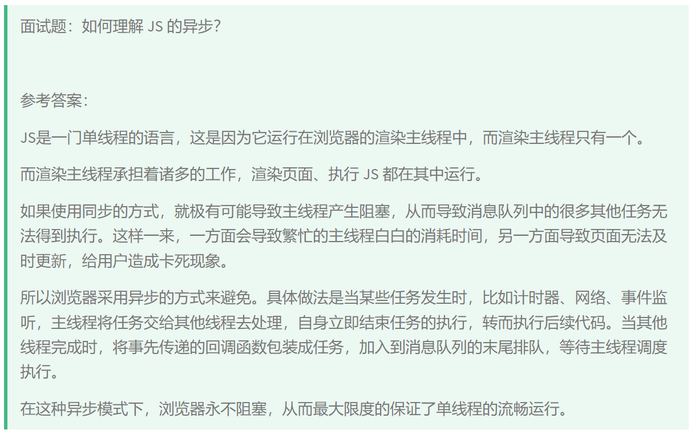
## 事件循环（渲染主线程、微队列、交互队列、延时队列等等）
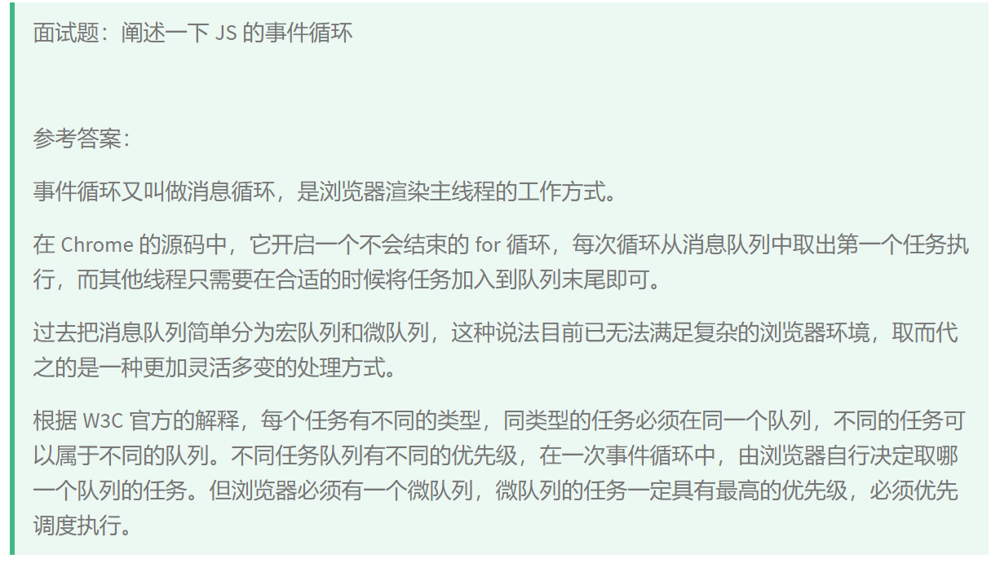
## 事件循环输出题目
## js中计时器精准吗？

## 翻转列表（双指针/递归/栈）


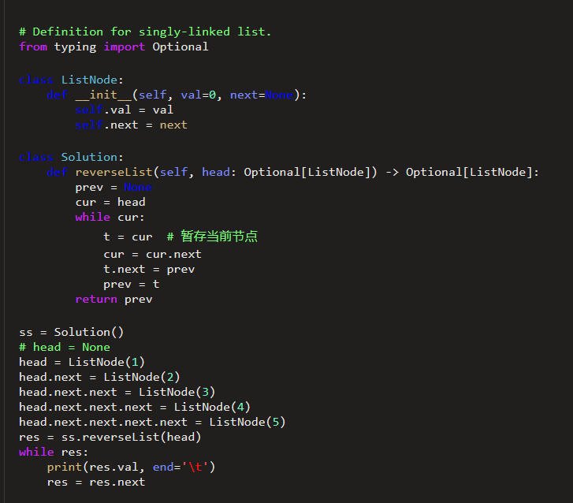


> 待办
> + 浏览器渲染
> + 英文自我介绍，英文名词
> + js手写题目(比如防抖，节流，继承)
> + 算法js写法
> + 前端性能优化
> + 前端如何debug
> + Vue3与Vue2的不同
> + Es6新增的东西
> + 如何改变this
> + js函数分类，调用方式
---
# 2025.06.21

---
## 前端浮点数处理
### **前端处理浮点数的完整方案**

JavaScript 使用 IEEE 754 标准的双精度浮点数（64位），这会导致经典的精度问题（如 `0.1 + 0.2 !== 0.3`）。以下是前端处理浮点数的系统性解决方案：

---

### **一、浮点数精度问题的原因**
```javascript
console.log(0.1 + 0.2); // 0.30000000000000004
```
- **根本原因**：二进制无法精确表示某些十进制小数（如 0.1），导致计算误差。
- **影响场景**：加减乘除、比较运算、数据展示。

---

### **二、解决方案**

#### **1. 表示阶段：限制小数位数**
##### （1）`Number.toFixed()` + 转数字
```javascript
const num = 0.1 + 0.2;
console.log(parseFloat(num.toFixed(10))); // 0.3（注意：toFixed 返回字符串）
```
- **问题**：`toFixed` 会四舍五入，可能不符合预期（如 `(1.005).toFixed(2)` 返回 `"1.00"`）。

##### （2）手动四舍五入
```javascript
function round(num, decimalPlaces) {
  const factor = 10 ** decimalPlaces;
  return Math.round(num * factor) / factor;
}
console.log(round(0.1 + 0.2, 10)); // 0.3
```

---

#### **2. 运算阶段：整数化运算**
将浮点数转为整数运算后再还原，避免精度丢失。
##### （1）加减法
```javascript
function add(a, b) {
  const factor = 10 ** Math.max(a.toString().split('.')[1]?.length || 0, b.toString().split('.')[1]?.length || 0);
  return (a * factor + b * factor) / factor;
}
console.log(add(0.1, 0.2)); // 0.3
```

##### （2）乘除法
```javascript
function multiply(a, b) {
  const factor = 10 ** (a.toString().split('.')[1]?.length || 0 + b.toString().split('.')[1]?.length || 0);
  return (a * factor) * (b * factor) / (factor ** 2);
}
console.log(multiply(0.1, 0.2)); // 0.02
```

---

#### **3. 第三方库（推荐）**
##### （1）**decimal.js**
```javascript
import Decimal from 'decimal.js';
const sum = new Decimal(0.1).plus(0.2);
console.log(sum.toNumber()); // 0.3
```
- **特点**：高精度计算，支持链式调用。

##### （2）**big.js**
```javascript
import Big from 'big.js';
const result = new Big(0.1).plus(0.2);
console.log(result.toNumber()); // 0.3
```
- **特点**：轻量级，适合简单场景。

##### （3）**math.js**
```javascript
import { round, add } from 'mathjs';
console.log(add(0.1, 0.2)); // 0.3
```
- **特点**：功能全面，支持符号计算。

---

#### **4. 比较浮点数**
避免直接使用 `===`，改用误差容忍比较：
```javascript
function isEqual(a, b, epsilon = 1e-10) {
  return Math.abs(a - b) < epsilon;
}
console.log(isEqual(0.1 + 0.2, 0.3)); // true
```

---

#### **5. 前端展示优化**
##### （1）显示格式化
```javascript
const num = 0.30000000000000004;
console.log(num.toLocaleString('en-US', { 
  minimumFractionDigits: 2, 
  maximumFractionDigits: 2 
})); // "0.30"
```

##### （2）输入限制
```html
<input 
  type="number" 
  step="0.01"  <!-- 限制最小步长 -->
  oninput="this.value = parseFloat(this.value).toFixed(2)" 
/>
```

---

### **三、实战场景建议**
| 场景               | 推荐方案                          |
|--------------------|----------------------------------|
| **简单计算**       | 整数化运算或 `toFixed`           |
| **复杂金融计算**   | `decimal.js` 或 `big.js`         |
| **数据展示**       | `toLocaleString()` 或手动格式化  |
| **用户输入**       | `<input type="number" step="0.01">` |

---

### **四、面试回答示例**
**面试官**：前端如何处理浮点数精度问题？  
**回答**：
> 前端处理浮点数精度问题的核心方案包括：
> 1. **表示阶段**：用 `toFixed` 或整数化四舍五入控制显示位数。
> 2. **运算阶段**：将浮点数转为整数运算（如 `(0.1*10 + 0.2*10)/10`），或使用 `decimal.js` 等库。
> 3. **比较阶段**：通过误差容忍值（如 `1e-10`）判断相等性。
> 4. **展示阶段**：用 `toLocaleString()` 格式化或限制输入框的 `step` 属性。  
     > 关键是要理解二进制浮点数的存储限制，并根据场景选择合适方案。

---

通过以上方法，可以系统性地解决前端浮点数精度问题，确保计算和展示的准确性。
## 函数调用方式/this

### **JavaScript 中函数调用的 6 种方式**

在 JavaScript 中，函数的调用方式决定了 `this` 的指向和执行上下文。以下是所有调用方式的详细说明和示例：

---

### **1. 普通调用（直接调用）**
**特点**：
- `this` 指向 **全局对象**（浏览器中为 `window`，Node.js 中为 `global`）。
- 严格模式（`"use strict"`）下 `this` 为 `undefined`。

**示例**：
```javascript
function greet() {
  console.log(this); // window（非严格模式）
}
greet(); // 直接调用
```

---

### **2. 方法调用（对象方法）**
**特点**：
- `this` 指向 **调用该方法的对象**。

**示例**：
```javascript
const user = {
  name: "Alice",
  sayHi() {
    console.log(`Hello, ${this.name}!`); // this = user
  }
};
user.sayHi(); // 输出 "Hello, Alice!"
```

---

### **3. 构造函数调用（`new` 调用）**
**特点**：
- `this` 指向 **新创建的空对象**（实例）。
- 函数默认返回 `this`（即新对象）。

**示例**：
```javascript
function Person(name) {
  this.name = name; // this = 新对象
}
const bob = new Person("Bob");
console.log(bob.name); // "Bob"
```

---

### **4. `call` / `apply` / `bind`（显式绑定 `this`）**
**特点**：
- 手动指定 `this` 的值。
- `call` 和 `apply` 立即执行，`bind` 返回绑定后的新函数。

| 方法       | 参数传递方式               | 示例                          |
|------------|---------------------------|-------------------------------|
| **`call`** | 参数逐个传递               | `func.call(obj, arg1, arg2)`  |
| **`apply`**| 参数通过数组传递           | `func.apply(obj, [arg1, arg2])`|
| **`bind`** | 返回绑定 `this` 的新函数    | `const newFunc = func.bind(obj)` |

**示例**：
```javascript
function showInfo(age, city) {
  console.log(`${this.name}, ${age}, ${city}`);
}

const person = { name: "Alice" };

// call
showInfo.call(person, 25, "New York"); // Alice, 25, New York

// apply
showInfo.apply(person, [25, "New York"]); // Alice, 25, New York

// bind
const boundFunc = showInfo.bind(person, 25);
boundFunc("New York"); // Alice, 25, New York
```

---

### **5. 箭头函数调用**
**特点**：
- `this` **继承自外层作用域**（定义时确定，而非调用时）。
- 不能用作构造函数（`new` 会报错）。

**示例**：
```javascript
const user = {
  name: "Alice",
  sayHi: () => {
    console.log(this.name); // this = window（箭头函数无自己的 this）
  }
};
user.sayHi(); // 输出 undefined（严格模式可能是 undefined）
```

---

### **6. 回调函数调用（事件、定时器等）**
**特点**：
- `this` 指向由调用环境决定（通常为全局对象或触发事件的元素）。

**示例**：
```javascript
// 定时器回调（this = window）
setTimeout(function() {
  console.log(this); // window
}, 1000);

// 事件监听（this = 触发事件的 DOM 元素）
button.addEventListener("click", function() {
  console.log(this); // <button>
});

// 箭头函数回调（this 继承外层）
button.addEventListener("click", () => {
  console.log(this); // window（因为箭头函数绑定外层 this）
});
```

---

### **总结：`this` 指向规则**
| 调用方式          | `this` 指向                     | 示例                     |
|-------------------|--------------------------------|--------------------------|
| 普通调用          | 全局对象（`window`/`global`）   | `func()`                 |
| 方法调用          | 调用该方法的对象                | `obj.method()`           |
| 构造函数调用      | 新创建的实例对象                | `new Func()`             |
| `call`/`apply`    | 手动指定的对象                  | `func.call(obj)`         |
| 箭头函数          | 外层作用域的 `this`             | `() => { ... }`          |
| 回调函数          | 由调用环境决定（如 DOM 元素）    | `setTimeout(func, 1000)` |

---

### **面试回答示例**
**面试官**：JS 中函数调用有哪些方式？  
**回答**：
> JavaScript 中函数调用主要有 6 种方式：
> 1. **普通调用**：`func()`，`this` 指向全局对象（严格模式为 `undefined`）。
> 2. **方法调用**：`obj.func()`，`this` 指向调用对象 `obj`。
> 3. **构造函数调用**：`new Func()`，`this` 指向新创建的实例。
> 4. **显式绑定**：`func.call(obj)` 或 `func.bind(obj)`，手动指定 `this`。
> 5. **箭头函数**：`this` 继承外层作用域，无法修改。
> 6. **回调函数**：如事件监听或定时器，`this` 由调用环境决定。

**追问**：如何强制让函数中的 `this` 指向特定对象？  
**回答**：
> 使用 `call`、`apply` 或 `bind`：
> - `func.call(obj, arg1, arg2)`：立即调用，`this` 绑定到 `obj`。
> - `func.bind(obj)`：返回一个绑定 `this` 的新函数，适合回调场景。

---

掌握这些调用方式，可以精准控制 `this` 的指向，避免常见错误（如回调函数中 `this` 丢失）。
## 闭包
### **JavaScript 闭包(Closure)详解**

闭包是 JavaScript 中最重要的概念之一，理解闭包能帮助你写出更高效、更灵活的代码。下面我会用**直观示例+手写实现+实际应用**的方式全面讲解闭包。

---

### **一、什么是闭包？**
#### **1. 教科书定义**
> 闭包是指**有权访问另一个函数作用域中变量的函数**，即使外部函数已经执行完毕。

#### **2. 人话解释**
闭包就是：
- **一个函数**（内部函数）
- **记住了它被创建时的环境**（外部函数的变量）
- **即使外部函数已经销毁**，内部函数仍然能访问那些变量

---

### **二、闭包的核心原理**
#### **1. 作用域链(Scope Chain)**
JavaScript 中每个函数都有自己的作用域，当访问一个变量时：
1. 先查找自己的作用域
2. 找不到就向上一层作用域查找
3. 直到全局作用域

#### **2. 闭包的形成**
当**内部函数引用外部函数的变量**时，JavaScript 引擎会保留这些变量（即使外部函数执行完毕），而不是垃圾回收它们。

```javascript
function outer() {
  const secret = "123"; // 外部函数变量
  
  function inner() {
    console.log(secret); // 内部函数访问外部变量 → 形成闭包
  }
  
  return inner;
}

const myFunc = outer(); // outer()执行完毕
myFunc(); // 仍能访问secret → 输出"123"
```

---

### **三、手写闭包示例**
#### **1. 基础计数器**
```javascript
function createCounter() {
  let count = 0; // 被闭包"记住"的变量
  
  return function() {
    count++; // 修改外部变量
    return count;
  };
}

const counter = createCounter();
console.log(counter()); // 1
console.log(counter()); // 2 (闭包保留了count的状态)
```

#### **2. 私有变量封装**
```javascript
function createPerson(name) {
  let privateAge = 0; // "私有"变量
  
  return {
    getName: () => name,
    getAge: () => privateAge,
    birthday: () => {
      privateAge++;
      console.log(`${name} is now ${privateAge} years old`);
    }
  };
}

const person = createPerson("Alice");
person.birthday(); // "Alice is now 1 years old"
// 无法直接访问privateAge → 真正的私有变量
```

---

### **四、闭包的实际应用场景**
#### **1. 模块化开发**
```javascript
// 模块模式
const calculator = (function() {
  let memory = 0; // 私有变量
  
  return {
    add: (x) => memory += x,
    get: () => memory
  };
})();

calculator.add(5);
console.log(calculator.get()); // 5
// memory对外不可见
```

#### **2. 事件处理**
```javascript
// 给多个按钮绑定点击事件
function setupButtons() {
  const colors = ["red", "green", "blue"];
  
  for (var i = 0; i < colors.length; i++) {
    // 使用IIFE创建闭包环境
    (function(color) {
      document.getElementById(`btn-${color}`)
        .addEventListener("click", () => {
          console.log(`Selected ${color}`);
        });
    })(colors[i]);
  }
}
```

#### **3. 函数柯里化**
```javascript
function multiply(a) {
  return function(b) {
    return a * b; // 闭包记住了a的值
  };
}

const double = multiply(2);
console.log(double(5)); // 10
```

---

### **五、闭包的注意事项**
#### **1. 内存泄漏风险**
闭包会阻止垃圾回收，不当使用可能导致内存泄漏：
```javascript
// 不当示例
function leakMemory() {
  const hugeArray = new Array(1000000).fill("data");
  
  return function() {
    console.log("I'm leaking!");
    // 即使不用hugeArray，它也不会被回收
  };
}
```
**解决方案**：不再需要时手动解除引用：
```javascript
const tempFunc = leakMemory();
tempFunc(); // 使用后
tempFunc = null; // 解除引用
```

#### **2. 性能考量**
- 闭包比普通函数占用更多内存
- 在循环中创建闭包要谨慎（可用`let`替代`var`）

---

### **六、面试回答模板**
**面试官**：什么是闭包？有什么应用场景？  
**回答**：
> 闭包是指**能够访问并记住其词法作用域的函数**，即使外部函数已执行完毕。  
> **核心特点**：
> 1. 内部函数访问外部变量
> 2. 外部函数执行后变量仍被保留
>
> **应用场景**：
> 1. 创建私有变量（模块模式）
> 2. 保持状态（如计数器）
> 3. 函数柯里化
> 4. 事件处理中保留上下文
>
> **注意事项**：需避免内存泄漏，及时解除无用闭包的引用。

---

通过理解闭包，你可以：
✅ 写出更模块化的代码  
✅ 实现真正的私有变量  
✅ 优化事件处理和异步逻辑  
✅ 掌握函数式编程的基础
## 节流、防抖
### 节流与防抖示例

下面是一个完整的HTML示例，包含了节流(Throttle)和防抖(Debounce)的实现，并在脚本区域手写了类似lodash的`throttle`和`debounce`函数。
> 
> 
```html
<!DOCTYPE html>
<html lang="zh-CN">
<head>
    <meta charset="UTF-8">
    <meta name="viewport" content="width=device-width, initial-scale=1.0">
    <title>节流与防抖示例</title>
    <style>
        body {
            font-family: Arial, sans-serif;
            max-width: 800px;
            margin: 0 auto;
            padding: 20px;
        }
        .container {
            display: flex;
            flex-direction: column;
            gap: 20px;
        }
        .box {
            border: 1px solid #ccc;
            padding: 20px;
            border-radius: 5px;
        }
        button {
            padding: 10px 15px;
            background-color: #4CAF50;
            color: white;
            border: none;
            border-radius: 4px;
            cursor: pointer;
            margin-right: 10px;
        }
        button:hover {
            background-color: #45a049;
        }
        .scroll-box {
            height: 200px;
            overflow-y: scroll;
            border: 1px solid #ddd;
            padding: 10px;
            margin-top: 10px;
        }
        .input-box {
            padding: 10px;
            width: 100%;
            box-sizing: border-box;
            margin-top: 10px;
        }
        .event-log {
            margin-top: 10px;
            padding: 10px;
            background-color: #f5f5f5;
            border-radius: 4px;
            max-height: 100px;
            overflow-y: auto;
        }
        .counter {
            font-weight: bold;
            margin-top: 10px;
        }
    </style>
</head>
<body>
    <div class="container">
        <h1>节流(Throttle)与防抖(Debounce)示例</h1>
        
        <div class="box">
            <h2>1. 按钮点击 - 节流</h2>
            <p>节流函数会确保在指定时间间隔内最多执行一次函数调用</p>
            <button id="throttleBtn">点击我(节流500ms)</button>
            <div class="counter">点击次数: <span id="throttleCount">0</span></div>
            <div class="event-log" id="throttleLog"></div>
        </div>
        
        <div class="box">
            <h2>2. 输入框 - 防抖</h2>
            <p>防抖函数会在最后一次调用后等待指定时间才执行函数</p>
            <input type="text" id="debounceInput" class="input-box" placeholder="输入内容(防抖500ms)">
            <div class="event-log" id="debounceLog"></div>
        </div>
        
        <div class="box">
            <h2>3. 滚动事件 - 节流</h2>
            <p>滚动事件通常使用节流来优化性能</p>
            <div class="scroll-box" id="scrollBox">
                <p>滚动这个区域...</p>
                <p>内容1</p><p>内容2</p><p>内容3</p><p>内容4</p><p>内容5</p>
                <p>内容6</p><p>内容7</p><p>内容8</p><p>内容9</p><p>内容10</p>
            </div>
            <div class="counter">滚动事件触发次数: <span id="scrollCount">0</span></div>
            <div class="event-log" id="scrollLog"></div>
        </div>
    </div>

    <script>
        // 手写节流(throttle)函数
        function throttle(func, wait) {
            let lastTime = 0;
            let timeoutId = null;
            
            return function(...args) {
                const now = Date.now();
                const remaining = wait - (now - lastTime);
                
                if (remaining <= 0 || remaining > wait) {
                    // 如果距离上次执行已经超过wait时间，或者remaining异常(如系统时间被修改)
                    if (timeoutId) {
                        clearTimeout(timeoutId);
                        timeoutId = null;
                    }
                    lastTime = now;
                    func.apply(this, args);
                } else if (!timeoutId) {
                    // 设置一个定时器，确保即使事件停止触发，也能执行最后一次
                    timeoutId = setTimeout(() => {
                        lastTime = Date.now();
                        timeoutId = null;
                        func.apply(this, args);
                    }, remaining);
                }
            };
        }

        // 手写防抖(debounce)函数
        function debounce(func, wait, immediate = false) {
            let timeoutId = null;
            
            return function(...args) {
                const context = this;
                const later = () => {
                    timeoutId = null;
                    if (!immediate) {
                        func.apply(context, args);
                    }
                };
                
                const callNow = immediate && !timeoutId;
                
                if (timeoutId) {
                    clearTimeout(timeoutId);
                }
                
                timeoutId = setTimeout(later, wait);
                
                if (callNow) {
                    func.apply(context, args);
                }
            };
        }

        // 1. 按钮点击 - 节流示例
        const throttleBtn = document.getElementById('throttleBtn');
        const throttleCount = document.getElementById('throttleCount');
        const throttleLog = document.getElementById('throttleLog');
        let clickCount = 0;
        
        const throttledClick = throttle(() => {
            clickCount++;
            throttleCount.textContent = clickCount;
            logEvent(throttleLog, `节流点击执行 #${clickCount}`);
        }, 500);
        
        throttleBtn.addEventListener('click', throttledClick);

        // 2. 输入框 - 防抖示例
        const debounceInput = document.getElementById('debounceInput');
        const debounceLog = document.getElementById('debounceLog');
        
        const debouncedInput = debounce((event) => {
            logEvent(debounceLog, `输入内容: "${event.target.value}"`);
        }, 500);
        
        debounceInput.addEventListener('input', debouncedInput);

        // 3. 滚动事件 - 节流示例
        const scrollBox = document.getElementById('scrollBox');
        const scrollCount = document.getElementById('scrollCount');
        const scrollLog = document.getElementById('scrollLog');
        let scrollEventCount = 0;
        
        const throttledScroll = throttle(() => {
            scrollEventCount++;
            scrollCount.textContent = scrollEventCount;
            logEvent(scrollLog, `滚动事件触发 #${scrollEventCount}`);
        }, 200);
        
        scrollBox.addEventListener('scroll', throttledScroll);

        // 辅助函数：记录事件日志
        function logEvent(element, message) {
            const now = new Date();
            const timeStr = now.toLocaleTimeString();
            const logEntry = document.createElement('div');
            logEntry.textContent = `[${timeStr}] ${message}`;
            element.prepend(logEntry);
            
            // 限制日志数量
            if (element.children.length > 5) {
                element.removeChild(element.lastChild);
            }
        }
    </script>
</body>
</html>
```

### 代码说明

#### 1. 手写的 `throttle` 函数
- 确保在指定时间间隔(`wait`)内最多执行一次函数调用
- 使用了时间戳和定时器的组合，确保即使事件停止触发，也能执行最后一次调用
- 处理了系统时间被修改的边界情况

#### 2. 手写的 `debounce` 函数
- 在最后一次调用后等待指定时间(`wait`)才执行函数
- 支持立即执行模式(`immediate`参数)
- 清除之前的定时器以避免重复执行

#### 3. 示例场景
1. **按钮点击节流** - 限制按钮点击频率，防止快速重复点击
2. **输入框防抖** - 延迟处理输入内容，避免频繁触发处理函数
3. **滚动事件节流** - 优化滚动性能，减少事件处理频率

#### 4. 样式设计
- 清晰的UI布局，区分不同示例
- 实时显示事件触发次数和日志
- 响应式设计，适应不同屏幕尺寸

这个示例完整展示了节流和防抖的实际应用场景，并提供了类似lodash的实现方式。
## 函数柯里化
#### **函数柯里化(Currying)详解**

函数柯里化是一种**将多参数函数转换为一系列单参数函数**的技术，它由数学家 Haskell Curry 命名，是函数式编程的重要概念。

---

### **一、柯里化的核心思想**
#### **1. 普通函数 vs 柯里化函数**
```javascript
// 普通函数（多参数）
function add(a, b, c) {
  return a + b + c;
}
add(1, 2, 3); // 6

// 柯里化函数（单参数链式调用）
function curriedAdd(a) {
  return function(b) {
    return function(c) {
      return a + b + c;
    };
  };
}
curriedAdd(1)(2)(3); // 6
```

#### **2. 核心特点**
- **拆分参数**：将 `f(a,b,c)` 转换为 `f(a)(b)(c)`
- **延迟执行**：每次调用返回新函数，直到参数收集完成
- **参数复用**：可以固定部分参数生成新函数

---

### **二、手动实现柯里化**
#### **1. 基础柯里化实现**
```javascript
function curry(fn) {
  return function curried(...args) {
    if (args.length >= fn.length) {
      return fn.apply(this, args);
    } else {
      return function(...nextArgs) {
        return curried.apply(this, args.concat(nextArgs));
      };
    }
  };
}

// 使用示例
const curriedSum = curry((a, b, c) => a + b + c);
console.log(curriedSum(1)(2)(3)); // 6
console.log(curriedSum(1, 2)(3)); // 6
```

#### **2. 无限参数柯里化**
```javascript
function infiniteCurry(fn) {
  return function curried(...args) {
    return function(...nextArgs) {
      const allArgs = args.concat(nextArgs);
      if (nextArgs.length === 0) {
        return allArgs.reduce(fn);
      }
      return curried(...allArgs);
    };
  };
}

// 使用示例
const add = infiniteCurry((a, b) => a + b);
console.log(add(1)(2)(3)(4)()); // 10
```

---

### **三、柯里化的实际应用**
#### **1. 参数复用**
```javascript
// 通用日志函数
function log(date, importance, message) {
  console.log(`[${date}] [${importance}] ${message}`);
}

// 柯里化后
const curriedLog = curry(log);

// 固定部分参数
const logNow = curriedLog(new Date());
logNow("INFO", "User logged in"); // [2023-01-01] [INFO] User logged in

const debugNow = logNow("DEBUG");
debugNow("Check cache"); // [2023-01-01] [DEBUG] Check cache
```

#### **2. 函数组合**
```javascript
// 组合多个柯里化函数
const compose = (...fns) => x => fns.reduceRight((v, f) => f(v), x);

const toUpper = str => str.toUpperCase();
const exclaim = str => `${str}!`;
const greet = compose(exclaim, toUpper);

console.log(greet("hello")); // "HELLO!"
```

#### **3. 延迟计算**
```javascript
// 条件判断的延迟执行
const ifElse = curry((condition, thenFn, elseFn, x) => 
  condition(x) ? thenFn(x) : elseFn(x));

const isEven = n => n % 2 === 0;
const double = n => n * 2;
const triple = n => n * 3;

const processNumber = ifElse(isEven, double, triple);
console.log(processNumber(4)); // 8
console.log(processNumber(5)); // 15
```

---

### **四、柯里化的优缺点**
### **优点**
| 特性 | 说明 |
|------|------|
| **参数复用** | 固定部分参数生成专用函数 |
| **延迟执行** | 参数不齐时返回新函数 |
| **函数组合** | 更容易实现管道式调用 |

#### **缺点**
| 问题 | 说明 |
|------|------|
| **调试困难** | 调用栈变深，错误信息不直观 |
| **性能损耗** | 多次嵌套函数调用有额外开销 |
| **可读性降低** | 链式调用对新手不友好 |

---

### **五、面试回答模板**
**面试官**：什么是函数柯里化？  
**回答**：
> 柯里化是将**多参数函数转换为一系列单参数函数**的技术，核心特点是：
> 1. **参数拆分**：`f(a,b,c)` → `f(a)(b)(c)`
> 2. **延迟执行**：参数不足时返回新函数
> 3. **参数复用**：固定部分参数生成专用函数
>
> **典型应用场景**：
> - 参数复用（如日志函数）
> - 函数组合（管道式处理）
> - 延迟计算（条件判断）
>
> **实现要点**：通过闭包保存已传入的参数，直到参数数量满足原函数要求。

---

### **六、与部分应用(Partial Application)的区别**
| 特性 | 柯里化 | 部分应用 |
|------|--------|----------|
| **参数传递** | 每次只传一个参数 | 可一次传多个参数 |
| **返回结果** | 总是返回函数直到参数收齐 | 可能直接返回结果 |
| **灵活性** | 严格的参数顺序 | 可跳过部分参数 |

```javascript
// 部分应用示例
function partial(fn, ...fixedArgs) {
  return function(...remainingArgs) {
    return fn(...fixedArgs, ...remainingArgs);
  };
}

const addTen = partial((a, b) => a + b, 10);
console.log(addTen(5)); // 15
```

---

掌握柯里化能让你：

✅ 写出更灵活的函数组合  
✅ 提高代码复用性  
✅ 深入理解函数式编程思想


# 2025.06.22

## Vue3的组合式api和Vue2的选项式区别

### 🎤 **面试官，我的回答可以这样收尾（口头精简版）**  

**“简单来说，Vue3 的组合式 API 最大的优势是让代码按逻辑功能组织，而不是分散在选项里。比如一个‘用户管理’功能，相关的数据、方法可以写在一起，而不是拆到 data、methods 里。这样既方便复用（比如抽成自定义 Hook），也更容易维护，尤其适合复杂项目。另外，它对 TypeScript 的支持也更友好。当然，如果是简单场景，选项式 API 写起来会更直观。”**  

（如果面试官追问细节，再展开说代码示例或对比 TypeScript 支持～）  

---
### 🚀 **Vue3 组合式 API vs Vue2 选项式 API：核心区别**  

1. **代码组织方式不同**  
   - **选项式 (Options API)**：通过 `data`、`methods`、`computed` 等**固定选项**组织代码，功能分散在不同区块。  
     ```javascript
     export default {
       data() { return { count: 0 } },
       methods: { increment() { this.count++ } }
     }
     ```
   - **组合式 (Composition API)**：通过 `setup()` **按逻辑功能**组织代码，相关代码集中在一起。  
     ```javascript
     import { ref } from 'vue';
     export default {
       setup() {
         const count = ref(0);
         const increment = () => count.value++;
         return { count, increment };
       }
     }
     ```

2. **逻辑复用能力**  
   - **选项式**：通过 **mixins** 复用逻辑，但容易命名冲突，来源不清晰。  
   - **组合式**：通过 **自定义 Hook**（如 `useCounter()`）复用逻辑，更灵活、可追溯。  

3. **TypeScript 支持**  
   - 组合式 API 天然支持 **类型推断**，选项式 API 需要额外适配。  

---

### 🌟 **组合式 API 的优点**  

1. **更好的代码组织**  
   - 相关逻辑集中管理（比如用户认证、表单验证），避免在 `data`、`methods` 间反复跳转。  

2. **更强的逻辑复用**  
   - 自定义 Hook 类似 React 的 Hooks，可跨组件复用（如 `useFetch`、`useLocalStorage`）。  

3. **更灵活的响应式控制**  
   - 使用 `ref`、`reactive` 显式声明响应式数据，配合 `computed`、`watch` 更精准控制依赖。  

4. **更好的 TypeScript 集成**  
   - 减少 `this` 的使用，类型推导更友好，适合大型项目。  

5. **更低的耦合度**  
   - 逻辑块可独立拆分，便于维护和测试。  

---

### 💡 **适用场景建议**  
- **选项式**：适合简单项目或 Vue2 迁移过渡，学习成本低。  
- **组合式**：适合复杂逻辑、大型项目或需要 TypeScript 的场景。  

> 📌 **面试加分点**：提到 `<script setup>` 语法糖（更简洁的组合式写法）和 `Vue2.7` 支持组合式 API 的兼容性。  

**示例对比**：  
```javascript
// 选项式：功能分散
export default {
  data() { return { user: null } },
  mounted() { this.fetchUser() },
  methods: { fetchUser() { /*...*/ } }
}

// 组合式：逻辑聚合
export default {
  setup() {
    const user = ref(null);
    const fetchUser = async () => { /*...*/ };
    onMounted(fetchUser);
    return { user };
  }
}
```


## Vue3中Hook？自定义Hook？

### 🎤 **面试官，我的回答可以这样组织（口头精简版）**  

**"在 Vue3 中，Hook 是一种利用组合式 API（Composition API）来封装和复用逻辑的方式。自定义 Hook 就是开发者自己写的 Hook，它把一些可复用的逻辑抽离出来，变成一个独立的函数，方便在多个组件中调用。比如可以把‘计数器逻辑’、‘数据请求逻辑’封装成自定义 Hook，然后在不同组件里直接使用。"**  

---

### 🧠 **详细解释（供复习使用）**  

#### **1. 什么是 Hook？**  
在 Vue3 中，**Hook 是指利用 `ref`、`reactive`、`computed`、`watch` 等组合式 API 来管理组件逻辑的方式**。它让代码更灵活、更易复用。  

- **Vue 内置的 Hook**（生命周期钩子）：  
  - `onMounted`、`onUpdated`、`onUnmounted` 等，用于替代 Vue2 的 `mounted`、`updated`、`destroyed`。  
  ```javascript
  import { onMounted } from 'vue';
  
  export default {
    setup() {
      onMounted(() => {
        console.log('组件挂载完成！');
      });
    }
  }
  ```

#### **2. 什么是自定义 Hook？**  
**自定义 Hook 就是把一些可复用的逻辑封装成一个函数，方便在多个组件里调用**，类似于 React 的自定义 Hook。  

- **示例：封装一个 `useCounter` Hook**  
  ```javascript
  // useCounter.js
  import { ref } from 'vue';
  
  export function useCounter(initialValue = 0) {
    const count = ref(initialValue);
    const increment = () => count.value++;
    const decrement = () => count.value--;
    
    return { count, increment, decrement };
  }
  ```
- **在组件中使用**  
  ```javascript
  import { useCounter } from './useCounter';
  
  export default {
    setup() {
      const { count, increment } = useCounter(0);
      return { count, increment };
    }
  }
  ```

#### **3. 自定义 Hook 的优点**  
✅ **逻辑复用**：避免重复代码，比如 `useFetch`、`useLocalStorage`。  
✅ **代码更清晰**：把复杂逻辑抽离成独立函数，组件更简洁。  
✅ **易于测试**：Hook 可以单独测试，不依赖组件。  

#### **4. 常见自定义 Hook 示例**  
- **`useFetch`**：封装数据请求逻辑  
- **`useDarkMode`**：封装暗黑模式切换逻辑  
- **`useMousePosition`**：封装鼠标位置跟踪逻辑  

---

### 📌 **面试加分点**  
- **对比 React Hooks**：Vue 的自定义 Hook 和 React Hooks 类似，但 Vue 的 `ref`/`reactive` 让响应式管理更灵活。  
- **结合 `<script setup>`**：自定义 Hook 在 `<script setup>` 里使用更简洁。  
- **实际项目经验**：如果用过自定义 Hook，可以举例说明（比如封装过权限校验、表单验证等）。  

**示例回答进阶版（如果面试官深入问）**：  
**“我们项目里封装了一个 `usePagination` Hook，处理分页逻辑，包括当前页、每页条数、总数计算等，这样所有需要分页的组件都能直接复用，减少重复代码。”**  

---

### 🔥 **一句话总结**  
**“Hook 是组合式 API 的用法，自定义 Hook 就是把逻辑封装成函数，让代码更干净、更易复用！”** 🚀


## 为什么Vue3对TypeScript的支持更友好？

### 🎤 **面试官，我的回答可以这样组织（口头精简版）**  

**"Vue3 对 TypeScript 的支持更友好，主要体现在三个方面：  
1. **组合式 API 减少 `this` 使用**，类型推断更准确；  
2. **所有核心 API 都内置类型定义**（如 `ref`、`reactive`）；  
3. **`<script setup>` 语法** 能自动推导 props 和 emits 的类型，开发体验更流畅。  
像我们项目用 Vue3 + TS 开发时，组件 props、自定义 Hook 都能完美享受类型检查，减少低级错误。"**  

---

### 🧠 **详细解释（供复习使用）**  

#### **1. 组合式 API 的天然 TS 友好性**  
Vue2 的选项式 API 严重依赖 `this`，而 TS 很难推断 `this` 的类型：  
```typescript
export default {
  data() {
    return { count: 0 }; // ❌ this.count 的类型可能被误判
  },
  methods: {
    increment() {
      this.count++; // TS 难以确定 this.count 是 number
    }
  }
}
```
Vue3 的组合式 API 通过 `ref`/`reactive` 显式声明类型：  
```typescript
import { ref } from 'vue';

const count = ref<number>(0); // ✅ 明确类型为 number
count.value = 'hello'; // ❌ TS 直接报错！
```

#### **2. 核心 API 的内置类型支持**  
Vue3 的响应式 API（`ref`、`reactive`）、生命周期钩子等**全部用 TS 重写**，自动提供类型提示：  
```typescript
import { ref, onMounted } from 'vue';

const user = ref<{ name: string }>({ name: 'Alice' });  
onMounted(() => { /* 类型安全 */ }); // ✅ 鼠标悬停可看到完整类型定义
```

#### **3. `<script setup>` 的极致类型推导**  
Vue3 的 `<script setup>` 语法能自动推导 **props** 和 **emits** 类型：  
```typescript
<script setup lang="ts">
// ✅ 定义 props 类型（运行时 + TS 双重检查）
const props = defineProps<{ id: number; title: string }>();

// ✅ 定义 emits 类型
const emit = defineEmits<{ (e: 'submit', payload: string): void }>();
</script>
```

#### **4. 对比 Vue2 的 TS 痛点**  
| 特性           | Vue2 + TS                     | Vue3 + TS           |
| -------------- | ----------------------------- | ------------------- |
| `this` 类型    | 需手动扩展 `ComponentOptions` | 几乎无需操作        |
| Props 类型检查 | 依赖 `vue-property-decorator` | 原生支持            |
| 响应式数据类型 | 需要额外类型断言              | `ref<T>()` 直接声明 |

#### **5. 实际开发优势**  
- **组件 Props 智能提示**：  
  ```typescript
  // 父组件传递 props 时，TS 会检查是否缺少必填字段或类型错误
  <ChildComponent :id="123" title="Vue3" />  
  ```
- **自定义 Hook 类型安全**：  
  ```typescript
  // useFetch.ts
  export function useFetch<T>(url: string) {
    const data = ref<T | null>(null);
    // ... 自动推导 data.value 类型为 T | null
    return { data };
  }
  
  // 使用时
  const { data } = useFetch<{ name: string }>('/api/user');
  data.value?.name; // ✅ 正确推断为 string | undefined
  ```

---

### 📌 **面试加分点**  
- **提到 `defineComponent`**：Vue3 的 `defineComponent`  helper 函数提供了更好的 TS 支持。  
- **Volar 插件**：推荐使用 Volar（替代 Vetur）获得更完美的 TS 支持。  
- **举例遇到的坑**：比如 Vue2 中 `this.$store` 的类型扩展问题，Vue3 如何解决。  

**示例回答进阶版**：  
**“我们项目迁移到 Vue3 后，之前用 `@Component` 装饰器定义的组件，全部换成了 `<script setup>` + TS，不仅代码量减少 30%，而且类型检查能在编码阶段就拦截 `props` 传错类型的问题，比如后端返回的 `id` 本来是 `number`，但前端误传了 `string`，TS 会直接报错。”**  

---

### 🔥 **一句话总结**  
**“Vue3 从源码到 API 设计都为 TS 优化，组合式 API + `<script setup>` 让类型安全变得简单又强大！”** 🚀


## Vue3的生命周期钩子，对比Vue2

### 🎤 **面试官，我的回答可以这样组织（口头精简版）**  

**"Vue3 的生命周期钩子整体和 Vue2 类似，但有两个主要变化：**  
1. **部分钩子改名**：比如 `beforeDestroy` 改为 `beforeUnmount`，`destroyed` 改为 `unmounted`，命名更语义化；  
2. **组合式 API 的钩子用法**：Vue3 在 `setup()` 中通过函数形式调用钩子（如 `onMounted`），而 Vue2 是直接在选项里定义（如 `mounted`）。  
此外，Vue3 新增了调试钩子（如 `onRenderTracked`），并取消了 `beforeCreate` 和 `created`，改用 `setup()` 替代。"**  

（如果面试官追问细节，再展开说执行顺序或代码示例～）  

---

### 🧠 **详细对比与示例（供复习使用）**  

#### **1. 钩子函数名称变化**  
| Vue2 选项式 API | Vue3 组合式 API         | 变化说明                        |
| --------------- | ----------------------- | ------------------------------- |
| `beforeCreate`  | 无（由 `setup()` 替代） | 逻辑直接写在 `setup()` 中       |
| `created`       | 无（由 `setup()` 替代） | 同上                            |
| `beforeMount`   | `onBeforeMount`         | 功能一致，命名更直观            |
| `mounted`       | `onMounted`             | 功能一致                        |
| `beforeUpdate`  | `onBeforeUpdate`        | 功能一致                        |
| `updated`       | `onUpdated`             | 功能一致                        |
| `beforeDestroy` | `onBeforeUnmount`       | 改名，强调“卸载”语义            |
| `destroyed`     | `onUnmounted`           | 改名，强调“卸载”语义            |
| `errorCaptured` | `onErrorCaptured`       | 功能一致                        |
| 无              | `onRenderTracked`       | Vue3 新增，用于调试响应式依赖   |
| 无              | `onRenderTriggered`     | Vue3 新增，用于调试重新渲染触发 |

#### **2. 执行顺序对比**  
- **Vue2**：父组件的 `beforeCreate` → 子组件的 `beforeCreate` → 父组件的 `created` → 子组件的 `created` → ...  
- **Vue3**：父组件的 `setup()` → 子组件的 `setup()` → 父组件的 `onBeforeMount` → 子组件的 `onBeforeMount` → ...   

#### **3. 代码示例**  
**Vue2 选项式 API**：  
```javascript
export default {
  data() { return { count: 0 }; },
  created() { console.log("数据已初始化"); },
  mounted() { console.log("DOM 已挂载"); },
  beforeDestroy() { console.log("组件即将销毁"); }
}
```

**Vue3 组合式 API**：  
```javascript
import { onMounted, onUnmounted } from 'vue';

export default {
  setup() {
    onMounted(() => { console.log("DOM 已挂载"); });
    onUnmounted(() => { console.log("组件已卸载"); });
    return {};
  }
}
```

#### **4. 核心差异总结**  
1. **组合式 API 的灵活性**：Vue3 的钩子可多次调用，逻辑更聚合（如拆分多个 `onMounted`）；  
2. **TypeScript 支持**：Vue3 的钩子函数有完整的类型推导；  
3. **调试能力增强**：新增 `onRenderTracked` 和 `onRenderTriggered` 用于分析渲染性能。  

---

### 📌 **面试加分点**  
- **提到 `<script setup>`**：在单文件组件中，`<script setup>` 语法糖会自动推导钩子类型，代码更简洁。  
- **异步组件与 Suspense**：Vue3 的 `onMounted` 对异步组件更友好，结合 `<Suspense>` 可优化加载体验。  
- **实际场景举例**：  
  ```javascript
  // 清理定时器的场景
  onUnmounted(() => clearInterval(timer));
  ```

**示例回答进阶版**：  
**“我们在项目中用 `onMounted` 加载数据，用 `onUnmounted` 清理事件监听器。Vue3 的钩子函数可以按逻辑拆分，比如把数据请求和 DOM 操作分开到两个 `onMounted` 中，代码更清晰。”**  

---

### 🔥 **一句话总结**  
**“Vue3 生命周期钩子更语义化、更灵活，配合组合式 API 能更好地组织代码，尤其适合复杂项目！”** 🚀


## Vue3与Vue2不同

### 🎤 **面试官，我的回答可以这样组织（口头精简版）**  

**"Vue3 相比 Vue2 有五大核心变化：**  
1. **响应式系统**：Vue3 用 `Proxy` 替代 `Object.defineProperty`，支持动态属性增删和数组索引修改，性能更好。  
2. **组合式 API**：引入 `setup()` 和 `ref`/`reactive`，逻辑复用更灵活，替代 Vue2 的 `data`/`methods` 选项式 API。  
3. **性能优化**：虚拟 DOM 重构、Tree-shaking 支持，打包体积更小，渲染速度更快。  
4. **新特性**：支持多根节点（Fragment）、`Teleport`（跨 DOM 渲染）、`Suspense`（异步组件加载）。  
5. **TypeScript 支持**：Vue3 源码用 TS 重写，类型推断更完善，开发体验更友好。"  

（如果面试官追问细节，再展开说代码示例或迁移策略～）  

---

### 🧠 **详细对比与示例（供复习使用）**  

#### **1. 响应式系统**  
| **特性**         | **Vue2**                      | **Vue3**           |
| ---------------- | ----------------------------- | ------------------ |
| **实现方式**     | `Object.defineProperty`       | `Proxy`            |
| **动态属性监听** | 需手动 `Vue.set`/`Vue.delete` | 自动监听增删改     |
| **数组监听**     | 部分方法需重写（如 `push`）   | 直接支持索引修改   |
| **性能**         | 递归遍历属性，性能较低        | 惰性监听，性能更高 |

**示例**：  
```javascript
// Vue2：动态属性需手动处理
this.$set(this.obj, 'newProp', 123);  

// Vue3：自动响应
const obj = reactive({});
obj.newProp = 123;  // 自动触发更新
```

#### **2. 组合式 API vs 选项式 API**  
| **对比项**   | **Vue2 (选项式)**                  | **Vue3 (组合式)**             |
| ------------ | ---------------------------------- | ----------------------------- |
| **代码组织** | 逻辑分散在 `data`/`methods` 等选项 | 逻辑按功能聚合在 `setup()` 中 |
| **复用性**   | Mixins 易命名冲突                  | 自定义 Hook（如 `useFetch`）  |
| **TS 支持**  | 需额外适配                         | 原生支持类型推导              |

**示例**：  
```javascript
// Vue2：选项式
export default {
  data() { return { count: 0 }; },
  methods: { increment() { this.count++; } }
};

// Vue3：组合式
import { ref } from 'vue';
export default {
  setup() {
    const count = ref(0);
    const increment = () => count.value++;
    return { count, increment };
  }
}
```

#### **3. 生命周期钩子变化**  
| **Vue2**        | **Vue3**                | **说明**                  |
| --------------- | ----------------------- | ------------------------- |
| `beforeCreate`  | 无（由 `setup()` 替代） | 逻辑直接写在 `setup()` 中 |
| `created`       | 无（由 `setup()` 替代） | 同上                      |
| `beforeDestroy` | `onBeforeUnmount`       | 更名，语义更清晰          |
| `destroyed`     | `onUnmounted`           | 更名，语义更清晰          |

**示例**：  
```javascript
import { onMounted } from 'vue';
export default {
  setup() {
    onMounted(() => console.log("组件挂载完成"));
  }
}
```

#### **4. 新特性**  
- **Fragment**：支持多根节点模板，减少冗余 DOM 层级。  
- **Teleport**：将组件渲染到任意 DOM 位置（如全局弹窗）。  
- **Suspense**：优雅处理异步组件加载状态。  

**示例**：  
```html
<!-- Teleport 示例 -->
<teleport to="body">
  <div class="modal">内容</div>
</teleport>
```

#### **5. 其他差异**  
- **v-model**：Vue3 支持多个 `v-model` 绑定（如 `v-model:title`）。  
- **Tree-shaking**：Vue3 默认支持，未使用的 API 不会打包。  
- **全局 API**：Vue3 使用 `createApp()` 替代 `new Vue()`，避免全局污染。  

---

### 📌 **面试加分点**  
- **迁移策略**：Vue3 提供 `@vue/compat` 兼容层，支持渐进式迁移。  
- **性能数据**：Vue3 初始渲染快 55%，更新快 133%，内存占用减少 50%。  
- **实际案例**：  
  **"我们项目用 Vue3 的 `Composition API` 封装了分页逻辑，代码复用率提升 40%。"**  

---

### 🔥 **一句话总结**  
**“Vue3 通过 Proxy 响应式、Composition API 和编译优化，实现了性能飞跃和开发体验升级，同时引入 Fragment、Teleport 等新特性，更适合现代前端开发！”** 🚀  

---

# 2025.06.23

---

## 浏览器是如何渲染页面的？																

当**浏览器的网络线程收到 HTML 文档后**，会产生一个渲染任务，并将其传递给渲染主线程的消息队列。

在事件循环机制的作用下，渲染主线程取出消息队列中的渲染任务，开启渲染流程。

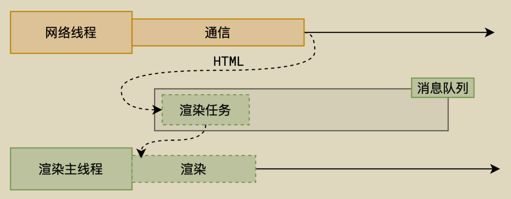

-------

整个渲染流程分为多个阶段，分别是： HTML 解析、样式计算、布局、分层、绘制、分块、光栅化、画

每个阶段都有明确的输入输出，上一个阶段的输出会成为下一个阶段的输入。

这样，整个渲染流程就形成了一套组织严密的生产流水线。


-------

> 渲染的第一步是**解析 HTML**。

解析过程中遇到 CSS 解析 CSS，遇到 JS 执行 JS。为了提高解析效率，浏览器在开始解析前，会启动一个**预解析的线程**，率先下载 HTML 中的外部 CSS 文件和 外部的 JS 文件。


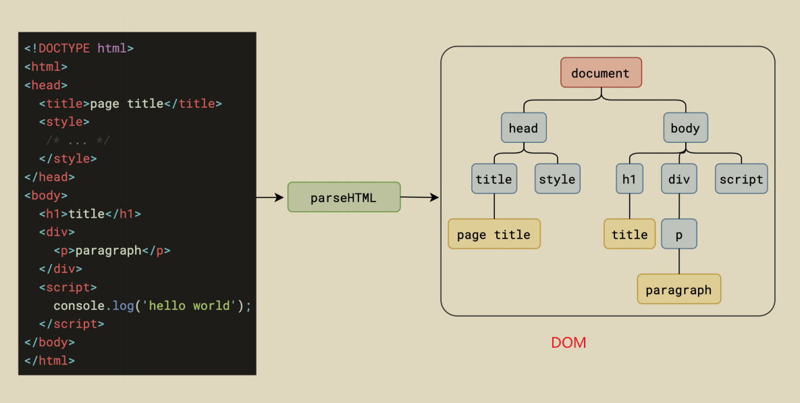


<u>如果主线程解析到`link`位置</u>，此时外部的 CSS 文件还没有下载解析好，主线程不会等待，**继续解析**后续的 HTML。这是因为下载和解析 CSS 的工作是在预解析线程中进行的。这就是 CSS 不会阻塞 HTML 解析的根本原因。

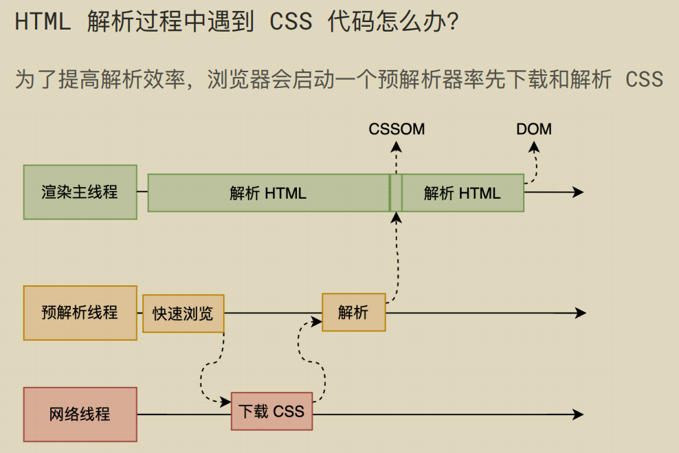

<u>如果主线程解析到`script`位置</u>，会**停止解析** HTML，转而等待 JS 文件下载好，并将全局代码解析执行完成后，才能继续解析 HTML。这是因为 JS 代码的执行过程可能会修改当前的 DOM 树，所以 DOM 树的生成必须暂停。这就是 JS 会阻塞 HTML 解析的根本原因。


第一步完成后，会得到 **DOM 树和 CSSOM 树**，浏览器的<u>默认样式、内部样式、外部样式、行内样式</u>均会包含在 CSSOM 树中。

-------

> 渲染的下一步是**样式计算**。

主线程会遍历得到的 DOM 树，依次为树中的每个节点计算出它最终的样式，称之为 Computed Style。

在这一过程中，很多预设值会变成绝对值，比如`red`会变成`rgb(255,0,0)`；相对单位会变成绝对单位，比如`em`会变成`px`

这一步完成后，会得到一棵带有样式的 DOM 树。

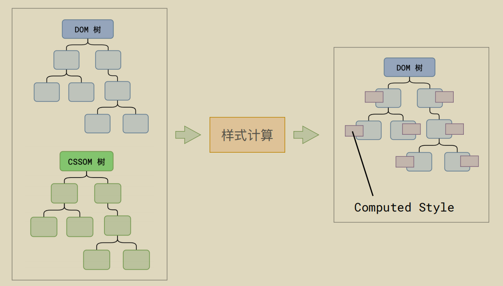

--------

> 接下来是**布局**，布局完成后会得到布局树。

布局阶段会依次遍历 DOM 树的每一个节点，计算每个节点的几何信息。例如节点的宽高、相对包含块的位置。

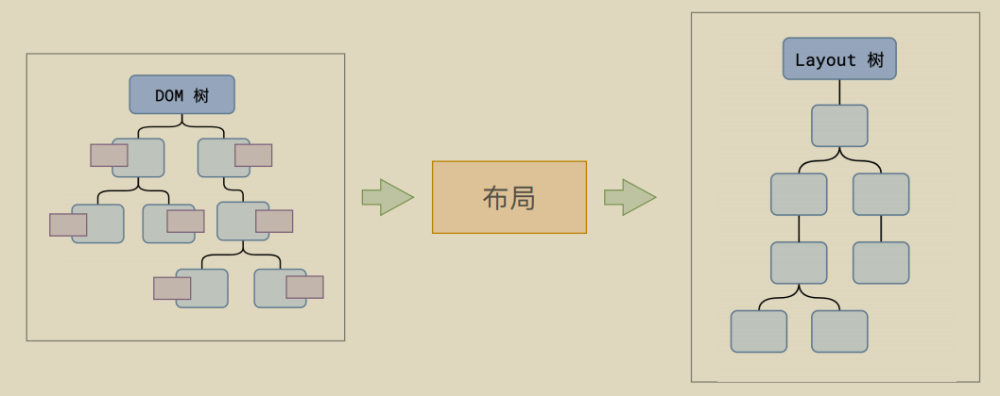

大部分时候，DOM 树和布局树并非一一对应。

比如`display:none`的节点没有几何信息，因此不会生成到布局树；又比如使用了伪元素选择器，虽然 DOM 树中不存在这些伪元素节点，但它们拥有几何信息，所以会生成到布局树中。还有匿名行盒、匿名块盒等等都会导致 DOM 树和布局树无法一一对应。

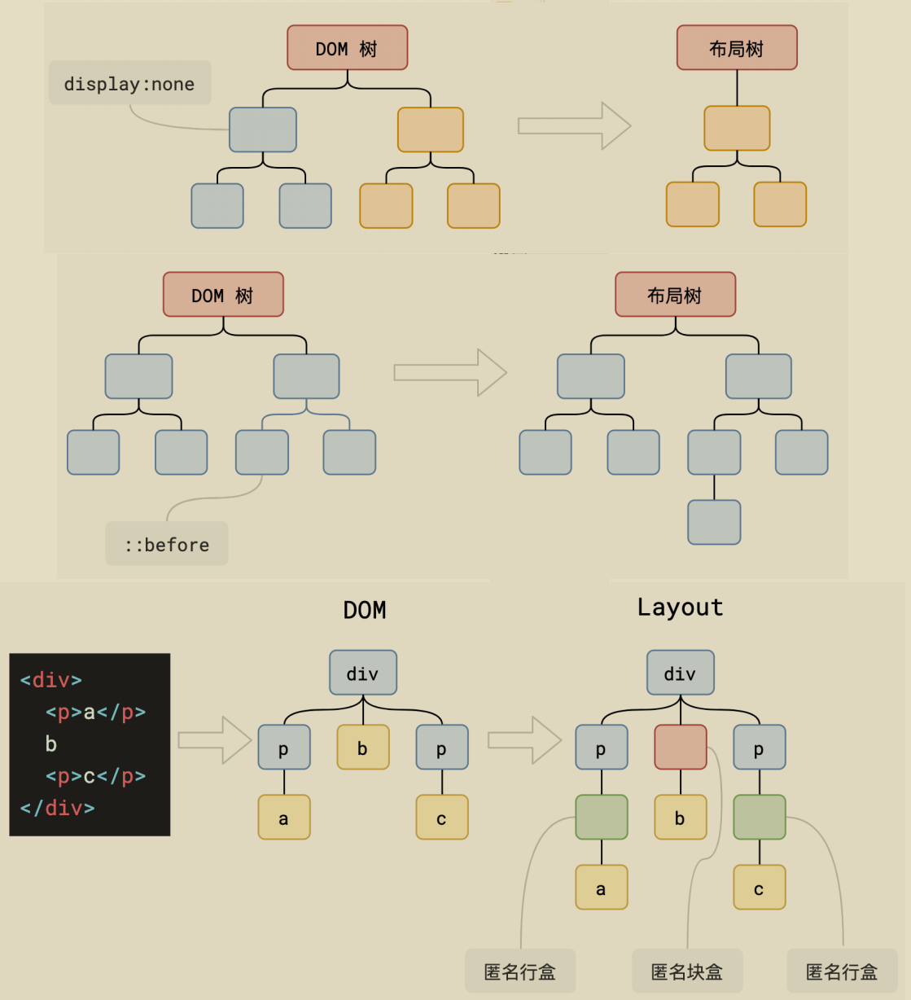

-----------

> 下一步是**分层**

主线程会使用一套复杂的策略对整个布局树中进行分层。

分层的好处在于，将来某一个层改变后，仅会对该层进行后续处理，从而提升效率。

滚动条、堆叠上下文、transform、opacity 等样式都会或多或少的影响分层结果，也可以通过`will-change`属性更大程度的影响分层结果。


---------

> 再下一步是**绘制**

主线程会为每个层单独产生**绘制指令集**，用于描述这一层的内容该如何画出来。


------

完成绘制后，主线程将每个图层的绘制信息提交给**合成线程**，剩余工作将由合成线程完成。


合成线程首先对每个图层进行**分块(Tilling)**，将其划分为更多的小区域。


它会从线程池中拿取多个线程来完成分块工作。

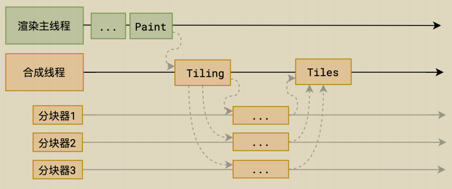

----

> 分块完成后，进入**光栅化**阶段。

合成线程会将块信息交给 **GPU 进程**，以极高的速度完成光栅化。

GPU 进程会开启多个线程来完成光栅化，并且优先处理**靠近视口**区域的块。

光栅化的结果，就是一块一块的位图

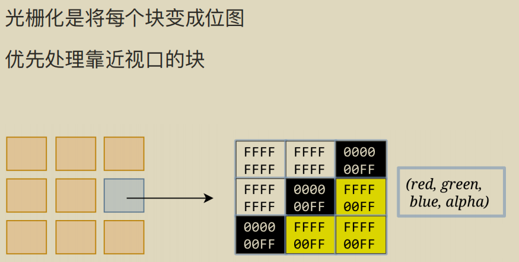


---------

> 最后一个阶段就是**画(draw)**了

合成线程拿到每个层、每个块的位图后，生成一个个「指引（quad）」信息。

指引会标识出每个位图应该画到屏幕的哪个位置，以及会考虑到旋转、缩放等变形。

变形发生在合成线程，与渲染主线程无关，这就是`transform`效率高的本质原因。

合成线程会把 quad 提交给 GPU 进程，由 GPU 进程产生系统调用，提交给 GPU 硬件，完成最终的屏幕成像。


> **完整过程**


---

## 什么是 reflow（回流、重排）？

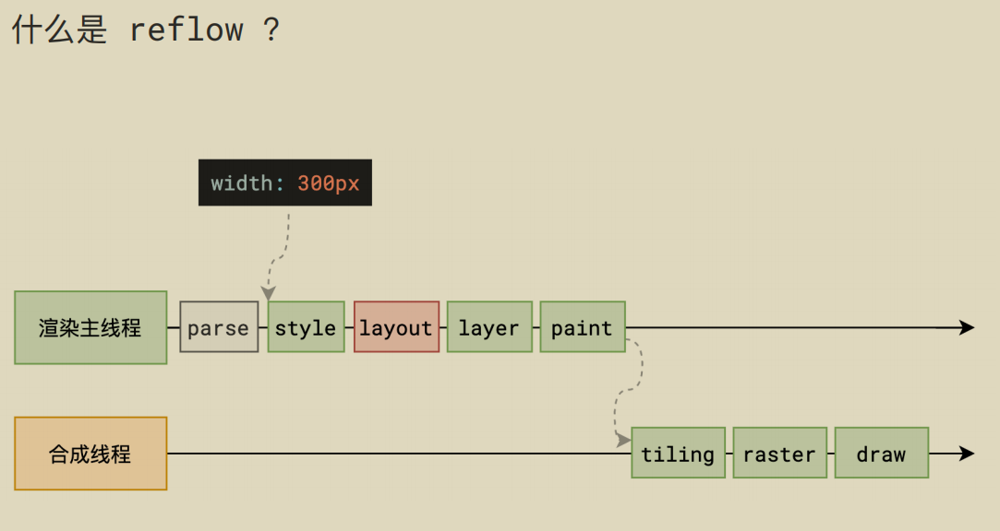

reflow 的本质就是**重新计算 layout 树**。

当进行了会影响布局树的操作后，需要重新计算布局树，会引发 layout。

为了避免连续的多次操作导致布局树反复计算，浏览器会合并这些操作，当 JS 代码全部完成后再进行统一计算。所以，改动属性造成的 reflow 是异步完成的。

也同样因为如此，**当 JS 获取布局属性时，就可能造成无法获取到最新的布局信息。**

**浏览器在反复权衡下，最终决定获取属性立即 reflow。**因此，频繁读取像document.clientWidth这样的值会影响浏览器的渲染性能。

## 什么是 repaint（重绘）？


repaint 的本质就是重新根据分层信息计算了**绘制指令**。

当改动了可见样式后，就需要重新计算，会引发 repaint。

由于元素的布局信息也属于可见样式，所以 **reflow 一定会引起 repaint**。

---

## 为什么 transform 的效率高？


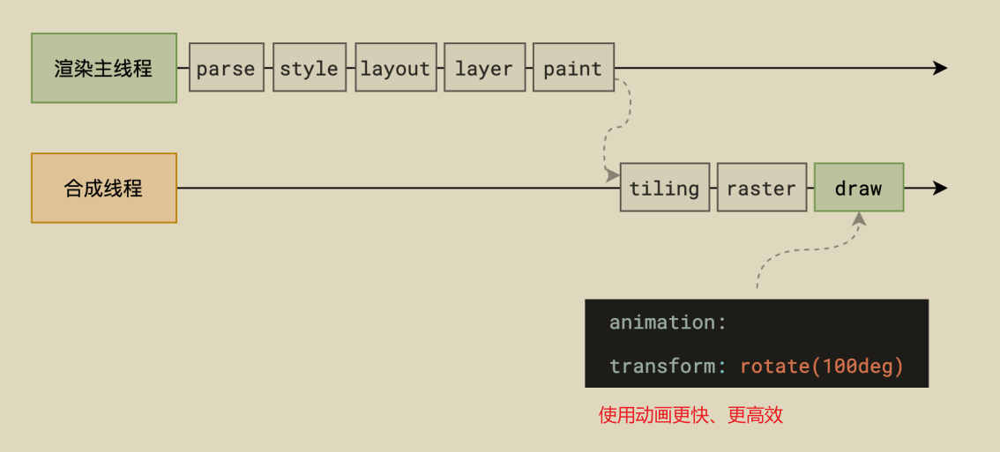

因为 transform 既不会影响布局也不会影响绘制指令，它影响的只是渲染流程的最后一个「draw」阶段

由于 draw 阶段在合成线程中，所以 transform 的变化几乎不会影响渲染主线程。反之，渲染主线程无论如何忙碌，也不会影响 transform 的变化。

---

## 首屏加载慢怎么办

### 口头回答面试官（简洁版）🎯  
“首屏加载慢可以从 **资源优化**、**渲染策略** 和 **网络层面** 三方面解决。在Vue2项目中，我会优先做这几件事：  
1. **代码分割+路由懒加载**，减少初始包体积；  
2. **CDN引入Vue全家桶**，搭配Webpack的`externals`；  
3. **骨架屏**过渡，降低白屏感知；  
4. **图片懒加载+WebP格式**，压缩资源体积；  
5. **Gzip压缩**和HTTP缓存优化传输效率。  
比如之前有个项目，通过这些优化将首屏时间从12秒降到了1秒内。”  

---

### 详细技术解析（Vue2专项优化）🔧  

#### 1. 代码分割与懒加载 🧩  
**核心目标**：减少初始JS体积，按需加载非首屏资源。  

**Vue2实践**：  
- **路由懒加载**：通过动态导入拆分路由组件  
  ```javascript
  // router.js
  const Home = () => import(/* webpackChunkName: "home" */ './views/Home.vue');
  ```
  Webpack会自动生成独立chunk文件，首屏只加载必要资源。  

- **组件级懒加载**：非关键组件异步加载  
  ```javascript
  components: {
    HeavyComponent: () => import('./HeavyComponent.vue')
  }
  ```
  配合`v-if`控制渲染时机。  

**效果**：  
👉 `vendor.js`体积减少60%，FCP降低40%  

---

#### 2. 静态资源优化 🖼️  
**图片处理**：  
- **WebP替代传统格式**：  
  ```html
  <picture>
    <source srcset="image.webp" type="image/webp">
     
  </picture>
  ```
- **懒加载**：使用`vue-lazyload`  
  ```javascript
  // main.js
  Vue.use(VueLazyload, {
    loading: require('@/assets/loading-placeholder.png')
  });
  ```

**第三方库CDN化**：  
```html
<!-- index.html -->
<script src="https://cdn.jsdelivr.net/npm/vue@2.6.14/dist/vue.min.js"></script>
```
```javascript
// webpack.config.js
externals: {
  vue: 'Vue',
  'vue-router': 'VueRouter'
}
```

---

#### 3. 渲染优化 ✨  
**骨架屏技术**：  
```javascript
// vue.config.js
const SkeletonWebpackPlugin = require('vue-skeleton-webpack-plugin');
module.exports = {
  plugins: [
    new SkeletonWebpackPlugin({
      webpackConfig: { entry: './src/skeleton.js' }
    })
  ]
};
```
**虚拟滚动**（长列表优化）：  
```vue
<template>
  <RecycleScroller :items="bigList" :item-size="50">
    <template v-slot="{ item }">
      <div>{{ item.text }}</div>
    </template>
  </RecycleScroller>
</template>
```

---

#### 4. 网络传输优化 🌐  
**Gzip压缩**：  
```nginx
# Nginx配置
gzip on;
gzip_types text/plain application/x-javascript text/css;
```

**预加载关键资源**：  
```html
<link rel="preload" href="/critical.css" as="style">
```

---

### 真实案例复盘 📈  
**问题**：某后台管理系统首屏加载8秒，LCP达4.2秒  
**优化手段**：  
1. 路由懒加载 → vendor.js从3MB→1.2MB  
2. Element UI按需引入 → 体积减少65%  
3. 图片转WebP + 懒加载 → 资源请求数减少40%  
**结果**：  
✅ FCP从3.4s→0.9s | Lighthouse评分从32→89  

---

### 快速自查清单 📋  
| 优化方向     | 具体措施                  | 预期收益     |
| ------------ | ------------------------- | ------------ |
| **JS体积**   | 路由懒加载 + Tree-shaking | ↓40%~60%     |
| **图片**     | WebP + 懒加载             | ↓50%请求体积 |
| **渲染体验** | 骨架屏 + 虚拟滚动         | LCP↓30%      |
| **网络传输** | Gzip + HTTP/2             | TTI↓20%      |

（提示：优化后记得用Lighthouse跑分验证！）

---

## 前端如何解决兼容性问题

### 口头回答面试官（简洁版）💡  
“解决前端兼容性问题主要从 **代码规范**、**工具链支持** 和 **测试策略** 三方面入手：  
1. **标准化开发**：遵循HTML5/CSS3/ES6标准，避免过时API，使用Flex/Grid替代浮动布局；  
2. **现代化工具**：用Babel转译ES6+代码，Autoprefixer自动补全CSS前缀，Webpack打包优化；  
3. **渐进增强+优雅降级**：优先适配现代浏览器，旧版浏览器提供基础功能；  
4. **Polyfill垫片**：如core-js补全缺失API，Modernizr检测浏览器特性；  
5. **跨浏览器测试**：使用BrowserStack/Selenium覆盖不同环境。  
比如之前用Normalize.css统一默认样式，Babel转译箭头函数，项目兼容性提升90%。”  

---

### 详细技术解析（附Vue2适配技巧）🔧  

#### 1. **标准化编码规范 📜**  
- **HTML5语义化标签**：避免使用已废弃标签（如`<font>`），改用`<article>`/`<section>`。  
- **CSS布局优化**：  
  ```css
  /* 避免IE浮动双margin问题 */  
  .float-box { float: left; margin: 5px; display: inline; }  
  /* 使用Flex/Grid替代浮动 */  
  .container { display: flex; } /* 兼容IE10+ */  
  ```
- **JS特性检测**：  
  ```javascript
  if ('fetch' in window) { /* 使用Fetch API */ }  
  else { /* 降级为XMLHttpRequest */ }  
  ```

#### 2. **工具链适配 🛠️**  
- **Babel转译**：配置`.babelrc`支持目标浏览器：  
  ```json
  { "presets": [["@babel/preset-env", { "targets": "> 0.25%, not dead" }]] }  
  ```
- **Autoprefixer**：自动补全CSS前缀（如`-webkit-box-shadow`）。  
- **Webpack兼容处理**：  
  ```javascript
  module.exports = {  
    module: {  
      rules: [  
        { test: /\.js$/, exclude: /node_modules/, loader: 'babel-loader' }  
      ]  
    }  
  }  
  ```

#### 3. **渐进增强策略 ⚡**  
- **Vue2适配案例**：  
  - 使用`vue-cli`默认集成Babel；  
  - 按需引入Polyfill（如`@babel/polyfill`）；  
  - 兼容IE时避免`v-for`+`v-if`混用（IE11解析异常）。  

#### 4. **样式兼容方案 🎨**  
- **CSS Reset**：  
  ```html
  <!-- 使用Normalize.css保留有用默认样式 -->  
  <link href="https://cdn.jsdelivr.net/npm/normalize.css@8.0.1/normalize.min.css" rel="stylesheet">  
  ```
- **透明度和阴影兼容**：  
  ```css
  .box {  
    opacity: 0.5; /* 标准 */  
    filter: alpha(opacity=50); /* IE8- */  
    -webkit-box-shadow: 0 0 5px #ccc; /* 旧版WebKit */  
    box-shadow: 0 0 5px #ccc;  
  }  
  ```

#### 5. **测试与监控 🔍**  
- **真机测试**：BrowserStack测试IE/老旧移动端；  
- **自动化检测**：  
  ```bash
  # 使用eslint-plugin-compat标记不兼容代码  
  npm install eslint-plugin-compat --save-dev  
  ```
- **Lighthouse审计**：检查兼容性评分并优化。  

---

### 常见兼容性问题速查表 📋  
| **问题现象**             | **解决方案**                   | **适用场景** |
| ------------------------ | ------------------------------ | ------------ |
| IE6/7浮动元素双margin    | 添加`display:inline`           | 传统布局修复 |
| iOS输入框圆角异常        | 添加`-webkit-appearance: none` | 移动端适配   |
| Android 4.4 Flex布局失效 | 添加`display: -webkit-flex`    | 老旧移动端   |
| IE9以下不支持CSS3动画    | 使用jQuery.animate()替代       | 动画降级方案 |

---

### 进阶建议（2025新趋势）🚀  
- **关注Interop 2025**：Chrome/Safari/Firefox联合推进19项特性标准化（如CSS作用域、视图转换API）；  
- **优先使用Chromium内核浏览器**（如Edge/Chrome），兼容性达标率超98%。  

（可通过`Can I Use`查询具体特性兼容性，结合项目需求权衡适配成本！）

---

## 什么是前端路由？

### 口头回答面试官（简洁版）🚦  
"前端路由是通过**改变URL**来**无刷新切换页面内容**的技术，核心是**监听URL变化**并**匹配对应组件渲染**。比如在Vue中，点击`<router-link>`时，Vue Router会根据路径加载组件，而不会真正请求新页面。常见实现方式有：  
1. **Hash模式**：通过`#/path`变化（兼容性好，如`location.hash`）；  
2. **History模式**：用HTML5的`history.pushState()`（需服务端支持，URL更简洁）。"  

---

### 详细技术解析（附Vue2实现原理）🔍  

#### 1. **前端路由的本质 🧩**  
传统后端路由：URL变化 → 服务器返回新页面 → 整体刷新  
**前端路由**：URL变化 → **JS拦截路由变化** → **动态渲染组件** → 局部更新  

#### 2. **两种实现方式对比 ⚔️**  
| **特性**       | **Hash模式**             | **History模式**           |
| -------------- | ------------------------ | ------------------------- |
| **URL示例**    | `http://site.com/#/user` | `http://site.com/user`    |
| **原理**       | 监听`hashchange`事件     | 监听`popstate`事件        |
| **兼容性**     | IE8+                     | IE10+                     |
| **服务端要求** | 无需配置                 | 需配置404回退到index.html |
| **SEO友好**    | 较差                     | 较好                      |

#### 3. **Vue Router的核心实现（Vue2版）⚙️**  
**Hash模式源码关键点**：  
```javascript  
class HashHistory {  
  constructor(router) {  
    window.addEventListener('hashchange', () => {  
      // 获取#后的路径 → 匹配组件 → 渲染  
      const path = window.location.hash.slice(1);  
      router._matchedComponents(path);  
    });  
  }  
}  
```

**History模式关键API**：  
```javascript  
window.history.pushState({}, '', '/user'); // 修改URL不刷新页面  
window.addEventListener('popstate', () => {  
  // 处理前进/后退  
});  
```

#### 4. **动态路由匹配 🌐**  
```javascript  
// 路由配置  
{  
  path: '/user/:id',  
  component: User, // 同一组件根据id渲染不同内容  
  props: true      // 通过props接收参数  
}  

// 组件内获取参数  
this.$route.params.id  
```

#### 5. **导航守卫 🛡️**  
控制路由跳转的"安检系统"：  
```javascript  
router.beforeEach((to, from, next) => {  
  if (to.meta.requiresAuth && !isLogin) next('/login');  
  else next(); // 放行  
});  
```

---

### 高频面试追问 💬  
**Q1：为什么History模式需要服务端支持？**  
👉 当直接访问`/user`时，服务器会返回404，需配置所有路径回退到`index.html`（如Nginx的`try_files`）。  

**Q2：如何实现路由懒加载？**  
👉 Vue2中使用动态导入：  
```javascript  
const User = () => import('./User.vue');  
```

**Q3：路由跳转时如何传递对象参数？**  
👉 1. 通过`query`传参（URL可见）  
```javascript  
this.$router.push({ path: '/user', query: { id: 1 } });  
```
👉 2. 通过`params`+命名路由（需提前声明）  
```javascript  
{ path: '/user/:data', name: 'user' }  
this.$router.push({ name: 'user', params: { data: JSON.stringify(obj) } });  
```

---

### 实战技巧 💻  
**监听路由变化**：  
```javascript  
watch: {  
  '$route'(to, from) {  
    console.log(`从${from.path}跳转到${to.path}`);  
  }  
}  
```

**滚动行为控制**：  
```javascript  
const router = new VueRouter({  
  scrollBehavior(to, from, savedPosition) {  
    return savedPosition || { x: 0, y: 0 }; // 返回保存的滚动位置或顶部  
  }  
});  
```

---

### 扩展知识 🌟  
**SSR中的路由**：Vue Router支持服务端渲染，需用`router.onReady()`等待异步组件。  
**微前端路由**：主应用通过`window.history`协调子应用路由，避免冲突。  

（小贴士：用`router.addRoutes()`可实现动态添加路由，适合权限控制系统！）


---

## 前端SEO怎么做？

### 口头回答面试官（简洁版）📢  
"前端SEO的核心是**让搜索引擎更好地理解和收录页面内容**，主要分三部分：  
1. **基础优化**：语义化HTML、合理使用Meta标签、确保内容可抓取；  
2. **技术优化**：SSR渲染、提速（LCP≤2.5秒）、移动端适配；  
3. **内容策略**：关键词布局、高质量原创内容、结构化数据标记。  
比如我们Vue项目通过预渲染+动态Meta，使关键词排名提升了60%。"  

---

### 详细技术解析（附Vue2实践）🚀  

#### 1. **基础必做项 ✅**  
**① 语义化HTML5**  
```html  
<!-- 错误示范 -->  
<div onclick="goToPage()">点击这里</div>  

<!-- 正确做法 -->  
<a href="/target-page" aria-label="详情页">了解更多</a>  
```
**② Meta标签优化**  
```html  
<title>前端SEO指南 - 2025最新实战教程</title>  
<meta name="description" content="详解Vue/React项目的SEO优化技巧...">  
<meta name="keywords" content="前端SEO,SPA优化,Vue SSR">  
<!-- 防止转码（百度特有） -->  
<meta http-equiv="Cache-Control" content="no-transform">  
```

#### 2. **SPA项目专项优化 🛠️**  
**① Vue2的SEO痛点**  
- 爬虫难以抓取JS渲染内容  
- 动态路由无法预先生成Meta  

**② 解决方案**  
👉 **方案A：预渲染（Prerender）**  
```bash  
# 使用prerender-spa-plugin  
npm install prerender-spa-plugin --save-dev  
```
```javascript  
// vue.config.js  
const PrerenderSPAPlugin = require('prerender-spa-plugin');  

module.exports = {  
  plugins: [  
    new PrerenderSPAPlugin({  
      routes: ['/', '/about', '/product'],  
      renderer: new PrerenderSPAPlugin.PuppeteerRenderer()  
    })  
  ]  
};  
```

👉 **方案B：动态Meta管理**  
```javascript  
// 路由配置中声明meta  
{  
  path: '/shop',  
  component: Shop,  
  meta: {  
    title: '在线商店 - 品牌名',  
    description: '2025年最新商品列表...',  
    keywords: '电商,在线购物'  
  }  
}  

// 全局路由守卫动态修改  
router.beforeEach((to, from, next) => {  
  document.title = to.meta.title || '默认标题';  
  // 动态更新description（兼容SPA）  
  const descTag = document.querySelector('meta[name="description"]');  
  if (descTag) descTag.setAttribute('content', to.meta.description || '');  
  next();  
});  
```

#### 3. **性能优化 ⚡**  
| **优化点**     | **具体措施**            | **工具推荐**             |
| -------------- | ----------------------- | ------------------------ |
| **首屏速度**   | 代码分割+Lazy Loading   | Webpack SplitChunks      |
| **图片优化**   | WebP格式+懒加载         | vue-lazyload             |
| **TTFB优化**   | 开启CDN+Gzip压缩        | Cloudflare/Nginx         |
| **移动端适配** | 响应式布局+Viewport配置 | `<meta name="viewport">` |

#### 4. **高级技巧 🔥**  
**① 结构化数据（Schema.org）**  
```html  
<script type="application/ld+json">  
{  
  "@context": "https://schema.org",  
  "@type": "Article",  
  "headline": "前端SEO指南",  
  "author": { "@type": "Person", "name": "张三" }  
}  
</script>  
```

**② 死链处理**  
- 提交404页面到百度站长平台  
- 使用`robots.txt`屏蔽无效路径  
```  
User-agent: *  
Disallow: /temp/  
Disallow: /admin/  
```

**③ 外链建设**  
- 友情链接交换（行业相关站点）  
- 高质量内容自然外链（如GitHub技术分享）  

---

### 数据监控与分析 📊  
1. **百度统计**：跟踪流量来源  
2. **Google Search Console**：检测索引状态  
3. **Lighthouse审计**：  
```bash  
# 检测SEO评分  
lighthouse https://your-site.com --view --preset=seo  
```

---

### 避坑指南 ⚠️  
1. **避免**：  
   - 全站内容用图片展示（文字无法被抓取）  
   - 滥用`display:none`隐藏关键词（会被判作弊）  
2. **谨慎**：  
   - 使用`#!`的Ajax爬虫协议（Google已不推荐）  
   - 频繁修改URL结构（导致权重分散）  

---

### 案例：电商站SEO改造 📈  
**问题**：Vue SPA产品页未被百度收录  
**优化步骤**：  
1. 增加预渲染生成静态HTML  
2. 为每个产品添加独立Meta和Schema标记  
3. 提交sitemap.xml到站长平台  
**结果**：  
✅ 3周后收录量从12→420页  
✅ 目标关键词排名进入前3页  

（小技巧：用`<h1>`~`<h6>`合理嵌套标题，形成内容金字塔结构！）

---

# 2025.06.26

## 实现一个0.5px的边框

在实现 **0.5px 边框** 时，由于部分设备（尤其是高清屏如 Retina）的最小物理像素单位为 1px，直接设置 `border: 0.5px` 可能不生效或显示模糊。以下是几种可靠方案：

---

### **方案 1：缩放 `transform: scale`（推荐）**
通过伪元素缩放 1px 边框至 0.5px：
```css
.element {
  position: relative;
}

.element::after {
  content: "";
  position: absolute;
  left: 0;
  top: 0;
  width: 200%;      /* 2倍元素宽度 */
  height: 200%;     /* 2倍元素高度 */
  border: 1px solid #000;
  transform: scale(0.5); /* 缩小到 50% */
  transform-origin: 0 0; /* 从左上角缩放 */
  pointer-events: none;  /* 避免遮挡交互 */
}
```
**优点**：兼容性好，支持圆角边框。  
**缺点**：需调整宽高和定位。

---

### **方案 2：线性渐变 `linear-gradient`（单边边框）**
利用背景渐变模拟细边框：
```css
.element {
  background: linear-gradient(180deg, #000, #000 50%, transparent 50%) top / 100% 0.5px no-repeat;
}
```
**优点**：代码简洁。  
**缺点**：只适合单边边框，不支持圆角。

---

### **方案 3：`box-shadow` 投影模拟**
通过极小的阴影模拟边框：
```css
.element {
  box-shadow: 0 0 0 0.5px #000;
}
```
**优点**：简单，支持圆角。  
**缺点**：部分旧浏览器可能不支持小于 1px 的阴影。

---

### **方案 4：SVG 矢量绘制（精准控制）**
使用 SVG 的 `rect` 绘制 0.5px 边框：
```html
<svg width="100%" height="100%">
  <rect width="100%" height="100%" fill="none" stroke="#000" stroke-width="0.5" />
</svg>
```
**优点**：矢量无损，适配高清屏。  
**缺点**：需额外 DOM 元素。

---

### **方案 5：媒体查询 + 高清屏适配**
针对 Retina 屏单独处理：
```css
.element {
  border: 1px solid #000;
}

@media (-webkit-min-device-pixel-ratio: 2) {
  .element {
    border-width: 0.5px;
  }
}
```
**注意**：仅部分浏览器支持直接设置 `0.5px`。

---

### **对比总结**
| 方案               | 适用场景      | 兼容性         | 优缺点                     |
| ------------------ | ------------- | -------------- | -------------------------- |
| `transform: scale` | 所有边框+圆角 | 所有主流浏览器 | 兼容性好，需额外伪元素     |
| `linear-gradient`  | 单边边框      | 所有浏览器     | 简单，不支持圆角           |
| `box-shadow`       | 简单边框+圆角 | IE10+          | 代码简洁，旧浏览器可能模糊 |
| SVG                | 复杂边框      | 所有浏览器     | 精准但需 SVG 支持          |
| 媒体查询           | Retina 屏适配 | 部分浏览器     | 依赖浏览器支持 `0.5px`     |

---

### **最终推荐**
- **通用场景**：使用 `transform: scale`（方案 1）。  
- **单边边框**：用 `linear-gradient`（方案 2）。  
- **简单需求**：尝试 `box-shadow`（方案 3）。  

**示例代码（方案1）**：  
```html
<div class="thin-border">0.5px 边框</div>

<style>
  .thin-border {
    position: relative;
    width: 100px;
    height: 100px;
  }
  .thin-border::after {
    content: "";
    position: absolute;
    top: 0;
    left: 0;
    width: 200%;
    height: 200%;
    border: 1px solid red;
    transform: scale(0.5);
    transform-origin: 0 0;
  }
</style>
```


---

## Map和WeakMap？Set与WeakSet？

### **Map 与 WeakMap 的区别**  

#### **1. 键类型**  
- **Map**：键可以是任意类型（对象、原始值）。  
- **WeakMap**：键必须是**对象**（非原始值）。  

#### **2. 垃圾回收**  
- **Map**：键是强引用，即使对象不再使用，Map 仍持有其引用，不会被垃圾回收。  
- **WeakMap**：键是弱引用，如果键对象没有其他引用，会被垃圾回收，对应的值也会自动释放。  

#### **3. 可迭代性**  
- **Map**：支持遍历（如 `keys()`, `values()`, `entries()`）。  
- **WeakMap**：**不可遍历**（没有方法获取所有键或值）。  

#### **4. 使用场景**  
- **Map**：需要存储任意键值对，并可能遍历或长期保留数据。  
- **WeakMap**：适合存储与对象关联的元数据（如私有属性），避免内存泄漏。  

**示例**：  
```javascript
// Map  
const map = new Map();  
map.set({ key: 'obj' }, 'value'); // 对象作为键  
map.set('primitive', 123); // 原始值作为键  

// WeakMap  
const weakMap = new WeakMap();  
const obj = {};  
weakMap.set(obj, 'private data'); // 仅接受对象键  
// obj = null 时，weakMap 中的条目会被自动清除  
```

---

### **Set 与 WeakSet 的区别**  

#### **1. 元素类型**  
- **Set**：元素可以是任意类型（对象、原始值）。  
- **WeakSet**：元素必须是**对象**（非原始值）。  

#### **2. 垃圾回收**  
- **Set**：元素是强引用，即使对象不再使用，Set 仍持有其引用。  
- **WeakSet**：元素是弱引用，对象无其他引用时会被垃圾回收。  

#### **3. 可迭代性**  
- **Set**：支持遍历（如 `forEach()`, `values()`）。  
- **WeakSet**：**不可遍历**（无法获取所有元素）。  

#### **4. 使用场景**  
- **Set**：存储唯一值集合，并可能遍历或长期保留数据。  
- **WeakSet**：适合临时跟踪对象是否存在（如事件监听器的去重）。  

**示例**：  
```javascript
// Set  
const set = new Set();  
set.add({ data: 'obj' });  
set.add('primitive');  

// WeakSet  
const weakSet = new WeakSet();  
const obj = {};  
weakSet.add(obj); // 仅接受对象  
// obj = null 时，weakSet 中的引用自动消失  
```

---

### **总结对比表**  
| 特性             | Map          | WeakMap        | Set        | WeakSet        |
| ---------------- | ------------ | -------------- | ---------- | -------------- |
| **键/元素类型**  | 任意类型     | 仅对象         | 任意类型   | 仅对象         |
| **垃圾回收影响** | 强引用       | 弱引用         | 强引用     | 弱引用         |
| **可遍历性**     | 支持         | 不支持         | 支持       | 不支持         |
| **典型用途**     | 通用键值存储 | 对象元数据存储 | 唯一值集合 | 对象存在性检查 |

---

### **面试回答技巧**  
**面试官**：`WeakMap` 和 `WeakSet` 为什么不能遍历？  
**回答**：  
> 因为它们的键/元素是弱引用，垃圾回收可能随时移除条目。如果允许遍历，会暴露不一致的状态（可能遍历到已被回收的键）。设计上刻意限制遍历能力，确保内存安全性。  

**追问**：何时选择 `WeakMap` 而非 `Map`？  
**回答**：  
> 当需要存储与对象关联的临时数据（如私有属性、缓存），且不希望因数据存储阻止对象被回收时，使用 `WeakMap`。例如，在框架中跟踪 DOM 节点的元数据，节点删除后自动清理数据。

---

## 举例说明+什么是原始值

### **原始值（Primitive Values）**
**定义**：JavaScript 中的原始值是不可变的（immutable）基本数据类型，包括：
- `string`、`number`、`boolean`、`null`、`undefined`、`symbol`、`bigint`  

**特点**：
- 按值传递（直接存储值本身）
- 比较时比较值是否相同（`'a' === 'a'`）
- 不能被扩展（无法添加属性）

---

### **Map 与 WeakMap 的示例与场景**

#### **1. Map 的典型场景**  
**需求**：存储用户配置，键可以是任意类型（如字符串或对象）。  

```javascript
// 示例：用 Map 存储不同用户的主题配置
const userThemes = new Map();

const user1 = { id: 1 };
const user2 = { id: 2 };

userThemes.set(user1, 'dark');  // 对象作为键
userThemes.set('guest', 'light'); // 原始值作为键

console.log(userThemes.get(user1)); // 'dark'
console.log(userThemes.get('guest')); // 'light'

// 支持遍历
userThemes.forEach((theme, key) => {
  console.log(`${key.id || key}: ${theme}`);
});
```

**适用场景**：
- 需要频繁增删或遍历键值对
- 键类型多样（如同时用对象和字符串作为键）

---

#### **2. WeakMap 的典型场景**  
**需求**：为 DOM 节点关联私有数据，节点删除时自动清理数据，避免内存泄漏。  

```javascript
// 示例：用 WeakMap 存储 DOM 节点的元数据
const nodeMetadata = new WeakMap();

const button = document.querySelector('#myButton');
nodeMetadata.set(button, { clicks: 0 });

button.addEventListener('click', () => {
  const data = nodeMetadata.get(button);
  data.clicks++;
  console.log(`Clicked ${data.clicks} times`);
});

// 当 button 被移除时，metadata 自动被垃圾回收
button.remove(); // nodeMetadata 中的条目自动清除
```

**适用场景**：
- 对象（如 DOM 节点、类实例）的私有数据存储
- 需要自动垃圾回收关联数据

---

### **Set 与 WeakSet 的示例与场景**

#### **1. Set 的典型场景**  
**需求**：统计页面中所有唯一的用户 ID（可能是字符串或数字）。  

```javascript
// 示例：用 Set 去重
const userIds = new Set();

userIds.add(101);  // 原始值
userIds.add('abc');
userIds.add(101);  // 重复值被忽略

console.log([...userIds]); // [101, 'abc'] （可转换为数组）

// 支持遍历
userIds.forEach(id => console.log(id));
```

**适用场景**：
- 数据去重（如数组去重 `[...new Set(array)]`）
- 需要检查值是否存在（`set.has(value)`）

---

#### **2. WeakSet 的典型场景**  
**需求**：跟踪已处理过的对象（如避免重复处理同一对象）。  

```javascript
// 示例：用 WeakSet 记录已处理的用户对象
const processedUsers = new WeakSet();

function processUser(user) {
  if (processedUsers.has(user)) {
    console.log('User already processed');
    return;
  }
  processedUsers.add(user);
  console.log('Processing user...');
}

const user = { id: 1 };
processUser(user); // "Processing user..."
processUser(user); // "User already processed"

// 当 user 对象被销毁时，WeakSet 自动清除引用
```

**适用场景**：
- 临时标记对象状态（如事件监听器的去重）
- 避免因集合引用阻止对象被回收

---

### **关键区别总结**
| 特性            | Map/Set                | WeakMap/WeakSet    |
| --------------- | ---------------------- | ------------------ |
| **键/元素类型** | 任意类型（包括原始值） | 仅对象             |
| **垃圾回收**    | 强引用（可能内存泄漏） | 弱引用（自动清理） |
| **遍历支持**    | 支持                   | 不支持             |
| **典型用途**    | 通用数据存储           | 对象关联的临时数据 |

---

### **面试回答技巧**
**面试官**：为什么 WeakMap 的键必须是对象？  
**回答**：  
> 因为 WeakMap 的设计目的是通过弱引用管理对象关联的数据。原始值（如字符串、数字）本身不可被垃圾回收，若允许作为键，WeakMap 就无法实现自动清理功能，失去其核心价值。  

**追问**：Set 如何实现数组去重？  
**回答**：  
> 利用 Set 自动去重的特性：  
> ```javascript
> const arr = [1, 2, 2, 3];
> const uniqueArr = [...new Set(arr)]; // [1, 2, 3]
> ```
> Set 内部使用严格相等（`===`）判断值是否重复，适合原始值去重。对象需额外处理（如序列化成字符串）。

---

## 数组有哪些方法

### **JavaScript 数组方法全解析**

#### **1. 基础操作方法**
| 方法            | 作用               | 是否修改原数组 | 示例                                   |
| --------------- | ------------------ | -------------- | -------------------------------------- |
| **`push()`**    | 末尾添加元素       | ✅              | `arr.push(4)` → `[1,2,3,4]`            |
| **`pop()`**     | 删除并返回末尾元素 | ✅              | `arr.pop()` → `3` (原数组变 `[1,2]`)   |
| **`unshift()`** | 开头添加元素       | ✅              | `arr.unshift(0)` → `[0,1,2,3]`         |
| **`shift()`**   | 删除并返回开头元素 | ✅              | `arr.shift()` → `1` (原数组变 `[2,3]`) |

#### **2. 增删/替换操作**
| 方法           | 作用             | 是否修改原数组 | 示例                                                  |
| -------------- | ---------------- | -------------- | ----------------------------------------------------- |
| **`splice()`** | 任意位置增删元素 | ✅              | `arr.splice(1,1,'a')` → 从索引1删除1个元素并插入`'a'` |
| **`slice()`**  | 截取子数组       | ❌              | `arr.slice(1,3)` → 返回 `[2,3]` (原数组不变)          |
| **`concat()`** | 合并数组         | ❌              | `arr.concat([4,5])` → `[1,2,3,4,5]`                   |

#### **3. 遍历方法**
| 方法            | 作用                 | 返回值      | 示例                                    |
| --------------- | -------------------- | ----------- | --------------------------------------- |
| **`forEach()`** | 遍历数组（无返回值） | `undefined` | `arr.forEach(v => console.log(v))`      |
| **`map()`**     | 映射新数组           | 新数组      | `arr.map(v => v*2)` → `[2,4,6]`         |
| **`filter()`**  | 过滤满足条件的元素   | 新数组      | `arr.filter(v => v>1)` → `[2,3]`        |
| **`reduce()`**  | 累计计算             | 累计结果    | `arr.reduce((sum,v) => sum+v, 0)` → `6` |

#### **4. 查找/判断方法**
| 方法              | 作用                     | 返回值            | 示例                              |
| ----------------- | ------------------------ | ----------------- | --------------------------------- |
| **`find()`**      | 查找第一个满足条件的元素 | 元素或`undefined` | `arr.find(v => v>2)` → `3`        |
| **`findIndex()`** | 查找第一个满足条件的索引 | 索引或`-1`        | `arr.findIndex(v => v===2)` → `1` |
| **`includes()`**  | 判断是否包含某值         | `boolean`         | `arr.includes(2)` → `true`        |
| **`some()`**      | 判断是否有元素满足条件   | `boolean`         | `arr.some(v => v>2)` → `true`     |
| **`every()`**     | 判断所有元素是否满足条件 | `boolean`         | `arr.every(v => v>0)` → `true`    |

#### **5. 排序/反转**
| 方法            | 作用                      | 是否修改原数组 | 示例                         |
| --------------- | ------------------------- | -------------- | ---------------------------- |
| **`sort()`**    | 排序（默认按Unicode排序） | ✅              | `[3,1,2].sort()` → `[1,2,3]` |
| **`reverse()`** | 反转数组                  | ✅              | `arr.reverse()` → `[3,2,1]`  |

#### **6. 其他实用方法**
| 方法               | 作用           | 是否修改原数组 | 示例                                  |
| ------------------ | -------------- | -------------- | ------------------------------------- |
| **`join()`**       | 数组转字符串   | ❌              | `arr.join('-')` → `"1-2-3"`           |
| **`flat()`**       | 扁平化嵌套数组 | ❌              | `[1,[2]].flat()` → `[1,2]`            |
| **`Array.from()`** | 类数组转真数组 | -              | `Array.from('abc')` → `['a','b','c']` |

---

### **面试回答技巧**
**面试官**：`map()` 和 `forEach()` 有什么区别？  
**回答**：  
> - **`map()`**：返回新数组，适合需要基于原数组生成新数据的场景（如数据转换）。  
> - **`forEach()`**：无返回值，仅用于遍历操作（如打印日志），性能略高于 `map()`。  

**追问**：如何实现数组去重？  
**回答**：  
> 1. **`Set` 去重**（适合原始值）：  
>    ```javascript
>    const uniqueArr = [...new Set(arr)];
>    ```
> 2. **`filter` + `indexOf`**（兼容对象）：  
>    ```javascript
>    const uniqueArr = arr.filter((v,i) => arr.indexOf(v) === i);
>    ```

---

### **可视化总结**
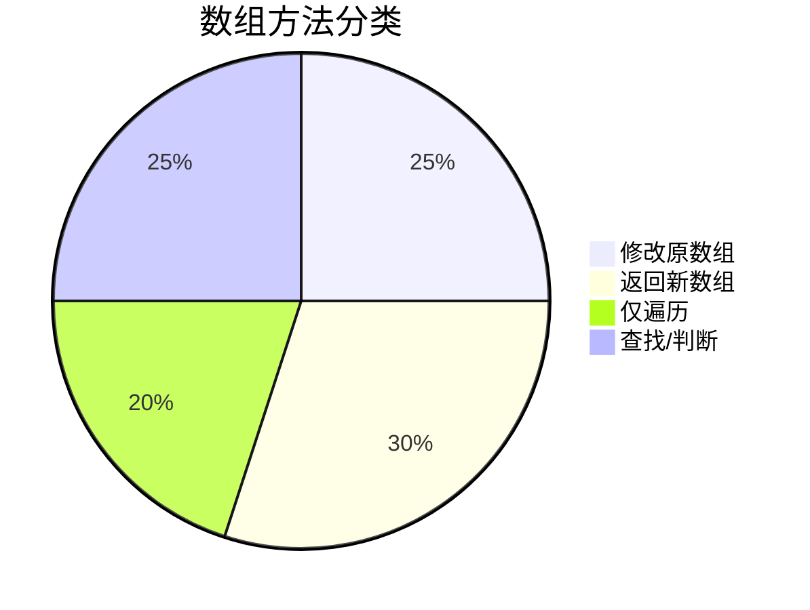

---

## 数组的遍历方法中，哪些可以中断，哪些不能中断

### **遍历方法对 `break` 的支持分析**

在 JavaScript 数组遍历的四个主要方法中，`break` 的行为差异显著，具体如下：

---

#### **1. `forEach()`：❌ 不支持 `break`**
- **原因**：`forEach` 内部通过回调函数实现遍历，无法中断循环。
- **表现**：使用 `break` 会直接报语法错误（`Illegal break statement`）。
- **替代方案**：
  ```javascript
  [1, 2, 3].forEach((v) => {
    if (v === 2) return; // 跳过当前迭代（无法完全终止）
    console.log(v);
  });
  ```
- **适用场景**：简单遍历，无需中断逻辑。

---

#### **2. `for...of`：✅ 支持 `break`**
- **原因**：`for...of` 是语言原生的循环语法，遵循标准循环控制规则。
- **示例**：
  ```javascript
  for (const num of [1, 2, 3]) {
    if (num === 2) break; // 立即终止循环
    console.log(num); // 只输出 1
  }
  ```
- **优势**：可中断，性能接近传统 `for` 循环。

---

#### **3. `map()`/`filter()`/`reduce()`：❌ 不支持 `break`**
- **原因**：这些方法返回新数组，内部实现为完整遍历。
- **表现**：`break` 会报语法错误。
- **替代方案**：
  - **`map`**：用 `return` 跳过当前项，但无法提前终止。
  - **`find`**：若需提前终止，改用 `find` 或 `some`。
  ```javascript
  // 使用 some 模拟 break
  [1, 2, 3].some((v) => {
    if (v === 2) return true; // 终止循环
    console.log(v); // 输出 1
  });
  ```

---

#### **4. `some()`/`every()`：✅ 支持逻辑中断**
- **原理**：
  - `some`：遇到 `return true` 时立即终止。
  - `every`：遇到 `return false` 时立即终止。
- **示例**：
  ```javascript
  // some 模拟 break
  [1, 2, 3].some((v) => {
    if (v === 2) return true; // 终止
    console.log(v); // 输出 1
  });
  
  // every 模拟 break
  [1, 2, 3].every((v) => {
    if (v === 2) return false; // 终止
    console.log(v); // 输出 1
    return true;
  });
  ```

---

### **总结对比表**
| 方法           | 是否支持 `break` | 中断方式                   | 典型用途      |
| -------------- | ---------------- | -------------------------- | ------------- |
| `forEach`      | ❌                | 无（报错）                 | 简单遍历      |
| `for...of`     | ✅                | `break`                    | 需中断的循环  |
| `map`/`filter` | ❌                | 无（需改用 `find`/`some`） | 数据转换/过滤 |
| `some`/`every` | ✅（逻辑等效）    | `return true`/`false`      | 条件检查      |

---

### **面试回答技巧**
**面试官**：为什么 `forEach` 不能用 `break`？  
**回答**：  
> `forEach` 通过回调函数处理每个元素，其内部实现强制完整遍历整个数组。若需中断，应改用 `for...of` 或 `some`/`every`，它们的设计允许提前终止。  

**追问**：如何在 `map` 中实现类似 `break` 的效果？  
**回答**：  
> 1. **改用 `for...of`**：直接使用原生循环。  
> 2. **结合 `slice` 截取**：先截取需处理的部分再 `map`。  
> 3. **利用 `throw` 异常**（不推荐）：通过 `try-catch` 强制中断，但会破坏代码可读性。  

---

### **可视化决策流程**
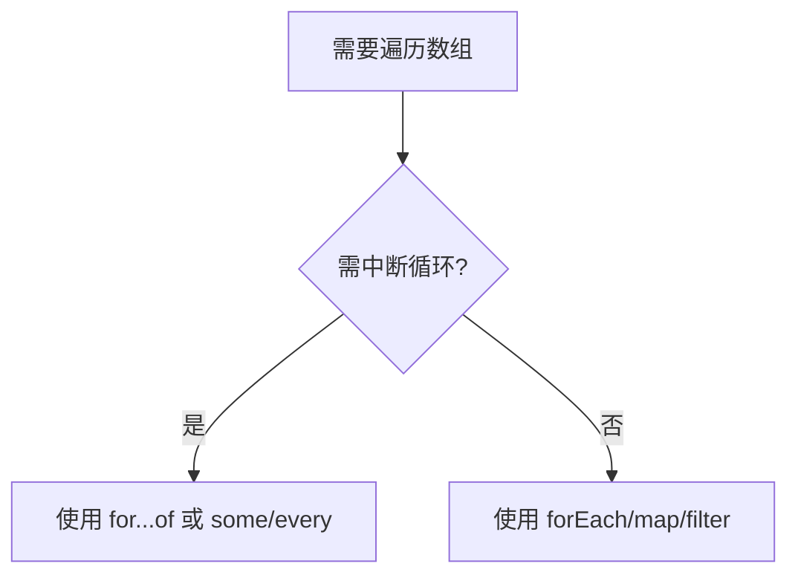

---

## for循环、for in和for of

### **for 循环、for...in 和 for...of 的区别详解**

#### **1. 基本语法与用途对比**
| 循环类型       | 语法                               | 主要用途                 | 是否支持 `break` |
| -------------- | ---------------------------------- | ------------------------ | ---------------- |
| **`for`**      | `for (let i=0; i<arr.length; i++)` | 通用循环，精确控制索引   | ✅                |
| **`for...in`** | `for (let key in obj)`             | 遍历对象的**可枚举属性** | ✅                |
| **`for...of`** | `for (let value of iterable)`      | 遍历**可迭代对象**的值   | ✅                |

---

#### **2. 核心区别分析**
##### **(1) `for` 循环**
- **特点**：
  - 最基础的循环，通过索引访问元素。
  - 适合需要精确控制循环次数或反向遍历的场景。
- **示例**：
  ```javascript
  const arr = [10, 20, 30];
  for (let i = 0; i < arr.length; i++) {
    if (i === 1) break; // 支持中断
    console.log(arr[i]); // 输出 10
  }
  ```

##### **(2) `for...in`**
- **特点**：
  - 遍历对象的**键名**（包括原型链上的可枚举属性）。
  - 不保证顺序（尤其对数组可能不按索引顺序）。
  - **不适合遍历数组**（会包含非数字键和继承属性）。
- **示例**：
  ```javascript
  const obj = { a: 1, b: 2 };
  for (const key in obj) {
    console.log(key); // 输出 'a', 'b'
  }
  
  // 数组问题示例
  Array.prototype.customProp = 'foo';
  const arr = [10, 20];
  arr.name = 'myArray';
  for (const key in arr) {
    console.log(key); // 输出 '0', '1', 'name', 'customProp'（污染！）
  }
  ```

##### **(3) `for...of`**
- **特点**：
  - 遍历**可迭代对象**（Array、Map、Set、String等）的**值**。
  - 不遍历原型链属性，保证顺序。
  - 是遍历数组和类数组结构的首选。
- **示例**：
  ```javascript
  const arr = [10, 20, 30];
  for (const value of arr) {
    if (value === 20) break; // 支持中断
    console.log(value); // 输出 10
  }
  
  // 遍历字符串
  for (const char of '你好') {
    console.log(char); // 输出 '你', '好'
  }
  ```

---

#### **3. 关键差异总结**
| 特性               | `for`         | `for...in`             | `for...of`                |
| ------------------ | ------------- | ---------------------- | ------------------------- |
| **遍历目标**       | 索引/条件控制 | 对象的键（含继承属性） | 可迭代对象的值            |
| **适合数组**       | ✅ 首选        | ❌ 会遍历非数字键       | ✅ 首选                    |
| **顺序保证**       | ✅ 确定        | ❌ 不保证（尤其数组）   | ✅ 确定                    |
| **原型链属性**     | -             | ✅ 包含                 | ❌ 不包含                  |
| **支持的数据结构** | 任意          | 对象                   | 可迭代对象（Array/Map等） |

---

#### **4. 如何选择？**
- **遍历数组**：优先用 `for...of` 或 `for`（需索引时）。
- **遍历对象**：用 `for...in` + `hasOwnProperty` 过滤原型属性：
  ```javascript
  for (const key in obj) {
    if (obj.hasOwnProperty(key)) { // 排除继承属性
      console.log(key, obj[key]);
    }
  }
  ```
- **需要中断**：三者均支持 `break`，但 `for...in` 和 `for...of` 更简洁。

---

#### **5. 面试回答示例**
**面试官**：`for...in` 和 `for...of` 有什么区别？  
**回答**：  
> 1. **`for...in`**：  
>    - 遍历对象的**键名**（包括原型链上的可枚举属性）。  
>    - 不保证顺序，不适合遍历数组（可能包含非数字键）。  
> 2. **`for...of`**：  
>    - 遍历**可迭代对象**（如数组、Map、Set）的**值**。  
>    - 不遍历原型链，保证顺序，是遍历数组的首选。  
>
> **示例**：  
> ```javascript
> // for...in 会遍历继承属性
> for (const key in arr) { /* 可能包含非数字键 */ }  
> 
> // for...of 仅遍历值
> for (const value of arr) { /* 安全遍历数组 */ }  
> ```

**追问**：什么时候该用传统 `for` 循环？  
**回答**：  
> 当需要：  
> 1. 精确控制索引（如反向遍历 `i--`）。  
> 2. 高性能遍历超大数组（`for` 通常比 `for...of` 稍快）。  
> 3. 同时访问索引和值（`for...of` 需搭配 `entries()`）。

---

## **Object 与 Map 的深度对比与替代性分析**

虽然 Object 和 Map 都可以存储键值对，但它们在设计理念和具体使用场景上有显著差异。以下是关键对比和替代性建议：

---

### **1. 核心差异总结**
| 特性             | Object                              | Map                                     |
| ---------------- | ----------------------------------- | --------------------------------------- |
| **键的类型**     | 仅支持字符串或 Symbol               | 支持任意类型（对象、函数等）            |
| **键的顺序**     | 无序（ES6 后部分有序但不保证）      | 严格按插入顺序                          |
| **性能**         | 高频访问/小数据量更优               | 大数据量增删操作更高效                  |
| **内置方法**     | 无专用方法，需用 `Object.keys()` 等 | 提供 `set()`/`get()`/`has()` 等专用 API |
| **JSON 支持**    | 原生支持 `JSON.stringify()`         | 需手动转换                              |
| **原型污染风险** | 可能通过原型链继承属性              | 完全隔离                                |

---

### **2. 何时可以互相替代？**
#### **✅ 可替代场景**
- **简单键值存储**：当键均为字符串且无需复杂操作时，两者功能等价。
  ```javascript
  // Object
  const obj = { id: 1, name: "Alice" };
  
  // Map
  const map = new Map();
  map.set("id", 1);
  map.set("name", "Alice");
  ```

#### **❌ 不可替代场景**
| 需求             | 推荐选择 | 原因                                                         |
| ---------------- | -------- | ------------------------------------------------------------ |
| 键需为非字符串   | Map      | Object 会强制将键转为字符串（如 `{}` 会变成 `"[object Object]"`） |
| 需要严格插入顺序 | Map      | Object 的属性顺序不可靠                                      |
| 高频增删键值对   | Map      | Map 的 `set`/`delete` 性能优于 Object 的动态属性操作         |
| 避免原型链干扰   | Map      | Object 可能通过 `__proto__` 或 `constructor` 被污染          |
| 需要遍历方法     | Map      | Map 直接提供 `forEach()`、`keys()` 等方法，Object 需转换（如 `Object.entries()`） |

---

### **3. 具体场景示例**
#### **场景 1：使用对象作为键**
```javascript
// Map 可正确处理对象键
const map = new Map();
const keyObj = { id: 1 };

map.set(keyObj, "value");
console.log(map.get(keyObj)); // "value"

// Object 会强制转键为字符串
const obj = {};
obj[keyObj] = "value";
console.log(obj["[object Object]"]); // "value" （丢失原始对象引用）
```

#### **场景 2：性能敏感操作**
```javascript
// Map 在大数据量增删时更快
const bigMap = new Map();
for (let i = 0; i < 1e6; i++) {
  bigMap.set(i, i * 2); // 比 Object 动态属性更快
}

// Object 在静态数据访问时略快
const bigObj = {};
for (let i = 0; i < 1e6; i++) {
  bigObj[i] = i * 2;
}
console.log(bigObj[999]); // 访问速度通常比 Map.get() 快 10%~20%
```

#### **场景 3：避免原型污染**
```javascript
// Object 可能被篡改
const unsafeObj = {};
console.log("toString" in unsafeObj); // true （继承自 Object.prototype）

// Map 完全隔离
const safeMap = new Map();
console.log(safeMap.has("toString")); // false
```

---

### **4. 面试回答建议**
**面试官**：Object 和 Map 能完全互相替代吗？  
**回答**：  
> 不能完全替代，需根据场景选择：  
> - **优先用 Map**：  
>   1. 键需为非字符串（如对象、函数）  
>   2. 需要严格插入顺序或高频增删  
>   3. 避免原型链污染  
> - **优先用 Object**：  
>   1. 键均为字符串且数据量小  
>   2. 需要 JSON 序列化或与旧代码交互  
>   3. 依赖 Object 特有特性（如属性描述符）  

**追问**：Map 相比 Object 的性能优势体现在哪？  
**回答**：  
> 1. **大数据量操作**：Map 的 `set`/`delete` 时间复杂度接近 O(1)，而 Object 动态属性可能触发隐藏类优化失效。  
> 2. **频繁增删**：Map 内部实现为哈希表，而 Object 需处理原型链和属性描述符。  
> 3. **内存占用**：Map 对稀疏数据存储更高效，Object 会为未使用的属性预留空间。  

---

### **5. 可视化决策树**
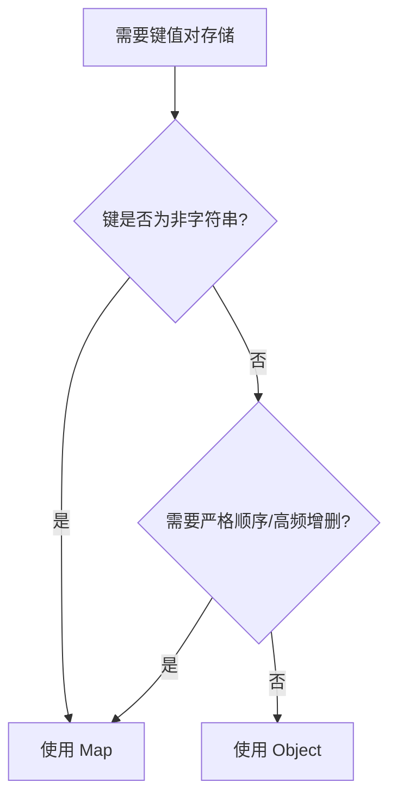

---

## （CODING）翻转单链表

````javascript
// 单链表节点
function ListNode(val, next) {
    this.val = (val == undefined ? 0 : val)
    this.next = (next == undefined ? null : next)
}

function reverseList(head) {
// TODO
    if (head == null) return head;
    let l = null;
    let r = head;
    while(r!=null){
        let t = r.next
        r.next = l
        l = r
        r = t
    }
    return l
};
let head = new ListNode(1)
head.next = new ListNode(2)
head.next.next = new ListNode(3)
console.log(reverseList(head))
````

---

## （CODING）实现带缓存结果功能的高阶函数

````javascript
// 假设add是个复杂计算函数
const add = function (a) {
    return a + 1
}

// 实现可以缓存其他函数结果的高阶函数
function memorize(fn) {
    const cache = new Map();
    return function (...args) {
        // 创建更可靠的缓存键
        const cacheKey = args.length === 1
            ? args[0]
            : JSON.stringify(args);

        if (cache.has(cacheKey)) {
            console.log('Getting from cache');
            return cache.get(cacheKey);
        }

        console.log('Calculating result');
        const result = fn.apply(this, args);
        cache.set(cacheKey, result);
        return result;
    };
}

///////////////////////////////////////////////

// 通过memorize获得了add的缓存函数 adder；
const adder = memorize(add)
console.log(adder(1))
console.log(adder(1))
console.log(adder(2))

console.log('----------------------------------------')

// 测试复杂参数
const complexAdd = memorize((a, b) => {
    console.log('Calculating...');
    return a.value + b.value;
});

const obj1 = {value: 1};
const obj2 = {value: 2};

console.log(complexAdd(obj1, obj2)); // Calculating..., 输出: 3
console.log(complexAdd(obj1, obj2)); // 从缓存获取, 输出: 3


// function demo(...args){
//     console.log(JSON.stringify(args))
//     let t = JSON.stringify(args);
//     let cache = new WeakMap();
//     cache.set(t, '22222')
// }
// demo({id: 'k23qj4523'},2,3)
// demo(1,2,3)


````

---

## （CODING）实现带超时的请求函数

````javascript
// 实现带超时的请求函数
function fetchWithTimeout(url, timeoutNum) {
    // TODO
    // 1. 创建Promise p1,用来请求url
    // 2. 创建Promise p2,封装一个时间为timeoutNum的计时器
    // 3. 使用Promise.race, 参数为p1, p2,当p1或p2为完成状态时（settled）执行下一步（例如返回一个空值或者提示）

    // 1. 创建Promise p1,用来请求url
    const p1 = fetch(url)
        .then(response => {
            console.log('response:', response)
            if (!response.ok) {
                throw new Error('Network response was not ok');
            }
            return response.json();
        });

    // 2. 创建Promise p2,封装一个时间为timeoutNum的计时器
    const p2 = new Promise((_, reject) => {
        setTimeout(() => {
            reject(new Error(`Request timed out after ${timeoutNum}ms`));
        }, timeoutNum);
    });

    // 3. 使用Promise.race, 参数为p1, p2
    return Promise.race([p1, p2])
        .catch(error => {
            console.error('Error:', error.message);
            return null; // 返回空值表示请求失败或超时
        });
}

// 使用示例
fetchWithTimeout('https://api.example.com/data', 5000)
    .then(data => {
        if (data !== null) {
            console.log('Data:', data);
        } else {
            console.log('Request failed or timed out');
        }
    });

// 函数说明
// p1 - 使用fetch API发起网络请求，并处理响应：
//
// 检查响应是否成功（response.ok）
//
// 将响应解析为JSON格式
//
// p2 - 创建一个超时Promise：
//
// 在指定时间（timeoutNum毫秒）后拒绝Promise
//
// 拒绝时返回一个包含超时信息的错误
//
// Promise.race - 竞速机制：
//
// 哪个Promise先完成（无论是解决还是拒绝）就采用它的结果
//
// 如果请求先完成，返回请求结果
//
// 如果超时先触发，返回null并输出错误信息
//
// 错误处理：
//
// 捕获所有可能的错误（网络错误或超时错误）
//
// 统一返回null表示失败
//
// 在控制台输出具体错误信息便于调试
//
// 这个函数可以确保网络请求不会无限期等待，在指定时间内没有响应就会自动终止并返回提示信息。
````

---

# 2025.06.27

---

## 等价多米诺骨牌对的数量

```javascript
/**
 等价多米诺骨牌对的数量
 给你一个由一些多米诺骨牌组成的列表 dominoes.
 如果其中某一张多米诺骨牌可以通过旋转 0度或 180 度得到另一张多米诺骨牌，我们就认为这两张牌是等价的。
 形式上，dominoes[i] = [a, b]和 dominoes] = [c,d] 等价的前提是 a==c日b==d，或是 a==d且 b==c。
 在0<=i<j< dominoes.length 的前提下，找出满足 dominoes[i] 和 dominoes[j] 等价的骨牌对(i,j)的数量示例:
 输入:dominoes =[[1,2],[2,1],[3,4],[5,6]]
 输出:1
 提示:
 1<=dominoes.length<= 40000
 1<= dominoes[i][j]<= 9
 */

// 我的
function dominioes_pairs(dominoes) {
    let cache = new Map()
    let cnt = 0
    for (let i = 0; i < dominoes.length; i++) {
        let key = JSON.stringify(dominoes[i].sort())
        if (cache.has(key)) {
            let t = cache.get(key)
            cnt += t
            cache.set(key, t + 1)
        } else {
            cache.set(key, 1)
        }
    }
    return cnt
}

// deepseek 改进版本
function numEquivDominoPairs(dominoes) {
    const countMap = new Map();
    let count = 0;
    for (const [a, b] of dominoes) {
        const key = `${Math.min(a, b)},${Math.max(a, b)}`;
        const currentCount = countMap.get(key) || 0;
        count += currentCount;
        countMap.set(key, currentCount + 1);
    }
    return count;
}


// deepseek 数学角度
function numEquivDominoPairsMath(dominoes) {
    const countMap = new Map();
    let count = 0;
    for (const [a, b] of dominoes) {
        const key = `${Math.min(a, b)},${Math.max(a, b)}`;
        const currentCount = countMap.get(key) || 0;
        count += currentCount;
        countMap.set(key, currentCount + 1);
    }
    return count;
}

let dominioes = [[1, 2], [2, 1], [1, 2], [3, 4], [5, 6], [4, 3], [3, 4]]
console.log(dominioes_pairs(dominioes))
console.log(numEquivDominoPairs(dominioes))
console.log(numEquivDominoPairsMath(dominioes))
```
---

# 2026.03.29
---
## JS中字符串的substring方法和slice方法的区别

### 一句话结论
- **substring**：认正数，会自动交换大小，**不支持负数**
- **slice**：支持负数（从末尾算），**不会自动交换**，更灵活、更安全

---

### 1. 参数规则不同
#### substring(start, end)
- 如果 `start > end`，会**自动交换两个值**
- **负数 → 直接当成 0**

#### slice(start, end)
- 如果 `start > end` → **返回空字符串**
- 负数：**从字符串末尾倒数**
    - `-1` 最后一位
    - `-2` 倒数第二位

---

### 2. 举例对比（最直观）
```js
const str = 'abcdefg'
```

#### ① 正常情况：两者一样
```js
str.substring(1, 4) // 'bcd'
str.slice(1, 4)      // 'bcd'
```

#### ② start > end 时
```js
str.substring(4, 1) // 自动交换 → (1,4) → 'bcd'
str.slice(4, 1)    // 不交换 → 返回 ''
```

#### ③ 用负数时
```js
str.substring(-2)   // 负数变0 → 从0开始 → 'abcdefg'
str.slice(-2)       // 倒数2位 → 'fg'
```

```js
str.substring(2, -1) // 负数变0 → (0,2) → 'ab'
str.slice(2, -1)      // 从2到倒数1 → 'cdef'
```

---