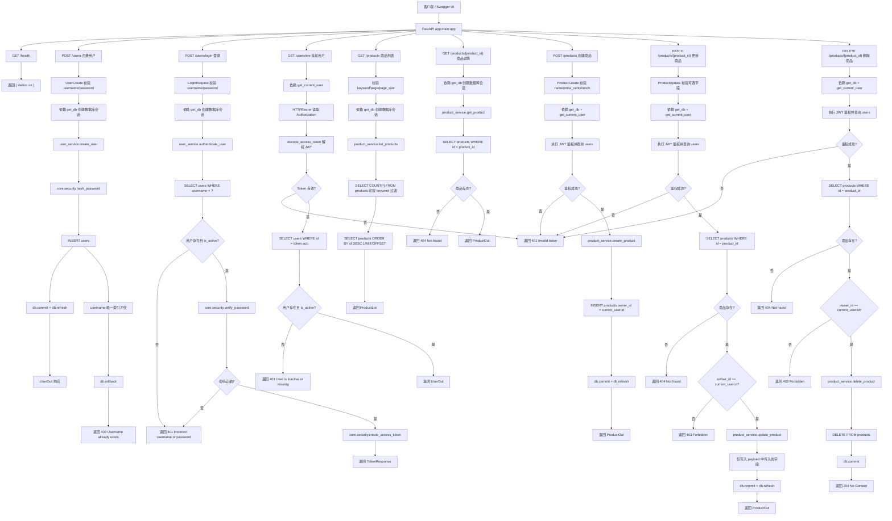

# FastAPI Lab By Codex

这是一个按照博客「推荐项目结构」整理出来的小型 FastAPI Demo。它包含用户注册、登录、JWT 鉴权、商品 CRUD、SQLAlchemy 2.0 数据访问、初始化 SQL 和基础测试。

## 项目结构

```txt
app/
  main.py
  core/
    config.py
    security.py
  db/
    session.py
    models.py
  api/
    deps.py
    routers/
      users.py
      products.py
  schemas/
    user.py
    product.py
  services/
    user_service.py
    product_service.py
tests/
  test_products.py
sql/
  init.sql
```

## 接口逻辑流程图



## 准备数据库

本项目不使用原来的 `ghjf` 数据库，默认使用新库 `fastapi_lab_bycodex`。

先在 MySQL 中执行：

```sql
source sql/init.sql;
```

如果你的 MySQL 账号密码不是 `root/root`，复制环境变量模板并修改连接串：

```bash
cp .env.example .env
```

Windows PowerShell 可以执行：

```powershell
Copy-Item .env.example .env
```

然后把 `.env` 中的 `DATABASE_URL` 改成你的 MySQL 地址。

## 启动项目

建议在当前目录创建虚拟环境：

```bash
python -m venv .venv
```

Windows PowerShell 激活：

```powershell
.\.venv\Scripts\Activate.ps1
```

安装依赖：

```bash
pip install -r requirements.txt
```

启动服务：

```bash
uvicorn app.main:app --reload --port 8001
```

打开接口文档：

```txt
http://127.0.0.1:8001/docs
```

## 试用账号

初始化 SQL 会创建一个测试账号：

```txt
username: admin
password: admin123
```

在 `/users/login` 登录后，把返回的 `access_token` 填入 Swagger 右上角的 Authorize，格式为：

```txt
Bearer <access_token>
```

之后可以调用需要登录的商品创建、更新、删除接口。

## 运行测试

测试会使用 SQLite 内存库，不依赖你的 MySQL：

```bash
pytest
```
