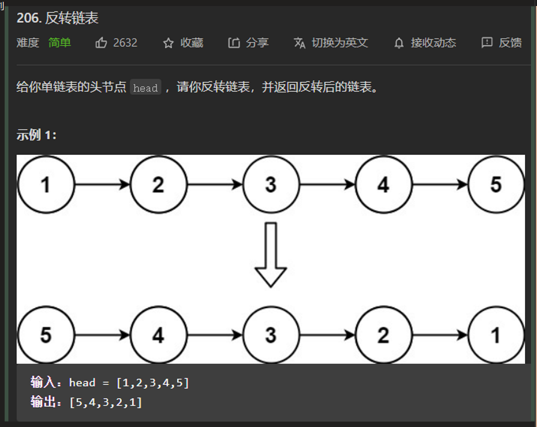
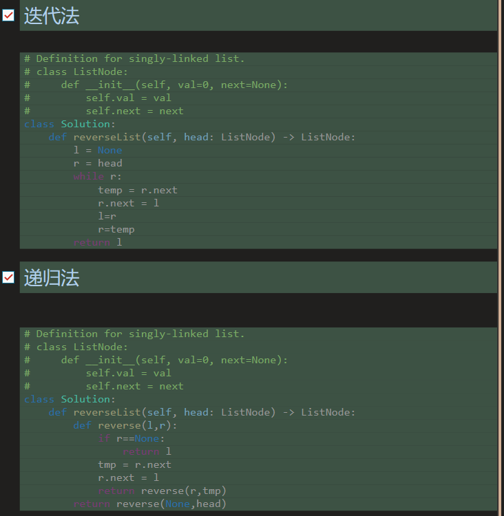
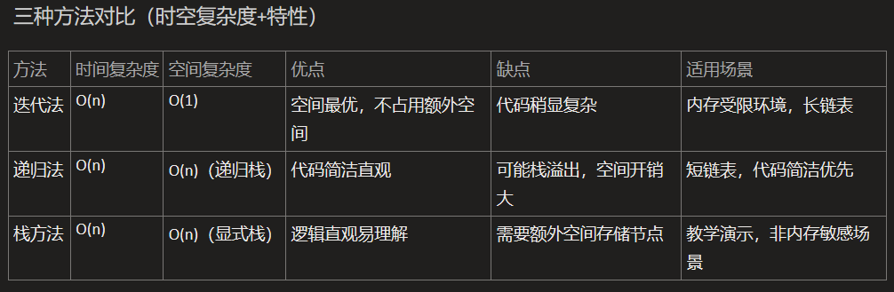

# 算法与手写题复习

整理链表、缓存高阶函数、超时请求、等价多米诺骨牌等 coding 题。

> 本文从旧博客笔记归档中按主题拆分整理，保留了原笔记内容和图片引用。
> 来源日期：2025.06.19

## 翻转列表（双指针/递归/栈）





---

---

> 来源日期：2025.06.26

## （CODING）翻转单链表

````javascript
// 单链表节点
function ListNode(val, next) {
    this.val = (val == undefined ? 0 : val)
    this.next = (next == undefined ? null : next)
}

function reverseList(head) {
// TODO
    if (head == null) return head;
    let l = null;
    let r = head;
    while(r!=null){
        let t = r.next
        r.next = l
        l = r
        r = t
    }
    return l
};
let head = new ListNode(1)
head.next = new ListNode(2)
head.next.next = new ListNode(3)
console.log(reverseList(head))
````

---

> 来源日期：2025.06.26

## （CODING）实现带缓存结果功能的高阶函数

````javascript
// 假设add是个复杂计算函数
const add = function (a) {
    return a + 1
}

// 实现可以缓存其他函数结果的高阶函数
function memorize(fn) {
    const cache = new Map();
    return function (...args) {
        // 创建更可靠的缓存键
        const cacheKey = args.length === 1
            ? args[0]
            : JSON.stringify(args);

        if (cache.has(cacheKey)) {
            console.log('Getting from cache');
            return cache.get(cacheKey);
        }

        console.log('Calculating result');
        const result = fn.apply(this, args);
        cache.set(cacheKey, result);
        return result;
    };
}

///////////////////////////////////////////////

// 通过memorize获得了add的缓存函数 adder；
const adder = memorize(add)
console.log(adder(1))
console.log(adder(1))
console.log(adder(2))

console.log('----------------------------------------')

// 测试复杂参数
const complexAdd = memorize((a, b) => {
    console.log('Calculating...');
    return a.value + b.value;
});

const obj1 = {value: 1};
const obj2 = {value: 2};

console.log(complexAdd(obj1, obj2)); // Calculating..., 输出: 3
console.log(complexAdd(obj1, obj2)); // 从缓存获取, 输出: 3

// function demo(...args){
//     console.log(JSON.stringify(args))
//     let t = JSON.stringify(args);
//     let cache = new WeakMap();
//     cache.set(t, '22222')
// }
// demo({id: 'k23qj4523'},2,3)
// demo(1,2,3)

````

---

> 来源日期：2025.06.26

## （CODING）实现带超时的请求函数

````javascript
// 实现带超时的请求函数
function fetchWithTimeout(url, timeoutNum) {
    // TODO
    // 1. 创建Promise p1,用来请求url
    // 2. 创建Promise p2,封装一个时间为timeoutNum的计时器
    // 3. 使用Promise.race, 参数为p1, p2,当p1或p2为完成状态时（settled）执行下一步（例如返回一个空值或者提示）

    // 1. 创建Promise p1,用来请求url
    const p1 = fetch(url)
        .then(response => {
            console.log('response:', response)
            if (!response.ok) {
                throw new Error('Network response was not ok');
            }
            return response.json();
        });

    // 2. 创建Promise p2,封装一个时间为timeoutNum的计时器
    const p2 = new Promise((_, reject) => {
        setTimeout(() => {
            reject(new Error(`Request timed out after ${timeoutNum}ms`));
        }, timeoutNum);
    });

    // 3. 使用Promise.race, 参数为p1, p2
    return Promise.race([p1, p2])
        .catch(error => {
            console.error('Error:', error.message);
            return null; // 返回空值表示请求失败或超时
        });
}

// 使用示例
fetchWithTimeout('https://api.example.com/data', 5000)
    .then(data => {
        if (data !== null) {
            console.log('Data:', data);
        } else {
            console.log('Request failed or timed out');
        }
    });

// 函数说明
// p1 - 使用fetch API发起网络请求，并处理响应：
//
// 检查响应是否成功（response.ok）
//
// 将响应解析为JSON格式
//
// p2 - 创建一个超时Promise：
//
// 在指定时间（timeoutNum毫秒）后拒绝Promise
//
// 拒绝时返回一个包含超时信息的错误
//
// Promise.race - 竞速机制：
//
// 哪个Promise先完成（无论是解决还是拒绝）就采用它的结果
//
// 如果请求先完成，返回请求结果
//
// 如果超时先触发，返回null并输出错误信息
//
// 错误处理：
//
// 捕获所有可能的错误（网络错误或超时错误）
//
// 统一返回null表示失败
//
// 在控制台输出具体错误信息便于调试
//
// 这个函数可以确保网络请求不会无限期等待，在指定时间内没有响应就会自动终止并返回提示信息。
````

---

---

> 来源日期：2025.06.27

## 等价多米诺骨牌对的数量

```javascript
/**
 等价多米诺骨牌对的数量
 给你一个由一些多米诺骨牌组成的列表 dominoes.
 如果其中某一张多米诺骨牌可以通过旋转 0度或 180 度得到另一张多米诺骨牌，我们就认为这两张牌是等价的。
 形式上，dominoes[i] = [a, b]和 dominoes] = [c,d] 等价的前提是 a==c日b==d，或是 a==d且 b==c。
 在0<=i<j< dominoes.length 的前提下，找出满足 dominoes[i] 和 dominoes[j] 等价的骨牌对(i,j)的数量示例:
 输入:dominoes =[[1,2],[2,1],[3,4],[5,6]]
 输出:1
 提示:
 1<=dominoes.length<= 40000
 1<= dominoes[i][j]<= 9
 */

// 我的
function dominioes_pairs(dominoes) {
    let cache = new Map()
    let cnt = 0
    for (let i = 0; i < dominoes.length; i++) {
        let key = JSON.stringify(dominoes[i].sort())
        if (cache.has(key)) {
            let t = cache.get(key)
            cnt += t
            cache.set(key, t + 1)
        } else {
            cache.set(key, 1)
        }
    }
    return cnt
}

// deepseek 改进版本
function numEquivDominoPairs(dominoes) {
    const countMap = new Map();
    let count = 0;
    for (const [a, b] of dominoes) {
        const key = `${Math.min(a, b)},${Math.max(a, b)}`;
        const currentCount = countMap.get(key) || 0;
        count += currentCount;
        countMap.set(key, currentCount + 1);
    }
    return count;
}

// deepseek 数学角度
function numEquivDominoPairsMath(dominoes) {
    const countMap = new Map();
    let count = 0;
    for (const [a, b] of dominoes) {
        const key = `${Math.min(a, b)},${Math.max(a, b)}`;
        const currentCount = countMap.get(key) || 0;
        count += currentCount;
        countMap.set(key, currentCount + 1);
    }
    return count;
}

let dominioes = [[1, 2], [2, 1], [1, 2], [3, 4], [5, 6], [4, 3], [3, 4]]
console.log(dominioes_pairs(dominioes))
console.log(numEquivDominoPairs(dominioes))
console.log(numEquivDominoPairsMath(dominioes))
```
---

---

