# 浏览器渲染与前端性能

整理浏览器渲染流程、回流重绘、transform 性能和首屏加载优化。

> 本文从旧博客笔记归档中按主题拆分整理，保留了原笔记内容和图片引用。
> 来源日期：2025.06.23

## 浏览器是如何渲染页面的？																

当**浏览器的网络线程收到 HTML 文档后**，会产生一个渲染任务，并将其传递给渲染主线程的消息队列。

在事件循环机制的作用下，渲染主线程取出消息队列中的渲染任务，开启渲染流程。


-------

整个渲染流程分为多个阶段，分别是： HTML 解析、样式计算、布局、分层、绘制、分块、光栅化、画

每个阶段都有明确的输入输出，上一个阶段的输出会成为下一个阶段的输入。

这样，整个渲染流程就形成了一套组织严密的生产流水线。

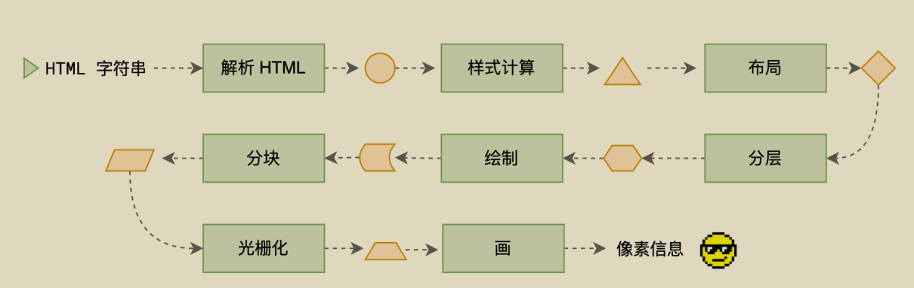

-------

> 渲染的第一步是**解析 HTML**。

解析过程中遇到 CSS 解析 CSS，遇到 JS 执行 JS。为了提高解析效率，浏览器在开始解析前，会启动一个**预解析的线程**，率先下载 HTML 中的外部 CSS 文件和 外部的 JS 文件。

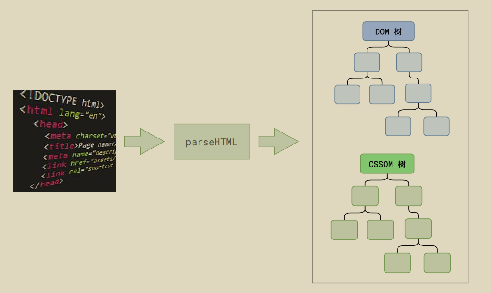


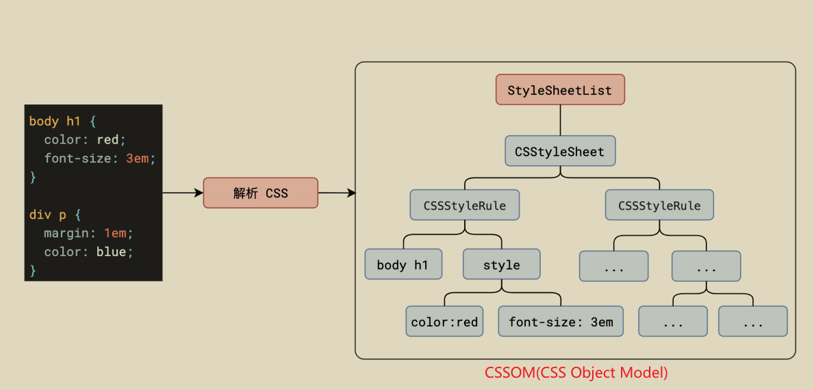

<u>如果主线程解析到`link`位置</u>，此时外部的 CSS 文件还没有下载解析好，主线程不会等待，**继续解析**后续的 HTML。这是因为下载和解析 CSS 的工作是在预解析线程中进行的。这就是 CSS 不会阻塞 HTML 解析的根本原因。


<u>如果主线程解析到`script`位置</u>，会**停止解析** HTML，转而等待 JS 文件下载好，并将全局代码解析执行完成后，才能继续解析 HTML。这是因为 JS 代码的执行过程可能会修改当前的 DOM 树，所以 DOM 树的生成必须暂停。这就是 JS 会阻塞 HTML 解析的根本原因。

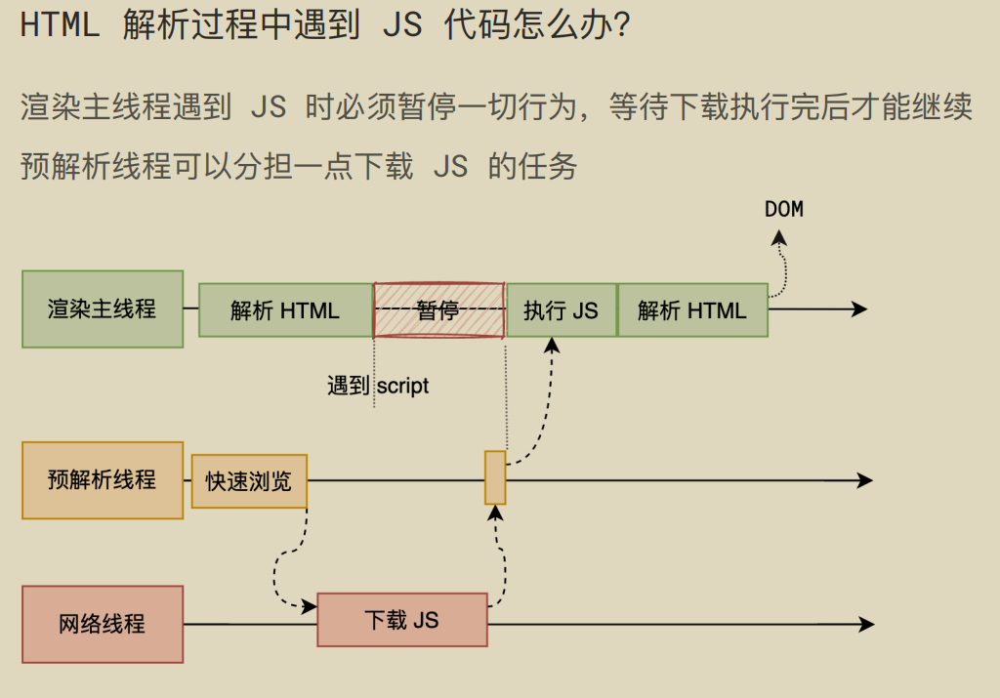

第一步完成后，会得到 **DOM 树和 CSSOM 树**，浏览器的<u>默认样式、内部样式、外部样式、行内样式</u>均会包含在 CSSOM 树中。

-------

> 渲染的下一步是**样式计算**。

主线程会遍历得到的 DOM 树，依次为树中的每个节点计算出它最终的样式，称之为 Computed Style。

在这一过程中，很多预设值会变成绝对值，比如`red`会变成`rgb(255,0,0)`；相对单位会变成绝对单位，比如`em`会变成`px`

这一步完成后，会得到一棵带有样式的 DOM 树。


--------

> 接下来是**布局**，布局完成后会得到布局树。

布局阶段会依次遍历 DOM 树的每一个节点，计算每个节点的几何信息。例如节点的宽高、相对包含块的位置。


大部分时候，DOM 树和布局树并非一一对应。

比如`display:none`的节点没有几何信息，因此不会生成到布局树；又比如使用了伪元素选择器，虽然 DOM 树中不存在这些伪元素节点，但它们拥有几何信息，所以会生成到布局树中。还有匿名行盒、匿名块盒等等都会导致 DOM 树和布局树无法一一对应。


-----------

> 下一步是**分层**

主线程会使用一套复杂的策略对整个布局树中进行分层。

分层的好处在于，将来某一个层改变后，仅会对该层进行后续处理，从而提升效率。

滚动条、堆叠上下文、transform、opacity 等样式都会或多或少的影响分层结果，也可以通过`will-change`属性更大程度的影响分层结果。

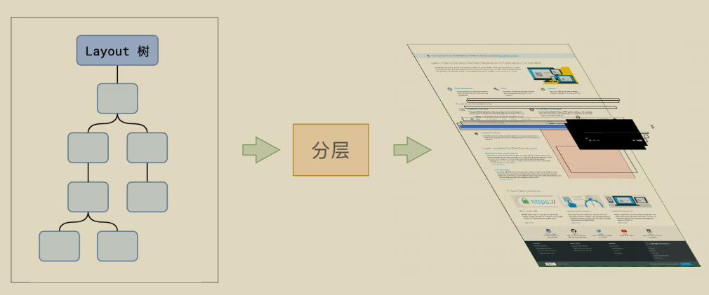

---------

> 再下一步是**绘制**

主线程会为每个层单独产生**绘制指令集**，用于描述这一层的内容该如何画出来。

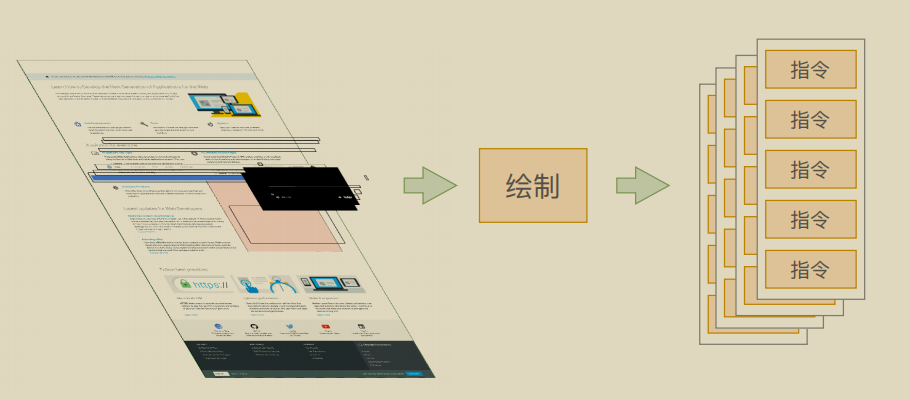

------

完成绘制后，主线程将每个图层的绘制信息提交给**合成线程**，剩余工作将由合成线程完成。

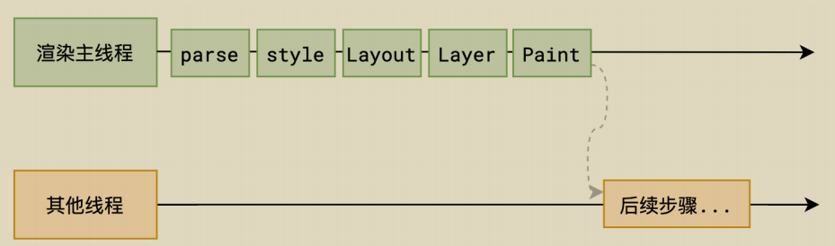

合成线程首先对每个图层进行**分块(Tilling)**，将其划分为更多的小区域。

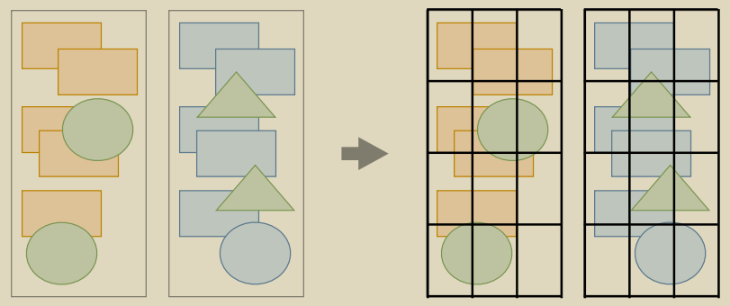

它会从线程池中拿取多个线程来完成分块工作。


----

> 分块完成后，进入**光栅化**阶段。

合成线程会将块信息交给 **GPU 进程**，以极高的速度完成光栅化。

GPU 进程会开启多个线程来完成光栅化，并且优先处理**靠近视口**区域的块。

光栅化的结果，就是一块一块的位图


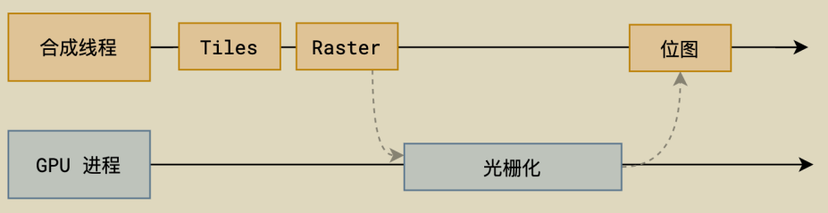

---------

> 最后一个阶段就是**画(draw)**了

合成线程拿到每个层、每个块的位图后，生成一个个「指引（quad）」信息。

指引会标识出每个位图应该画到屏幕的哪个位置，以及会考虑到旋转、缩放等变形。

变形发生在合成线程，与渲染主线程无关，这就是`transform`效率高的本质原因。

合成线程会把 quad 提交给 GPU 进程，由 GPU 进程产生系统调用，提交给 GPU 硬件，完成最终的屏幕成像。

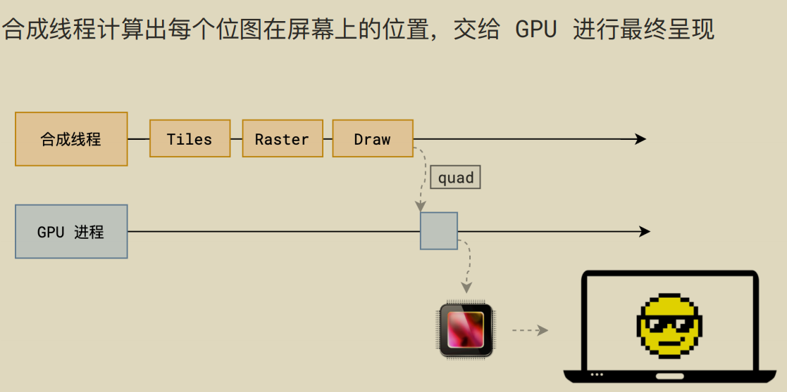

> **完整过程**

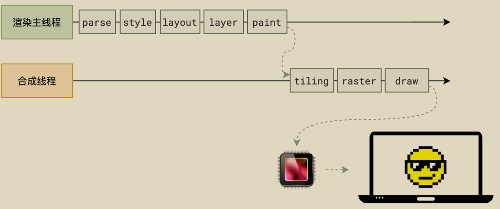

---

> 来源日期：2025.06.23

## 什么是 reflow（回流、重排）？


reflow 的本质就是**重新计算 layout 树**。

当进行了会影响布局树的操作后，需要重新计算布局树，会引发 layout。

为了避免连续的多次操作导致布局树反复计算，浏览器会合并这些操作，当 JS 代码全部完成后再进行统一计算。所以，改动属性造成的 reflow 是异步完成的。

也同样因为如此，**当 JS 获取布局属性时，就可能造成无法获取到最新的布局信息。**

**浏览器在反复权衡下，最终决定获取属性立即 reflow。**因此，频繁读取像document.clientWidth这样的值会影响浏览器的渲染性能。

> 来源日期：2025.06.23

## 什么是 repaint（重绘）？

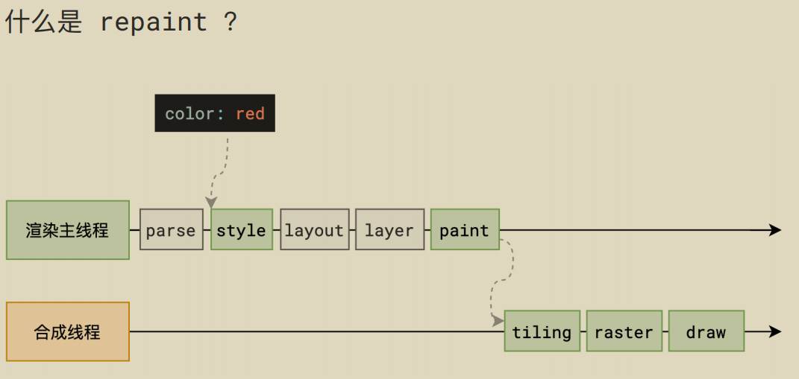

repaint 的本质就是重新根据分层信息计算了**绘制指令**。

当改动了可见样式后，就需要重新计算，会引发 repaint。

由于元素的布局信息也属于可见样式，所以 **reflow 一定会引起 repaint**。

---

> 来源日期：2025.06.23

## 为什么 transform 的效率高？

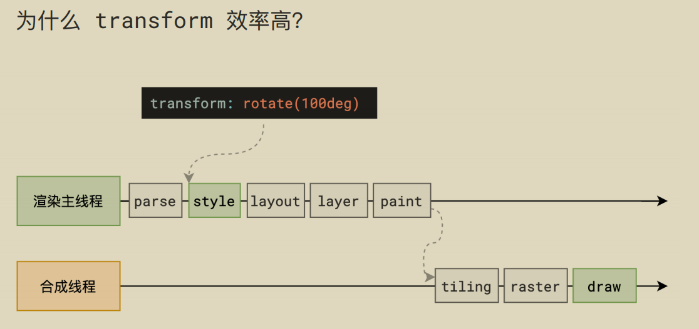


因为 transform 既不会影响布局也不会影响绘制指令，它影响的只是渲染流程的最后一个「draw」阶段

由于 draw 阶段在合成线程中，所以 transform 的变化几乎不会影响渲染主线程。反之，渲染主线程无论如何忙碌，也不会影响 transform 的变化。

---

> 来源日期：2025.06.23

## 首屏加载慢怎么办

### 口头回答面试官（简洁版）🎯  
“首屏加载慢可以从 **资源优化**、**渲染策略** 和 **网络层面** 三方面解决。在Vue2项目中，我会优先做这几件事：  
1. **代码分割+路由懒加载**，减少初始包体积；  
2. **CDN引入Vue全家桶**，搭配Webpack的`externals`；  
3. **骨架屏**过渡，降低白屏感知；  
4. **图片懒加载+WebP格式**，压缩资源体积；  
5. **Gzip压缩**和HTTP缓存优化传输效率。  
比如之前有个项目，通过这些优化将首屏时间从12秒降到了1秒内。”  

---

### 详细技术解析（Vue2专项优化）🔧  

#### 1. 代码分割与懒加载 🧩  
**核心目标**：减少初始JS体积，按需加载非首屏资源。  

**Vue2实践**：  
- **路由懒加载**：通过动态导入拆分路由组件  
  ```javascript
  // router.js
  const Home = () => import(/* webpackChunkName: "home" */ './views/Home.vue');
  ```
  Webpack会自动生成独立chunk文件，首屏只加载必要资源。  

- **组件级懒加载**：非关键组件异步加载  
  ```javascript
  components: {
    HeavyComponent: () => import('./HeavyComponent.vue')
  }
  ```
  配合`v-if`控制渲染时机。  

**效果**：  
👉 `vendor.js`体积减少60%，FCP降低40%  

---

#### 2. 静态资源优化 🖼️  
**图片处理**：  
- **WebP替代传统格式**：  
  ```html
  <picture>
    <source srcset="image.webp" type="image/webp">
     
  </picture>
  ```
- **懒加载**：使用`vue-lazyload`  
  ```javascript
  // main.js
  Vue.use(VueLazyload, {
    loading: require('@/assets/loading-placeholder.png')
  });
  ```

**第三方库CDN化**：  
```html
<!-- index.html -->
<script src="https://cdn.jsdelivr.net/npm/vue@2.6.14/dist/vue.min.js"></script>
```
```javascript
// webpack.config.js
externals: {
  vue: 'Vue',
  'vue-router': 'VueRouter'
}
```

---

#### 3. 渲染优化 ✨  
**骨架屏技术**：  
```javascript
// vue.config.js
const SkeletonWebpackPlugin = require('vue-skeleton-webpack-plugin');
module.exports = {
  plugins: [
    new SkeletonWebpackPlugin({
      webpackConfig: { entry: './src/skeleton.js' }
    })
  ]
};
```
**虚拟滚动**（长列表优化）：  
```vue
<template>
  <RecycleScroller :items="bigList" :item-size="50">
    <template v-slot="{ item }">
      <div>{{ item.text }}</div>
    </template>
  </RecycleScroller>
</template>
```

---

#### 4. 网络传输优化 🌐  
**Gzip压缩**：  
```nginx
# Nginx配置
gzip on;
gzip_types text/plain application/x-javascript text/css;
```

**预加载关键资源**：  
```html
<link rel="preload" href="/critical.css" as="style">
```

---

### 真实案例复盘 📈  
**问题**：某后台管理系统首屏加载8秒，LCP达4.2秒  
**优化手段**：  
1. 路由懒加载 → vendor.js从3MB→1.2MB  
2. Element UI按需引入 → 体积减少65%  
3. 图片转WebP + 懒加载 → 资源请求数减少40%  
**结果**：  
✅ FCP从3.4s→0.9s | Lighthouse评分从32→89  

---

### 快速自查清单 📋  
| 优化方向     | 具体措施                  | 预期收益     |
| ------------ | ------------------------- | ------------ |
| **JS体积**   | 路由懒加载 + Tree-shaking | ↓40%~60%     |
| **图片**     | WebP + 懒加载             | ↓50%请求体积 |
| **渲染体验** | 骨架屏 + 虚拟滚动         | LCP↓30%      |
| **网络传输** | Gzip + HTTP/2             | TTI↓20%      |

（提示：优化后记得用Lighthouse跑分验证！）

---

