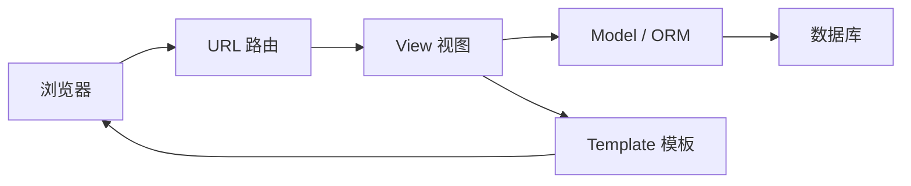
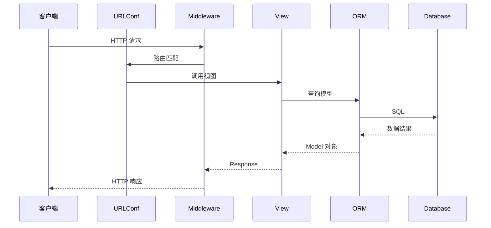

# Django 使用教程：从 MVT 到可维护后端应用

Django 是 Python 生态里非常成熟的 Web 框架。它强调“电池内置”：ORM、模板、表单、后台管理、用户认证、安全中间件、迁移系统都已经准备好。

如果 FastAPI 更像轻量 API 框架，Django 更像一套完整的 Web 应用开发平台。

## 1. 创建项目

安装：

```bash
pip install django
```

创建项目：

```bash
django-admin startproject config .
python manage.py startapp blog
```

典型结构：

```txt
.
  manage.py
  config/
    settings.py
    urls.py
    wsgi.py
    asgi.py
  blog/
    models.py
    views.py
    urls.py
    admin.py
    apps.py
    migrations/
```

`config` 是项目配置，`blog` 是业务应用。一个 Django 项目可以包含多个 app，例如 `users`、`orders`、`products`。

## 2. MVT 架构

Django 常说 MVT：

```txt
Model     数据模型
View      处理请求并返回响应
Template  页面模板
```

它和常见 MVC 很接近，只是命名不同。



如果项目只提供 JSON API，也可以不使用 Template，而是返回 JSON。

## 3. 路由和视图

`blog/views.py`：

```python
from django.http import JsonResponse


def article_list(request):
    return JsonResponse({
        "items": [
            {"id": 1, "title": "Hello Django"}
        ]
    })
```

`blog/urls.py`：

```python
from django.urls import path
from . import views

urlpatterns = [
    path("articles/", views.article_list, name="article-list"),
]
```

项目路由 `config/urls.py`：

```python
from django.urls import include, path

urlpatterns = [
    path("api/", include("blog.urls")),
]
```

访问：

```txt
GET /api/articles/
```

## 4. 模型和迁移

`blog/models.py`：

```python
from django.db import models


class Article(models.Model):
    title = models.CharField(max_length=120)
    content = models.TextField()
    published = models.BooleanField(default=False)
    created_at = models.DateTimeField(auto_now_add=True)
    updated_at = models.DateTimeField(auto_now=True)

    def __str__(self):
        return self.title
```

生成迁移：

```bash
python manage.py makemigrations
```

执行迁移：

```bash
python manage.py migrate
```

Django 会把模型转换成数据库表结构。

## 5. ORM 查询

创建：

```python
Article.objects.create(
    title="Django ORM",
    content="ORM 可以让我们用 Python 操作数据库",
    published=True
)
```

查询：

```python
articles = Article.objects.filter(published=True).order_by("-created_at")
```

获取单个：

```python
article = Article.objects.get(id=1)
```

如果不存在会抛异常：

```python
from django.shortcuts import get_object_or_404

article = get_object_or_404(Article, id=1)
```

分页：

```python
from django.core.paginator import Paginator


def article_list(request):
    page = int(request.GET.get("page", 1))
    page_size = int(request.GET.get("pageSize", 20))

    queryset = Article.objects.filter(published=True).order_by("-created_at")
    paginator = Paginator(queryset, page_size)
    current_page = paginator.get_page(page)

    return JsonResponse({
        "items": [
            {"id": item.id, "title": item.title}
            for item in current_page.object_list
        ],
        "page": page,
        "total": paginator.count
    })
```

## 6. 关系模型

作者和文章是一对多。

```python
from django.conf import settings
from django.db import models


class Article(models.Model):
    author = models.ForeignKey(
        settings.AUTH_USER_MODEL,
        on_delete=models.CASCADE,
        related_name="articles"
    )
    title = models.CharField(max_length=120)
    content = models.TextField()
```

查询某个用户的文章：

```python
user.articles.filter(published=True)
```

避免 N+1 查询：

```python
articles = (
    Article.objects
    .select_related("author")
    .filter(published=True)
)
```

`select_related` 适合外键和一对一关系，`prefetch_related` 适合多对多和反向一对多。

## 7. Admin 后台

Django Admin 是它非常实用的内置能力。

创建管理员：

```bash
python manage.py createsuperuser
```

注册模型：

```python
from django.contrib import admin
from .models import Article


@admin.register(Article)
class ArticleAdmin(admin.ModelAdmin):
    list_display = ("id", "title", "published", "created_at")
    list_filter = ("published",)
    search_fields = ("title", "content")
```

访问：

```txt
/admin/
```

后台适合运营管理、内部工具和数据维护，不建议把复杂业务流程都塞进 Admin。

## 8. 表单和校验

Django Form 可以处理表单校验。

```python
from django import forms


class ArticleForm(forms.Form):
    title = forms.CharField(max_length=120)
    content = forms.CharField()


def create_article(request):
    form = ArticleForm(request.POST)

    if not form.is_valid():
        return JsonResponse({"errors": form.errors}, status=400)

    article = Article.objects.create(**form.cleaned_data)
    return JsonResponse({"id": article.id}, status=201)
```

如果表单和模型强绑定，可以用 ModelForm：

```python
class ArticleModelForm(forms.ModelForm):
    class Meta:
        model = Article
        fields = ["title", "content", "published"]
```

## 9. 用户认证

Django 内置用户系统。

登录：

```python
from django.contrib.auth import authenticate, login
from django.views.decorators.http import require_POST


@require_POST
def login_view(request):
    username = request.POST.get("username")
    password = request.POST.get("password")

    user = authenticate(request, username=username, password=password)

    if user is None:
        return JsonResponse({"message": "用户名或密码错误"}, status=401)

    login(request, user)
    return JsonResponse({"ok": True})
```

要求登录：

```python
from django.contrib.auth.decorators import login_required


@login_required
def me(request):
    return JsonResponse({
        "id": request.user.id,
        "username": request.user.username
    })
```

权限判断：

```python
from django.contrib.auth.decorators import permission_required


@permission_required("blog.add_article", raise_exception=True)
def create_article(request):
    ...
```

## 10. Django REST Framework

如果主要构建 API，通常会引入 Django REST Framework，简称 DRF。

安装：

```bash
pip install djangorestframework
```

加入配置：

```python
INSTALLED_APPS = [
    ...
    "rest_framework",
]
```

序列化器：

```python
from rest_framework import serializers
from .models import Article


class ArticleSerializer(serializers.ModelSerializer):
    class Meta:
        model = Article
        fields = ["id", "title", "content", "published", "created_at"]
```

视图：

```python
from rest_framework import viewsets
from .models import Article
from .serializers import ArticleSerializer


class ArticleViewSet(viewsets.ModelViewSet):
    queryset = Article.objects.all().order_by("-created_at")
    serializer_class = ArticleSerializer
```

路由：

```python
from rest_framework.routers import DefaultRouter
from .views import ArticleViewSet

router = DefaultRouter()
router.register("articles", ArticleViewSet)

urlpatterns = router.urls
```

DRF 会自动提供列表、详情、创建、更新、删除接口。

## 11. 中间件

中间件可以在请求进入视图前、响应返回客户端前做统一处理。

```python
class RequestIdMiddleware:
    def __init__(self, get_response):
        self.get_response = get_response

    def __call__(self, request):
        request.request_id = request.headers.get("x-request-id")
        response = self.get_response(request)
        response["x-request-id"] = request.request_id or ""
        return response
```

注册：

```python
MIDDLEWARE = [
    ...
    "config.middleware.RequestIdMiddleware",
]
```

常见用途：

1. 请求日志。
2. 认证上下文。
3. 跨域处理。
4. 安全 Header。
5. 灰度和多租户识别。

## 12. 配置和环境变量

不要把生产密钥写在代码里。

```python
import os

SECRET_KEY = os.environ["DJANGO_SECRET_KEY"]
DEBUG = os.environ.get("DJANGO_DEBUG") == "true"
ALLOWED_HOSTS = os.environ.get("DJANGO_ALLOWED_HOSTS", "").split(",")
```

数据库配置：

```python
DATABASES = {
    "default": {
        "ENGINE": "django.db.backends.postgresql",
        "NAME": os.environ["POSTGRES_DB"],
        "USER": os.environ["POSTGRES_USER"],
        "PASSWORD": os.environ["POSTGRES_PASSWORD"],
        "HOST": os.environ["POSTGRES_HOST"],
        "PORT": os.environ.get("POSTGRES_PORT", "5432"),
    }
}
```

## 13. 部署要点

生产环境通常使用 Gunicorn：

```bash
gunicorn config.wsgi:application --bind 0.0.0.0:8000
```

静态文件：

```bash
python manage.py collectstatic
```

安全配置：

```python
DEBUG = False
SECURE_SSL_REDIRECT = True
SESSION_COOKIE_SECURE = True
CSRF_COOKIE_SECURE = True
```

如果用 Nginx 反向代理，要正确传递 Host 和协议：

```nginx
proxy_set_header Host $host;
proxy_set_header X-Forwarded-Proto $scheme;
```

## 14. Django 请求流程



## 总结

Django 的优势是完整、稳定、工程化程度高。它适合后台系统、内容管理、企业内部应用、数据管理平台，也适合配合 DRF 构建 REST API。

使用 Django 时，要把 app 拆分、模型设计、ORM 查询优化、Admin、权限、配置和部署一起考虑，而不是只写几个视图函数。
