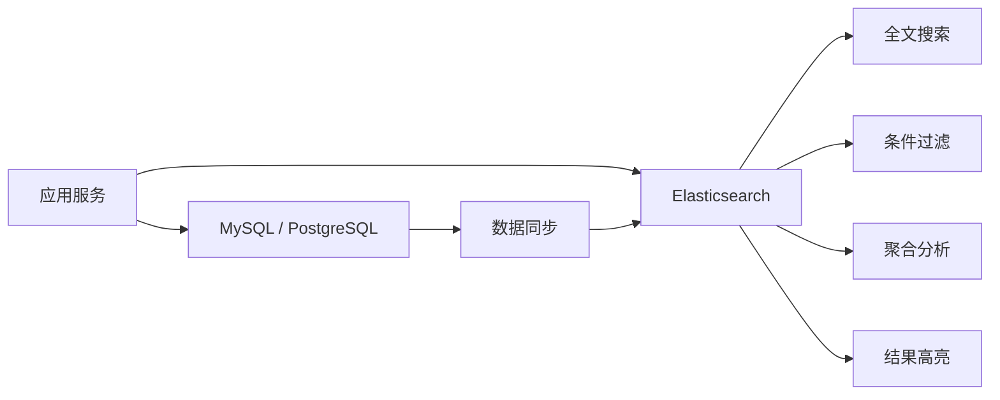
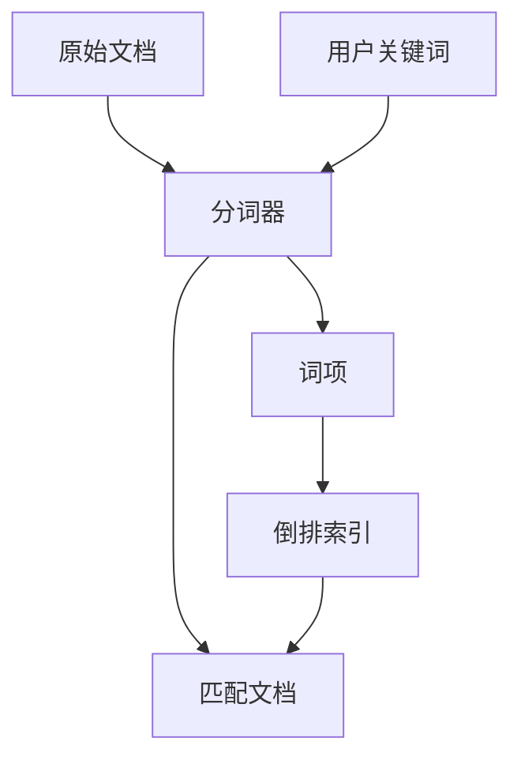
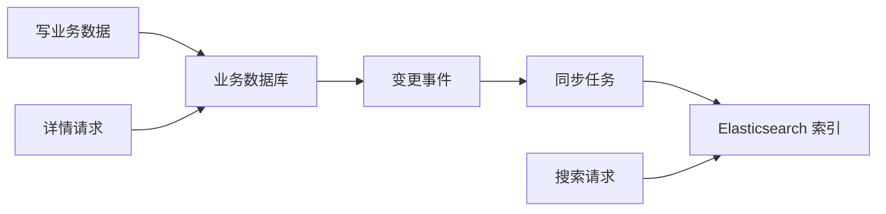

# Elasticsearch 使用教程：从倒排索引到全文搜索、聚合分析和性能优化

Elasticsearch 是一个面向搜索和分析的分布式引擎。它最常见的用途是全文搜索，例如商品搜索、站内搜索、日志检索、知识库检索、订单筛选和运营分析。和关系型数据库不同，Elasticsearch 的核心不是事务和约束，而是把数据转成适合快速检索的索引结构，让用户可以用关键词、过滤条件、排序、聚合和高亮快速找到结果。

一句话理解：数据库负责保存事实，Elasticsearch 负责让这些事实更容易被搜索、过滤和分析。



## 1. Elasticsearch 解决什么问题

如果只用数据库做搜索，简单场景可以用 `like` 或全文索引解决，但一旦需求变复杂，就会开始吃力：

- 用户输入关键词后，希望匹配标题、正文、标签、作者等多个字段。
- 输入 `iphone 手机壳`，希望不同词都能参与匹配和排序。
- 搜索结果需要按照相关性、销量、发布时间、价格组合排序。
- 需要搜索建议、拼写容错、高亮片段。
- 需要按分类、品牌、价格区间、状态做筛选。
- 需要统计每个分类下有多少结果，或按时间聚合日志数量。
- 数据量大以后，查询不能拖慢主业务数据库。

Elasticsearch 更适合解决“读多、搜索复杂、分析维度多”的问题。它不适合作为核心业务账本，因为它不擅长强事务、外键约束和复杂多表关联。

## 2. 倒排索引是什么

普通数据库索引通常是从记录定位字段值，而全文搜索更关心“一个词出现在哪些文档里”。倒排索引就是从词反查文档。

假设有 3 篇文章：

| 文档 ID | 标题 |
| --- | --- |
| 1 | Elasticsearch 入门教程 |
| 2 | Redis 缓存使用教程 |
| 3 | Elasticsearch 性能优化 |

倒排索引可以理解成：

| 词项 | 出现的文档 |
| --- | --- |
| elasticsearch | 1, 3 |
| 入门 | 1 |
| 教程 | 1, 2 |
| redis | 2 |
| 性能 | 3 |
| 优化 | 3 |

当用户搜索 `Elasticsearch 教程` 时，搜索引擎先找到包含这些词的文档，再结合词频、字段权重、文档长度等因素计算相关性分数。



## 3. 基本概念

| 概念 | 含义 |
| --- | --- |
| Cluster | 集群，由一个或多个节点组成 |
| Node | 节点，一个 Elasticsearch 进程 |
| Index | 索引，类似一类文档的集合 |
| Document | 文档，一条 JSON 数据 |
| Field | 字段，文档中的属性 |
| Mapping | 字段类型和索引规则 |
| Shard | 分片，索引被拆分后的物理存储单元 |
| Replica | 副本，用于容错和提升读取能力 |
| Analyzer | 分词器，决定文本如何被切分和归一化 |
| Query DSL | Elasticsearch 的 JSON 查询语言 |

从应用视角看，最常接触的是 `index`、`document`、`mapping` 和 `query DSL`。

## 4. 本地启动

开发环境可以用 Docker 启动一个单节点：

```bash
docker run --name es-dev \
  -p 9200:9200 \
  -e discovery.type=single-node \
  -e xpack.security.enabled=false \
  -e ES_JAVA_OPTS="-Xms1g -Xmx1g" \
  docker.elastic.co/elasticsearch/elasticsearch:8.15.0
```

验证服务：

```bash
curl http://localhost:9200
```

如果返回集群名称、版本号和 tagline，说明服务已经启动。开发阶段关闭安全认证是为了降低门槛，生产环境不要这样配置。

## 5. 索引和文档

创建一个文章索引：

```bash
curl -X PUT "http://localhost:9200/blog_posts" \
  -H "Content-Type: application/json" \
  -d '{
    "settings": {
      "number_of_shards": 1,
      "number_of_replicas": 0
    }
  }'
```

写入文档：

```bash
curl -X POST "http://localhost:9200/blog_posts/_doc/1" \
  -H "Content-Type: application/json" \
  -d '{
    "title": "Elasticsearch 入门教程",
    "content": "本文讲解倒排索引、mapping、搜索 DSL 和聚合分析。",
    "tags": ["search", "backend"],
    "status": "published",
    "viewCount": 120,
    "publishedAt": "2026-06-09T10:00:00.000Z"
  }'
```

读取文档：

```bash
curl "http://localhost:9200/blog_posts/_doc/1"
```

Elasticsearch 的文档是 JSON。它不会像关系型数据库那样要求你先建表再插入，但真实项目里最好提前定义 mapping，否则字段类型可能被动态推断成不合适的类型。

## 6. Mapping：先把字段类型想清楚

Mapping 决定字段如何被索引、是否分词、能否排序和聚合。

```bash
curl -X PUT "http://localhost:9200/blog_posts_v1" \
  -H "Content-Type: application/json" \
  -d '{
    "settings": {
      "number_of_shards": 1,
      "number_of_replicas": 0
    },
    "mappings": {
      "properties": {
        "title": {
          "type": "text",
          "fields": {
            "keyword": {
              "type": "keyword"
            }
          }
        },
        "content": {
          "type": "text"
        },
        "tags": {
          "type": "keyword"
        },
        "status": {
          "type": "keyword"
        },
        "authorId": {
          "type": "keyword"
        },
        "viewCount": {
          "type": "integer"
        },
        "publishedAt": {
          "type": "date"
        }
      }
    }
  }'
```

常见字段类型：

| 类型 | 适合字段 |
| --- | --- |
| `text` | 需要全文搜索的长文本，例如标题、正文 |
| `keyword` | 不分词的精确值，例如状态、标签、ID、枚举 |
| `integer` / `long` / `double` | 数字 |
| `date` | 时间 |
| `boolean` | 布尔值 |
| `object` | 普通嵌套对象 |
| `nested` | 需要保持数组对象内部关系的嵌套数组 |

最容易踩坑的是 `text` 和 `keyword`：

- `text` 会分词，适合搜索，不适合直接排序和精确聚合。
- `keyword` 不分词，适合过滤、排序、聚合和精确匹配。
- 标题这类字段经常同时需要全文搜索和精确排序，所以可以用 `fields.keyword` 做多字段。

## 7. 分词器决定搜索体验

分词器会把文本切成 token。英文可以按空格和标点拆分，中文需要更细致的分词策略。

查看分词结果：

```bash
curl -X POST "http://localhost:9200/_analyze" \
  -H "Content-Type: application/json" \
  -d '{
    "analyzer": "standard",
    "text": "Elasticsearch 性能优化教程"
  }'
```

英文搜索常见处理包括小写化、去停用词、词干提取。中文搜索通常会接入中文分词插件或使用专门的搜索方案。选择分词器时要看业务语言、召回要求和误匹配容忍度。

分词器设计要注意两个方向：

- 召回：用户搜得出来，比如同义词、大小写、单复数、中文切词。
- 精准：不要搜出太多无关结果，比如品牌名、型号、专有名词不要被拆坏。

## 8. Match 查询：全文搜索

最常见的全文搜索是 `match`：

```bash
curl -X GET "http://localhost:9200/blog_posts_v1/_search" \
  -H "Content-Type: application/json" \
  -d '{
    "query": {
      "match": {
        "title": "Elasticsearch 教程"
      }
    }
  }'
```

搜索多个字段：

```bash
curl -X GET "http://localhost:9200/blog_posts_v1/_search" \
  -H "Content-Type: application/json" \
  -d '{
    "query": {
      "multi_match": {
        "query": "Elasticsearch 性能",
        "fields": ["title^3", "content", "tags^2"]
      }
    }
  }'
```

`title^3` 表示标题命中的权重更高。实际站内搜索里，标题、标签、摘要、正文通常不会同权。

## 9. Term 查询：精确过滤

精确值过滤用 `term` 或 `terms`：

```bash
curl -X GET "http://localhost:9200/blog_posts_v1/_search" \
  -H "Content-Type: application/json" \
  -d '{
    "query": {
      "term": {
        "status": "published"
      }
    }
  }'
```

多个标签：

```json
{
  "query": {
    "terms": {
      "tags": ["search", "backend"]
    }
  }
}
```

不要对 `text` 字段直接做 `term` 查询，除非你非常清楚它的分词结果。精确过滤应该用 `keyword` 字段。

## 10. Bool 查询：组合搜索条件

真实搜索通常是关键词 + 筛选 + 排除 + 排序：

```bash
curl -X GET "http://localhost:9200/blog_posts_v1/_search" \
  -H "Content-Type: application/json" \
  -d '{
    "query": {
      "bool": {
        "must": [
          {
            "multi_match": {
              "query": "Elasticsearch",
              "fields": ["title^3", "content"]
            }
          }
        ],
        "filter": [
          { "term": { "status": "published" } },
          { "term": { "tags": "backend" } },
          {
            "range": {
              "publishedAt": {
                "gte": "2026-01-01"
              }
            }
          }
        ],
        "must_not": [
          { "term": { "tags": "draft" } }
        ]
      }
    }
  }'
```

`must` 会参与相关性评分，`filter` 只做过滤，通常可以被缓存。能放进 `filter` 的精确条件，不要放进 `must`。

## 11. 排序和相关性

默认情况下，Elasticsearch 会按 `_score` 排序。`_score` 表示文档和查询的相关程度。

按相关性 + 发布时间排序：

```json
{
  "query": {
    "match": {
      "title": "Elasticsearch"
    }
  },
  "sort": [
    { "_score": "desc" },
    { "publishedAt": "desc" }
  ]
}
```

如果是商品搜索，常见排序还会混合销量、库存、价格、上架时间、业务权重。可以用 `function_score` 调整评分：

```json
{
  "query": {
    "function_score": {
      "query": {
        "multi_match": {
          "query": "无线耳机",
          "fields": ["title^3", "description"]
        }
      },
      "field_value_factor": {
        "field": "viewCount",
        "factor": 0.1,
        "modifier": "log1p"
      },
      "boost_mode": "sum"
    }
  }
}
```

业务权重不要无限放大，否则搜索会变成“热门内容永远排前面”，新内容很难被发现。

## 12. 分页：from/size 和 search_after

普通分页：

```json
{
  "from": 0,
  "size": 20,
  "query": {
    "match_all": {}
  }
}
```

`from + size` 很适合浅分页，例如前 10 页。深分页会让 Elasticsearch 跳过大量结果，成本越来越高。

深分页更推荐 `search_after`：

```json
{
  "size": 20,
  "query": {
    "term": {
      "status": "published"
    }
  },
  "sort": [
    { "publishedAt": "desc" },
    { "_id": "desc" }
  ],
  "search_after": ["2026-06-09T10:00:00.000Z", "1"]
}
```

`search_after` 使用上一页最后一条结果的排序值作为游标。它适合无限滚动、日志翻页和信息流，不适合随机跳到第 1000 页。

## 13. 高亮

高亮可以把命中的关键词片段返回给前端：

```json
{
  "query": {
    "multi_match": {
      "query": "倒排索引",
      "fields": ["title", "content"]
    }
  },
  "highlight": {
    "pre_tags": ["<mark>"],
    "post_tags": ["</mark>"],
    "fields": {
      "title": {},
      "content": {
        "fragment_size": 120,
        "number_of_fragments": 2
      }
    }
  }
}
```

前端渲染高亮时要注意 XSS。不要直接相信搜索结果中的 HTML，尤其是内容来自用户输入时。

## 14. 聚合分析

Elasticsearch 不只做搜索，也能做聚合。比如统计不同标签下的文章数量：

```json
{
  "size": 0,
  "query": {
    "term": {
      "status": "published"
    }
  },
  "aggs": {
    "tag_count": {
      "terms": {
        "field": "tags",
        "size": 10
      }
    }
  }
}
```

按日期聚合：

```json
{
  "size": 0,
  "aggs": {
    "posts_by_month": {
      "date_histogram": {
        "field": "publishedAt",
        "calendar_interval": "month"
      }
    }
  }
}
```

聚合适合做搜索结果侧边栏、日志趋势、运营看板和粗粒度分析。但如果是复杂财务报表、强一致 BI 或跨多表分析，数据仓库或关系型数据库通常更合适。

## 15. Node.js 接入

安装客户端：

```bash
pnpm add @elastic/elasticsearch
```

创建连接：

```js
// elasticsearch-client.mjs
import { Client } from '@elastic/elasticsearch'

export const es = new Client({
  node: process.env.ELASTICSEARCH_URL ?? 'http://localhost:9200'
})
```

写入文章：

```js
import { es } from './elasticsearch-client.mjs'

export async function indexPost(post) {
  await es.index({
    index: 'blog_posts_v1',
    id: post.id,
    document: {
      title: post.title,
      content: post.content,
      tags: post.tags,
      status: post.status,
      authorId: post.authorId,
      viewCount: post.viewCount,
      publishedAt: post.publishedAt
    }
  })
}
```

搜索文章：

```js
export async function searchPosts({ keyword, tag, pageSize = 20 }) {
  const response = await es.search({
    index: 'blog_posts_v1',
    size: pageSize,
    query: {
      bool: {
        must: keyword
          ? [
              {
                multi_match: {
                  query: keyword,
                  fields: ['title^3', 'content', 'tags^2']
                }
              }
            ]
          : [{ match_all: {} }],
        filter: [
          { term: { status: 'published' } },
          ...(tag ? [{ term: { tags: tag } }] : [])
        ]
      }
    },
    highlight: {
      pre_tags: ['<mark>'],
      post_tags: ['</mark>'],
      fields: {
        title: {},
        content: {
          fragment_size: 120,
          number_of_fragments: 2
        }
      }
    }
  })

  return response.hits.hits.map((hit) => ({
    id: hit._id,
    score: hit._score,
    source: hit._source,
    highlight: hit.highlight
  }))
}
```

## 16. 数据同步：不要把 Elasticsearch 当唯一数据源

常见架构是数据库作为主存储，Elasticsearch 作为搜索索引：



同步方式有几种：

| 方式 | 特点 |
| --- | --- |
| 应用双写 | 简单，但容易出现数据库成功、ES 失败的不一致 |
| 消息队列异步同步 | 更可靠，可重试，适合大多数业务 |
| Outbox 模式 | 把业务写入和待同步事件放在同一个数据库事务里 |
| CDC | 从数据库变更日志同步，适合数据平台和较大规模系统 |
| 定时全量重建 | 简单可靠，适合数据量不大或低频更新 |

推荐思路：用户写入时先保证数据库成功，再通过可靠事件同步到 Elasticsearch。搜索结果可以允许短暂延迟，但不要让 Elasticsearch 成为唯一事实来源。

## 17. Reindex 和别名

Mapping 中很多字段一旦创建后不能随意修改。比如把字段从 `text` 改成 `keyword`，通常需要新建索引并重建数据。

常见做法是使用版本化索引 + 别名：

```txt
blog_posts_v1
blog_posts_v2
alias: blog_posts -> blog_posts_v2
```

创建别名：

```bash
curl -X POST "http://localhost:9200/_aliases" \
  -H "Content-Type: application/json" \
  -d '{
    "actions": [
      {
        "add": {
          "index": "blog_posts_v1",
          "alias": "blog_posts"
        }
      }
    ]
  }'
```

切换别名：

```json
{
  "actions": [
    { "remove": { "index": "blog_posts_v1", "alias": "blog_posts" } },
    { "add": { "index": "blog_posts_v2", "alias": "blog_posts" } }
  ]
}
```

应用只访问 `blog_posts`，底层索引可以平滑切换。这是线上维护 Elasticsearch 很重要的习惯。

## 18. 分片和副本

索引会被拆成 shard。每个 shard 本质上是一个 Lucene 索引。

- 主分片负责存储数据，数量创建后不方便直接修改。
- 副本分片用于高可用和读取扩展。
- 分片太少会限制扩展能力。
- 分片太多会浪费资源，增加集群管理成本。

开发环境可以用：

```json
{
  "number_of_shards": 1,
  "number_of_replicas": 0
}
```

生产环境要根据数据量、节点数量、增长速度和查询压力规划。不要为了“以后可能很大”一上来创建很多分片。分片不是越多越好。

## 19. 常见性能优化

### 控制字段和文档大小

搜索列表页不一定需要返回全文内容：

```json
{
  "_source": ["title", "tags", "publishedAt", "viewCount"],
  "query": {
    "match": {
      "title": "Elasticsearch"
    }
  }
}
```

大字段会增加网络传输和反序列化成本。正文、富文本、原始日志这类字段要谨慎返回。

### filter 优先

状态、分类、标签、时间范围这类条件尽量放进 `filter`：

```json
{
  "query": {
    "bool": {
      "must": [
        { "match": { "title": "搜索" } }
      ],
      "filter": [
        { "term": { "status": "published" } }
      ]
    }
  }
}
```

`filter` 不计算相关性，更适合精确筛选。

### 避免深分页

不要让用户无限 `from: 100000`。深分页用 `search_after`，后台批处理用 scroll 或 point in time。

### 批量写入

大量数据导入要用 bulk：

```js
export async function bulkIndexPosts(posts) {
  const operations = posts.flatMap((post) => [
    { index: { _index: 'blog_posts_v1', _id: post.id } },
    post
  ])

  const response = await es.bulk({
    refresh: false,
    operations
  })

  if (response.errors) {
    throw new Error('bulk index failed')
  }
}
```

逐条写入会产生大量网络往返和刷新压力。

### 刷新策略

Elasticsearch 写入后不是立刻对搜索可见，而是通过 refresh 周期变成可搜索。默认近实时已经适合大多数业务。

如果每次写入都强制 `refresh: true`，搜索可见性会提升，但吞吐会下降。只有对实时性要求很高的小量操作才考虑这样做。

## 20. 监控和排查

线上 Elasticsearch 至少要关注：

| 指标 | 含义 |
| --- | --- |
| 集群健康 | green、yellow、red |
| JVM heap | 堆内存使用率和 GC |
| 磁盘水位 | 分片能否继续分配 |
| 查询耗时 | 慢查询和高峰延迟 |
| 写入耗时 | bulk 是否积压 |
| 分片数量 | 是否过多或不均衡 |
| refresh / merge | 写入和段合并压力 |
| rejected | 线程池拒绝数量 |

排查慢查询时，可以先看：

1. 查询是否返回太多字段。
2. 是否用了深分页。
3. 是否在高基数字段上做大聚合。
4. 是否把精确过滤写成了全文查询。
5. mapping 是否把字段类型建错。
6. 分片是否太多、太大或分布不均。

## 21. 和数据库、Redis 的边界

Elasticsearch、数据库、Redis 经常同时出现在系统里，但职责不同：

| 工具 | 更适合做什么 |
| --- | --- |
| PostgreSQL / MySQL | 事实存储、事务、约束、复杂关系 |
| Redis | 缓存、计数、限流、临时状态、轻量消息流 |
| Elasticsearch | 全文搜索、多条件过滤、聚合分析、日志检索 |

不要把 Elasticsearch 当数据库用，也不要把数据库硬撑成搜索引擎。好的架构通常是：数据库保存真实数据，事件同步到 Elasticsearch，Redis 缓存高频热点。

## 22. 使用建议

1. 先明确搜索场景：站内搜索、商品筛选、日志检索还是聚合分析。
2. 提前设计 mapping，区分 `text` 和 `keyword`。
3. 用别名管理索引版本，给 reindex 留余地。
4. 写入链路要可重试，数据库仍然是事实来源。
5. 精确条件放 `filter`，全文条件放 `must`。
6. 控制返回字段，避免大文档拖慢查询。
7. 深分页用 `search_after`，不要滥用 `from/size`。
8. 上线后持续监控 JVM、磁盘、慢查询、分片和写入积压。

Elasticsearch 的学习重点不是背 API，而是建立“文档建模 + 分词 + mapping + 查询 DSL + 同步链路 + 集群资源”的整体思维。只要这条链路清楚，就能判断一个搜索需求应该怎么建索引、怎么查、怎么排序，以及出了问题该从哪里开始排查。

## 参考资料

- [Elasticsearch Guide](https://www.elastic.co/guide/en/elasticsearch/reference/current/index.html)
- [Elasticsearch Query DSL](https://www.elastic.co/guide/en/elasticsearch/reference/current/query-dsl.html)
- [Elasticsearch Mapping](https://www.elastic.co/guide/en/elasticsearch/reference/current/mapping.html)
- [Elasticsearch Aggregations](https://www.elastic.co/guide/en/elasticsearch/reference/current/search-aggregations.html)
- [Elasticsearch JavaScript Client](https://www.elastic.co/guide/en/elasticsearch/client/javascript-api/current/index.html)
