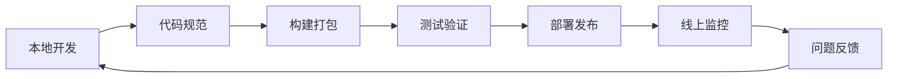

# 前端工程化讲解：从开发体验到构建、规范和交付

前端工程化不是“用了 Webpack、Vite、Babel、ESLint 就叫工程化”。工具只是手段，真正的工程化目标是：让一个前端项目在多人协作、长期迭代和频繁发布时，仍然保持可维护、可测试、可交付。

一句话理解：

> 前端工程化就是把开发、构建、规范、测试、发布、监控这些流程标准化，让项目从“能跑”变成“稳定地持续交付”。

## 1. 为什么需要前端工程化

早期页面比较简单时，前端可能只是写几段 HTML、CSS、JavaScript。随着应用复杂度上升，会出现很多问题：

- 文件越来越多，依赖关系难维护。
- 不同开发者代码风格不一致。
- 新语法和旧浏览器兼容冲突。
- 手动压缩、上传、清缓存容易出错。
- 线上白屏、卡顿、接口异常不好定位。
- 多环境配置混乱，测试环境和生产环境行为不一致。
- 项目变大后构建慢，影响开发效率。

工程化要解决的不是单个技术点，而是一整条链路。



这条链路越稳定，团队就越敢改、越敢发。

## 2. 工程化包含哪些内容

前端工程化可以拆成几个维度：

| 维度 | 关注点 | 常见工具 |
| --- | --- | --- |
| 项目组织 | 目录结构、模块边界、组件拆分 | Vite、Vue CLI、Create React App、Next.js |
| 依赖管理 | 包版本、锁文件、私有包、工作区 | npm、pnpm、Yarn |
| 语法转换 | 新语法、JSX、TypeScript、兼容性 | Babel、TypeScript、SWC、esbuild |
| 构建打包 | 资源处理、代码分割、压缩、缓存 | Webpack、Vite、Rollup、Rspack |
| 代码规范 | 格式、静态检查、提交约束 | ESLint、Prettier、Stylelint、lint-staged |
| 测试保障 | 单元测试、组件测试、端到端测试 | Vitest、Jest、Testing Library、Playwright |
| 发布部署 | CI/CD、环境变量、灰度、回滚 | GitHub Actions、GitLab CI、Docker、Nginx |
| 质量监控 | 错误、性能、埋点、日志 | Sentry、Performance API、自研监控 SDK |

面试时如果只说“工程化就是打包”，会显得太窄。最好从研发全流程来回答。

## 3. 项目结构怎么设计

一个常见的中后台项目结构：

```txt
src
  api
  assets
  components
  composables
  hooks
  layouts
  pages
  router
  stores
  styles
  utils
  main.ts
```

目录不是越多越工程化，关键是职责清楚。

- `api`：接口请求和数据访问。
- `components`：可复用 UI 组件。
- `pages`：路由页面。
- `stores`：全局状态。
- `utils`：纯工具函数。
- `styles`：全局样式、变量、主题。
- `hooks` 或 `composables`：可复用逻辑。

一个实用原则是：页面负责组织业务流程，组件负责展示和局部交互，工具函数不要依赖框架状态。

## 4. 包管理和锁文件

依赖管理是工程化里很容易被忽视的一环。

常见问题：

- 没有提交锁文件，导致不同人安装到不同版本。
- 依赖版本写得太宽，构建结果不稳定。
- 把只在构建期使用的包放进 `dependencies`。
- 团队里 npm、pnpm、Yarn 混用。
- 依赖升级没有测试和回滚方案。

一个项目应该明确：

```json
{
  "packageManager": "pnpm@10.11.0",
  "scripts": {
    "dev": "vite",
    "build": "vite build",
    "test": "vitest",
    "lint": "eslint ."
  }
}
```

锁文件要提交到仓库。CI 中应该使用固定安装命令，例如：

```bash
pnpm install --frozen-lockfile
```

这样可以保证本地、测试环境和生产构建使用同一套依赖解析结果。

## 5. 构建工具解决什么问题

构建工具主要做这些事：

- 解析模块依赖。
- 转换 TypeScript、JSX、Vue SFC、CSS 预处理器。
- 处理图片、字体、JSON、Worker 等资源。
- 压缩 JS、CSS、HTML。
- 做代码分割和懒加载。
- 生成带 hash 的静态资源文件。
- 提供开发服务器和热更新。

构建前的源码：

```txt
src/main.ts
src/App.vue
src/styles/index.scss
src/assets/logo.svg
```

构建后的产物：

```txt
dist/index.html
dist/assets/index.8c9a1f.js
dist/assets/index.71bb3d.css
dist/assets/logo.31a9ef.svg
```

hash 文件名可以配合浏览器缓存。内容不变，文件名不变；内容变化，文件名变化。

## 6. Babel、TypeScript、构建工具的关系

这几个工具经常被混在一起：

| 工具 | 核心职责 |
| --- | --- |
| TypeScript | 类型检查，也可以把 TS 转成 JS |
| Babel | 语法转换、JSX 转换、插件化 AST 转换 |
| Webpack / Vite | 模块构建、资源处理、开发服务器、生产产物 |
| esbuild / SWC | 更快的语法转换和压缩 |

一个现代项目里可能是这样分工：

- TypeScript 负责类型检查。
- Vite 使用 esbuild 做快速转译。
- Babel 负责某些特定插件或兼容需求。
- Rollup 或 Webpack 负责生产构建和代码分割。

不要把“类型检查”和“语法转换”混为一谈。很多快速构建工具只转译 TS，不做完整类型检查，所以 CI 里仍然需要 `tsc --noEmit`。

## 7. 代码规范

代码规范的价值不只是让代码好看，而是减少沟通成本。

常见组合：

- ESLint：检查代码质量和潜在问题。
- Prettier：统一格式。
- Stylelint：检查 CSS、SCSS、Less。
- EditorConfig：统一编辑器缩进、换行。
- lint-staged：只检查本次提交涉及的文件。
- Husky：接入 Git hooks。

示例：

```json
{
  "scripts": {
    "lint": "eslint src",
    "format": "prettier --write src",
    "typecheck": "tsc --noEmit"
  },
  "lint-staged": {
    "*.{js,ts,tsx,vue}": ["eslint --fix", "prettier --write"]
  }
}
```

团队项目里，规范应该自动执行，而不是靠口头提醒。

## 8. 测试体系

前端测试可以分层：

| 类型 | 关注点 | 示例 |
| --- | --- | --- |
| 单元测试 | 纯函数、工具方法、状态逻辑 | `formatPrice`、`validateForm` |
| 组件测试 | 组件渲染和交互 | 按钮点击、表单校验 |
| 集成测试 | 多模块协作 | 登录流程、订单提交 |
| E2E 测试 | 浏览器里的完整用户路径 | Playwright 模拟真实操作 |

不是所有项目都要一开始写满测试。更实际的策略是：

- 工具函数和复杂业务逻辑优先写单元测试。
- 核心页面优先写 E2E。
- 修复线上 bug 后补回归测试。
- CI 中至少跑 lint、typecheck、build。

一个基础 CI 流程：

```txt
install dependencies
run lint
run typecheck
run test
run build
deploy
```

## 9. 多环境配置

常见环境：

- `development`：本地开发。
- `test`：测试环境。
- `staging`：预发布环境。
- `production`：生产环境。

前端项目常见配置：

```txt
.env.development
.env.test
.env.production
```

例如：

```bash
VITE_API_BASE_URL=https://api.example.com
VITE_APP_ENV=production
```

注意不要把密钥放进前端环境变量。前端构建后的变量会进入浏览器，用户可以看到。真正敏感的密钥应该放在后端。

## 10. 发布和回滚

前端发布看似只是上传静态文件，但也有不少细节：

- 静态资源文件名带 hash，便于长期缓存。
- `index.html` 不要强缓存太久，避免引用旧资源。
- 发布顺序要避免 HTML 引用到还没上传的 JS。
- CDN 缓存要能刷新。
- 生产构建要保留 sourcemap，但不要随便公开。
- 出问题时要有回滚版本。

常见部署方式：

```txt
构建 dist
上传到对象存储或服务器
刷新 CDN
发布 index.html
监控错误和性能
```

如果系统足够重要，可以做灰度发布：先让一小部分用户访问新版本，确认没有问题后再全量。

## 11. 性能工程化

性能优化也应该工程化，而不是上线后临时救火。

常见手段：

- 路由级代码分割。
- 第三方依赖按需引入。
- 图片压缩和响应式图片。
- CDN 和缓存策略。
- CSS 拆分和关键 CSS。
- 预加载关键资源。
- 构建产物体积分析。
- 首屏、LCP、CLS、INP 指标监控。

比如路由懒加载：

```js
const routes = [
  {
    path: '/settings',
    component: () => import('./pages/Settings.vue')
  }
]
```

这样设置页代码不会进入首页首屏包。

## 12. Monorepo

当项目里有多个应用、多个公共包时，可以考虑 Monorepo。

```txt
apps
  admin
  mobile
packages
  ui
  utils
  request
```

Monorepo 的优点：

- 公共组件和工具复用更方便。
- 依赖版本更统一。
- 跨包改动可以在一个提交里完成。
- CI 可以按变更范围增量构建。

但它也会带来复杂度：包边界、构建缓存、版本发布、权限控制都要设计好。小项目没有必要为了“看起来高级”强行 Monorepo。

## 13. 面试怎么回答

可以这样回答：

> 前端工程化是为了让前端项目在多人协作和持续迭代下仍然可维护、可构建、可测试、可发布。它包括项目结构、依赖管理、构建打包、语法转换、代码规范、测试、CI/CD、性能优化和线上监控。比如我会用 Vite 或 Webpack 处理模块构建，用 TypeScript 做类型约束，用 ESLint 和 Prettier 统一规范，用 Vitest 或 Playwright 做测试，用 CI 保证每次提交都能 lint、typecheck 和 build，通过 hash、CDN、灰度和监控保证发布质量。

如果面试官继续追问，可以重点讲这些点：

- Babel 和 TypeScript 的分工。
- Webpack 和 Vite 的差异。
- ESLint 和 Prettier 的边界。
- 如何设计构建缓存和代码分割。
- 如何保证发布后可以回滚。
- 如何监控线上白屏和性能。

## 14. 总结

前端工程化的核心不是工具名，而是流程稳定性。

记住这几句话：

- 工具是为流程服务的。
- 规范要自动化执行。
- 构建产物要可缓存、可追踪、可回滚。
- 测试和类型检查要进入 CI。
- 线上监控要反哺开发。

能把这些串成闭环，才算真正理解前端工程化。
