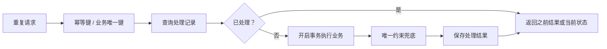

# 幂等性讲解：从 HTTP 接口到订单、支付和消息队列

幂等性是后端系统里非常常见、也非常容易被问到的一个概念。它解决的问题不是“接口会不会被调用”，而是“接口被重复调用时，系统结果是否仍然正确”。

一句话理解：

> 同一个操作执行一次和执行多次，对系统产生的最终影响应该相同。

这里的“相同”不是说每次响应内容都必须完全一样，而是说业务状态不能因为重复请求而被重复修改。例如用户点击一次支付按钮和连续点击三次支付按钮，订单最多只能支付成功一次，不能扣三次钱。

## 1. 为什么会出现重复请求

重复请求并不一定是用户手抖，真实系统里有很多来源：

- 用户重复点击提交按钮。
- 前端请求超时后自动重试。
- 网关、负载均衡或 SDK 做了失败重试。
- 移动端网络抖动，客户端没有收到响应，再发一次。
- 消息队列至少一次投递，同一条消息可能被消费多次。
- 定时任务重复扫描同一批数据。
- 第三方支付、物流、短信平台重复回调。

如果系统没有幂等保护，重复请求就会把“可靠性机制”变成“重复执行机制”。重试本来是为了提高成功率，但没有幂等性时，重试可能会造成重复下单、重复扣款、重复发券、重复发货、重复发送通知。

## 2. 幂等和防抖、节流、分布式锁的区别

幂等性经常和防抖、节流、锁混在一起，但它们解决的问题不一样。

| 概念 | 解决的问题 | 典型位置 | 是否保证业务结果正确 |
| --- | --- | --- | --- |
| 防抖 | 短时间多次触发只执行最后一次 | 前端交互 | 不能单独保证 |
| 节流 | 固定时间窗口内限制执行频率 | 前端交互、网关 | 不能单独保证 |
| 分布式锁 | 同一时间只允许一个执行者进入临界区 | 后端服务 | 依赖锁实现和业务逻辑 |
| 幂等 | 同一操作重复执行结果一致 | 后端业务、数据库、消息消费 | 核心目标就是保证结果正确 |

防抖和节流可以减少重复请求，但不能作为最终防线。因为攻击脚本、网络重试、服务重试、消息重复投递都可以绕过前端控制。真正可靠的幂等性必须落在服务端和数据层。

## 3. HTTP 方法里的幂等语义

HTTP 方法本身就有一些幂等语义：

| 方法 | 是否通常幂等 | 说明 |
| --- | --- | --- |
| GET | 是 | 查询资源，多次查询不应该修改资源 |
| PUT | 是 | 用完整内容替换资源，多次提交同一内容结果一致 |
| DELETE | 是 | 删除同一资源，多次删除后资源都不存在 |
| POST | 通常不是 | 常用于创建资源，多次调用可能创建多条 |
| PATCH | 不一定 | 局部更新是否幂等取决于更新语义 |

例如这个接口通常不是幂等的：

```http
POST /orders
Content-Type: application/json

{
  "skuId": "sku_1001",
  "quantity": 1
}
```

如果客户端重复提交三次，服务端可能创建三个订单。

而这个接口更接近幂等：

```http
PUT /users/42/profile
Content-Type: application/json

{
  "nickname": "Yunlong",
  "avatar": "https://example.com/avatar.png"
}
```

因为它表达的是“把用户 42 的资料设置为这个状态”，重复执行不会继续叠加副作用。

PATCH 要特别小心。下面这种不是幂等的：

```http
PATCH /accounts/1001

{
  "balanceIncrement": 100
}
```

重复执行会多次加钱。更好的表达是记录一笔唯一流水：

```http
POST /accounts/1001/transactions
Idempotency-Key: recharge_20260602_0001

{
  "type": "recharge",
  "amount": 100
}
```

## 4. 幂等性的核心思路

实现幂等通常有三种思路：

1. 用唯一业务键识别“同一个操作”。
2. 用状态机约束“只有合法状态才能流转”。
3. 用数据库约束保证“重复写入只能成功一次”。

它们经常组合使用。



好的幂等设计不是只在内存里判断一下，而是要让数据库也能兜住并发和重复提交。

## 5. 幂等键 Idempotency-Key

对创建订单、支付、充值、发券这类接口，常见做法是让客户端或服务端生成一个幂等键。

```http
POST /payments
Idempotency-Key: pay_order_1001_20260602_001
Content-Type: application/json

{
  "orderId": "1001",
  "amount": 19900,
  "channel": "wechat"
}
```

服务端可以建一张幂等记录表：

```sql
create table idempotency_records (
  id bigserial primary key,
  idempotency_key varchar(128) not null,
  request_hash varchar(128) not null,
  status varchar(32) not null,
  response_body jsonb,
  created_at timestamptz not null default now(),
  updated_at timestamptz not null default now(),
  unique (idempotency_key)
);
```

处理流程：

1. 收到请求后读取 `Idempotency-Key`。
2. 对请求参数做 hash，防止同一个 key 搭配不同参数。
3. 尝试插入幂等记录，状态为 `processing`。
4. 如果插入成功，说明第一次请求，执行业务。
5. 如果唯一约束冲突，说明重复请求，查询旧记录。
6. 如果旧记录已成功，直接返回旧响应或当前资源状态。
7. 如果旧记录处理中，可以返回 `409 Conflict`、`202 Accepted`，或短暂等待后查询。
8. 业务完成后把记录更新为 `succeeded` 或 `failed`。

示例伪代码：

```js
async function createPayment(req, res) {
  const key = req.header('Idempotency-Key')
  if (!key) {
    return res.status(400).json({ message: 'missing Idempotency-Key' })
  }

  const requestHash = hash(JSON.stringify(req.body))

  try {
    await db.query(
      `insert into idempotency_records (idempotency_key, request_hash, status)
       values ($1, $2, 'processing')`,
      [key, requestHash]
    )
  } catch (error) {
    if (!isUniqueViolation(error)) throw error

    const record = await findIdempotencyRecord(key)
    if (record.request_hash !== requestHash) {
      return res.status(409).json({ message: 'same key with different request body' })
    }

    if (record.status === 'succeeded') {
      return res.status(200).json(record.response_body)
    }

    return res.status(202).json({ message: 'request is still processing' })
  }

  const payment = await paymentService.create(req.body)
  const responseBody = { paymentId: payment.id, status: payment.status }

  await db.query(
    `update idempotency_records
     set status = 'succeeded', response_body = $2, updated_at = now()
     where idempotency_key = $1`,
    [key, responseBody]
  )

  return res.status(201).json(responseBody)
}
```

这个设计的关键点是：先占住幂等键，再执行业务。否则两个并发请求都可能认为自己是第一次请求。

## 6. 数据库唯一约束是最后防线

很多幂等问题最终都应该落到唯一约束上。比如一个用户对同一张优惠券只能领取一次：

```sql
create table user_coupons (
  id bigserial primary key,
  user_id bigint not null,
  coupon_id bigint not null,
  created_at timestamptz not null default now(),
  unique (user_id, coupon_id)
);
```

业务代码可以先查再插，但并发下“先查再插”并不可靠：

```txt
请求 A 查询：没有领取
请求 B 查询：没有领取
请求 A 插入：成功
请求 B 插入：也成功
```

真正可靠的是让数据库唯一约束兜底：

```sql
insert into user_coupons (user_id, coupon_id)
values (42, 1001)
on conflict (user_id, coupon_id) do nothing;
```

如果插入行数为 1，说明首次领取；如果为 0，说明之前已经领取过。这样即使有多个服务实例并发处理，也不会重复发券。

## 7. 订单和支付场景怎么做

订单和支付是幂等性最典型的场景。

创建订单时，可以用客户端生成的 `clientOrderNo` 作为业务唯一键：

```sql
create table orders (
  id bigserial primary key,
  user_id bigint not null,
  client_order_no varchar(64) not null,
  status varchar(32) not null,
  total_amount integer not null,
  created_at timestamptz not null default now(),
  unique (user_id, client_order_no)
);
```

重复提交同一个 `clientOrderNo` 时，服务端返回已经创建的订单，而不是重新创建。

支付时要更严格。常见约束包括：

- `order_id` 对支付单唯一，避免一个订单生成多张有效支付单。
- 第三方支付流水号唯一，避免重复回调入账。
- 订单状态必须从 `pending` 流转到 `paid`，不能从 `paid` 再次扣款。
- 资金流水表使用唯一业务流水号。

支付回调可以这样处理：

```sql
create table payment_transactions (
  id bigserial primary key,
  provider varchar(32) not null,
  provider_trade_no varchar(128) not null,
  order_id bigint not null,
  amount integer not null,
  created_at timestamptz not null default now(),
  unique (provider, provider_trade_no)
);
```

回调处理流程：

1. 校验第三方签名。
2. 插入第三方流水，唯一约束防止重复回调。
3. 如果流水已存在，直接返回成功，避免第三方继续重试。
4. 在事务内把订单从 `pending` 更新为 `paid`。
5. 如果订单已经是 `paid`，返回成功，不重复发货。

状态更新最好带条件：

```sql
update orders
set status = 'paid'
where id = $1 and status = 'pending';
```

如果影响行数为 1，说明本次完成支付状态流转；如果影响行数为 0，再查询订单状态。如果已经是 `paid`，说明重复回调，可以正常返回。

## 8. 消息队列消费幂等

消息队列通常提供“至少一次投递”，这意味着消息不会轻易丢，但可能重复。消费者必须能处理重复消息。

生产者发送消息时应该带上全局唯一事件 ID：

```js
await messageBus.publish('order.paid', {
  eventId: 'evt_20260602_0001',
  orderId: '1001',
  amount: 19900,
  paidAt: '2026-06-02T10:00:00+08:00'
})
```

消费者建立处理记录表：

```sql
create table consumed_messages (
  id bigserial primary key,
  consumer_name varchar(128) not null,
  event_id varchar(128) not null,
  consumed_at timestamptz not null default now(),
  unique (consumer_name, event_id)
);
```

消费时先插入处理记录：

```js
async function handleOrderPaid(message) {
  const inserted = await tryInsertConsumedMessage('point-service', message.eventId)
  if (!inserted) {
    return
  }

  await pointService.addPoints({
    userId: message.userId,
    orderId: message.orderId,
    points: calculatePoints(message.amount)
  })
}
```

如果插入成功，说明第一次消费；如果插入失败，说明这条消息已经处理过，直接 ack。

更严谨的做法是把“插入消费记录”和“业务写入”放在同一个数据库事务里，避免记录成功但业务失败，或者业务成功但记录失败。

## 9. 幂等记录要不要过期

幂等记录不一定要永久保存，要看业务风险。

| 场景 | 保存建议 |
| --- | --- |
| 普通表单提交 | 保存几分钟到几小时 |
| 创建订单 | 至少覆盖订单创建重试窗口 |
| 支付、充值、退款 | 长期保存或按财务审计要求保存 |
| 消息消费记录 | 根据消息保留时间和重放需求决定 |
| 第三方回调流水 | 通常长期保存 |

如果记录会过期，需要注意一个问题：过期后同一个幂等键再次请求，系统可能把它当成新请求。因此幂等键最好设计成一次性业务键，而不是容易重复生成的短随机数。

## 10. 常见坑

### 10.1 只靠 Redis setnx

Redis `setnx` 可以作为快速防重手段，但不要把它当成唯一保证。原因包括：

- Redis key 过期后重复请求可能重新进入。
- 业务执行成功但 Redis 写入或删除异常时，状态可能不一致。
- 如果涉及资金、库存、订单状态，最终仍要靠数据库约束和事务兜底。

Redis 更适合做短时间请求去重，数据库才适合做关键业务结果约束。

### 10.2 同一个幂等键允许不同参数

同一个 `Idempotency-Key` 如果第一次用于 `amount=100`，第二次用于 `amount=200`，不能直接返回第一次结果。正确做法是保存请求 hash，发现参数不一致时返回冲突错误。

### 10.3 只判断状态，不判断状态流转

例如订单状态已经是 `paid`，重复支付回调可以返回成功；但如果订单是 `cancelled`，就不能随便改成 `paid`。幂等不是忽略所有重复请求，而是在合法状态机里保持结果正确。

### 10.4 先执行业务，再写幂等记录

如果先扣款再写幂等记录，中间失败会很危险。下一次请求进来时系统看不到幂等记录，可能再次扣款。关键操作应该尽量在事务里完成，或者先用唯一键占位，再执行业务。

## 11. 面试怎么回答

可以按这个结构回答：

1. 先定义：幂等是同一个操作执行一次和多次，最终业务结果一致。
2. 再举例：支付、下单、发券、消息消费、第三方回调都需要幂等。
3. 说明原因：网络超时、客户端重试、MQ 重投、第三方重复回调都会导致重复请求。
4. 讲实现：幂等键、业务唯一键、状态机、数据库唯一约束、事务、消费记录表。
5. 补充边界：防抖节流只能减少请求，不能替代服务端幂等；Redis 可以辅助，但关键业务要数据库兜底。

一个比较完整的表达：

> 幂等性是为了保证重复请求不会造成重复业务结果。比如支付接口即使被调用多次，也只能生成一笔有效支付和一条资金流水。实现时我会先定义能标识同一次业务操作的唯一键，比如 Idempotency-Key、订单号、第三方流水号或消息 eventId，然后在数据库里加唯一约束，并把状态流转写成有条件更新。对于消息队列消费，会记录 consumerName 和 eventId，保证同一个消费者对同一条消息只处理一次。前端防抖、网关限流和 Redis setnx 可以辅助，但关键业务不能只靠它们，最终要用数据库事务和唯一约束兜底。

## 12. 总结

幂等性的本质不是“禁止重复请求”，而是“允许重复发生，但重复不会破坏结果”。

落地时记住四句话：

- 请求会重复，这是分布式系统里的正常现象。
- 幂等键要能识别同一次业务操作。
- 状态机要限制非法流转。
- 数据库唯一约束和事务是最后防线。

只要把这几层设计清楚，接口重试、消息重投、第三方重复回调都不会轻易把系统打乱。
