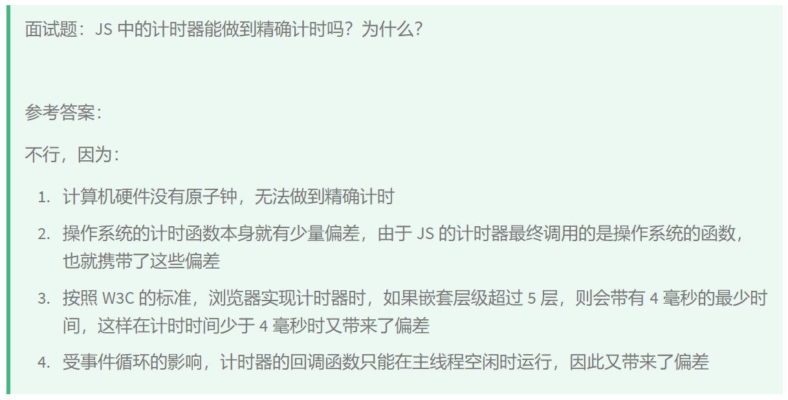

# JavaScript 异步与事件循环

整理 JS 异步、事件循环、队列和计时器相关复习内容。

> 本文从旧博客笔记归档中按主题拆分整理，保留了原笔记内容和图片引用。
> 来源日期：2025.06.19

##  js异步

> 来源日期：2025.06.19

## 事件循环（渲染主线程、微队列、交互队列、延时队列等等）

> 来源日期：2025.06.19

## 事件循环输出题目

> 来源日期：2025.06.19

## js中计时器精准吗？

