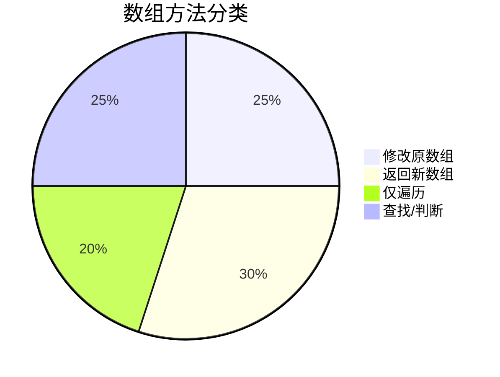
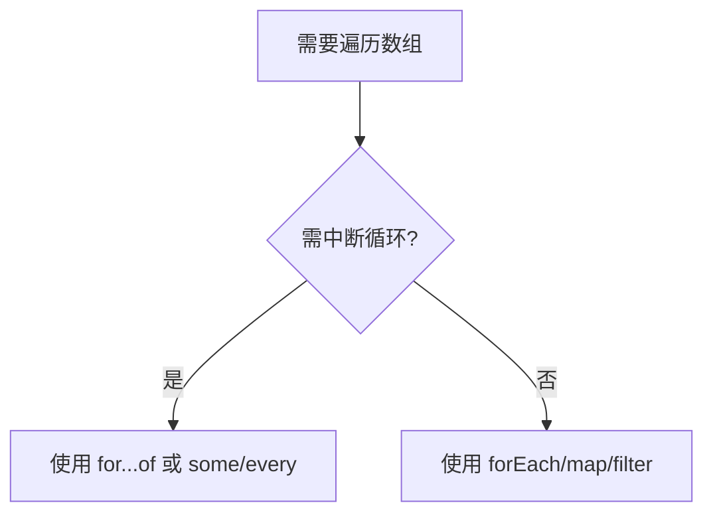
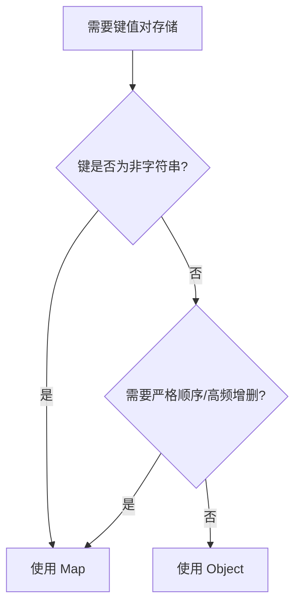

# JavaScript 集合、数组与遍历

整理 Map、Set、Object、数组方法和循环遍历相关复习内容。

> 本文从旧博客笔记归档中按主题拆分整理，保留了原笔记内容和图片引用。
> 来源日期：2025.06.26

## Map和WeakMap？Set与WeakSet？

### **Map 与 WeakMap 的区别**  

#### **1. 键类型**  
- **Map**：键可以是任意类型（对象、原始值）。  
- **WeakMap**：键必须是**对象**（非原始值）。  

#### **2. 垃圾回收**  
- **Map**：键是强引用，即使对象不再使用，Map 仍持有其引用，不会被垃圾回收。  
- **WeakMap**：键是弱引用，如果键对象没有其他引用，会被垃圾回收，对应的值也会自动释放。  

#### **3. 可迭代性**  
- **Map**：支持遍历（如 `keys()`, `values()`, `entries()`）。  
- **WeakMap**：**不可遍历**（没有方法获取所有键或值）。  

#### **4. 使用场景**  
- **Map**：需要存储任意键值对，并可能遍历或长期保留数据。  
- **WeakMap**：适合存储与对象关联的元数据（如私有属性），避免内存泄漏。  

**示例**：  
```javascript
// Map  
const map = new Map();  
map.set({ key: 'obj' }, 'value'); // 对象作为键  
map.set('primitive', 123); // 原始值作为键  

// WeakMap  
const weakMap = new WeakMap();  
const obj = {};  
weakMap.set(obj, 'private data'); // 仅接受对象键  
// obj = null 时，weakMap 中的条目会被自动清除  
```

---

### **Set 与 WeakSet 的区别**  

#### **1. 元素类型**  
- **Set**：元素可以是任意类型（对象、原始值）。  
- **WeakSet**：元素必须是**对象**（非原始值）。  

#### **2. 垃圾回收**  
- **Set**：元素是强引用，即使对象不再使用，Set 仍持有其引用。  
- **WeakSet**：元素是弱引用，对象无其他引用时会被垃圾回收。  

#### **3. 可迭代性**  
- **Set**：支持遍历（如 `forEach()`, `values()`）。  
- **WeakSet**：**不可遍历**（无法获取所有元素）。  

#### **4. 使用场景**  
- **Set**：存储唯一值集合，并可能遍历或长期保留数据。  
- **WeakSet**：适合临时跟踪对象是否存在（如事件监听器的去重）。  

**示例**：  
```javascript
// Set  
const set = new Set();  
set.add({ data: 'obj' });  
set.add('primitive');  

// WeakSet  
const weakSet = new WeakSet();  
const obj = {};  
weakSet.add(obj); // 仅接受对象  
// obj = null 时，weakSet 中的引用自动消失  
```

---

### **总结对比表**  
| 特性             | Map          | WeakMap        | Set        | WeakSet        |
| ---------------- | ------------ | -------------- | ---------- | -------------- |
| **键/元素类型**  | 任意类型     | 仅对象         | 任意类型   | 仅对象         |
| **垃圾回收影响** | 强引用       | 弱引用         | 强引用     | 弱引用         |
| **可遍历性**     | 支持         | 不支持         | 支持       | 不支持         |
| **典型用途**     | 通用键值存储 | 对象元数据存储 | 唯一值集合 | 对象存在性检查 |

---

### **面试回答技巧**  
**面试官**：`WeakMap` 和 `WeakSet` 为什么不能遍历？  
**回答**：  
> 因为它们的键/元素是弱引用，垃圾回收可能随时移除条目。如果允许遍历，会暴露不一致的状态（可能遍历到已被回收的键）。设计上刻意限制遍历能力，确保内存安全性。  

**追问**：何时选择 `WeakMap` 而非 `Map`？  
**回答**：  
> 当需要存储与对象关联的临时数据（如私有属性、缓存），且不希望因数据存储阻止对象被回收时，使用 `WeakMap`。例如，在框架中跟踪 DOM 节点的元数据，节点删除后自动清理数据。

---

> 来源日期：2025.06.26

## 举例说明+什么是原始值

### **原始值（Primitive Values）**
**定义**：JavaScript 中的原始值是不可变的（immutable）基本数据类型，包括：
- `string`、`number`、`boolean`、`null`、`undefined`、`symbol`、`bigint`  

**特点**：
- 按值传递（直接存储值本身）
- 比较时比较值是否相同（`'a' === 'a'`）
- 不能被扩展（无法添加属性）

---

### **Map 与 WeakMap 的示例与场景**

#### **1. Map 的典型场景**  
**需求**：存储用户配置，键可以是任意类型（如字符串或对象）。  

```javascript
// 示例：用 Map 存储不同用户的主题配置
const userThemes = new Map();

const user1 = { id: 1 };
const user2 = { id: 2 };

userThemes.set(user1, 'dark');  // 对象作为键
userThemes.set('guest', 'light'); // 原始值作为键

console.log(userThemes.get(user1)); // 'dark'
console.log(userThemes.get('guest')); // 'light'

// 支持遍历
userThemes.forEach((theme, key) => {
  console.log(`${key.id || key}: ${theme}`);
});
```

**适用场景**：
- 需要频繁增删或遍历键值对
- 键类型多样（如同时用对象和字符串作为键）

---

#### **2. WeakMap 的典型场景**  
**需求**：为 DOM 节点关联私有数据，节点删除时自动清理数据，避免内存泄漏。  

```javascript
// 示例：用 WeakMap 存储 DOM 节点的元数据
const nodeMetadata = new WeakMap();

const button = document.querySelector('#myButton');
nodeMetadata.set(button, { clicks: 0 });

button.addEventListener('click', () => {
  const data = nodeMetadata.get(button);
  data.clicks++;
  console.log(`Clicked ${data.clicks} times`);
});

// 当 button 被移除时，metadata 自动被垃圾回收
button.remove(); // nodeMetadata 中的条目自动清除
```

**适用场景**：
- 对象（如 DOM 节点、类实例）的私有数据存储
- 需要自动垃圾回收关联数据

---

### **Set 与 WeakSet 的示例与场景**

#### **1. Set 的典型场景**  
**需求**：统计页面中所有唯一的用户 ID（可能是字符串或数字）。  

```javascript
// 示例：用 Set 去重
const userIds = new Set();

userIds.add(101);  // 原始值
userIds.add('abc');
userIds.add(101);  // 重复值被忽略

console.log([...userIds]); // [101, 'abc'] （可转换为数组）

// 支持遍历
userIds.forEach(id => console.log(id));
```

**适用场景**：
- 数据去重（如数组去重 `[...new Set(array)]`）
- 需要检查值是否存在（`set.has(value)`）

---

#### **2. WeakSet 的典型场景**  
**需求**：跟踪已处理过的对象（如避免重复处理同一对象）。  

```javascript
// 示例：用 WeakSet 记录已处理的用户对象
const processedUsers = new WeakSet();

function processUser(user) {
  if (processedUsers.has(user)) {
    console.log('User already processed');
    return;
  }
  processedUsers.add(user);
  console.log('Processing user...');
}

const user = { id: 1 };
processUser(user); // "Processing user..."
processUser(user); // "User already processed"

// 当 user 对象被销毁时，WeakSet 自动清除引用
```

**适用场景**：
- 临时标记对象状态（如事件监听器的去重）
- 避免因集合引用阻止对象被回收

---

### **关键区别总结**
| 特性            | Map/Set                | WeakMap/WeakSet    |
| --------------- | ---------------------- | ------------------ |
| **键/元素类型** | 任意类型（包括原始值） | 仅对象             |
| **垃圾回收**    | 强引用（可能内存泄漏） | 弱引用（自动清理） |
| **遍历支持**    | 支持                   | 不支持             |
| **典型用途**    | 通用数据存储           | 对象关联的临时数据 |

---

### **面试回答技巧**
**面试官**：为什么 WeakMap 的键必须是对象？  
**回答**：  
> 因为 WeakMap 的设计目的是通过弱引用管理对象关联的数据。原始值（如字符串、数字）本身不可被垃圾回收，若允许作为键，WeakMap 就无法实现自动清理功能，失去其核心价值。  

**追问**：Set 如何实现数组去重？  
**回答**：  
> 利用 Set 自动去重的特性：  
> ```javascript
> const arr = [1, 2, 2, 3];
> const uniqueArr = [...new Set(arr)]; // [1, 2, 3]
> ```
> Set 内部使用严格相等（`===`）判断值是否重复，适合原始值去重。对象需额外处理（如序列化成字符串）。

---

> 来源日期：2025.06.26

## 数组有哪些方法

### **JavaScript 数组方法全解析**

#### **1. 基础操作方法**
| 方法            | 作用               | 是否修改原数组 | 示例                                   |
| --------------- | ------------------ | -------------- | -------------------------------------- |
| **`push()`**    | 末尾添加元素       | ✅              | `arr.push(4)` → `[1,2,3,4]`            |
| **`pop()`**     | 删除并返回末尾元素 | ✅              | `arr.pop()` → `3` (原数组变 `[1,2]`)   |
| **`unshift()`** | 开头添加元素       | ✅              | `arr.unshift(0)` → `[0,1,2,3]`         |
| **`shift()`**   | 删除并返回开头元素 | ✅              | `arr.shift()` → `1` (原数组变 `[2,3]`) |

#### **2. 增删/替换操作**
| 方法           | 作用             | 是否修改原数组 | 示例                                                  |
| -------------- | ---------------- | -------------- | ----------------------------------------------------- |
| **`splice()`** | 任意位置增删元素 | ✅              | `arr.splice(1,1,'a')` → 从索引1删除1个元素并插入`'a'` |
| **`slice()`**  | 截取子数组       | ❌              | `arr.slice(1,3)` → 返回 `[2,3]` (原数组不变)          |
| **`concat()`** | 合并数组         | ❌              | `arr.concat([4,5])` → `[1,2,3,4,5]`                   |

#### **3. 遍历方法**
| 方法            | 作用                 | 返回值      | 示例                                    |
| --------------- | -------------------- | ----------- | --------------------------------------- |
| **`forEach()`** | 遍历数组（无返回值） | `undefined` | `arr.forEach(v => console.log(v))`      |
| **`map()`**     | 映射新数组           | 新数组      | `arr.map(v => v*2)` → `[2,4,6]`         |
| **`filter()`**  | 过滤满足条件的元素   | 新数组      | `arr.filter(v => v>1)` → `[2,3]`        |
| **`reduce()`**  | 累计计算             | 累计结果    | `arr.reduce((sum,v) => sum+v, 0)` → `6` |

#### **4. 查找/判断方法**
| 方法              | 作用                     | 返回值            | 示例                              |
| ----------------- | ------------------------ | ----------------- | --------------------------------- |
| **`find()`**      | 查找第一个满足条件的元素 | 元素或`undefined` | `arr.find(v => v>2)` → `3`        |
| **`findIndex()`** | 查找第一个满足条件的索引 | 索引或`-1`        | `arr.findIndex(v => v===2)` → `1` |
| **`includes()`**  | 判断是否包含某值         | `boolean`         | `arr.includes(2)` → `true`        |
| **`some()`**      | 判断是否有元素满足条件   | `boolean`         | `arr.some(v => v>2)` → `true`     |
| **`every()`**     | 判断所有元素是否满足条件 | `boolean`         | `arr.every(v => v>0)` → `true`    |

#### **5. 排序/反转**
| 方法            | 作用                      | 是否修改原数组 | 示例                         |
| --------------- | ------------------------- | -------------- | ---------------------------- |
| **`sort()`**    | 排序（默认按Unicode排序） | ✅              | `[3,1,2].sort()` → `[1,2,3]` |
| **`reverse()`** | 反转数组                  | ✅              | `arr.reverse()` → `[3,2,1]`  |

#### **6. 其他实用方法**
| 方法               | 作用           | 是否修改原数组 | 示例                                  |
| ------------------ | -------------- | -------------- | ------------------------------------- |
| **`join()`**       | 数组转字符串   | ❌              | `arr.join('-')` → `"1-2-3"`           |
| **`flat()`**       | 扁平化嵌套数组 | ❌              | `[1,[2]].flat()` → `[1,2]`            |
| **`Array.from()`** | 类数组转真数组 | -              | `Array.from('abc')` → `['a','b','c']` |

---

### **面试回答技巧**
**面试官**：`map()` 和 `forEach()` 有什么区别？  
**回答**：  
> - **`map()`**：返回新数组，适合需要基于原数组生成新数据的场景（如数据转换）。  
> - **`forEach()`**：无返回值，仅用于遍历操作（如打印日志），性能略高于 `map()`。  

**追问**：如何实现数组去重？  
**回答**：  
> 1. **`Set` 去重**（适合原始值）：  
>    ```javascript
>    const uniqueArr = [...new Set(arr)];
>    ```
> 2. **`filter` + `indexOf`**（兼容对象）：  
>    ```javascript
>    const uniqueArr = arr.filter((v,i) => arr.indexOf(v) === i);
>    ```

---

### **可视化总结**


---

> 来源日期：2025.06.26

## 数组的遍历方法中，哪些可以中断，哪些不能中断

### **遍历方法对 `break` 的支持分析**

在 JavaScript 数组遍历的四个主要方法中，`break` 的行为差异显著，具体如下：

---

#### **1. `forEach()`：❌ 不支持 `break`**
- **原因**：`forEach` 内部通过回调函数实现遍历，无法中断循环。
- **表现**：使用 `break` 会直接报语法错误（`Illegal break statement`）。
- **替代方案**：
  ```javascript
  [1, 2, 3].forEach((v) => {
    if (v === 2) return; // 跳过当前迭代（无法完全终止）
    console.log(v);
  });
  ```
- **适用场景**：简单遍历，无需中断逻辑。

---

#### **2. `for...of`：✅ 支持 `break`**
- **原因**：`for...of` 是语言原生的循环语法，遵循标准循环控制规则。
- **示例**：
  ```javascript
  for (const num of [1, 2, 3]) {
    if (num === 2) break; // 立即终止循环
    console.log(num); // 只输出 1
  }
  ```
- **优势**：可中断，性能接近传统 `for` 循环。

---

#### **3. `map()`/`filter()`/`reduce()`：❌ 不支持 `break`**
- **原因**：这些方法返回新数组，内部实现为完整遍历。
- **表现**：`break` 会报语法错误。
- **替代方案**：
  - **`map`**：用 `return` 跳过当前项，但无法提前终止。
  - **`find`**：若需提前终止，改用 `find` 或 `some`。
  ```javascript
  // 使用 some 模拟 break
  [1, 2, 3].some((v) => {
    if (v === 2) return true; // 终止循环
    console.log(v); // 输出 1
  });
  ```

---

#### **4. `some()`/`every()`：✅ 支持逻辑中断**
- **原理**：
  - `some`：遇到 `return true` 时立即终止。
  - `every`：遇到 `return false` 时立即终止。
- **示例**：
  ```javascript
  // some 模拟 break
  [1, 2, 3].some((v) => {
    if (v === 2) return true; // 终止
    console.log(v); // 输出 1
  });
  
  // every 模拟 break
  [1, 2, 3].every((v) => {
    if (v === 2) return false; // 终止
    console.log(v); // 输出 1
    return true;
  });
  ```

---

### **总结对比表**
| 方法           | 是否支持 `break` | 中断方式                   | 典型用途      |
| -------------- | ---------------- | -------------------------- | ------------- |
| `forEach`      | ❌                | 无（报错）                 | 简单遍历      |
| `for...of`     | ✅                | `break`                    | 需中断的循环  |
| `map`/`filter` | ❌                | 无（需改用 `find`/`some`） | 数据转换/过滤 |
| `some`/`every` | ✅（逻辑等效）    | `return true`/`false`      | 条件检查      |

---

### **面试回答技巧**
**面试官**：为什么 `forEach` 不能用 `break`？  
**回答**：  
> `forEach` 通过回调函数处理每个元素，其内部实现强制完整遍历整个数组。若需中断，应改用 `for...of` 或 `some`/`every`，它们的设计允许提前终止。  

**追问**：如何在 `map` 中实现类似 `break` 的效果？  
**回答**：  
> 1. **改用 `for...of`**：直接使用原生循环。  
> 2. **结合 `slice` 截取**：先截取需处理的部分再 `map`。  
> 3. **利用 `throw` 异常**（不推荐）：通过 `try-catch` 强制中断，但会破坏代码可读性。  

---

### **可视化决策流程**


---

> 来源日期：2025.06.26

## for循环、for in和for of

### **for 循环、for...in 和 for...of 的区别详解**

#### **1. 基本语法与用途对比**
| 循环类型       | 语法                               | 主要用途                 | 是否支持 `break` |
| -------------- | ---------------------------------- | ------------------------ | ---------------- |
| **`for`**      | `for (let i=0; i<arr.length; i++)` | 通用循环，精确控制索引   | ✅                |
| **`for...in`** | `for (let key in obj)`             | 遍历对象的**可枚举属性** | ✅                |
| **`for...of`** | `for (let value of iterable)`      | 遍历**可迭代对象**的值   | ✅                |

---

#### **2. 核心区别分析**
##### **(1) `for` 循环**
- **特点**：
  - 最基础的循环，通过索引访问元素。
  - 适合需要精确控制循环次数或反向遍历的场景。
- **示例**：
  ```javascript
  const arr = [10, 20, 30];
  for (let i = 0; i < arr.length; i++) {
    if (i === 1) break; // 支持中断
    console.log(arr[i]); // 输出 10
  }
  ```

##### **(2) `for...in`**
- **特点**：
  - 遍历对象的**键名**（包括原型链上的可枚举属性）。
  - 不保证顺序（尤其对数组可能不按索引顺序）。
  - **不适合遍历数组**（会包含非数字键和继承属性）。
- **示例**：
  ```javascript
  const obj = { a: 1, b: 2 };
  for (const key in obj) {
    console.log(key); // 输出 'a', 'b'
  }
  
  // 数组问题示例
  Array.prototype.customProp = 'foo';
  const arr = [10, 20];
  arr.name = 'myArray';
  for (const key in arr) {
    console.log(key); // 输出 '0', '1', 'name', 'customProp'（污染！）
  }
  ```

##### **(3) `for...of`**
- **特点**：
  - 遍历**可迭代对象**（Array、Map、Set、String等）的**值**。
  - 不遍历原型链属性，保证顺序。
  - 是遍历数组和类数组结构的首选。
- **示例**：
  ```javascript
  const arr = [10, 20, 30];
  for (const value of arr) {
    if (value === 20) break; // 支持中断
    console.log(value); // 输出 10
  }
  
  // 遍历字符串
  for (const char of '你好') {
    console.log(char); // 输出 '你', '好'
  }
  ```

---

#### **3. 关键差异总结**
| 特性               | `for`         | `for...in`             | `for...of`                |
| ------------------ | ------------- | ---------------------- | ------------------------- |
| **遍历目标**       | 索引/条件控制 | 对象的键（含继承属性） | 可迭代对象的值            |
| **适合数组**       | ✅ 首选        | ❌ 会遍历非数字键       | ✅ 首选                    |
| **顺序保证**       | ✅ 确定        | ❌ 不保证（尤其数组）   | ✅ 确定                    |
| **原型链属性**     | -             | ✅ 包含                 | ❌ 不包含                  |
| **支持的数据结构** | 任意          | 对象                   | 可迭代对象（Array/Map等） |

---

#### **4. 如何选择？**
- **遍历数组**：优先用 `for...of` 或 `for`（需索引时）。
- **遍历对象**：用 `for...in` + `hasOwnProperty` 过滤原型属性：
  ```javascript
  for (const key in obj) {
    if (obj.hasOwnProperty(key)) { // 排除继承属性
      console.log(key, obj[key]);
    }
  }
  ```
- **需要中断**：三者均支持 `break`，但 `for...in` 和 `for...of` 更简洁。

---

#### **5. 面试回答示例**
**面试官**：`for...in` 和 `for...of` 有什么区别？  
**回答**：  
> 1. **`for...in`**：  
>    - 遍历对象的**键名**（包括原型链上的可枚举属性）。  
>    - 不保证顺序，不适合遍历数组（可能包含非数字键）。  
> 2. **`for...of`**：  
>    - 遍历**可迭代对象**（如数组、Map、Set）的**值**。  
>    - 不遍历原型链，保证顺序，是遍历数组的首选。  
>
> **示例**：  
> ```javascript
> // for...in 会遍历继承属性
> for (const key in arr) { /* 可能包含非数字键 */ }  
> 
> // for...of 仅遍历值
> for (const value of arr) { /* 安全遍历数组 */ }  
> ```

**追问**：什么时候该用传统 `for` 循环？  
**回答**：  
> 当需要：  
> 1. 精确控制索引（如反向遍历 `i--`）。  
> 2. 高性能遍历超大数组（`for` 通常比 `for...of` 稍快）。  
> 3. 同时访问索引和值（`for...of` 需搭配 `entries()`）。

---

> 来源日期：2025.06.26

## **Object 与 Map 的深度对比与替代性分析**

虽然 Object 和 Map 都可以存储键值对，但它们在设计理念和具体使用场景上有显著差异。以下是关键对比和替代性建议：

---

### **1. 核心差异总结**
| 特性             | Object                              | Map                                     |
| ---------------- | ----------------------------------- | --------------------------------------- |
| **键的类型**     | 仅支持字符串或 Symbol               | 支持任意类型（对象、函数等）            |
| **键的顺序**     | 无序（ES6 后部分有序但不保证）      | 严格按插入顺序                          |
| **性能**         | 高频访问/小数据量更优               | 大数据量增删操作更高效                  |
| **内置方法**     | 无专用方法，需用 `Object.keys()` 等 | 提供 `set()`/`get()`/`has()` 等专用 API |
| **JSON 支持**    | 原生支持 `JSON.stringify()`         | 需手动转换                              |
| **原型污染风险** | 可能通过原型链继承属性              | 完全隔离                                |

---

### **2. 何时可以互相替代？**
#### **✅ 可替代场景**
- **简单键值存储**：当键均为字符串且无需复杂操作时，两者功能等价。
  ```javascript
  // Object
  const obj = { id: 1, name: "Alice" };
  
  // Map
  const map = new Map();
  map.set("id", 1);
  map.set("name", "Alice");
  ```

#### **❌ 不可替代场景**
| 需求             | 推荐选择 | 原因                                                         |
| ---------------- | -------- | ------------------------------------------------------------ |
| 键需为非字符串   | Map      | Object 会强制将键转为字符串（如 `{}` 会变成 `"[object Object]"`） |
| 需要严格插入顺序 | Map      | Object 的属性顺序不可靠                                      |
| 高频增删键值对   | Map      | Map 的 `set`/`delete` 性能优于 Object 的动态属性操作         |
| 避免原型链干扰   | Map      | Object 可能通过 `__proto__` 或 `constructor` 被污染          |
| 需要遍历方法     | Map      | Map 直接提供 `forEach()`、`keys()` 等方法，Object 需转换（如 `Object.entries()`） |

---

### **3. 具体场景示例**
#### **场景 1：使用对象作为键**
```javascript
// Map 可正确处理对象键
const map = new Map();
const keyObj = { id: 1 };

map.set(keyObj, "value");
console.log(map.get(keyObj)); // "value"

// Object 会强制转键为字符串
const obj = {};
obj[keyObj] = "value";
console.log(obj["[object Object]"]); // "value" （丢失原始对象引用）
```

#### **场景 2：性能敏感操作**
```javascript
// Map 在大数据量增删时更快
const bigMap = new Map();
for (let i = 0; i < 1e6; i++) {
  bigMap.set(i, i * 2); // 比 Object 动态属性更快
}

// Object 在静态数据访问时略快
const bigObj = {};
for (let i = 0; i < 1e6; i++) {
  bigObj[i] = i * 2;
}
console.log(bigObj[999]); // 访问速度通常比 Map.get() 快 10%~20%
```

#### **场景 3：避免原型污染**
```javascript
// Object 可能被篡改
const unsafeObj = {};
console.log("toString" in unsafeObj); // true （继承自 Object.prototype）

// Map 完全隔离
const safeMap = new Map();
console.log(safeMap.has("toString")); // false
```

---

### **4. 面试回答建议**
**面试官**：Object 和 Map 能完全互相替代吗？  
**回答**：  
> 不能完全替代，需根据场景选择：  
> - **优先用 Map**：  
>   1. 键需为非字符串（如对象、函数）  
>   2. 需要严格插入顺序或高频增删  
>   3. 避免原型链污染  
> - **优先用 Object**：  
>   1. 键均为字符串且数据量小  
>   2. 需要 JSON 序列化或与旧代码交互  
>   3. 依赖 Object 特有特性（如属性描述符）  

**追问**：Map 相比 Object 的性能优势体现在哪？  
**回答**：  
> 1. **大数据量操作**：Map 的 `set`/`delete` 时间复杂度接近 O(1)，而 Object 动态属性可能触发隐藏类优化失效。  
> 2. **频繁增删**：Map 内部实现为哈希表，而 Object 需处理原型链和属性描述符。  
> 3. **内存占用**：Map 对稀疏数据存储更高效，Object 会为未使用的属性预留空间。  

---

### **5. 可视化决策树**


---

