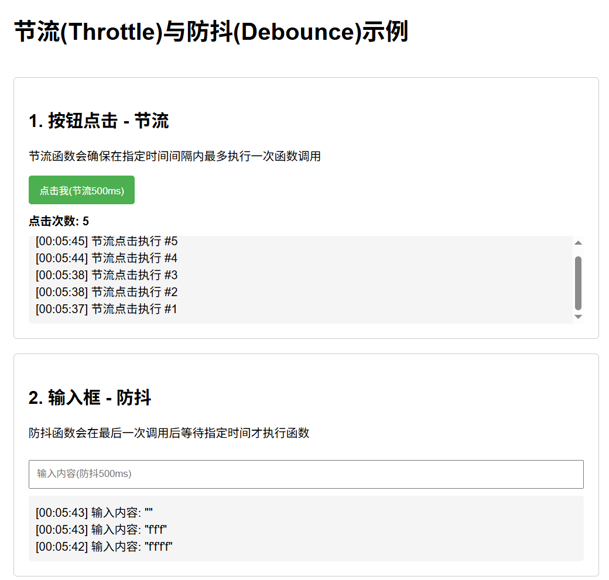
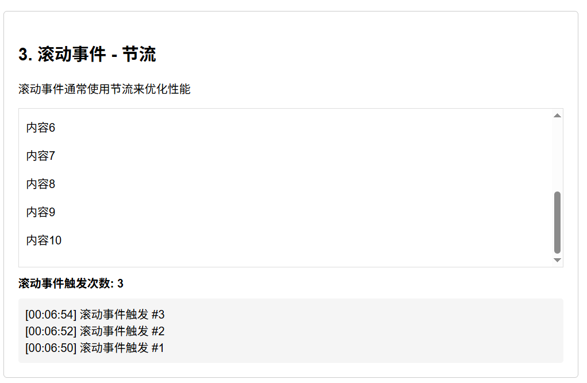

# JavaScript this、闭包与函数技巧

整理 this 指向、闭包、节流防抖、函数柯里化等高频 JavaScript 主题。

> 本文从旧博客笔记归档中按主题拆分整理，保留了原笔记内容和图片引用。
> 来源日期：2025.06.21

## 函数调用方式/this

### **JavaScript 中函数调用的 6 种方式**

在 JavaScript 中，函数的调用方式决定了 `this` 的指向和执行上下文。以下是所有调用方式的详细说明和示例：

---

### **1. 普通调用（直接调用）**
**特点**：
- `this` 指向 **全局对象**（浏览器中为 `window`，Node.js 中为 `global`）。
- 严格模式（`"use strict"`）下 `this` 为 `undefined`。

**示例**：
```javascript
function greet() {
  console.log(this); // window（非严格模式）
}
greet(); // 直接调用
```

---

### **2. 方法调用（对象方法）**
**特点**：
- `this` 指向 **调用该方法的对象**。

**示例**：
```javascript
const user = {
  name: "Alice",
  sayHi() {
    console.log(`Hello, ${this.name}!`); // this = user
  }
};
user.sayHi(); // 输出 "Hello, Alice!"
```

---

### **3. 构造函数调用（`new` 调用）**
**特点**：
- `this` 指向 **新创建的空对象**（实例）。
- 函数默认返回 `this`（即新对象）。

**示例**：
```javascript
function Person(name) {
  this.name = name; // this = 新对象
}
const bob = new Person("Bob");
console.log(bob.name); // "Bob"
```

---

### **4. `call` / `apply` / `bind`（显式绑定 `this`）**
**特点**：
- 手动指定 `this` 的值。
- `call` 和 `apply` 立即执行，`bind` 返回绑定后的新函数。

| 方法       | 参数传递方式               | 示例                          |
|------------|---------------------------|-------------------------------|
| **`call`** | 参数逐个传递               | `func.call(obj, arg1, arg2)`  |
| **`apply`**| 参数通过数组传递           | `func.apply(obj, [arg1, arg2])`|
| **`bind`** | 返回绑定 `this` 的新函数    | `const newFunc = func.bind(obj)` |

**示例**：
```javascript
function showInfo(age, city) {
  console.log(`${this.name}, ${age}, ${city}`);
}

const person = { name: "Alice" };

// call
showInfo.call(person, 25, "New York"); // Alice, 25, New York

// apply
showInfo.apply(person, [25, "New York"]); // Alice, 25, New York

// bind
const boundFunc = showInfo.bind(person, 25);
boundFunc("New York"); // Alice, 25, New York
```

---

### **5. 箭头函数调用**
**特点**：
- `this` **继承自外层作用域**（定义时确定，而非调用时）。
- 不能用作构造函数（`new` 会报错）。

**示例**：
```javascript
const user = {
  name: "Alice",
  sayHi: () => {
    console.log(this.name); // this = window（箭头函数无自己的 this）
  }
};
user.sayHi(); // 输出 undefined（严格模式可能是 undefined）
```

---

### **6. 回调函数调用（事件、定时器等）**
**特点**：
- `this` 指向由调用环境决定（通常为全局对象或触发事件的元素）。

**示例**：
```javascript
// 定时器回调（this = window）
setTimeout(function() {
  console.log(this); // window
}, 1000);

// 事件监听（this = 触发事件的 DOM 元素）
button.addEventListener("click", function() {
  console.log(this); // <button>
});

// 箭头函数回调（this 继承外层）
button.addEventListener("click", () => {
  console.log(this); // window（因为箭头函数绑定外层 this）
});
```

---

### **总结：`this` 指向规则**
| 调用方式          | `this` 指向                     | 示例                     |
|-------------------|--------------------------------|--------------------------|
| 普通调用          | 全局对象（`window`/`global`）   | `func()`                 |
| 方法调用          | 调用该方法的对象                | `obj.method()`           |
| 构造函数调用      | 新创建的实例对象                | `new Func()`             |
| `call`/`apply`    | 手动指定的对象                  | `func.call(obj)`         |
| 箭头函数          | 外层作用域的 `this`             | `() => { ... }`          |
| 回调函数          | 由调用环境决定（如 DOM 元素）    | `setTimeout(func, 1000)` |

---

### **面试回答示例**
**面试官**：JS 中函数调用有哪些方式？  
**回答**：
> JavaScript 中函数调用主要有 6 种方式：
> 1. **普通调用**：`func()`，`this` 指向全局对象（严格模式为 `undefined`）。
> 2. **方法调用**：`obj.func()`，`this` 指向调用对象 `obj`。
> 3. **构造函数调用**：`new Func()`，`this` 指向新创建的实例。
> 4. **显式绑定**：`func.call(obj)` 或 `func.bind(obj)`，手动指定 `this`。
> 5. **箭头函数**：`this` 继承外层作用域，无法修改。
> 6. **回调函数**：如事件监听或定时器，`this` 由调用环境决定。

**追问**：如何强制让函数中的 `this` 指向特定对象？  
**回答**：
> 使用 `call`、`apply` 或 `bind`：
> - `func.call(obj, arg1, arg2)`：立即调用，`this` 绑定到 `obj`。
> - `func.bind(obj)`：返回一个绑定 `this` 的新函数，适合回调场景。

---

掌握这些调用方式，可以精准控制 `this` 的指向，避免常见错误（如回调函数中 `this` 丢失）。

> 来源日期：2025.06.21

## 闭包
### **JavaScript 闭包(Closure)详解**

闭包是 JavaScript 中最重要的概念之一，理解闭包能帮助你写出更高效、更灵活的代码。下面我会用**直观示例+手写实现+实际应用**的方式全面讲解闭包。

---

### **一、什么是闭包？**
#### **1. 教科书定义**
> 闭包是指**有权访问另一个函数作用域中变量的函数**，即使外部函数已经执行完毕。

#### **2. 人话解释**
闭包就是：
- **一个函数**（内部函数）
- **记住了它被创建时的环境**（外部函数的变量）
- **即使外部函数已经销毁**，内部函数仍然能访问那些变量

---

### **二、闭包的核心原理**
#### **1. 作用域链(Scope Chain)**
JavaScript 中每个函数都有自己的作用域，当访问一个变量时：
1. 先查找自己的作用域
2. 找不到就向上一层作用域查找
3. 直到全局作用域

#### **2. 闭包的形成**
当**内部函数引用外部函数的变量**时，JavaScript 引擎会保留这些变量（即使外部函数执行完毕），而不是垃圾回收它们。

```javascript
function outer() {
  const secret = "123"; // 外部函数变量
  
  function inner() {
    console.log(secret); // 内部函数访问外部变量 → 形成闭包
  }
  
  return inner;
}

const myFunc = outer(); // outer()执行完毕
myFunc(); // 仍能访问secret → 输出"123"
```

---

### **三、手写闭包示例**
#### **1. 基础计数器**
```javascript
function createCounter() {
  let count = 0; // 被闭包"记住"的变量
  
  return function() {
    count++; // 修改外部变量
    return count;
  };
}

const counter = createCounter();
console.log(counter()); // 1
console.log(counter()); // 2 (闭包保留了count的状态)
```

#### **2. 私有变量封装**
```javascript
function createPerson(name) {
  let privateAge = 0; // "私有"变量
  
  return {
    getName: () => name,
    getAge: () => privateAge,
    birthday: () => {
      privateAge++;
      console.log(`${name} is now ${privateAge} years old`);
    }
  };
}

const person = createPerson("Alice");
person.birthday(); // "Alice is now 1 years old"
// 无法直接访问privateAge → 真正的私有变量
```

---

### **四、闭包的实际应用场景**
#### **1. 模块化开发**
```javascript
// 模块模式
const calculator = (function() {
  let memory = 0; // 私有变量
  
  return {
    add: (x) => memory += x,
    get: () => memory
  };
})();

calculator.add(5);
console.log(calculator.get()); // 5
// memory对外不可见
```

#### **2. 事件处理**
```javascript
// 给多个按钮绑定点击事件
function setupButtons() {
  const colors = ["red", "green", "blue"];
  
  for (var i = 0; i < colors.length; i++) {
    // 使用IIFE创建闭包环境
    (function(color) {
      document.getElementById(`btn-${color}`)
        .addEventListener("click", () => {
          console.log(`Selected ${color}`);
        });
    })(colors[i]);
  }
}
```

#### **3. 函数柯里化**
```javascript
function multiply(a) {
  return function(b) {
    return a * b; // 闭包记住了a的值
  };
}

const double = multiply(2);
console.log(double(5)); // 10
```

---

### **五、闭包的注意事项**
#### **1. 内存泄漏风险**
闭包会阻止垃圾回收，不当使用可能导致内存泄漏：
```javascript
// 不当示例
function leakMemory() {
  const hugeArray = new Array(1000000).fill("data");
  
  return function() {
    console.log("I'm leaking!");
    // 即使不用hugeArray，它也不会被回收
  };
}
```
**解决方案**：不再需要时手动解除引用：
```javascript
const tempFunc = leakMemory();
tempFunc(); // 使用后
tempFunc = null; // 解除引用
```

#### **2. 性能考量**
- 闭包比普通函数占用更多内存
- 在循环中创建闭包要谨慎（可用`let`替代`var`）

---

### **六、面试回答模板**
**面试官**：什么是闭包？有什么应用场景？  
**回答**：
> 闭包是指**能够访问并记住其词法作用域的函数**，即使外部函数已执行完毕。  
> **核心特点**：
> 1. 内部函数访问外部变量
> 2. 外部函数执行后变量仍被保留
>
> **应用场景**：
> 1. 创建私有变量（模块模式）
> 2. 保持状态（如计数器）
> 3. 函数柯里化
> 4. 事件处理中保留上下文
>
> **注意事项**：需避免内存泄漏，及时解除无用闭包的引用。

---

通过理解闭包，你可以：
✅ 写出更模块化的代码  
✅ 实现真正的私有变量  
✅ 优化事件处理和异步逻辑  
✅ 掌握函数式编程的基础

> 来源日期：2025.06.21

## 节流、防抖
### 节流与防抖示例

下面是一个完整的HTML示例，包含了节流(Throttle)和防抖(Debounce)的实现，并在脚本区域手写了类似lodash的`throttle`和`debounce`函数。
> 
> 
```html
<!DOCTYPE html>
<html lang="zh-CN">
<head>
    <meta charset="UTF-8">
    <meta name="viewport" content="width=device-width, initial-scale=1.0">
    <title>节流与防抖示例</title>
    <style>
        body {
            font-family: Arial, sans-serif;
            max-width: 800px;
            margin: 0 auto;
            padding: 20px;
        }
        .container {
            display: flex;
            flex-direction: column;
            gap: 20px;
        }
        .box {
            border: 1px solid #ccc;
            padding: 20px;
            border-radius: 5px;
        }
        button {
            padding: 10px 15px;
            background-color: #4CAF50;
            color: white;
            border: none;
            border-radius: 4px;
            cursor: pointer;
            margin-right: 10px;
        }
        button:hover {
            background-color: #45a049;
        }
        .scroll-box {
            height: 200px;
            overflow-y: scroll;
            border: 1px solid #ddd;
            padding: 10px;
            margin-top: 10px;
        }
        .input-box {
            padding: 10px;
            width: 100%;
            box-sizing: border-box;
            margin-top: 10px;
        }
        .event-log {
            margin-top: 10px;
            padding: 10px;
            background-color: #f5f5f5;
            border-radius: 4px;
            max-height: 100px;
            overflow-y: auto;
        }
        .counter {
            font-weight: bold;
            margin-top: 10px;
        }
    </style>
</head>
<body>
    <div class="container">
        <h1>节流(Throttle)与防抖(Debounce)示例</h1>
        
        <div class="box">
            <h2>1. 按钮点击 - 节流</h2>
            <p>节流函数会确保在指定时间间隔内最多执行一次函数调用</p>
            <button id="throttleBtn">点击我(节流500ms)</button>
            <div class="counter">点击次数: <span id="throttleCount">0</span></div>
            <div class="event-log" id="throttleLog"></div>
        </div>
        
        <div class="box">
            <h2>2. 输入框 - 防抖</h2>
            <p>防抖函数会在最后一次调用后等待指定时间才执行函数</p>
            <input type="text" id="debounceInput" class="input-box" placeholder="输入内容(防抖500ms)">
            <div class="event-log" id="debounceLog"></div>
        </div>
        
        <div class="box">
            <h2>3. 滚动事件 - 节流</h2>
            <p>滚动事件通常使用节流来优化性能</p>
            <div class="scroll-box" id="scrollBox">
                <p>滚动这个区域...</p>
                <p>内容1</p><p>内容2</p><p>内容3</p><p>内容4</p><p>内容5</p>
                <p>内容6</p><p>内容7</p><p>内容8</p><p>内容9</p><p>内容10</p>
            </div>
            <div class="counter">滚动事件触发次数: <span id="scrollCount">0</span></div>
            <div class="event-log" id="scrollLog"></div>
        </div>
    </div>

    <script>
        // 手写节流(throttle)函数
        function throttle(func, wait) {
            let lastTime = 0;
            let timeoutId = null;
            
            return function(...args) {
                const now = Date.now();
                const remaining = wait - (now - lastTime);
                
                if (remaining <= 0 || remaining > wait) {
                    // 如果距离上次执行已经超过wait时间，或者remaining异常(如系统时间被修改)
                    if (timeoutId) {
                        clearTimeout(timeoutId);
                        timeoutId = null;
                    }
                    lastTime = now;
                    func.apply(this, args);
                } else if (!timeoutId) {
                    // 设置一个定时器，确保即使事件停止触发，也能执行最后一次
                    timeoutId = setTimeout(() => {
                        lastTime = Date.now();
                        timeoutId = null;
                        func.apply(this, args);
                    }, remaining);
                }
            };
        }

        // 手写防抖(debounce)函数
        function debounce(func, wait, immediate = false) {
            let timeoutId = null;
            
            return function(...args) {
                const context = this;
                const later = () => {
                    timeoutId = null;
                    if (!immediate) {
                        func.apply(context, args);
                    }
                };
                
                const callNow = immediate && !timeoutId;
                
                if (timeoutId) {
                    clearTimeout(timeoutId);
                }
                
                timeoutId = setTimeout(later, wait);
                
                if (callNow) {
                    func.apply(context, args);
                }
            };
        }

        // 1. 按钮点击 - 节流示例
        const throttleBtn = document.getElementById('throttleBtn');
        const throttleCount = document.getElementById('throttleCount');
        const throttleLog = document.getElementById('throttleLog');
        let clickCount = 0;
        
        const throttledClick = throttle(() => {
            clickCount++;
            throttleCount.textContent = clickCount;
            logEvent(throttleLog, `节流点击执行 #${clickCount}`);
        }, 500);
        
        throttleBtn.addEventListener('click', throttledClick);

        // 2. 输入框 - 防抖示例
        const debounceInput = document.getElementById('debounceInput');
        const debounceLog = document.getElementById('debounceLog');
        
        const debouncedInput = debounce((event) => {
            logEvent(debounceLog, `输入内容: "${event.target.value}"`);
        }, 500);
        
        debounceInput.addEventListener('input', debouncedInput);

        // 3. 滚动事件 - 节流示例
        const scrollBox = document.getElementById('scrollBox');
        const scrollCount = document.getElementById('scrollCount');
        const scrollLog = document.getElementById('scrollLog');
        let scrollEventCount = 0;
        
        const throttledScroll = throttle(() => {
            scrollEventCount++;
            scrollCount.textContent = scrollEventCount;
            logEvent(scrollLog, `滚动事件触发 #${scrollEventCount}`);
        }, 200);
        
        scrollBox.addEventListener('scroll', throttledScroll);

        // 辅助函数：记录事件日志
        function logEvent(element, message) {
            const now = new Date();
            const timeStr = now.toLocaleTimeString();
            const logEntry = document.createElement('div');
            logEntry.textContent = `[${timeStr}] ${message}`;
            element.prepend(logEntry);
            
            // 限制日志数量
            if (element.children.length > 5) {
                element.removeChild(element.lastChild);
            }
        }
    </script>
</body>
</html>
```

### 代码说明

#### 1. 手写的 `throttle` 函数
- 确保在指定时间间隔(`wait`)内最多执行一次函数调用
- 使用了时间戳和定时器的组合，确保即使事件停止触发，也能执行最后一次调用
- 处理了系统时间被修改的边界情况

#### 2. 手写的 `debounce` 函数
- 在最后一次调用后等待指定时间(`wait`)才执行函数
- 支持立即执行模式(`immediate`参数)
- 清除之前的定时器以避免重复执行

#### 3. 示例场景
1. **按钮点击节流** - 限制按钮点击频率，防止快速重复点击
2. **输入框防抖** - 延迟处理输入内容，避免频繁触发处理函数
3. **滚动事件节流** - 优化滚动性能，减少事件处理频率

#### 4. 样式设计
- 清晰的UI布局，区分不同示例
- 实时显示事件触发次数和日志
- 响应式设计，适应不同屏幕尺寸

这个示例完整展示了节流和防抖的实际应用场景，并提供了类似lodash的实现方式。

> 来源日期：2025.06.21

## 函数柯里化
#### **函数柯里化(Currying)详解**

函数柯里化是一种**将多参数函数转换为一系列单参数函数**的技术，它由数学家 Haskell Curry 命名，是函数式编程的重要概念。

---

### **一、柯里化的核心思想**
#### **1. 普通函数 vs 柯里化函数**
```javascript
// 普通函数（多参数）
function add(a, b, c) {
  return a + b + c;
}
add(1, 2, 3); // 6

// 柯里化函数（单参数链式调用）
function curriedAdd(a) {
  return function(b) {
    return function(c) {
      return a + b + c;
    };
  };
}
curriedAdd(1)(2)(3); // 6
```

#### **2. 核心特点**
- **拆分参数**：将 `f(a,b,c)` 转换为 `f(a)(b)(c)`
- **延迟执行**：每次调用返回新函数，直到参数收集完成
- **参数复用**：可以固定部分参数生成新函数

---

### **二、手动实现柯里化**
#### **1. 基础柯里化实现**
```javascript
function curry(fn) {
  return function curried(...args) {
    if (args.length >= fn.length) {
      return fn.apply(this, args);
    } else {
      return function(...nextArgs) {
        return curried.apply(this, args.concat(nextArgs));
      };
    }
  };
}

// 使用示例
const curriedSum = curry((a, b, c) => a + b + c);
console.log(curriedSum(1)(2)(3)); // 6
console.log(curriedSum(1, 2)(3)); // 6
```

#### **2. 无限参数柯里化**
```javascript
function infiniteCurry(fn) {
  return function curried(...args) {
    return function(...nextArgs) {
      const allArgs = args.concat(nextArgs);
      if (nextArgs.length === 0) {
        return allArgs.reduce(fn);
      }
      return curried(...allArgs);
    };
  };
}

// 使用示例
const add = infiniteCurry((a, b) => a + b);
console.log(add(1)(2)(3)(4)()); // 10
```

---

### **三、柯里化的实际应用**
#### **1. 参数复用**
```javascript
// 通用日志函数
function log(date, importance, message) {
  console.log(`[${date}] [${importance}] ${message}`);
}

// 柯里化后
const curriedLog = curry(log);

// 固定部分参数
const logNow = curriedLog(new Date());
logNow("INFO", "User logged in"); // [2023-01-01] [INFO] User logged in

const debugNow = logNow("DEBUG");
debugNow("Check cache"); // [2023-01-01] [DEBUG] Check cache
```

#### **2. 函数组合**
```javascript
// 组合多个柯里化函数
const compose = (...fns) => x => fns.reduceRight((v, f) => f(v), x);

const toUpper = str => str.toUpperCase();
const exclaim = str => `${str}!`;
const greet = compose(exclaim, toUpper);

console.log(greet("hello")); // "HELLO!"
```

#### **3. 延迟计算**
```javascript
// 条件判断的延迟执行
const ifElse = curry((condition, thenFn, elseFn, x) => 
  condition(x) ? thenFn(x) : elseFn(x));

const isEven = n => n % 2 === 0;
const double = n => n * 2;
const triple = n => n * 3;

const processNumber = ifElse(isEven, double, triple);
console.log(processNumber(4)); // 8
console.log(processNumber(5)); // 15
```

---

### **四、柯里化的优缺点**
### **优点**
| 特性 | 说明 |
|------|------|
| **参数复用** | 固定部分参数生成专用函数 |
| **延迟执行** | 参数不齐时返回新函数 |
| **函数组合** | 更容易实现管道式调用 |

#### **缺点**
| 问题 | 说明 |
|------|------|
| **调试困难** | 调用栈变深，错误信息不直观 |
| **性能损耗** | 多次嵌套函数调用有额外开销 |
| **可读性降低** | 链式调用对新手不友好 |

---

### **五、面试回答模板**
**面试官**：什么是函数柯里化？  
**回答**：
> 柯里化是将**多参数函数转换为一系列单参数函数**的技术，核心特点是：
> 1. **参数拆分**：`f(a,b,c)` → `f(a)(b)(c)`
> 2. **延迟执行**：参数不足时返回新函数
> 3. **参数复用**：固定部分参数生成专用函数
>
> **典型应用场景**：
> - 参数复用（如日志函数）
> - 函数组合（管道式处理）
> - 延迟计算（条件判断）
>
> **实现要点**：通过闭包保存已传入的参数，直到参数数量满足原函数要求。

---

### **六、与部分应用(Partial Application)的区别**
| 特性 | 柯里化 | 部分应用 |
|------|--------|----------|
| **参数传递** | 每次只传一个参数 | 可一次传多个参数 |
| **返回结果** | 总是返回函数直到参数收齐 | 可能直接返回结果 |
| **灵活性** | 严格的参数顺序 | 可跳过部分参数 |

```javascript
// 部分应用示例
function partial(fn, ...fixedArgs) {
  return function(...remainingArgs) {
    return fn(...fixedArgs, ...remainingArgs);
  };
}

const addTen = partial((a, b) => a + b, 10);
console.log(addTen(5)); // 15
```

---

掌握柯里化能让你：

✅ 写出更灵活的函数组合  
✅ 提高代码复用性  
✅ 深入理解函数式编程思想

