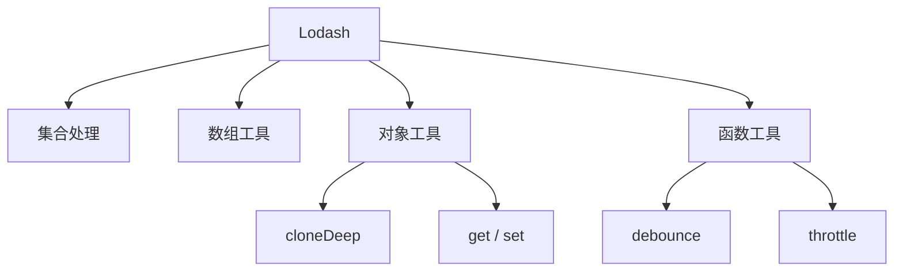

# Lodash 使用教程：从集合处理到防抖节流、对象操作和函数工具

Lodash 是 JavaScript 生态里非常经典的工具函数库。它提供了大量用于数组、对象、集合、字符串和函数控制的工具，尤其在数据清洗、兼容旧代码、复杂对象操作、防抖节流等场景里很常见。

一句话理解：

> Lodash 把常见的数据处理和函数控制逻辑封装成稳定工具，减少业务代码里的重复手写。

本文用一个“订单列表后台”串起来：筛选订单、分组统计、深拷贝表单、读取嵌套字段、合并配置、防抖搜索、节流滚动。



## 1. 为什么还要学 Lodash

现代 JavaScript 已经有很多原生能力：

```js
orders.filter(order => order.status === 'paid')
orders.map(order => order.amount)
orders.reduce((sum, order) => sum + order.amount, 0)
```

但 Lodash 仍然常见，原因是：

- 老项目里大量使用。
- 一些复杂操作写起来更稳。
- 对象路径读取、深拷贝、深合并很实用。
- 防抖、节流仍然是高频工具。
- 数据分组、排序、去重、扁平化更顺手。

学习 Lodash 的重点不是“所有函数都背下来”，而是知道哪些场景它比手写更清晰。

## 2. 安装和引入

安装：

```bash
pnpm add lodash
pnpm add -D @types/lodash
```

常见引入：

```ts
import debounce from 'lodash/debounce'
import groupBy from 'lodash/groupBy'
```

不推荐在前端项目里直接整体引入：

```ts
import _ from 'lodash'
```

如果项目构建配置不够理想，整体引入可能增加包体积。前端项目优先按函数引入。

## 3. 示例数据

后面都用订单数据：

```ts
type Order = {
  id: string
  userId: string
  status: 'created' | 'paid' | 'shipped' | 'cancelled'
  amount: number
  createdAt: string
  tags?: string[]
  customer?: {
    profile?: {
      city?: string
    }
  }
}

const orders: Order[] = [
  { id: 'o1', userId: 'u1', status: 'paid', amount: 120, createdAt: '2026-06-01' },
  { id: 'o2', userId: 'u2', status: 'created', amount: 80, createdAt: '2026-06-02' },
  { id: 'o3', userId: 'u1', status: 'shipped', amount: 220, createdAt: '2026-06-03' }
]
```

## 4. 集合筛选和映射

Lodash 的 `filter`、`map`、`reduce` 和原生方法类似：

```ts
import filter from 'lodash/filter'
import map from 'lodash/map'
import sumBy from 'lodash/sumBy'

const paidOrders = filter(orders, { status: 'paid' })
const ids = map(orders, 'id')
const totalAmount = sumBy(orders, 'amount')
```

这里的简写很常见：

```ts
filter(orders, { status: 'paid' })
map(orders, 'id')
```

等价于：

```ts
orders.filter(order => order.status === 'paid')
orders.map(order => order.id)
```

如果只是简单 map/filter，原生写法通常更直观。Lodash 的优势在复杂组合和对象路径上。

## 5. 分组和统计

按状态分组：

```ts
import groupBy from 'lodash/groupBy'

const byStatus = groupBy(orders, 'status')
```

结果类似：

```json
{
  "paid": [{ "id": "o1" }],
  "created": [{ "id": "o2" }],
  "shipped": [{ "id": "o3" }]
}
```

统计每个状态的金额：

```ts
import mapValues from 'lodash/mapValues'
import sumBy from 'lodash/sumBy'

const amountByStatus = mapValues(
  groupBy(orders, 'status'),
  list => sumBy(list, 'amount')
)
```

在报表、看板、列表聚合里，`groupBy + mapValues + sumBy` 很常见。

## 6. 排序

单字段排序：

```ts
import orderBy from 'lodash/orderBy'

const latestOrders = orderBy(orders, ['createdAt'], ['desc'])
```

多字段排序：

```ts
const sorted = orderBy(
  orders,
  ['status', 'amount'],
  ['asc', 'desc']
)
```

原生 `sort` 会原地修改数组。Lodash `orderBy` 返回新数组，更适合在 React/Vue 状态里使用。

## 7. 去重

普通数组去重可以用原生 `Set`：

```ts
const ids = [...new Set(['a', 'a', 'b'])]
```

对象数组按字段去重：

```ts
import uniqBy from 'lodash/uniqBy'

const uniqueUsers = uniqBy(orders, 'userId')
```

按自定义规则：

```ts
const uniqueByDay = uniqBy(orders, order => order.createdAt.slice(0, 10))
```

## 8. 扁平化

取所有订单标签：

```ts
import flatMap from 'lodash/flatMap'
import uniq from 'lodash/uniq'

const tags = uniq(flatMap(orders, order => order.tags ?? []))
```

多层数组：

```ts
import flattenDeep from 'lodash/flattenDeep'

const result = flattenDeep([1, [2, [3, [4]]]])
```

如果只是一层扁平化，原生 `flat()` 就够了；多层或兼容旧环境时 Lodash 更方便。

## 9. 安全读取嵌套字段

读取城市：

```ts
import get from 'lodash/get'

const city = get(order, 'customer.profile.city', '未知城市')
```

等价的现代写法：

```ts
const city = order.customer?.profile?.city ?? '未知城市'
```

什么时候用 `get`？

- 路径来自配置。
- 路径是字符串。
- 需要统一处理复杂嵌套对象。

动态路径：

```ts
function readField(row: unknown, path: string) {
  return get(row, path, '')
}
```

表格列配置里很常见。

## 10. 设置和挑选对象字段

设置嵌套字段：

```ts
import set from 'lodash/set'

const form = {}
set(form, 'customer.profile.city', '杭州')
```

挑选字段：

```ts
import pick from 'lodash/pick'
import omit from 'lodash/omit'

const payload = pick(order, ['id', 'status', 'amount'])
const publicOrder = omit(order, ['internalRemark'])
```

接口返回数据时，`pick` 比手写对象更不容易漏字段，但不要过度使用到看不清结构。

## 11. 深拷贝

```ts
import cloneDeep from 'lodash/cloneDeep'

const draft = cloneDeep(order)
draft.customer.profile.city = '上海'
```

适合：

- 表单编辑草稿。
- 配置对象复制。
- 测试数据复制。

注意：

- 深拷贝可能很耗性能。
- 函数、类实例、DOM、特殊对象不一定符合你的业务语义。
- 现代浏览器和 Node.js 可考虑 `structuredClone`。

```ts
const draft = structuredClone(order)
```

如果只改一层，没必要深拷贝：

```ts
const nextOrder = {
  ...order,
  status: 'paid'
}
```

## 12. 深合并

合并默认配置和用户配置：

```ts
import merge from 'lodash/merge'

const defaultConfig = {
  table: {
    pageSize: 20,
    columns: ['id', 'status']
  }
}

const userConfig = {
  table: {
    pageSize: 50
  }
}

const config = merge({}, defaultConfig, userConfig)
```

结果：

```ts
{
  table: {
    pageSize: 50,
    columns: ['id', 'status']
  }
}
```

注意：`merge` 会递归合并对象。数组合并规则未必符合所有业务，需要时用 `mergeWith` 自定义。

## 13. 防抖 debounce

防抖适合搜索输入：用户连续输入时不立刻请求，停下来一段时间后再请求。

```ts
import debounce from 'lodash/debounce'

const search = debounce(async (keyword: string) => {
  await fetch(`/api/search?q=${encodeURIComponent(keyword)}`)
}, 300)

input.addEventListener('input', event => {
  search((event.target as HTMLInputElement).value)
})
```

React 中要注意函数稳定：

```tsx
import debounce from 'lodash/debounce'
import { useMemo, useEffect } from 'react'

export function SearchBox() {
  const search = useMemo(
    () =>
      debounce((keyword: string) => {
        console.log(keyword)
      }, 300),
    []
  )

  useEffect(() => {
    return () => search.cancel()
  }, [search])

  return <input onChange={event => search(event.target.value)} />
}
```

组件卸载时调用 `cancel()`，避免延迟执行更新已卸载组件。

## 14. 节流 throttle

节流适合滚动、窗口 resize、拖拽：固定时间内最多执行一次。

```ts
import throttle from 'lodash/throttle'

const onScroll = throttle(() => {
  console.log(window.scrollY)
}, 200)

window.addEventListener('scroll', onScroll)
```

清理：

```ts
window.removeEventListener('scroll', onScroll)
onScroll.cancel()
```

防抖和节流区别：

| 工具 | 行为 | 场景 |
| --- | --- | --- |
| debounce | 停止触发一段时间后执行 | 搜索、表单自动保存 |
| throttle | 固定间隔最多执行一次 | 滚动、resize、拖拽 |

## 15. once、memoize、after

只执行一次：

```ts
import once from 'lodash/once'

const initSdk = once(() => {
  console.log('init')
})
```

缓存函数结果：

```ts
import memoize from 'lodash/memoize'

const formatCurrency = memoize((value: number) => {
  return new Intl.NumberFormat('zh-CN', {
    style: 'currency',
    currency: 'CNY'
  }).format(value)
})
```

注意：`memoize` 默认用第一个参数当缓存 key，复杂参数要自定义 resolver。

```ts
const getPrice = memoize(
  (userId: string, productId: string) => fetchPrice(userId, productId),
  (userId, productId) => `${userId}:${productId}`
)
```

## 16. 链式调用

Lodash 支持链式调用：

```ts
import _ from 'lodash'

const result = _(orders)
  .filter(order => order.status !== 'cancelled')
  .groupBy('status')
  .mapValues(list => _.sumBy(list, 'amount'))
  .value()
```

链式调用适合数据处理管道，但不要写得太长。超过几步后，可以拆成命名变量，提高可读性：

```ts
const validOrders = orders.filter(order => order.status !== 'cancelled')
const ordersByStatus = groupBy(validOrders, 'status')
const amountByStatus = mapValues(ordersByStatus, list => sumBy(list, 'amount'))
```

## 17. 性能和包体积

前端项目要关注引入方式：

```ts
import debounce from 'lodash/debounce'
```

优于：

```ts
import _ from 'lodash'
```

如果项目支持 ESM，也可以考虑：

```bash
pnpm add lodash-es
```

```ts
import { debounce, groupBy } from 'lodash-es'
```

实际选择取决于构建工具和项目规范。不要凭感觉判断包体积，应该看构建分析结果。

## 18. 现代 JavaScript 替代

很多 Lodash 函数已有原生替代：

| Lodash | 原生替代 |
| --- | --- |
| `map` | `Array.prototype.map` |
| `filter` | `Array.prototype.filter` |
| `find` | `Array.prototype.find` |
| `includes` | `Array.prototype.includes` |
| `assign` | `Object.assign` / 展开 |
| `get` | 可选链 `?.` + `??` |
| `cloneDeep` | `structuredClone` |
| `flatten` | `Array.prototype.flat` |

选择原则：

- 原生写法清楚时，用原生。
- 动态路径、深合并、防抖节流、复杂分组时，用 Lodash。
- 团队已有规范时，保持一致。

## 19. 常见坑

### 19.1 深拷贝滥用

每次状态更新都 `cloneDeep`，可能导致性能问题。能局部复制就局部复制。

### 19.2 debounce 在组件每次渲染时重建

React 里如果每次 render 都创建新的 debounce 函数，防抖会失效。要用 `useMemo` 或抽到组件外。

### 19.3 merge 改变了目标对象

`merge` 会修改第一个参数，所以推荐：

```ts
merge({}, defaultConfig, userConfig)
```

不要直接：

```ts
merge(defaultConfig, userConfig)
```

### 19.4 整体引入导致包变大

前端项目尽量按函数引入或使用 `lodash-es`，并用构建分析确认结果。

## 20. 面试表达

可以这样讲 Lodash：

> Lodash 是 JavaScript 工具函数库，常用于集合处理、对象路径访问、深拷贝、深合并、防抖节流和函数控制。现代 JavaScript 已经覆盖了很多简单数组操作，所以项目里应优先使用清晰的原生写法，在动态路径、复杂对象、数据聚合和防抖节流等场景使用 Lodash。前端还要注意按需引入和包体积。

## 21. 总结

学习 Lodash 的主线：

- 数组和集合：`groupBy`、`orderBy`、`uniqBy`、`sumBy`。
- 对象处理：`get`、`set`、`pick`、`omit`、`merge`。
- 复制和比较：`cloneDeep`、`isEqual`。
- 函数控制：`debounce`、`throttle`、`once`、`memoize`。
- 工程实践：按需引入、避免滥用、能用原生就用原生。

Lodash 最好的用法不是替代所有 JavaScript，而是在复杂数据处理和函数控制场景里让代码更稳定、更易读。
