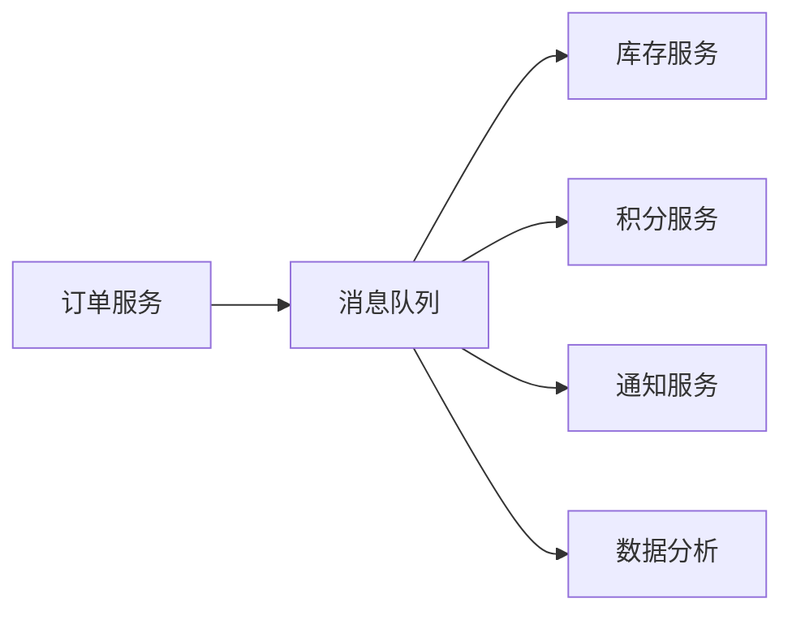
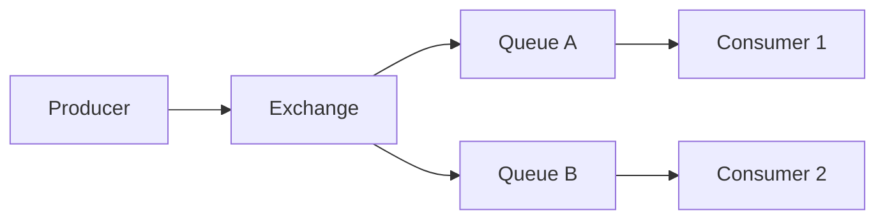
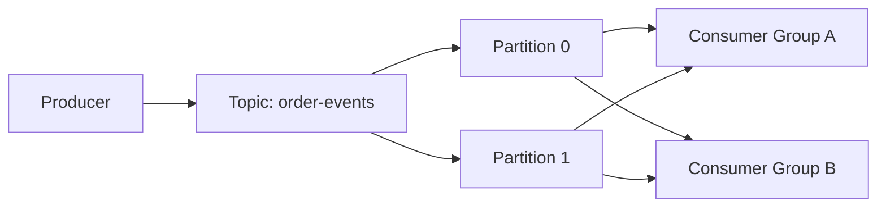

# 消息队列中间件使用教程：RabbitMQ、Kafka、RocketMQ、Redis Streams 和 NATS

消息队列中间件解决的是“系统之间如何可靠、可扩展、可缓冲地传递消息”的问题。没有队列时，服务之间通常是同步调用：订单服务直接调用库存、支付、积分、短信、物流等服务。只要其中一个服务变慢或不可用，订单主流程就会被拖住。

引入消息队列后，主流程可以先把事件写入队列，由下游服务异步消费：



它带来的核心能力有四个：

- 异步解耦：发送方不需要等待所有下游处理完。
- 削峰填谷：高峰流量先进入队列，下游按能力消费。
- 可靠投递：通过确认、重试、死信等机制减少消息丢失。
- 广播扩展：一个业务事件可以被多个系统订阅。

本文不只讲“怎么调用 API”，还会讲清不同中间件背后的模型差异。因为 RabbitMQ、Kafka、RocketMQ、Redis Streams、NATS 都能“发消息”，但它们适合的问题并不完全一样。

## 1. 先从一个同步调用问题开始

假设创建订单时直接调用多个服务：

```js
app.post('/orders', async (req, res) => {
  const order = await orderService.create(req.body)

  await stockService.lock(order.items)
  await pointService.add(order.userId, order.total)
  await notificationService.send(order.userId, 'order_created')

  res.json(order)
})
```

这段代码的问题是：

- 通知服务慢，会拖慢创建订单接口。
- 积分服务临时不可用，订单可能失败。
- 新增一个数据分析服务，需要修改订单服务。
- 高峰期大量订单同时写入，所有下游都被瞬间打满。

改成消息模式：

```js
app.post('/orders', async (req, res) => {
  const order = await orderService.create(req.body)

  await messageBus.publish('order.created', {
    eventId: crypto.randomUUID(),
    orderId: order.id,
    userId: order.userId,
    total: order.total,
    items: order.items,
    occurredAt: new Date().toISOString()
  })

  res.status(201).json(order)
})
```

订单服务只发布“订单已创建”这个事实，下游各自订阅。这个设计的关键是：消息表达业务事实，而不是远程函数调用。

## 2. 消息队列的通用概念

不同产品叫法不同，但核心概念相似：

| 概念 | 含义 |
| --- | --- |
| Producer | 生产者，发送消息的一方 |
| Consumer | 消费者，处理消息的一方 |
| Queue / Topic | 消息存放和订阅的逻辑通道 |
| Exchange | RabbitMQ 中负责路由消息的组件 |
| Partition | Kafka / RocketMQ 中用于并行和顺序的分片 |
| Consumer Group | 消费者组，同组内分摊消息，不同组各自消费 |
| Ack | 消费者确认消息已处理 |
| Retry | 处理失败后重试 |
| DLQ | 死信队列，保存最终失败的消息 |

理解队列时要关注 5 个问题：

1. 消息写入后是否持久化？
2. 消费者处理失败时消息怎么办？
3. 多个消费者是竞争消费还是广播消费？
4. 是否需要按 key 保证局部顺序？
5. 是否需要回放历史消息？

## 3. 常见中间件怎么选

| 中间件 | 更适合的场景 | 核心模型 |
| --- | --- | --- |
| RabbitMQ | 业务异步任务、复杂路由、工作队列、延迟重试 | Exchange + Queue + Ack |
| Kafka | 日志流、事件流、数据管道、可回放消息 | Topic + Partition + Offset |
| RocketMQ | 业务消息、事务消息、延迟消息、顺序消息 | Topic + Queue + Consumer Group |
| Redis Streams | 已经使用 Redis 的轻量消息流、消费组、任务流 | Stream + Consumer Group |
| NATS / JetStream | 云原生服务通信、轻量发布订阅、高性能消息 | Subject + Subscription + Stream |

一个简单判断：

- 要灵活路由、死信、业务任务分发：RabbitMQ。
- 要大吞吐、长期保留、回放、数据流：Kafka。
- 要业务消息能力和延迟/事务等企业场景：RocketMQ。
- 系统里已经有 Redis，消息量不大，想快速引入消费组：Redis Streams。
- 要轻量服务通信、低延迟发布订阅：NATS。

## 4. RabbitMQ：工作队列和路由最直观

RabbitMQ 基于 AMQP 模型。生产者不直接把消息发给队列，而是发给 exchange，exchange 再根据 routing key 和绑定关系把消息路由到队列。



安装依赖：

```bash
pnpm add amqplib
```

生产者：

```js
// rabbitmq/publisher.mjs
import amqp from 'amqplib'

const connection = await amqp.connect('amqp://localhost')
const channel = await connection.createChannel()

const exchange = 'order.events'
const routingKey = 'order.created'

await channel.assertExchange(exchange, 'topic', { durable: true })

const message = {
  eventId: crypto.randomUUID(),
  type: 'order.created',
  orderId: 'o_10001',
  userId: 'u_1',
  occurredAt: new Date().toISOString()
}

channel.publish(
  exchange,
  routingKey,
  Buffer.from(JSON.stringify(message)),
  {
    persistent: true,
    contentType: 'application/json',
    messageId: message.eventId
  }
)

console.log('published', message)

await channel.close()
await connection.close()
```

消费者：

```js
// rabbitmq/consumer.mjs
import amqp from 'amqplib'

const connection = await amqp.connect('amqp://localhost')
const channel = await connection.createChannel()

const exchange = 'order.events'
const queue = 'stock.order-created'
const routingKey = 'order.created'

await channel.assertExchange(exchange, 'topic', { durable: true })
await channel.assertQueue(queue, { durable: true })
await channel.bindQueue(queue, exchange, routingKey)

channel.prefetch(10)

channel.consume(queue, async (msg) => {
  if (!msg) return

  try {
    const event = JSON.parse(msg.content.toString('utf8'))
    console.log('received', event)

    await lockStock(event.orderId)

    channel.ack(msg)
  } catch (error) {
    console.error('consume failed', error)
    channel.nack(msg, false, false)
  }
})

async function lockStock(orderId) {
  console.log('lock stock for', orderId)
}
```

这里有几个关键点：

- `durable: true` 让 exchange 和 queue 元数据持久化。
- `persistent: true` 让消息尽量持久化到磁盘。
- `prefetch(10)` 控制单个消费者最多同时拿 10 条未确认消息。
- 处理成功后 `ack`。
- 处理失败后 `nack`，第三个参数传 `false` 表示不要立即重新入队。

如果失败消息直接重新入队，可能造成同一条坏消息无限重试。更好的方式是配死信队列。

### RabbitMQ 死信队列

```js
await channel.assertExchange('order.dlx', 'topic', { durable: true })
await channel.assertQueue('stock.dead-letter', { durable: true })
await channel.bindQueue('stock.dead-letter', 'order.dlx', 'order.created.failed')

await channel.assertQueue('stock.order-created', {
  durable: true,
  deadLetterExchange: 'order.dlx',
  deadLetterRoutingKey: 'order.created.failed'
})
```

主消费者失败后：

```js
channel.nack(msg, false, false)
```

消息会进入死信队列。后续可以：

- 人工查看死信内容。
- 修复数据后重新投递。
- 写一个补偿任务定时处理。

## 5. Kafka：把消息当作可回放的日志

Kafka 的核心不是“队列”，而是“分区日志”。消息写入 topic 的某个 partition，消费者组记录自己读到了哪个 offset。只要消息还没过保留期，就可以从历史 offset 重新读取。



安装依赖：

```bash
pnpm add kafkajs
```

生产者：

```js
// kafka/producer.mjs
import { Kafka } from 'kafkajs'

const kafka = new Kafka({
  clientId: 'order-service',
  brokers: ['localhost:9092']
})

const producer = kafka.producer()
await producer.connect()

const event = {
  eventId: crypto.randomUUID(),
  type: 'order.created',
  orderId: 'o_10001',
  userId: 'u_1',
  occurredAt: new Date().toISOString()
}

await producer.send({
  topic: 'order-events',
  messages: [
    {
      key: event.orderId,
      value: JSON.stringify(event),
      headers: {
        eventType: 'order.created'
      }
    }
  ]
})

await producer.disconnect()
```

消费者：

```js
// kafka/consumer.mjs
import { Kafka } from 'kafkajs'

const kafka = new Kafka({
  clientId: 'stock-service',
  brokers: ['localhost:9092']
})

const consumer = kafka.consumer({ groupId: 'stock-service' })

await consumer.connect()
await consumer.subscribe({
  topic: 'order-events',
  fromBeginning: false
})

await consumer.run({
  eachMessage: async ({ topic, partition, message }) => {
    const event = JSON.parse(message.value.toString())

    console.log({
      topic,
      partition,
      offset: message.offset,
      event
    })

    await lockStock(event.orderId)
  }
})

async function lockStock(orderId) {
  console.log('lock stock for', orderId)
}
```

Kafka 的 `key` 很重要。同一个 key 的消息会进入同一个分区，从而在该分区内保持顺序。比如所有同一个 `orderId` 的事件都用订单 ID 作为 key，可以保证同一订单内的事件顺序。

### Kafka 的 offset 思维

RabbitMQ 中消息被 ack 后通常就从队列中移除；Kafka 中消息不会因为被消费而删除，消费者只是提交 offset：

```txt
topic: order-events
partition: 0
offset: 100, 101, 102, 103 ...

stock-service group 已消费到 offset 102
analytics-service group 已消费到 offset 60
```

这让 Kafka 很适合：

- 多个系统独立消费同一份事件流。
- 数据分析系统稍后补消费。
- 修复消费者逻辑后从历史 offset 回放。

但也意味着你要认真设计：

- topic 的保留时间。
- partition 数量。
- key 的选择。
- 消费者的幂等处理。

## 6. RocketMQ：业务消息能力丰富

RocketMQ 常用于业务系统的异步消息，特点是对顺序消息、延迟消息、事务消息等场景支持明确。它的模型里也有 topic、message queue、producer、consumer group。

用 Java 发送普通消息的例子：

```java
DefaultMQProducer producer = new DefaultMQProducer("order-producer-group");
producer.setNamesrvAddr("127.0.0.1:9876");
producer.start();

Message message = new Message(
    "order-events",
    "order-created",
    "order-10001",
    "{\"orderId\":\"o_10001\",\"type\":\"order.created\"}".getBytes(StandardCharsets.UTF_8)
);

SendResult result = producer.send(message);
System.out.println(result);

producer.shutdown();
```

消费：

```java
DefaultMQPushConsumer consumer = new DefaultMQPushConsumer("stock-consumer-group");
consumer.setNamesrvAddr("127.0.0.1:9876");
consumer.subscribe("order-events", "order-created");

consumer.registerMessageListener((MessageListenerConcurrently) (messages, context) -> {
    for (MessageExt message : messages) {
        String body = new String(message.getBody(), StandardCharsets.UTF_8);
        System.out.println(body);
    }
    return ConsumeConcurrentlyStatus.CONSUME_SUCCESS;
});

consumer.start();
```

RocketMQ 的事务消息适合这种场景：本地数据库事务和消息发送要保持最终一致。典型流程是：

1. 发送半消息。
2. 执行本地事务。
3. 本地事务成功后提交消息，失败后回滚消息。
4. 如果生产者中途断开，Broker 回查本地事务状态。

这个模型适合“订单创建成功后一定要发出订单事件”这类场景。

## 7. Redis Streams：轻量但不要当万能队列

Redis Streams 是 Redis 内置的日志型数据结构，支持追加消息、按 ID 读取、消费者组、待确认列表。它适合已经有 Redis 的系统快速实现轻量异步流。

安装依赖：

```bash
pnpm add redis
```

生产者：

```js
// redis-streams/producer.mjs
import { createClient } from 'redis'

const client = createClient({ url: 'redis://localhost:6379' })
await client.connect()

const id = await client.xAdd('stream:order-events', '*', {
  eventId: crypto.randomUUID(),
  type: 'order.created',
  orderId: 'o_10001',
  userId: 'u_1',
  occurredAt: new Date().toISOString()
})

console.log('stream id', id)
await client.quit()
```

创建消费者组：

```js
// redis-streams/create-group.mjs
import { createClient } from 'redis'

const client = createClient()
await client.connect()

try {
  await client.xGroupCreate('stream:order-events', 'stock-service', '0', {
    MKSTREAM: true
  })
} catch (error) {
  if (!String(error?.message).includes('BUSYGROUP')) {
    throw error
  }
}

await client.quit()
```

消费者：

```js
// redis-streams/consumer.mjs
import { createClient } from 'redis'

const client = createClient()
await client.connect()

const stream = 'stream:order-events'
const group = 'stock-service'
const consumer = `consumer-${process.pid}`

while (true) {
  const response = await client.xReadGroup(
    group,
    consumer,
    [{ key: stream, id: '>' }],
    {
      COUNT: 10,
      BLOCK: 5000
    }
  )

  if (!response) continue

  for (const streamData of response) {
    for (const message of streamData.messages) {
      try {
        await lockStock(message.message.orderId)
        await client.xAck(stream, group, message.id)
      } catch (error) {
        console.error('failed', message.id, error)
      }
    }
  }
}

async function lockStock(orderId) {
  console.log('lock stock for', orderId)
}
```

Redis Streams 的优势是简单、低门槛、延迟低。但要注意：

- Redis 主要是内存系统，持久化和容量策略要提前规划。
- 大规模历史保留、复杂数据管道更适合 Kafka。
- 消费失败后要处理 pending entries，否则消息会卡在待确认列表。

## 8. NATS：轻量发布订阅和 JetStream 持久化

NATS 的基础模型是 subject。生产者向 subject 发布消息，消费者订阅 subject。

安装：

```bash
pnpm add nats
```

发布订阅：

```js
// nats/pubsub.mjs
import { connect, StringCodec } from 'nats'

const nc = await connect({ servers: 'nats://localhost:4222' })
const sc = StringCodec()

const sub = nc.subscribe('order.created')

const consume = (async () => {
  for await (const msg of sub) {
    const event = JSON.parse(sc.decode(msg.data))
    console.log('received', event)
  }
})()

nc.publish('order.created', sc.encode(JSON.stringify({
  eventId: crypto.randomUUID(),
  orderId: 'o_10001',
  occurredAt: new Date().toISOString()
})))

await consume
```

基础 NATS 偏向实时消息。如果需要持久化、确认、重放，要使用 JetStream。

## 9. 消息结构怎么设计

不要只发一个 ID，也不要把整个数据库行无脑塞进消息。推荐事件结构：

```ts
type DomainEvent<T> = {
  eventId: string
  eventType: string
  aggregateId: string
  version: number
  occurredAt: string
  producer: string
  traceId?: string
  payload: T
}

type OrderCreatedPayload = {
  orderId: string
  userId: string
  totalAmount: number
  currency: 'CNY' | 'USD'
  items: Array<{
    skuId: string
    quantity: number
  }>
}
```

示例消息：

```json
{
  "eventId": "evt_01HX...",
  "eventType": "order.created",
  "aggregateId": "order_o_10001",
  "version": 1,
  "occurredAt": "2026-05-23T10:00:00.000Z",
  "producer": "order-service",
  "traceId": "trace_abc",
  "payload": {
    "orderId": "o_10001",
    "userId": "u_1",
    "totalAmount": 19900,
    "currency": "CNY",
    "items": [
      { "skuId": "sku_1", "quantity": 2 }
    ]
  }
}
```

几个原则：

- `eventId` 用于幂等。
- `eventType` 用于识别消息语义。
- `aggregateId` 用于按业务实体分区或排查。
- `version` 用于消息结构演进。
- `traceId` 用于跨服务链路追踪。
- 金额用整数分表示，避免浮点误差。

## 10. 幂等：消费者必须能重复处理

大多数消息系统更容易做到“至少一次投递”，也就是消息可能重复。消费者必须按业务幂等设计。

数据库幂等表：

```sql
CREATE TABLE processed_messages (
  message_id text PRIMARY KEY,
  consumer_name text NOT NULL,
  processed_at timestamptz NOT NULL DEFAULT now()
);
```

消费者处理：

```js
async function handleOrderCreated(event, db) {
  await db.transaction(async (tx) => {
    const inserted = await tx.query(
      `
      INSERT INTO processed_messages (message_id, consumer_name)
      VALUES ($1, $2)
      ON CONFLICT (message_id) DO NOTHING
      RETURNING message_id
      `,
      [event.eventId, 'stock-service']
    )

    if (inserted.rowCount === 0) {
      return
    }

    await tx.query(
      `
      UPDATE stock
      SET locked_quantity = locked_quantity + $1
      WHERE sku_id = $2
      `,
      [event.payload.quantity, event.payload.skuId]
    )
  })
}
```

要点是：幂等记录和业务更新放在同一个数据库事务里。否则可能出现业务已经更新，但幂等记录没写入，重试时再次更新。

## 11. 重试和死信策略

错误分两类：

| 错误类型 | 例子 | 策略 |
| --- | --- | --- |
| 临时错误 | 网络抖动、数据库短暂不可用、下游限流 | 延迟重试 |
| 永久错误 | 消息格式错误、业务数据不存在、版本不兼容 | 进入死信 |

一个通用重试策略：

```js
const retryDelays = [10_000, 60_000, 300_000]

function shouldRetry(error) {
  return ['ECONNRESET', 'ETIMEDOUT', 'RATE_LIMITED'].includes(error.code)
}

async function handleMessage(event, metadata) {
  try {
    await processEvent(event)
  } catch (error) {
    if (shouldRetry(error) && metadata.retryCount < retryDelays.length) {
      await scheduleRetry(event, retryDelays[metadata.retryCount])
      return
    }

    await sendToDeadLetter(event, {
      reason: error.message,
      retryCount: metadata.retryCount
    })
  }
}
```

不要无限立即重试。它会放大故障，导致同一批坏消息不断占满消费者。

## 12. 事务一致性：Outbox 模式

最容易被忽略的问题是：数据库写成功了，但消息发送失败怎么办？

错误示例：

```js
const order = await db.orders.insert(input)
await mq.publish('order.created', { orderId: order.id })
```

如果数据库成功、发布消息失败，下游永远不知道订单创建了。

Outbox 模式把业务数据和待发送消息放进同一个数据库事务：

```sql
CREATE TABLE outbox_events (
  id uuid PRIMARY KEY,
  event_type text NOT NULL,
  aggregate_id text NOT NULL,
  payload jsonb NOT NULL,
  status text NOT NULL DEFAULT 'pending',
  created_at timestamptz NOT NULL DEFAULT now(),
  published_at timestamptz
);
```

创建订单：

```js
await db.transaction(async (tx) => {
  const order = await tx.orders.insert(input)

  await tx.query(
    `
    INSERT INTO outbox_events (id, event_type, aggregate_id, payload)
    VALUES ($1, $2, $3, $4)
    `,
    [
      crypto.randomUUID(),
      'order.created',
      order.id,
      JSON.stringify({ orderId: order.id, userId: order.userId })
    ]
  )
})
```

后台发布器：

```js
const events = await db.query(`
  SELECT *
  FROM outbox_events
  WHERE status = 'pending'
  ORDER BY created_at
  LIMIT 100
  FOR UPDATE SKIP LOCKED
`)

for (const event of events.rows) {
  await mq.publish(event.event_type, event.payload)

  await db.query(
    `
    UPDATE outbox_events
    SET status = 'published', published_at = now()
    WHERE id = $1
    `,
    [event.id]
  )
}
```

这个模式把“业务写入”和“消息待发送”绑定在同一个本地事务里，再由后台任务可靠发布。

## 13. 顺序消息怎么处理

全局顺序代价很高，通常只需要“同一个业务实体内有序”。例如同一个订单的事件：

```txt
order.created -> order.paid -> order.shipped -> order.completed
```

实现方式：

- Kafka：使用 `orderId` 作为 message key，进入同一 partition。
- RocketMQ：按 `orderId` 选择同一个 message queue。
- RabbitMQ：同一队列单消费者可保证顺序，但并行能力受限。
- Redis Streams：同一个 stream 内按 ID 有序，消费组并行时要小心同一实体被多个消费者处理。

消费者仍然要防乱序，可以在数据库里存版本：

```sql
ALTER TABLE orders ADD COLUMN event_version integer NOT NULL DEFAULT 0;
```

处理时只接受下一版本：

```sql
UPDATE orders
SET status = $1, event_version = $2
WHERE id = $3
  AND event_version = $2 - 1;
```

如果更新行数为 0，说明事件重复、乱序或状态已经被推进，需要单独处理。

## 14. 一个完整的本地演示：订单事件总线

定义统一接口：

```ts
export type MessageBus = {
  publish(topic: string, message: unknown): Promise<void>
  subscribe(topic: string, handler: (message: unknown) => Promise<void>): Promise<void>
}
```

业务层只依赖接口：

```ts
export async function createOrder(input: CreateOrderInput, bus: MessageBus) {
  const order = await orderRepository.create(input)

  await bus.publish('order.created', {
    eventId: crypto.randomUUID(),
    eventType: 'order.created',
    aggregateId: order.id,
    occurredAt: new Date().toISOString(),
    payload: {
      orderId: order.id,
      userId: order.userId,
      totalAmount: order.totalAmount
    }
  })

  return order
}
```

这样以后从 RabbitMQ 切到 Kafka，业务代码不用大改，只需要替换 `MessageBus` 实现。真实系统里不一定要过度抽象，但在业务层保持“发布业务事件”的思想非常重要。

## 15. 监控指标

队列上线后，要监控的不只是服务是否存活：

| 指标 | 含义 |
| --- | --- |
| 生产速率 | 每秒写入多少消息 |
| 消费速率 | 每秒处理多少消息 |
| 堆积量 | 未消费消息数量或 lag |
| 消费耗时 | 单条消息处理耗时 |
| 失败率 | 重试和死信数量 |
| 消费者数量 | 实际工作的消费者实例 |
| broker 资源 | CPU、内存、磁盘、网络 |

如果生产速率长期大于消费速率，堆积会持续增加。解决方向通常是：

- 提升消费者并发。
- 优化单条消息处理时间。
- 增加 Kafka partition 或 RabbitMQ 队列分片。
- 把慢任务拆出去。
- 对无效消息快速失败进死信。

## 16. 使用建议

消息队列不是银弹。它把同步复杂度变成异步复杂度，所以要配套设计：

1. 消息要有稳定 schema、版本和唯一 ID。
2. 消费者要幂等。
3. 失败要有重试上限和死信出口。
4. 业务数据和消息发布要考虑一致性，常用 Outbox。
5. 只追求局部顺序，避免全局顺序。
6. 上线后必须监控 lag、堆积、失败率和死信。

从实践角度，第一次引入可以先选一个明确场景，例如“订单创建后异步发通知”。把生产、消费、ack、重试、死信、幂等、监控这条链路跑通，再推广到更多业务事件。

## 参考资料

- [RabbitMQ JavaScript Tutorial](https://www.rabbitmq.com/tutorials/tutorial-one-javascript)
- [RabbitMQ Consumer Acknowledgements](https://www.rabbitmq.com/docs/confirms)
- [Apache Kafka Documentation](https://kafka.apache.org/documentation/)
- [Apache RocketMQ Documentation](https://rocketmq.apache.org/docs/)
- [Redis Streams Introduction](https://redis.io/docs/latest/develop/data-types/streams/)
- [NATS Documentation](https://docs.nats.io/)
