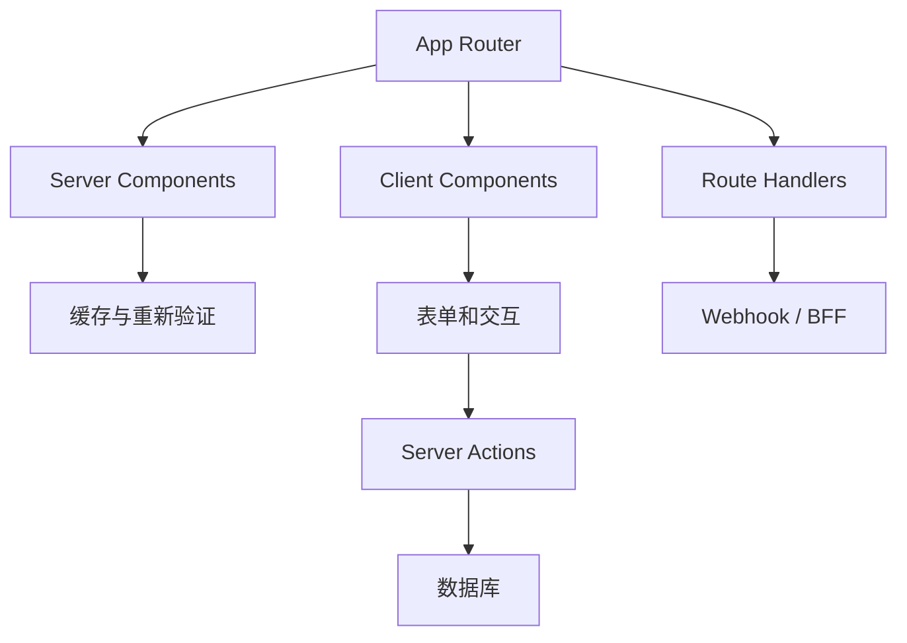
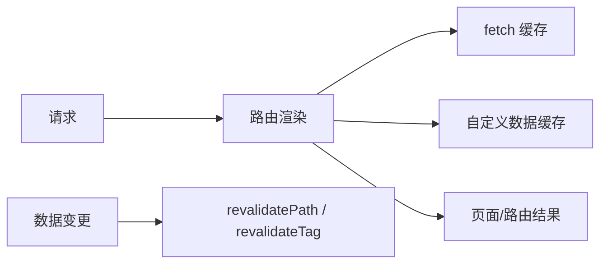
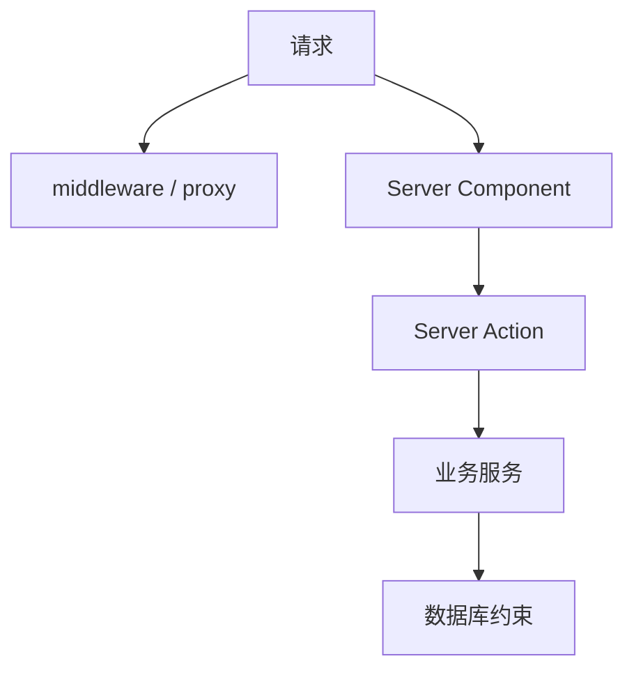

# Next.js 进阶教程：App Router、缓存、Server Actions 与生产实践

前一篇 Next.js 教程已经讲了 App Router 的基础用法。本文更进一步，把重点放到真实项目里最容易混乱的几个点：服务端和客户端边界、缓存和重新验证、Server Actions、Route Handlers、认证、安全和生产部署。

一句话理解：

> Next.js 进阶的关键不是多记几个 API，而是明确每段代码运行在哪里、数据什么时候缓存、变更后如何失效。

本文用一个“知识库系统”来讲：用户可以浏览公开文章，登录后编辑文章，上传封面，保存草稿并发布。



## 1. 先分清运行位置

Next.js App Router 里最重要的问题是：这段代码运行在哪里？

| 代码 | 运行位置 |
| --- | --- |
| 默认 `page.tsx` / 组件 | 服务端 |
| 加了 `"use client"` 的组件 | 浏览器 |
| Server Action | 服务端 |
| Route Handler | 服务端 |
| `middleware` / `proxy` | 边缘或服务端入口 |
| `next.config.ts` | 构建和运行配置 |

默认服务端组件：

```tsx
export default async function ArticlePage() {
  const articles = await getPublishedArticles()

  return (
    <main>
      {articles.map((article) => (
        <ArticleCard key={article.id} article={article} />
      ))}
    </main>
  )
}
```

客户端组件：

```tsx
'use client'

import { useState } from 'react'

export function LikeButton() {
  const [liked, setLiked] = useState(false)

  return (
    <button onClick={() => setLiked((value) => !value)}>
      {liked ? '已点赞' : '点赞'}
    </button>
  )
}
```

原则：能在服务端完成的读取和拼装，优先放服务端；只有交互状态和浏览器 API 放客户端。

## 2. App Router 组织方式

一个知识库项目：

```txt
src/app
  layout.tsx
  page.tsx
  articles
    page.tsx
    [slug]
      page.tsx
  dashboard
    layout.tsx
    articles
      page.tsx
      [id]
        edit
          page.tsx
  api
    upload-callback
      route.ts
```

几个结构技巧：

- 公共布局放 `layout.tsx`。
- 后台页面可以放在 `dashboard` 路由段。
- 不想影响 URL 的分组可以用 `(group)`。
- API 和 Webhook 放 `route.ts`。
- 加载状态放 `loading.tsx`。
- 局部错误边界放 `error.tsx`。

路由组示例：

```txt
src/app
  (marketing)
    page.tsx
  (app)
    dashboard
      page.tsx
```

`(marketing)` 和 `(app)` 不会出现在 URL 中，只用于组织代码。

## 3. 服务端组件的数据读取

服务端组件里可以直接读取数据库：

```tsx
import { db } from '@/lib/db'

export default async function ArticlesPage() {
  const articles = await db.article.findMany({
    where: {
      status: 'published'
    },
    orderBy: {
      publishedAt: 'desc'
    }
  })

  return <ArticleList articles={articles} />
}
```

也可以调用 HTTP 服务：

```tsx
async function getArticles() {
  const res = await fetch('https://api.example.com/articles')

  if (!res.ok) {
    throw new Error('Failed to fetch articles')
  }

  return res.json()
}
```

数据库读取适合自有后端逻辑，HTTP 适合调用外部服务或已经存在的 API。

## 4. 缓存模型

Next.js 的缓存要分层理解：



几种常见写法：

```tsx
await fetch('https://api.example.com/posts', {
  cache: 'no-store'
})
```

表示不缓存。

```tsx
await fetch('https://api.example.com/posts', {
  next: {
    revalidate: 60
  }
})
```

表示最多缓存 60 秒。

```tsx
await fetch('https://api.example.com/posts', {
  next: {
    tags: ['posts']
  }
})
```

表示给这次数据读取打上 `posts` 标签，后续可以按标签重新验证。

## 5. 什么时候缓存，什么时候不缓存

| 场景 | 策略 |
| --- | --- |
| 公开文章列表 | 缓存 + 发布后重新验证 |
| 文章详情 | 缓存 + 按文章 tag 重新验证 |
| 后台草稿列表 | 不缓存或私有缓存 |
| 当前登录用户信息 | 不做公共缓存 |
| 实时库存和余额 | 不缓存或短缓存 |
| 配置字典 | 长缓存 + 手动失效 |

缓存的判断标准：

- 数据能不能被其他用户看到？
- 旧数据能接受多久？
- 数据变更后是否有明确失效动作？
- 这个接口访问量是否值得缓存？

后台和用户私有页面要特别谨慎，不能把一个用户的数据缓存给另一个用户。

## 6. 重新验证

发布文章后，列表和详情页都要更新。

```ts
'use server'

import { revalidatePath, revalidateTag } from 'next/cache'

export async function publishArticle(id: string) {
  await db.article.update({
    where: { id },
    data: {
      status: 'published',
      publishedAt: new Date()
    }
  })

  revalidatePath('/articles')
  revalidateTag(`article:${id}`)
}
```

读取时打 tag：

```ts
async function getArticle(id: string) {
  const res = await fetch(`https://api.example.com/articles/${id}`, {
    next: {
      tags: [`article:${id}`]
    }
  })

  return res.json()
}
```

路径失效适合页面级更新，tag 失效适合数据级更新。

## 7. Server Actions

Server Actions 适合处理贴近页面的表单变更：

```ts
'use server'

import { redirect } from 'next/navigation'
import { revalidatePath } from 'next/cache'

export async function saveDraft(formData: FormData) {
  const id = String(formData.get('id') || '')
  const title = String(formData.get('title') || '')
  const content = String(formData.get('content') || '')

  if (!title.trim()) {
    throw new Error('标题不能为空')
  }

  await db.article.update({
    where: { id },
    data: { title, content }
  })

  revalidatePath(`/dashboard/articles/${id}/edit`)
}
```

表单：

```tsx
import { saveDraft } from './actions'

export default function EditArticlePage({ article }: { article: Article }) {
  return (
    <form action={saveDraft}>
      <input type="hidden" name="id" value={article.id} />
      <input name="title" defaultValue={article.title} />
      <textarea name="content" defaultValue={article.content} />
      <button type="submit">保存草稿</button>
    </form>
  )
}
```

Server Action 不是“自动安全”。服务端仍要校验：

- 当前用户是否登录。
- 是否拥有这篇文章权限。
- 表单字段是否合法。
- 数据变更后哪些缓存要失效。

## 8. 客户端提交状态

表单提交时需要 pending 状态：

```tsx
'use client'

import { useFormStatus } from 'react-dom'

export function SubmitButton() {
  const { pending } = useFormStatus()

  return (
    <button disabled={pending}>
      {pending ? '保存中...' : '保存'}
    </button>
  )
}
```

在表单中使用：

```tsx
<form action={saveDraft}>
  <input name="title" />
  <SubmitButton />
</form>
```

只把按钮做成客户端组件即可，不需要把整个页面改成客户端组件。

## 9. Route Handlers

Route Handlers 适合处理 HTTP 接口：

- Webhook。
- 上传回调。
- BFF 聚合接口。
- 给第三方系统调用的接口。
- 浏览器不方便直接调用的服务端能力。

示例：

```ts
// src/app/api/upload-callback/route.ts
import { NextResponse } from 'next/server'

export async function POST(request: Request) {
  const payload = await request.json()

  await db.file.update({
    where: {
      key: payload.key
    },
    data: {
      status: 'uploaded'
    }
  })

  return NextResponse.json({ ok: true })
}
```

Route Handler 要注意：

- 校验签名或 token。
- 限制请求体大小。
- 做幂等处理。
- 记录审计日志。
- 不要把业务后端全部塞到 Next.js。

## 10. 认证和权限

常见认证边界：



页面访问：

```ts
export async function requireUser() {
  const session = await getSession()

  if (!session?.user) {
    redirect('/login')
  }

  return session.user
}
```

业务权限：

```ts
export async function assertCanEditArticle(userId: string, articleId: string) {
  const article = await db.article.findFirst({
    where: {
      id: articleId,
      authorId: userId
    }
  })

  if (!article) {
    throw new Error('无权编辑文章')
  }
}
```

不要只隐藏按钮。按钮隐藏是体验，服务端校验才是权限。

## 11. 文件上传

Next.js 项目里上传文件常见两种：

| 方式 | 适合场景 |
| --- | --- |
| Route Handler 接收文件 | 小文件、需要服务端处理 |
| 预签名 URL 直传对象存储 | 大文件、图片、附件 |

推荐流程：

```txt
浏览器 -> Server Action 创建上传凭证 -> 对象存储
浏览器 -> Server Action 保存文件记录
```

服务端只生成权限，不转发大文件，这样应用服务器压力更小。

## 12. Metadata 和 Open Graph

文章详情页需要动态 metadata：

```tsx
import type { Metadata } from 'next'

export async function generateMetadata({
  params
}: {
  params: Promise<{ slug: string }>
}): Promise<Metadata> {
  const { slug } = await params
  const article = await getArticleBySlug(slug)

  return {
    title: article?.title ?? '文章不存在',
    description: article?.summary,
    openGraph: {
      title: article?.title,
      description: article?.summary,
      images: article?.coverUrl ? [article.coverUrl] : []
    }
  }
}
```

SEO 要关注：

- 标题和描述。
- 服务端是否能渲染关键内容。
- canonical URL。
- Open Graph 图片。
- sitemap 和 robots。

## 13. 错误处理

局部错误边界：

```tsx
'use client'

export default function Error({
  error,
  reset
}: {
  error: Error
  reset: () => void
}) {
  return (
    <section>
      <h2>页面加载失败</h2>
      <p>{error.message}</p>
      <button onClick={reset}>重试</button>
    </section>
  )
}
```

404：

```tsx
import { notFound } from 'next/navigation'

export default async function ArticlePage({
  params
}: {
  params: Promise<{ slug: string }>
}) {
  const { slug } = await params
  const article = await getArticleBySlug(slug)

  if (!article) {
    notFound()
  }

  return <ArticleDetail article={article} />
}
```

错误处理不是最后补一个页面，而是让用户在网络失败、权限失败、数据不存在时都有明确反馈。

## 14. 生产部署检查

部署前检查：

- 环境变量是否完整。
- 数据库连接池是否适合部署平台。
- 缓存失效路径是否覆盖数据变更。
- Server Actions 是否校验权限。
- Route Handlers 是否校验签名。
- 图片域名是否配置。
- 日志和错误监控是否接入。
- 构建产物是否过大。

构建命令：

```bash
pnpm build
pnpm start
```

如果自托管，要关注 Node.js 版本、进程管理、反向代理、静态资源缓存和健康检查。

## 15. 常见坑

### 15.1 把整个页面变成客户端组件

只因为一个按钮需要 `useState`，就把整页加 `"use client"`，会让更多代码进入浏览器包。

### 15.2 缓存失效不完整

更新文章后只失效详情页，忘了列表页，用户就会看到列表旧数据。

### 15.3 在 Server Action 里信任隐藏字段

隐藏字段也来自浏览器，不能信任。文章 ID 可以传，但权限必须服务端查。

### 15.4 Route Handler 没有幂等

Webhook 和上传回调可能重复投递。处理逻辑要允许重复调用。

## 16. 面试表达

可以这样讲 Next.js 进阶：

> Next.js App Router 默认使用 Server Components，把数据读取和页面拼装放在服务端，需要交互的局部组件才加 `"use client"`。数据读取要根据业务选择缓存、短缓存或不缓存，数据变更后通过 `revalidatePath` 或 `revalidateTag` 失效。Server Actions 适合页面表单变更，Route Handlers 适合 HTTP 接口和 Webhook。生产项目要重点关注权限校验、缓存边界、错误处理、环境变量和部署运行时。

## 17. 总结

Next.js 进阶的主线：

- 先判断代码运行在服务端还是浏览器。
- 再设计路由、布局和组件边界。
- 然后明确缓存和重新验证策略。
- 用 Server Actions 处理表单变更。
- 用 Route Handlers 处理 HTTP 接口。
- 最后补齐认证、安全、错误和部署。

掌握这些边界后，Next.js 才能从“能跑”变成“能维护、能上线”。
