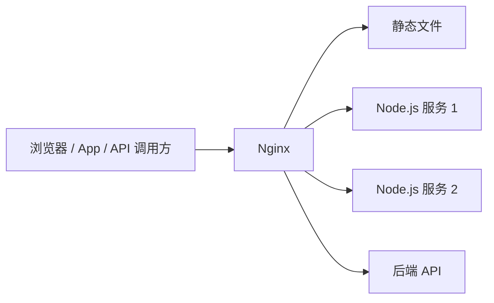

# Nginx 使用教程：从静态服务到反向代理、负载均衡和 HTTPS

Nginx 最早被设计出来，是为了解决高并发 Web 服务中的连接处理问题。传统的“一连接一进程/线程”模型在大量慢连接、长连接、静态资源请求面前成本很高；Nginx 使用事件驱动模型，让少量 worker 进程就能处理大量连接。今天的 Nginx 不只是 Web 服务器，还常被放在应用前面，承担静态资源服务、反向代理、负载均衡、TLS 终止、压缩、缓存、限流、日志入口等职责。

可以把 Nginx 理解成“站在用户和应用之间的流量层”：



本文按一个真实项目的部署过程来讲：先让 Nginx 跑起来，再服务静态文件，然后把 API 转发给 Node.js，最后补齐负载均衡、HTTPS、缓存、压缩、限流和排查。

## 1. Nginx 解决了什么问题

没有 Nginx 时，一个常见部署是让应用进程直接监听公网端口：

```txt
浏览器 -> Node.js:3000
```

这种方式可以跑，但上线后会遇到几个问题：

- 应用进程要直接处理 TLS、静态文件、压缩、缓存、日志等横切能力。
- 多个应用实例之间缺少统一入口和负载均衡。
- 想做灰度、路径转发、静态资源长期缓存时，需要改业务代码。
- 应用崩溃、重启、扩容时，入口层不稳定。

引入 Nginx 后，应用可以专注处理业务，Nginx 负责边界流量：

```txt
浏览器 -> Nginx:80/443 -> Node.js:3000
```

Nginx 的价值不是“替代应用”，而是把通用网络能力沉到入口层。

## 2. 基础安装和进程管理

在 Linux 上通常用包管理器安装：

```bash
# Ubuntu / Debian
sudo apt update
sudo apt install nginx

# CentOS / Rocky Linux
sudo dnf install nginx
```

常用命令：

```bash
# 检查配置语法
sudo nginx -t

# 启动
sudo systemctl start nginx

# 设置开机启动
sudo systemctl enable nginx

# 平滑重载配置，不中断已有请求
sudo nginx -s reload

# 查看状态
sudo systemctl status nginx
```

Nginx 官方文档里讲到它通常由一个 master 进程和多个 worker 进程组成。master 负责读取配置、管理 worker；worker 才是真正处理请求的进程。修改配置后不要直接杀进程，应该先 `nginx -t`，再 `nginx -s reload`。

## 3. 配置文件结构

默认主配置通常在 `/etc/nginx/nginx.conf`，站点配置常放在 `/etc/nginx/conf.d/*.conf` 或 `/etc/nginx/sites-enabled/*`。

一个简化配置如下：

```nginx
user nginx;
worker_processes auto;

events {
    worker_connections 1024;
}

http {
    include       mime.types;
    default_type  application/octet-stream;

    access_log /var/log/nginx/access.log;
    error_log  /var/log/nginx/error.log warn;

    server {
        listen 80;
        server_name example.com;

        location / {
            root /var/www/example;
            index index.html;
        }
    }
}
```

几个核心概念：

| 概念 | 作用 |
| --- | --- |
| `main` | 全局配置，例如 worker 数、用户 |
| `events` | 连接处理模型，例如每个 worker 的连接数 |
| `http` | HTTP 相关的全局配置 |
| `server` | 一个虚拟主机，可以按端口和域名区分 |
| `location` | 按 URI 路径或正则匹配请求 |
| directive | 具体指令，例如 `listen`、`root`、`proxy_pass` |

你写 Nginx 配置时，本质就是在回答三个问题：

1. 这个请求进入哪个 `server`？
2. 这个 URI 命中哪个 `location`？
3. 命中后是读本地文件，还是转发给上游服务？

## 4. 静态资源服务

先部署一个最小静态站点：

```bash
sudo mkdir -p /var/www/blog
echo '<h1>Hello Nginx</h1>' | sudo tee /var/www/blog/index.html
```

配置：

```nginx
server {
    listen 80;
    server_name blog.example.com;

    root /var/www/blog;
    index index.html;

    location / {
        try_files $uri $uri/ =404;
    }
}
```

`root` 表示把请求 URI 拼到某个目录后面。比如：

```txt
GET /assets/app.js
root /var/www/blog
最终文件：/var/www/blog/assets/app.js
```

`try_files` 很重要，它会按顺序检查文件是否存在：

```nginx
try_files $uri $uri/ =404;
```

含义是：

1. 先找完全匹配的文件。
2. 再找同名目录。
3. 都没有就返回 404。

如果部署的是 Vue、React、VitePress 这类前端单页应用，通常希望所有前端路由都回退到 `index.html`：

```nginx
location / {
    try_files $uri $uri/ /index.html;
}
```

这样访问 `/posts/nginx-practical-guide` 时，如果服务器上没有这个真实文件，就交给前端路由处理。

## 5. `root` 和 `alias` 的区别

`root` 是把完整 URI 追加到目录后面，`alias` 是把匹配到的 location 前缀替换为指定目录。

```nginx
location /images/ {
    root /data;
}
```

请求 `/images/a.png` 会找：

```txt
/data/images/a.png
```

而：

```nginx
location /images/ {
    alias /data/uploaded-images/;
}
```

请求 `/images/a.png` 会找：

```txt
/data/uploaded-images/a.png
```

经验规则：

- 站点根目录用 `root`。
- 某个 URL 前缀映射到完全不同的目录时用 `alias`。
- `alias` 的路径结尾斜杠要和 `location` 前缀配合好，否则容易拼错路径。

## 6. 反向代理 Node.js 服务

假设有一个 Node.js API：

```js
import express from 'express'

const app = express()

app.get('/api/health', (req, res) => {
  res.json({ ok: true, service: 'todo-api' })
})

app.listen(3000, () => {
  console.log('API listening on http://127.0.0.1:3000')
})
```

Nginx 配置：

```nginx
server {
    listen 80;
    server_name api.example.com;

    location / {
        proxy_pass http://127.0.0.1:3000;
        proxy_set_header Host $host;
        proxy_set_header X-Real-IP $remote_addr;
        proxy_set_header X-Forwarded-For $proxy_add_x_forwarded_for;
        proxy_set_header X-Forwarded-Proto $scheme;
    }
}
```

`proxy_pass` 表示把请求转发给上游服务。后面几行 header 很关键：

| Header | 作用 |
| --- | --- |
| `Host` | 保留原始域名，方便应用判断租户或生成链接 |
| `X-Real-IP` | 记录直接访问 Nginx 的客户端 IP |
| `X-Forwarded-For` | 追加代理链路中的客户端 IP |
| `X-Forwarded-Proto` | 告诉后端原始请求是 `http` 还是 `https` |

后端如果需要拿真实 IP，Express 里通常要开启 trust proxy：

```js
app.set('trust proxy', true)

app.get('/api/me', (req, res) => {
  res.json({
    ip: req.ip,
    protocol: req.protocol
  })
})
```

## 7. `proxy_pass` 末尾斜杠的坑

下面两种配置行为不同。

配置 A：

```nginx
location /api/ {
    proxy_pass http://127.0.0.1:3000/;
}
```

请求：

```txt
/api/users -> http://127.0.0.1:3000/users
```

配置 B：

```nginx
location /api/ {
    proxy_pass http://127.0.0.1:3000;
}
```

请求：

```txt
/api/users -> http://127.0.0.1:3000/api/users
```

原因是 `proxy_pass` 后面带 URI 部分时，Nginx 会用它替换匹配到的 location 前缀。实际项目里推荐统一约定：

- 后端路由本身带 `/api`：`proxy_pass http://127.0.0.1:3000;`
- 后端路由不带 `/api`：`proxy_pass http://127.0.0.1:3000/;`

## 8. 同站点部署前端和 API

这是最常见的部署方式：

```nginx
server {
    listen 80;
    server_name example.com;

    root /var/www/example-web;
    index index.html;

    location /api/ {
        proxy_pass http://127.0.0.1:3000;
        proxy_http_version 1.1;
        proxy_set_header Host $host;
        proxy_set_header X-Real-IP $remote_addr;
        proxy_set_header X-Forwarded-For $proxy_add_x_forwarded_for;
        proxy_set_header X-Forwarded-Proto $scheme;
    }

    location / {
        try_files $uri $uri/ /index.html;
    }
}
```

请求流向：

```txt
/assets/app.js       -> Nginx 读静态文件
/posts/nginx-guide   -> 回退到 index.html
/api/todos           -> 转发到 Node.js
```

这样可以避免浏览器跨域，因为前端页面和 API 都在同一个域名下。

## 9. 负载均衡

当一个后端实例不够时，可以用 `upstream`：

```nginx
upstream todo_api {
    server 127.0.0.1:3000;
    server 127.0.0.1:3001;
    server 127.0.0.1:3002;
}

server {
    listen 80;
    server_name api.example.com;

    location / {
        proxy_pass http://todo_api;
        proxy_set_header Host $host;
        proxy_set_header X-Real-IP $remote_addr;
        proxy_set_header X-Forwarded-For $proxy_add_x_forwarded_for;
    }
}
```

默认策略是轮询。常见策略：

```nginx
upstream todo_api {
    least_conn;

    server 127.0.0.1:3000 max_fails=3 fail_timeout=30s;
    server 127.0.0.1:3001 max_fails=3 fail_timeout=30s;
}
```

`least_conn` 会优先把请求给当前连接数较少的实例。`max_fails` 和 `fail_timeout` 用于基础的失败摘除。

如果后端需要会话粘性，优先考虑把会话放到 Redis、数据库或 JWT 中，而不是依赖固定转发到某台机器。入口层越无状态，扩容越简单。

## 10. WebSocket 代理

WebSocket 要升级 HTTP 连接，需要额外设置：

```nginx
map $http_upgrade $connection_upgrade {
    default upgrade;
    ''      close;
}

server {
    listen 80;
    server_name ws.example.com;

    location /socket.io/ {
        proxy_pass http://127.0.0.1:3000;
        proxy_http_version 1.1;
        proxy_set_header Upgrade $http_upgrade;
        proxy_set_header Connection $connection_upgrade;
        proxy_set_header Host $host;
    }
}
```

如果你发现 WebSocket 本地正常、上线后立刻断开，优先检查 `Upgrade` 和 `Connection` 这两个 header。

## 11. gzip 压缩

压缩可以减少文本资源体积，适合 HTML、CSS、JS、JSON、SVG：

```nginx
gzip on;
gzip_comp_level 5;
gzip_min_length 1024;
gzip_vary on;
gzip_types
    text/plain
    text/css
    text/javascript
    application/javascript
    application/json
    application/xml
    image/svg+xml;
```

不要压缩图片、视频这类已经压缩过的资源，收益小且浪费 CPU。

## 12. 静态资源缓存

构建产物通常会带 hash，例如：

```txt
app.8f3a12.js
style.4a9b10.css
```

这类文件内容一变，文件名也变，可以设置长期缓存：

```nginx
location ~* \.(js|css|png|jpg|jpeg|gif|svg|webp|woff2?)$ {
    root /var/www/example-web;
    expires 30d;
    add_header Cache-Control "public, immutable";
    try_files $uri =404;
}

location = /index.html {
    root /var/www/example-web;
    add_header Cache-Control "no-cache";
}
```

原则是：

- 带 hash 的静态资源长期缓存。
- `index.html` 不长期缓存，因为它负责引用最新资源。
- API 响应是否缓存要由业务语义决定。

## 13. 代理缓存

对某些公开、读多写少的接口，可以用 Nginx 缓存上游响应：

```nginx
proxy_cache_path /var/cache/nginx/api
    levels=1:2
    keys_zone=api_cache:10m
    max_size=1g
    inactive=60m
    use_temp_path=off;

server {
    listen 80;
    server_name api.example.com;

    location /public/ {
        proxy_pass http://127.0.0.1:3000;
        proxy_cache api_cache;
        proxy_cache_valid 200 10m;
        proxy_cache_key "$scheme$request_method$host$request_uri";
        add_header X-Cache-Status $upstream_cache_status;
    }
}
```

要谨慎缓存带用户身份的接口。只要响应和用户有关，就必须把用户维度放进缓存 key，或者直接不缓存。

## 14. HTTPS 和 HTTP 跳转

证书可以用 Let's Encrypt 申请。Nginx 侧通常拆成两个 server：

```nginx
server {
    listen 80;
    server_name example.com;
    return 301 https://$host$request_uri;
}

server {
    listen 443 ssl http2;
    server_name example.com;

    ssl_certificate     /etc/letsencrypt/live/example.com/fullchain.pem;
    ssl_certificate_key /etc/letsencrypt/live/example.com/privkey.pem;

    root /var/www/example-web;
    index index.html;

    location /api/ {
        proxy_pass http://127.0.0.1:3000;
        proxy_set_header Host $host;
        proxy_set_header X-Forwarded-Proto https;
        proxy_set_header X-Forwarded-For $proxy_add_x_forwarded_for;
    }

    location / {
        try_files $uri $uri/ /index.html;
    }
}
```

如果后端会生成回调地址、重定向地址，要确保后端能拿到 `X-Forwarded-Proto: https`。

## 15. 限制上传大小和超时

文件上传接口经常遇到 `413 Request Entity Too Large`：

```nginx
server {
    client_max_body_size 20m;

    location /api/upload {
        proxy_pass http://127.0.0.1:3000;
        proxy_read_timeout 120s;
        proxy_send_timeout 120s;
    }
}
```

超时配置要按业务设置：

- 普通 API 不要无限等待，通常几秒到几十秒。
- 文件上传、导入任务可以更长。
- 真正耗时的任务最好改成异步任务：提交后返回任务 ID，后台处理，前端轮询或订阅结果。

## 16. 简单限流

入口层限流可以保护后端：

```nginx
http {
    limit_req_zone $binary_remote_addr zone=api_limit:10m rate=10r/s;

    server {
        listen 80;
        server_name api.example.com;

        location /api/ {
            limit_req zone=api_limit burst=20 nodelay;
            proxy_pass http://127.0.0.1:3000;
        }
    }
}
```

这里按客户端 IP 限制平均每秒 10 个请求，允许短时突发 20 个。真实业务中，如果有登录用户或 API key，更推荐在应用层按用户、租户、接口维度做精确限流。

## 17. 日志：排查问题的入口

自定义日志格式：

```nginx
log_format main_ext
    '$remote_addr - $remote_user [$time_local] "$request" '
    '$status $body_bytes_sent "$http_referer" "$http_user_agent" '
    'rt=$request_time uct=$upstream_connect_time '
    'uht=$upstream_header_time urt=$upstream_response_time '
    'upstream=$upstream_addr';

access_log /var/log/nginx/access.log main_ext;
```

几个字段很有用：

| 字段 | 含义 |
| --- | --- |
| `$status` | HTTP 状态码 |
| `$request_time` | Nginx 从收到请求到返回响应的总耗时 |
| `$upstream_response_time` | 上游服务响应耗时 |
| `$upstream_addr` | 实际转发到哪个后端 |

如果 `$request_time` 很大，但 `$upstream_response_time` 不大，可能是客户端网络慢或响应体很大。如果 `$upstream_response_time` 很大，重点看后端服务。

## 18. 常见问题排查

### 502 Bad Gateway

通常表示 Nginx 连不上上游，或上游提前断开：

```bash
sudo tail -f /var/log/nginx/error.log
curl -v http://127.0.0.1:3000/api/health
```

检查点：

- 后端进程是否启动。
- `proxy_pass` 的地址和端口是否正确。
- 防火墙或容器网络是否阻断。
- 后端是否崩溃或主动关闭连接。

### 404 Not Found

先判断是 Nginx 返回的 404，还是后端返回的 404：

- 静态资源 404：看 `root`、`alias`、`try_files`。
- API 404：看 `location` 和 `proxy_pass` 斜杠规则。
- 单页应用刷新 404：看是否配置了 `/index.html` 回退。

### 配置不生效

按这个顺序查：

```bash
sudo nginx -t
sudo nginx -T | less
sudo nginx -s reload
```

`nginx -T` 会打印最终加载的完整配置，适合检查 include 后的实际结果。

## 19. 一份可上线的完整示例

下面是一个前端静态资源 + API + WebSocket + gzip + 缓存 + HTTPS 的组合配置：

```nginx
gzip on;
gzip_comp_level 5;
gzip_min_length 1024;
gzip_vary on;
gzip_types text/plain text/css application/javascript application/json image/svg+xml;

map $http_upgrade $connection_upgrade {
    default upgrade;
    ''      close;
}

upstream app_api {
    least_conn;
    server 127.0.0.1:3000 max_fails=3 fail_timeout=30s;
    server 127.0.0.1:3001 max_fails=3 fail_timeout=30s;
}

server {
    listen 80;
    server_name example.com;
    return 301 https://$host$request_uri;
}

server {
    listen 443 ssl http2;
    server_name example.com;

    ssl_certificate     /etc/letsencrypt/live/example.com/fullchain.pem;
    ssl_certificate_key /etc/letsencrypt/live/example.com/privkey.pem;

    root /var/www/example-web;
    index index.html;
    client_max_body_size 20m;

    location ~* \.(js|css|png|jpg|jpeg|gif|svg|webp|woff2?)$ {
        expires 30d;
        add_header Cache-Control "public, immutable";
        try_files $uri =404;
    }

    location /api/ {
        proxy_pass http://app_api;
        proxy_http_version 1.1;
        proxy_set_header Host $host;
        proxy_set_header X-Real-IP $remote_addr;
        proxy_set_header X-Forwarded-For $proxy_add_x_forwarded_for;
        proxy_set_header X-Forwarded-Proto https;
    }

    location /socket.io/ {
        proxy_pass http://app_api;
        proxy_http_version 1.1;
        proxy_set_header Upgrade $http_upgrade;
        proxy_set_header Connection $connection_upgrade;
        proxy_set_header Host $host;
    }

    location / {
        try_files $uri $uri/ /index.html;
    }
}
```

## 20. 学习和使用路线

掌握 Nginx 不需要一开始背所有指令，按使用场景推进更有效：

1. 会启动、检查配置、重载配置。
2. 会写 `server`、`location`、`root`、`try_files`。
3. 会用 `proxy_pass` 转发 API，并正确传递代理 header。
4. 理解 `proxy_pass` 斜杠、`root`/`alias`、单页应用回退。
5. 会配置 gzip、静态缓存、HTTPS、WebSocket。
6. 能通过 access log 和 error log 定位 404、502、超时和性能问题。

Nginx 的核心不是“配置很多”，而是“把请求按规则送到正确的地方，并在入口层处理通用能力”。只要抓住请求匹配和转发链路，绝大多数配置都能推导出来。

## 参考资料

- [Nginx Beginner's Guide](https://nginx.org/en/docs/beginners_guide.html)
- [Nginx ngx_http_proxy_module](https://nginx.org/en/docs/http/ngx_http_proxy_module.html)
- [Using Nginx as HTTP load balancer](https://nginx.org/en/docs/http/load_balancing.html)
- [Nginx Compression and Decompression](https://docs.nginx.com/nginx/admin-guide/web-server/compression/)
