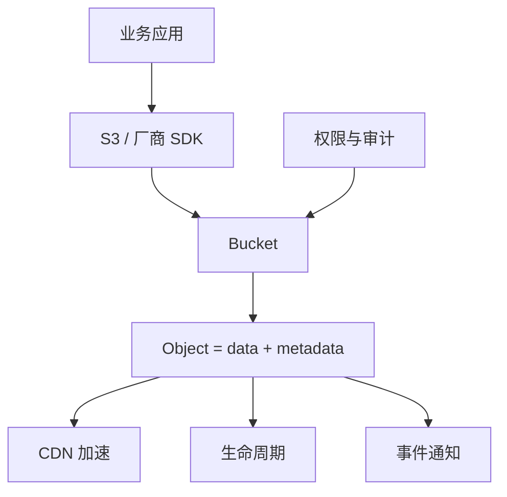
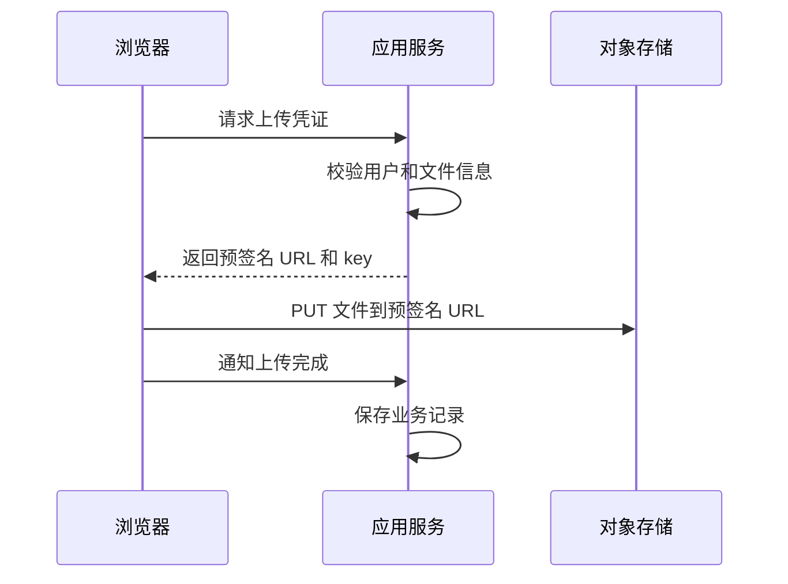
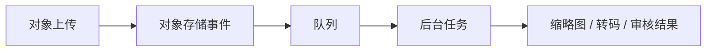

# 对象存储使用教程：从 S3、MinIO 到 R2、OSS、COS 和 Ceph RGW

对象存储是专门存放海量非结构化文件的存储系统。图片、视频、文档、备份、日志归档、模型文件、静态站点资源，都很适合放到对象存储里。

一句话理解：

> 对象存储不是把文件放进传统目录树，而是把对象放进 Bucket，通过唯一 Key、元数据、权限和 HTTP API 管理。

本文会讲清对象存储的底层模型、常见云厂商和开源方案、S3 API、上传下载、权限、安全、生命周期、CDN 和业务设计。



## 1. 对象存储解决什么问题

传统文件系统更像一棵目录树，适合本机或小规模共享文件。业务系统里的文件一多，会遇到：

- 图片、视频数量巨大，服务器磁盘不够。
- 多台应用服务器之间文件不同步。
- 文件下载占用应用带宽。
- 备份、归档、生命周期管理复杂。
- 权限、审计、防盗链、CDN 都要自己做。

对象存储把文件服务从应用服务器里拆出来：

```txt
浏览器 -> 应用服务 -> 对象存储
浏览器 -> 对象存储 / CDN
```

应用负责生成权限、记录业务数据；对象存储负责保存文件和提供高可用访问。

## 2. 基本概念

| 概念 | 说明 |
| --- | --- |
| Bucket | 对象容器，类似顶层命名空间 |
| Object | 文件内容 + 元数据 |
| Key | 对象唯一路径，例如 `avatars/u1.png` |
| Metadata | 内容类型、大小、自定义信息 |
| Region | 存储区域 |
| Storage Class | 存储类型，如标准、低频、归档 |
| Presigned URL | 带签名和过期时间的临时访问 URL |
| Multipart Upload | 大文件分片上传 |

对象存储通常是扁平结构。`images/2026/a.png` 里的斜杠更多是 Key 的命名约定，不是真正的目录。

## 3. 热门技术和方案

| 方案 | 类型 | 适合场景 |
| --- | --- | --- |
| Amazon S3 | 公有云对象存储 | 全球生态、标准事实、企业级能力 |
| 阿里云 OSS | 公有云对象存储 | 国内业务、阿里云生态 |
| 腾讯云 COS | 公有云对象存储 | 国内业务、腾讯云生态 |
| Cloudflare R2 | 公有云对象存储 | 低出口成本、Cloudflare CDN 生态 |
| MinIO | 开源 / 商业对象存储 | 私有化、开发测试、S3 兼容 |
| Ceph RGW | 开源分布式存储网关 | 大规模自建存储、多协议 |
| Backblaze B2 | 公有云对象存储 | 备份、低成本存储 |

选型时不要只看“每 GB 多少钱”，还要看：

- 请求费用。
- 出网流量费用。
- 跨区域复制费用。
- CDN 回源成本。
- SDK 和 S3 兼容程度。
- 权限模型。
- 生命周期和归档能力。
- 运维复杂度。

## 4. S3 API 为什么重要

Amazon S3 的 API 已经成为对象存储事实标准。很多厂商和开源系统都提供 S3-compatible API。

这意味着你可以用统一的 SDK 操作不同后端：

```ts
import { S3Client, PutObjectCommand } from '@aws-sdk/client-s3'

const s3 = new S3Client({
  region: 'auto',
  endpoint: process.env.S3_ENDPOINT,
  credentials: {
    accessKeyId: process.env.S3_ACCESS_KEY_ID!,
    secretAccessKey: process.env.S3_SECRET_ACCESS_KEY!
  },
  forcePathStyle: true
})
```

不同方案的差异通常体现在：

- endpoint 格式。
- region 写法。
- path-style 或 virtual-hosted-style。
- ACL 支持程度。
- 分片上传细节。
- 事件通知和生命周期能力。

写业务代码时，尽量把对象存储 SDK 封装到一层 `storageService`，不要让厂商细节散落在业务代码里。

## 5. Bucket 和 Key 设计

一个常见设计：

```txt
bucket: app-prod-assets

keys:
  avatars/2026/06/user_123.png
  posts/2026/06/post_456/cover.jpg
  exports/2026/06/report_789.xlsx
  temp/uploads/session_abc/part_1
```

Key 设计建议：

- 不要直接用用户上传的原始文件名做完整 Key。
- 使用业务类型前缀，例如 `avatars/`、`posts/`。
- 加日期或租户前缀，便于生命周期和排查。
- 文件名可以带随机 ID，避免覆盖。
- 保留扩展名，方便下载和调试。

示例：

```ts
import crypto from 'node:crypto'
import path from 'node:path'

export function createObjectKey(options: {
  type: 'avatar' | 'post-cover' | 'export'
  filename: string
}) {
  const ext = path.extname(options.filename).toLowerCase()
  const id = crypto.randomUUID()
  const date = new Date().toISOString().slice(0, 10).replaceAll('-', '/')

  return `${options.type}/${date}/${id}${ext}`
}
```

## 6. 服务端上传

服务端直接上传适合：

- 小文件。
- 需要服务端处理文件。
- 文件来自后端任务。
- 不想把上传权限暴露给浏览器。

```ts
import { PutObjectCommand } from '@aws-sdk/client-s3'
import { s3 } from './s3'

export async function uploadBuffer(input: {
  bucket: string
  key: string
  body: Buffer
  contentType: string
}) {
  await s3.send(
    new PutObjectCommand({
      Bucket: input.bucket,
      Key: input.key,
      Body: input.body,
      ContentType: input.contentType
    })
  )

  return {
    bucket: input.bucket,
    key: input.key
  }
}
```

缺点是文件流量先经过应用服务器，大文件会占用应用带宽和内存。

## 7. 浏览器直传和预签名 URL

更常见的方式是：应用服务生成预签名 URL，浏览器直接上传到对象存储。



生成预签名 URL：

```ts
import { PutObjectCommand } from '@aws-sdk/client-s3'
import { getSignedUrl } from '@aws-sdk/s3-request-presigner'
import { s3 } from './s3'

export async function createUploadUrl(input: {
  bucket: string
  key: string
  contentType: string
}) {
  const command = new PutObjectCommand({
    Bucket: input.bucket,
    Key: input.key,
    ContentType: input.contentType
  })

  return getSignedUrl(s3, command, { expiresIn: 60 * 5 })
}
```

浏览器上传：

```ts
await fetch(uploadUrl, {
  method: 'PUT',
  headers: {
    'Content-Type': file.type
  },
  body: file
})
```

预签名 URL 的关键点：

- 过期时间要短。
- 服务端先校验用户权限。
- 限制文件大小和类型。
- 上传完成后再写业务记录，或通过回调/事件确认。
- 不要把永久 AccessKey 暴露给浏览器。

## 8. 下载和访问控制

公开资源可以走 CDN：

```txt
https://cdn.example.com/posts/2026/06/cover.jpg
```

私有资源可以生成下载预签名 URL：

```ts
import { GetObjectCommand } from '@aws-sdk/client-s3'
import { getSignedUrl } from '@aws-sdk/s3-request-presigner'

export async function createDownloadUrl(bucket: string, key: string) {
  return getSignedUrl(
    s3,
    new GetObjectCommand({
      Bucket: bucket,
      Key: key
    }),
    { expiresIn: 60 * 10 }
  )
}
```

访问控制常见模式：

| 场景 | 推荐方式 |
| --- | --- |
| 公开图片 | 私有 Bucket + CDN 回源授权，或谨慎公开只读 |
| 用户私密附件 | 私有 Bucket + 下载预签名 URL |
| 临时导出文件 | 私有 Bucket + 短期 URL + 生命周期清理 |
| 内部备份 | 私有 Bucket + 最小权限账号 |

不要因为“图片要公开访问”就把整个 Bucket 放开。更稳的是只开放需要公开的前缀或通过 CDN 控制。

## 9. 大文件分片上传

大文件不适合一次性上传。分片上传流程：

```txt
Initiate Multipart Upload
  -> Upload Part 1
  -> Upload Part 2
  -> ...
  -> Complete Multipart Upload
```

优点：

- 失败后可以重传单个分片。
- 可以并发上传。
- 适合视频、大压缩包、备份文件。

注意：

- 未完成的分片上传会占用存储，需要配置清理。
- 分片大小和并发数要结合网络和浏览器能力。
- 完成前对象通常不可读。

业务上要保存上传会话：

```ts
type UploadSession = {
  uploadId: string
  bucket: string
  key: string
  userId: string
  status: 'created' | 'completed' | 'aborted'
}
```

## 10. 生命周期和归档

生命周期用于自动管理对象：

- 临时文件 1 天后删除。
- 导出文件 7 天后删除。
- 日志 30 天后转低频存储。
- 备份 180 天后转归档。
- 历史版本保留 90 天。

设计前先按业务分类：

| 前缀 | 生命周期 |
| --- | --- |
| `temp/` | 1 天删除 |
| `exports/` | 7 天删除 |
| `logs/` | 30 天转低频，180 天归档 |
| `backups/` | 长期保留，开启版本和锁定 |

生命周期是控制成本的核心。对象存储便宜，但长期堆积临时文件、旧导出、未完成分片，也会变成稳定浪费。

## 11. CDN 和图片处理

静态资源通常会接 CDN：

```txt
Browser -> CDN -> Object Storage
```

好处：

- 更低访问延迟。
- 降低对象存储直接访问压力。
- 支持缓存、压缩、图片转换、防盗链。

图片业务常见处理：

- 上传原图。
- 后台生成缩略图。
- 或通过图片处理服务按需裁剪。
- CDN 缓存处理后的结果。

不要让应用服务每次实时裁剪图片，这会把 CPU 和带宽压力打回应用层。

## 12. 安全实践

基本原则：

- Bucket 默认私有。
- AccessKey 只放服务端。
- 账号权限最小化。
- 前端使用预签名 URL 或临时凭证。
- 限制上传文件大小和 MIME 类型。
- 上传后做病毒扫描或内容审核。
- 开启访问日志和审计。
- 对重要对象开启版本控制或 Object Lock。

最小权限策略大致表达：

```json
{
  "Effect": "Allow",
  "Action": ["s3:PutObject", "s3:GetObject"],
  "Resource": ["arn:aws:s3:::app-prod-assets/uploads/*"]
}
```

不同厂商策略语法略有差异，但思想一致：只给这个服务需要的 Bucket、前缀和操作。

## 13. 业务表怎么设计

不要只把文件丢到对象存储就结束。业务数据库应该保存文件记录：

```sql
create table files (
  id uuid primary key,
  owner_id uuid not null,
  bucket text not null,
  object_key text not null,
  filename text not null,
  content_type text not null,
  size_bytes bigint not null,
  status text not null check (status in ('pending', 'uploaded', 'deleted')),
  created_at timestamptz not null default now()
);
```

上传流程：

1. 服务端创建 `pending` 文件记录。
2. 返回预签名 URL。
3. 浏览器上传对象。
4. 浏览器通知服务端。
5. 服务端检查对象存在和大小。
6. 文件状态改为 `uploaded`。

这样可以处理用户拿到 URL 但没有完成上传的情况。

## 14. 事件通知

对象存储通常支持事件通知：

- 上传完成触发函数。
- 图片上传后生成缩略图。
- 视频上传后进入转码队列。
- 日志到达后触发分析任务。

流程：



事件通知要考虑幂等性。对象存储事件可能重复投递，后台任务不能因为重复事件生成重复记录。

## 15. 自建 MinIO 和 Ceph RGW

自建对象存储适合：

- 数据必须在内网。
- 成本或合规要求不适合公有云。
- 需要本地开发和测试 S3 API。
- 已有服务器和运维团队。

MinIO 更适合轻量私有化和 S3 兼容场景。Ceph RGW 更适合大规模分布式存储，需要更强运维能力。

本地 MinIO Compose 示例：

```yaml
services:
  minio:
    image: minio/minio
    command: server /data --console-address ":9001"
    ports:
      - "9000:9000"
      - "9001:9001"
    environment:
      MINIO_ROOT_USER: minioadmin
      MINIO_ROOT_PASSWORD: minioadmin
    volumes:
      - minio_data:/data

volumes:
  minio_data:
```

开发环境可以把 MinIO 当成本地 S3，生产是否自建要认真评估运维成本。

## 16. 选型建议

| 场景 | 建议 |
| --- | --- |
| 普通互联网业务 | 优先云厂商对象存储 + CDN |
| 国内业务 | OSS、COS、OBS 等本地云生态 |
| 全球业务 | S3、R2、B2 等结合 CDN |
| 私有化交付 | MinIO |
| 大规模自建存储 | Ceph RGW |
| 开发测试 | MinIO 或 LocalStack |

对象存储选型要围绕业务约束，不要只看 API 是否兼容：

- 数据在哪个区域。
- 谁来运维。
- 出网流量多少钱。
- 是否需要强审计和合规。
- 是否需要低延迟。
- 是否需要跨区域容灾。

## 17. 常见坑

### 17.1 把 Bucket 整体公开

公开 Bucket 很容易误伤私有文件。更稳的是私有 Bucket + CDN 或预签名 URL。

### 17.2 数据库只保存 URL

只保存 URL 会让迁移和权限控制变困难。建议保存 `bucket`、`key`、`contentType`、`size` 等结构化字段。

### 17.3 没有限制上传大小

浏览器直传也要先在服务端校验业务限制。否则用户可能上传超大文件制造成本和安全问题。

### 17.4 忘记清理临时文件

导出文件、临时上传、未完成分片都要配置生命周期。

## 18. 面试表达

可以这样讲对象存储：

> 对象存储用 Bucket 和 Key 管理对象，对象由数据和元数据组成，通常通过 S3 API 或厂商 SDK 访问。业务系统里常用私有 Bucket、预签名 URL、CDN、生命周期、分片上传和事件通知来实现文件上传下载。落地时重点关注 Key 设计、权限最小化、上传状态表、临时文件清理、CDN 缓存和成本控制。

## 19. 总结

对象存储的学习主线：

- 先理解 Bucket、Object、Key。
- 再掌握 S3 API、上传、下载、预签名 URL。
- 然后处理权限、CDN、生命周期和分片上传。
- 最后做方案选型：公有云、R2、MinIO、Ceph RGW。

对象存储不是“网盘”，而是业务系统的文件基础设施。设计好权限、Key、生命周期和数据表，后续扩展会轻很多。
