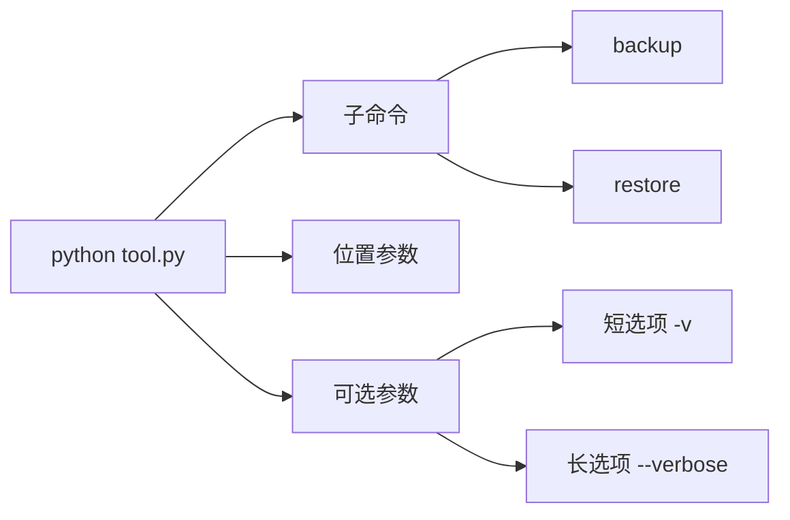
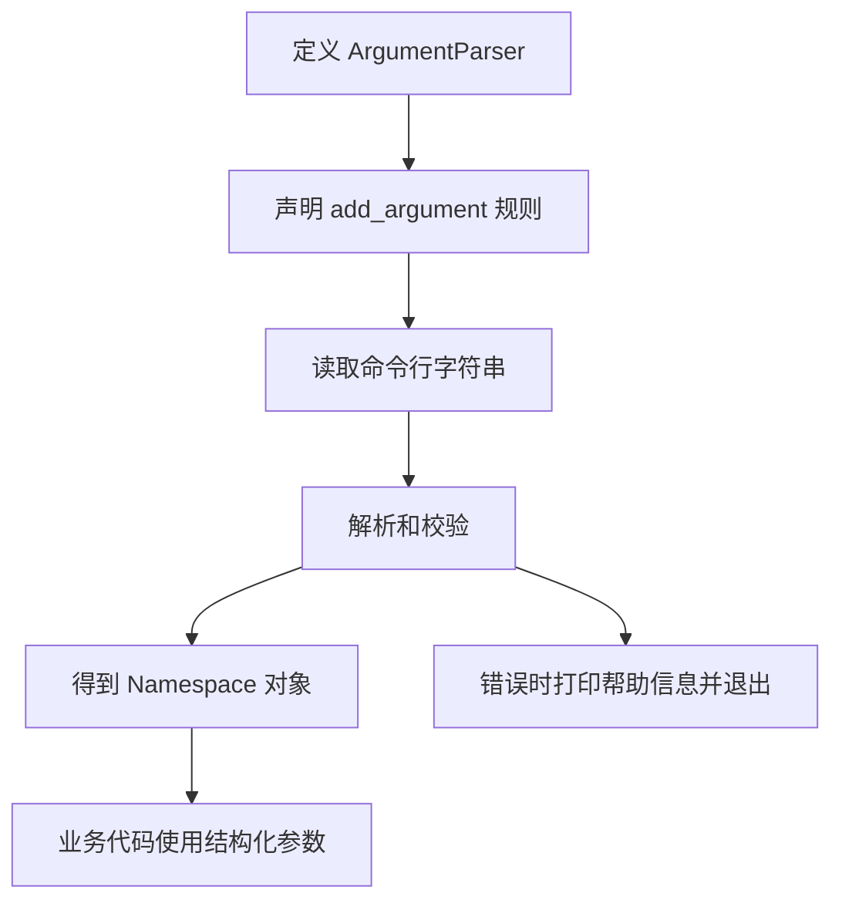
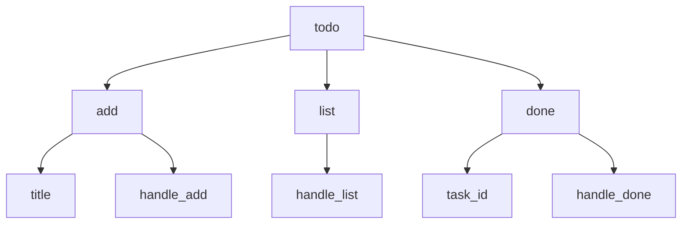

# Python argparse 库讲解：从命令行参数到子命令和工程化 CLI

`argparse` 是 Python 标准库里的命令行参数解析工具。它解决的是这样一类问题：用户在终端输入一串命令，程序需要把这些字符串解析成结构化参数，并且自动生成 `--help`、做类型转换、校验必填项和取值范围。

如果你写过这种代码：

```python
import sys

filename = sys.argv[1]
count = int(sys.argv[2])
verbose = "--verbose" in sys.argv
```

当参数越来越多时，很快会遇到问题：

- 参数顺序错了怎么办？
- 少传了必填参数怎么办？
- `count` 不是整数怎么办？
- 怎么让用户知道有哪些参数？
- 布尔开关、列表参数、子命令怎么写？

`argparse` 的价值，就是把这些命令行入口层的脏活统一收起来。

## 1. 先建立整体认识

一个命令行程序通常由几类元素组成：



比如下面这条命令：

```bash
python backup.py run ./data --output ./dist --workers 4 --verbose
```

可以拆成：

| 片段 | 类型 | 含义 |
| --- | --- | --- |
| `python backup.py` | 程序入口 | 执行脚本 |
| `run` | 子命令 | 执行备份任务 |
| `./data` | 位置参数 | 要备份的目录 |
| `--output ./dist` | 可选参数 | 输出目录 |
| `--workers 4` | 可选参数 | 并发数量 |
| `--verbose` | 布尔开关 | 输出更多日志 |

`argparse` 的工作流可以画成这样：



核心思想是：**命令行参数解析只负责把字符串变成可信的参数对象，真正的业务逻辑不要散落在解析代码里。**

## 2. 最小可用写法

先写一个最简单的脚本 `hello.py`：

```python
import argparse


parser = argparse.ArgumentParser()
parser.add_argument("name")

args = parser.parse_args()

print(f"Hello, {args.name}")
```

运行：

```bash
python hello.py Alice
```

输出：

```txt
Hello, Alice
```

如果不传 `name`：

```bash
python hello.py
```

`argparse` 会自动提示错误，大致类似：

```txt
usage: hello.py [-h] name
hello.py: error: the following arguments are required: name
```

同时它还会自动提供 `-h` / `--help`：

```bash
python hello.py --help
```

输出大致是：

```txt
usage: hello.py [-h] name

positional arguments:
  name

options:
  -h, --help  show this help message and exit
```

这就是 `argparse` 比手写 `sys.argv` 更适合工程代码的原因：错误处理、帮助文档和基本校验都由标准库统一完成。

## 3. ArgumentParser 是命令的说明书

实际项目里应该给 `ArgumentParser` 补上程序描述：

```python
import argparse


parser = argparse.ArgumentParser(
    prog="backup",
    description="备份指定目录到输出目录",
)

parser.add_argument("source", help="要备份的源目录")
parser.add_argument("--output", "-o", help="备份输出目录")

args = parser.parse_args()

print(args)
```

运行：

```bash
python backup.py ./data --output ./dist
```

输出类似：

```txt
Namespace(source='./data', output='./dist')
```

这里的 `args` 是一个 `Namespace` 对象，可以通过属性读取：

```python
print(args.source)
print(args.output)
```

常用的 `ArgumentParser` 参数有：

| 参数 | 作用 |
| --- | --- |
| `prog` | 帮助信息里展示的程序名 |
| `description` | 命令说明，显示在 help 顶部 |
| `epilog` | 补充说明，显示在 help 底部 |
| `formatter_class` | 控制 help 文本格式 |

示例：

```python
parser = argparse.ArgumentParser(
    prog="backup",
    description="备份指定目录",
    epilog="示例：backup ./data -o ./dist",
)
```

## 4. 位置参数和可选参数

`argparse` 里有两类最常见的参数。

第一类是位置参数，没有 `-` 或 `--` 前缀，通常必填，靠顺序识别：

```python
parser.add_argument("source", help="源目录")
parser.add_argument("target", help="目标目录")
```

命令：

```bash
python copy.py ./src ./dist
```

第二类是可选参数，有 `-` 或 `--` 前缀，通常可以不传：

```python
parser.add_argument("--force", action="store_true", help="覆盖已有文件")
parser.add_argument("--workers", type=int, default=4, help="并发数量")
```

命令：

```bash
python copy.py ./src ./dist --force --workers 8
```

完整例子：

```python
import argparse


def build_parser() -> argparse.ArgumentParser:
    parser = argparse.ArgumentParser(description="复制目录")
    parser.add_argument("source", help="源目录")
    parser.add_argument("target", help="目标目录")
    parser.add_argument("--force", action="store_true", help="覆盖已有文件")
    parser.add_argument("--workers", type=int, default=4, help="并发数量")
    return parser


parser = build_parser()
args = parser.parse_args()

print(args.source)
print(args.target)
print(args.force)
print(args.workers)
```

## 5. type：把字符串转换成目标类型

命令行参数本质上都是字符串。下面这条命令里的 `4`，传进 Python 时并不是整数：

```bash
python server.py --port 8000 --workers 4
```

使用 `type` 可以让 `argparse` 帮你转换：

```python
parser.add_argument("--port", type=int, default=8000)
parser.add_argument("--workers", type=int, default=4)
parser.add_argument("--timeout", type=float, default=3.0)
```

如果用户传了错误类型：

```bash
python server.py --workers many
```

`argparse` 会直接报错：

```txt
argument --workers: invalid int value: 'many'
```

`type` 也可以接收自定义函数。比如校验端口范围：

```python
import argparse


def port(value: str) -> int:
    number = int(value)
    if not 1 <= number <= 65535:
        raise argparse.ArgumentTypeError("端口必须在 1 到 65535 之间")
    return number


parser = argparse.ArgumentParser()
parser.add_argument("--port", type=port, default=8000)

args = parser.parse_args()
print(args.port)
```

自定义 `type` 函数适合做轻量转换和局部校验。更复杂的业务校验建议放到解析之后，不要把业务规则全部塞进 CLI 层。

## 6. choices：限制可选值

有些参数只能从固定集合里选择，例如运行环境：

```python
parser.add_argument(
    "--env",
    choices=["dev", "test", "prod"],
    default="dev",
    help="运行环境",
)
```

正确命令：

```bash
python app.py --env prod
```

错误命令：

```bash
python app.py --env local
```

会得到类似错误：

```txt
argument --env: invalid choice: 'local' (choose from 'dev', 'test', 'prod')
```

这类参数非常适合用 `choices`，因为错误信息清楚，`--help` 里也能看到可选范围。

## 7. default、required 和 dest

可选参数通常会有默认值：

```python
parser.add_argument("--host", default="127.0.0.1")
parser.add_argument("--port", type=int, default=8000)
```

`required=True` 可以让可选参数变成必填：

```python
parser.add_argument("--token", required=True, help="访问令牌")
```

不过要注意：**如果一个参数本来就是必须提供的，优先考虑位置参数；如果它是配置性质的参数，再考虑 `--token` 这种 required option。**

`dest` 用来指定解析后属性名：

```python
parser.add_argument("--dry-run", dest="dry_run", action="store_true")
```

其实 `argparse` 默认也会把 `--dry-run` 转成 `args.dry_run`。只有当命令行名字和 Python 属性名需要明显分离时，才需要手动写 `dest`：

```python
parser.add_argument("--from", dest="from_path")
```

因为 `from` 是 Python 关键字，不能直接写 `args.from`。

## 8. 布尔参数：store_true、store_false 和 BooleanOptionalAction

最常见的布尔开关是 `store_true`：

```python
parser.add_argument("--verbose", "-v", action="store_true", help="输出详细日志")
```

默认是 `False`，只要命令里出现 `--verbose` 就变成 `True`：

```bash
python app.py --verbose
```

反过来，也可以使用 `store_false`：

```python
parser.add_argument("--no-cache", dest="cache", action="store_false")
parser.set_defaults(cache=True)
```

命令：

```bash
python app.py --no-cache
```

Python 3.9 之后还可以用 `BooleanOptionalAction` 同时生成正反两个选项：

```python
import argparse


parser = argparse.ArgumentParser()
parser.add_argument(
    "--cache",
    action=argparse.BooleanOptionalAction,
    default=True,
    help="是否启用缓存",
)
```

这会同时支持：

```bash
python app.py --cache
python app.py --no-cache
```

布尔参数不要写成这样：

```python
parser.add_argument("--debug", type=bool)
```

因为命令行里的 `"False"` 是非空字符串，`bool("False")` 的结果是 `True`。布尔开关应该用 `action`。

## 9. 列表参数：append、nargs 和 split

命令行里经常需要传多个值，比如多个标签、多个文件、多个用户 ID。

### 多次传同一个参数：append

```python
parser.add_argument("--tag", action="append", default=[])
```

命令：

```bash
python publish.py --tag python --tag cli --tag backend
```

结果：

```python
args.tag == ["python", "cli", "backend"]
```

这种写法适合参数数量不固定，并且希望每个值都清楚写出来的场景。

### 一个参数后接多个值：nargs

```python
parser.add_argument("--files", nargs="+")
```

命令：

```bash
python upload.py --files a.txt b.txt c.txt
```

结果：

```python
args.files == ["a.txt", "b.txt", "c.txt"]
```

常用 `nargs`：

| 写法 | 含义 |
| --- | --- |
| `nargs=2` | 恰好 2 个值 |
| `nargs="?"` | 0 个或 1 个值 |
| `nargs="*"` | 0 个或多个值 |
| `nargs="+"` | 1 个或多个值 |

### 逗号分隔：自己转换

有些人喜欢这样传：

```bash
python report.py --columns name,age,email
```

可以写一个转换函数：

```python
def comma_list(value: str) -> list[str]:
    return [item.strip() for item in value.split(",") if item.strip()]


parser.add_argument("--columns", type=comma_list, default=[])
```

这三种方式没有绝对好坏。经验上：

- 命令行工具给人手动使用时，`--tag a --tag b` 更直观。
- 需要复制粘贴很多值时，逗号分隔更短。
- 多个文件路径时，`nargs="+"` 更自然。

## 10. metavar 和 help：让帮助信息更友好

好的 CLI 不只是能跑，还要让用户能通过 `--help` 自己理解。

```python
parser.add_argument(
    "--output",
    "-o",
    metavar="DIR",
    default="./dist",
    help="输出目录，默认：%(default)s",
)
```

`metavar` 控制 help 里展示的参数占位名。没有它时可能显示为：

```txt
--output OUTPUT
```

加上后会变成：

```txt
--output DIR
```

`help` 里可以使用 `%(default)s` 展示默认值：

```python
parser.add_argument("--workers", type=int, default=4, help="并发数量，默认：%(default)s")
```

如果参数很多，可以使用 `ArgumentDefaultsHelpFormatter` 自动显示默认值：

```python
parser = argparse.ArgumentParser(
    formatter_class=argparse.ArgumentDefaultsHelpFormatter,
)
```

## 11. 互斥参数：add_mutually_exclusive_group

有些参数不能同时出现。比如导出报告时，只能选择 JSON 或 CSV：

```python
import argparse


parser = argparse.ArgumentParser()
group = parser.add_mutually_exclusive_group(required=True)
group.add_argument("--json", action="store_true", help="导出 JSON")
group.add_argument("--csv", action="store_true", help="导出 CSV")

args = parser.parse_args()
```

正确：

```bash
python export.py --json
```

错误：

```bash
python export.py --json --csv
```

`argparse` 会提示这两个参数不能同时使用。

互斥组适合表达入口层规则，例如输出格式、运行模式、是否执行某类动作。复杂业务规则仍然建议放在解析后统一检查。

## 12. 子命令：像 git 一样组织 CLI

当一个工具有多种动作时，继续堆参数会变得混乱。比如：

```bash
todo add "写博客"
todo list
todo done 1
```

这里的 `add`、`list`、`done` 就是子命令。

用 `argparse` 可以这样写：

```python
import argparse


def handle_add(args: argparse.Namespace) -> None:
    print(f"新增任务: {args.title}")


def handle_list(args: argparse.Namespace) -> None:
    print("列出任务")


def handle_done(args: argparse.Namespace) -> None:
    print(f"完成任务: {args.task_id}")


def build_parser() -> argparse.ArgumentParser:
    parser = argparse.ArgumentParser(prog="todo")
    subparsers = parser.add_subparsers(dest="command", required=True)

    add_parser = subparsers.add_parser("add", help="新增任务")
    add_parser.add_argument("title", help="任务标题")
    add_parser.set_defaults(handler=handle_add)

    list_parser = subparsers.add_parser("list", help="查看任务列表")
    list_parser.set_defaults(handler=handle_list)

    done_parser = subparsers.add_parser("done", help="标记任务完成")
    done_parser.add_argument("task_id", type=int, help="任务 ID")
    done_parser.set_defaults(handler=handle_done)

    return parser


def main() -> None:
    parser = build_parser()
    args = parser.parse_args()
    args.handler(args)


if __name__ == "__main__":
    main()
```

调用：

```bash
python todo.py add "写 argparse 博客"
python todo.py list
python todo.py done 1
```

子命令的组织方式可以画成这样：



这里有一个很实用的技巧：`set_defaults(handler=...)`。它把每个子命令对应的处理函数挂到 `args` 上，主流程只需要：

```python
args.handler(args)
```

这样比写一大串 `if args.command == "add"` 更容易维护。

## 13. parse_args、parse_known_args 和 parse_intermixed_args

最常用的是 `parse_args()`：

```python
args = parser.parse_args()
```

它会解析全部参数。如果遇到未知参数，会直接报错。这适合大多数 CLI。

有些工具需要只解析自己关心的参数，把剩余参数转交给另一个程序，例如包装测试命令：

```python
args, unknown = parser.parse_known_args()
```

示例：

```python
parser.add_argument("--env", default="dev")

args, extra = parser.parse_known_args()
print(args.env)
print(extra)
```

命令：

```bash
python wrapper.py --env test -- -k user_test -q
```

`extra` 里可以保存后面那些不属于当前 parser 的参数。

另外，`parse_intermixed_args()` 可以支持位置参数和可选参数更自由地混排，但它对部分高级用法有限制。普通项目里优先使用 `parse_args()`，只有确实需要兼容特殊命令习惯时再考虑它。

## 14. 从 argparse 到业务配置

工程里经常会把命令行参数转成一个明确的配置对象，而不是在业务代码里到处传 `args`。

```python
from dataclasses import dataclass
from pathlib import Path
import argparse


@dataclass(frozen=True)
class BackupConfig:
    source: Path
    output: Path
    workers: int
    verbose: bool


def positive_int(value: str) -> int:
    number = int(value)
    if number <= 0:
        raise argparse.ArgumentTypeError("必须是正整数")
    return number


def build_parser() -> argparse.ArgumentParser:
    parser = argparse.ArgumentParser(
        prog="backup",
        description="备份指定目录",
        formatter_class=argparse.ArgumentDefaultsHelpFormatter,
    )
    parser.add_argument("source", type=Path, help="源目录")
    parser.add_argument("--output", "-o", type=Path, default=Path("./dist"), help="输出目录")
    parser.add_argument("--workers", "-w", type=positive_int, default=4, help="并发数量")
    parser.add_argument("--verbose", "-v", action="store_true", help="输出详细日志")
    return parser


def parse_config(argv: list[str] | None = None) -> BackupConfig:
    parser = build_parser()
    args = parser.parse_args(argv)
    return BackupConfig(
        source=args.source,
        output=args.output,
        workers=args.workers,
        verbose=args.verbose,
    )


def run_backup(config: BackupConfig) -> None:
    print(f"备份 {config.source} 到 {config.output}")


def main() -> None:
    config = parse_config()
    run_backup(config)


if __name__ == "__main__":
    main()
```

这里有几个工程化点：

- `build_parser()` 只负责声明 CLI。
- `parse_config()` 把命令行参数转成业务配置。
- `run_backup()` 不依赖 `argparse.Namespace`，更容易测试和复用。
- `parse_args(argv)` 支持测试时传入列表，不必真的改 `sys.argv`。

## 15. 命令行、环境变量和配置文件怎么合并

真实项目里配置来源通常不止命令行：

- 配置文件：适合保存稳定配置，例如数据库地址、默认输出目录。
- 环境变量：适合部署环境注入，例如 token、密钥、运行环境。
- 命令行参数：适合本次运行临时覆盖，例如 `--workers 8`。

常见优先级是：

```txt
命令行参数 > 环境变量 > 配置文件 > 程序默认值
```

可以画成这样：


一个简化例子：

```python
import argparse
import os


def build_parser() -> argparse.ArgumentParser:
    parser = argparse.ArgumentParser()
    parser.add_argument("--host", default=os.getenv("APP_HOST", "127.0.0.1"))
    parser.add_argument("--port", type=int, default=int(os.getenv("APP_PORT", "8000")))
    return parser


args = build_parser().parse_args()
print(args.host, args.port)
```

不过要注意，复杂配置不要全靠 `argparse` 硬撑。配置文件解析、环境变量解析、密钥管理可以拆到单独模块，`argparse` 只做命令行入口。

## 16. 测试 argparse 代码

不要为了测试 CLI 去真的启动一个新进程。可以让解析函数接收 `argv`：

```python
def parse_config(argv: list[str] | None = None) -> BackupConfig:
    parser = build_parser()
    args = parser.parse_args(argv)
    return BackupConfig(
        source=args.source,
        output=args.output,
        workers=args.workers,
        verbose=args.verbose,
    )
```

测试时传列表：

```python
def test_parse_config():
    config = parse_config(["./data", "--output", "./dist", "--workers", "8", "--verbose"])

    assert str(config.source) == "data"
    assert str(config.output) == "dist"
    assert config.workers == 8
    assert config.verbose is True
```

错误参数会触发 `SystemExit`，可以这样测：

```python
import pytest


def test_invalid_workers():
    with pytest.raises(SystemExit):
        parse_config(["./data", "--workers", "0"])
```

如果你不想在普通函数里处理 `SystemExit`，也可以把参数值校验放在解析后，用自己的异常表达业务错误。

## 17. 一个完整的备份工具示例

下面把前面的知识点串起来：

```python
from dataclasses import dataclass
from pathlib import Path
import argparse
import shutil


@dataclass(frozen=True)
class BackupConfig:
    source: Path
    output: Path
    mode: str
    workers: int
    dry_run: bool
    verbose: bool


def positive_int(value: str) -> int:
    number = int(value)
    if number <= 0:
        raise argparse.ArgumentTypeError("必须是正整数")
    return number


def existing_dir(value: str) -> Path:
    path = Path(value)
    if not path.exists():
        raise argparse.ArgumentTypeError(f"目录不存在: {path}")
    if not path.is_dir():
        raise argparse.ArgumentTypeError(f"不是目录: {path}")
    return path


def build_parser() -> argparse.ArgumentParser:
    parser = argparse.ArgumentParser(
        prog="backup",
        description="备份目录到指定位置",
        formatter_class=argparse.ArgumentDefaultsHelpFormatter,
    )
    parser.add_argument("source", type=existing_dir, help="源目录")
    parser.add_argument("--output", "-o", type=Path, default=Path("./backup"), help="输出目录")
    parser.add_argument("--mode", choices=["copy", "zip"], default="copy", help="备份模式")
    parser.add_argument("--workers", "-w", type=positive_int, default=4, help="并发数量")
    parser.add_argument("--dry-run", action="store_true", help="只打印计划，不真正执行")
    parser.add_argument("--verbose", "-v", action="store_true", help="输出详细日志")
    return parser


def parse_config(argv: list[str] | None = None) -> BackupConfig:
    args = build_parser().parse_args(argv)
    return BackupConfig(
        source=args.source,
        output=args.output,
        mode=args.mode,
        workers=args.workers,
        dry_run=args.dry_run,
        verbose=args.verbose,
    )


def run_backup(config: BackupConfig) -> None:
    if config.verbose:
        print(config)

    if config.dry_run:
        print(f"[dry-run] 将以 {config.mode} 模式备份 {config.source} 到 {config.output}")
        return

    if config.mode == "copy":
        shutil.copytree(config.source, config.output, dirs_exist_ok=True)
        print("复制完成")
    else:
        archive = shutil.make_archive(str(config.output), "zip", root_dir=config.source)
        print(f"压缩完成: {archive}")


def main() -> None:
    config = parse_config()
    run_backup(config)


if __name__ == "__main__":
    main()
```

可以这样使用：

```bash
python backup.py ./data --output ./dist --mode copy --workers 4 --verbose
python backup.py ./data --output ./dist --mode zip --dry-run
```

这已经是一个可维护 CLI 的基本形态：入口清楚、帮助信息完整、参数校验明确、业务逻辑和解析逻辑分开。

## 18. 常见坑和建议

### 不要在业务代码里到处使用 args

不推荐：

```python
def run(args):
    if args.verbose:
        ...
```

更推荐：

```python
def run(config: BackupConfig) -> None:
    if config.verbose:
        ...
```

`argparse.Namespace` 是入口层对象，不应该扩散到整个项目。

### 不要用 type=bool

前面已经提过：

```python
parser.add_argument("--debug", type=bool)
```

这是常见坑。布尔开关用：

```python
parser.add_argument("--debug", action="store_true")
```

### 不要让可选参数名字太短且含义不明

短选项适合高频参数，例如：

```txt
-h, -v, -o, -f
```

但不要为了短而短：

```txt
-x, -y, -z
```

除非这是非常明确的领域习惯，否则长选项更利于阅读和脚本维护。

### 不要把所有配置都塞进命令行

如果一个程序需要几十个参数，说明配置已经有一定复杂度。可以考虑：

- 常用参数留在命令行。
- 稳定参数放配置文件。
- 敏感参数放环境变量或密钥系统。
- 命令行只提供覆盖能力。

### 错误信息要面向使用者

自定义类型校验时，错误信息不要只写 `invalid value`：

```python
raise argparse.ArgumentTypeError("并发数量必须是正整数")
```

用户看得懂，排查成本才低。

## 19. argparse 适合什么，不适合什么

适合：

- 小型脚本参数解析。
- 内部工具 CLI。
- 数据处理、运维脚本、批处理任务。
- 有少量子命令的工程工具。
- 希望零第三方依赖的命令行程序。

不太适合：

- 需要非常漂亮的终端交互界面。
- 复杂补全、彩色输出、进度条、表格渲染。
- 大型多层级 CLI 框架。

如果只是标准参数解析，`argparse` 足够稳；如果要做更现代的 CLI 体验，可以再评估 Typer、Click、Rich 等库。但即使用第三方库，也建议先理解 `argparse`，因为它代表了命令行参数解析最基础的一套模型。

## 20. 总结

`argparse` 的核心不是某几个 API，而是把命令行入口设计清楚：


写好 `argparse` 代码时，可以按这个顺序思考：

1. 这个工具的主动作是什么，是否需要子命令？
2. 哪些是必填位置参数，哪些是可选配置？
3. 哪些参数需要 `type`、`choices`、`default`？
4. 布尔开关是否用了 `action`，有没有误用 `type=bool`？
5. `--help` 输出是否足够让别人独立使用？
6. 解析逻辑是否和业务逻辑分开？

掌握这些之后，你写的 Python 脚本就不再只是“能跑”，而是可以被别人稳定使用、被测试覆盖、被长期维护的命令行工具。
