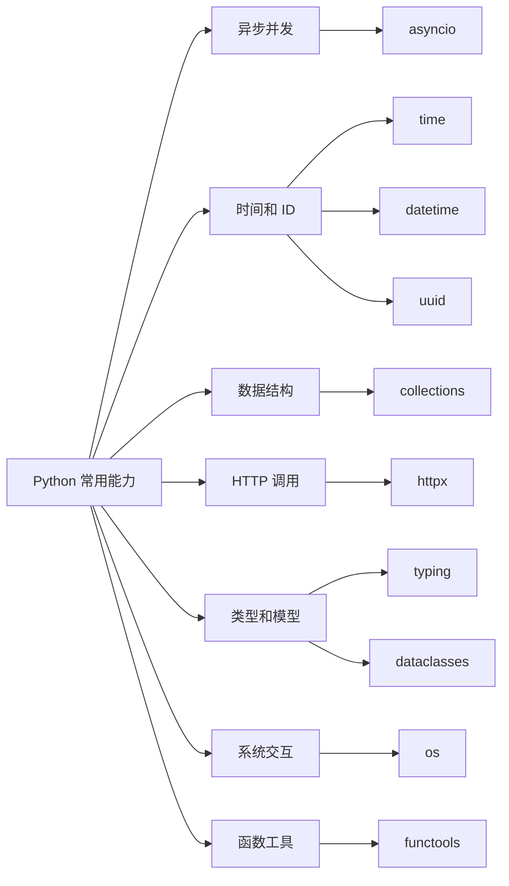

# Python 常用模块讲解：asyncio、time、uuid、collections、httpx、datetime、typing、dataclasses、os、functools

Python 的很多工程能力都藏在标准库里。真正写项目时，不需要死记 API，但要知道每个模块解决什么问题、适合放在哪一层、哪些写法更稳。

这篇文章把 10 个常用模块和库放在一张图里：



| 模块或库 | 主要用途 |
| --- | --- |
| `asyncio` | 用 `async` / `await` 写 I/O 并发 |
| `time` | 时间戳、计时、休眠 |
| `uuid` | 生成唯一标识 |
| `collections` | 更强的容器工具 |
| `httpx` | 同步和异步 HTTP 客户端 |
| `datetime` | 日期、时间、时区、格式化和解析 |
| `typing` | 类型提示和静态检查 |
| `dataclasses` | 快速定义数据模型 |
| `os` | 环境变量、路径、进程和文件系统交互 |
| `functools` | 装饰器、缓存、偏函数、泛函数 |

## 1. asyncio：用 async 和 await 写并发

`asyncio` 是 Python 的异步 I/O 标准库，适合网络请求、数据库访问、消息队列、长连接这类 I/O 密集型场景。

先看顺序执行：

```python
import asyncio


async def say_after(delay: float, message: str) -> str:
    await asyncio.sleep(delay)
    return message


async def main() -> None:
    print(await say_after(1, "hello"))
    print(await say_after(1, "world"))


asyncio.run(main())
```

两次等待是串行的，总耗时约 2 秒。改成并发：

```python
import asyncio


async def say_after(delay: float, message: str) -> str:
    await asyncio.sleep(delay)
    return message


async def main() -> None:
    results = await asyncio.gather(
        say_after(1, "hello"),
        say_after(1, "world"),
    )
    print(results)


asyncio.run(main())
```

总耗时约 1 秒，因为两个协程在等待期间把控制权交还给事件循环。


### create_task：创建任务

```python
import asyncio


async def send_email(email: str) -> None:
    await asyncio.sleep(0.5)
    print(f"email sent to {email}")


async def main() -> None:
    task = asyncio.create_task(send_email("alice@example.com"))

    print("继续处理其他逻辑")
    await task


asyncio.run(main())
```

`create_task` 会把协程包装成 `Task`，并交给事件循环调度。重要任务不要创建后就丢掉，否则异常可能变得难追踪。

### TaskGroup：结构化管理并发

Python 3.11 之后可以使用 `TaskGroup`：

```python
import asyncio


async def fetch_product(product_id: int) -> dict:
    await asyncio.sleep(0.2)
    return {"id": product_id}


async def main() -> None:
    async with asyncio.TaskGroup() as tg:
        task1 = tg.create_task(fetch_product(1))
        task2 = tg.create_task(fetch_product(2))

    print(task1.result())
    print(task2.result())


asyncio.run(main())
```

它把多个任务放在同一个上下文里，生命周期比散落的 `create_task` 更清楚。

### 限制并发数量

并发不是越多越好。访问外部接口、数据库、缓存时，通常要控制并发上限。

```python
import asyncio


async def fetch(url: str, sem: asyncio.Semaphore) -> str:
    async with sem:
        await asyncio.sleep(0.1)
        return f"content from {url}"


async def main() -> None:
    sem = asyncio.Semaphore(5)
    urls = [f"https://example.com/{i}" for i in range(20)]

    results = await asyncio.gather(
        *(fetch(url, sem) for url in urls)
    )
    print(len(results))


asyncio.run(main())
```

### 超时和阻塞代码

```python
import asyncio


async def slow_query() -> str:
    await asyncio.sleep(5)
    return "done"


async def main() -> None:
    try:
        async with asyncio.timeout(1):
            result = await slow_query()
            print(result)
    except TimeoutError:
        print("查询超时")


asyncio.run(main())
```

不要在 `async def` 里直接调用阻塞函数：

```python
import time


async def bad() -> None:
    time.sleep(3)
```

这会阻塞事件循环。异步休眠应该使用：

```python
await asyncio.sleep(3)
```

如果必须调用同步阻塞函数，可以放到线程里：

```python
import asyncio
import time


def blocking_io() -> str:
    time.sleep(1)
    return "result"


async def main() -> None:
    result = await asyncio.to_thread(blocking_io)
    print(result)
```

## 2. time：时间戳、计时和休眠

`time` 偏底层，适合处理时间戳、计时和休眠。

### 当前时间戳

```python
import time

now = time.time()
print(now)
```

`time.time()` 返回 Unix 时间戳，单位是秒。它适合记录粗略当前时刻，但如果要表达业务时间，通常更推荐 `datetime`。

### 测量耗时

```python
import time

start = time.perf_counter()

total = sum(range(1_000_000))

cost = time.perf_counter() - start
print(f"total={total}, cost={cost:.4f}s")
```

测量耗时推荐 `perf_counter`。它比 `time.time()` 更适合性能计时。

### 超时判断

```python
import time

deadline = time.monotonic() + 5

while True:
    if time.monotonic() >= deadline:
        print("timeout")
        break

    time.sleep(0.1)
```

`monotonic` 单调递增，不受系统时间回拨影响，适合超时控制。

### 同步休眠

```python
import time

print("start")
time.sleep(1)
print("end")
```

同步脚本可以用 `time.sleep`。异步函数里应该用 `await asyncio.sleep(...)`。

## 3. uuid：生成唯一 ID

`uuid` 用来生成通用唯一标识。最常用的是 `uuid4`。

```python
from uuid import uuid4

request_id = uuid4()

print(request_id)
print(request_id.hex)
```

输出类似：

```txt
30fbc6e6-7f95-4b2e-9d92-92046d0b2a41
30fbc6e67f954b2e9d9292046d0b2a41
```

### 请求 ID 和文件名

```python
from uuid import uuid4


def new_upload_name(filename: str) -> str:
    suffix = filename.rsplit(".", maxsplit=1)[-1]
    return f"{uuid4().hex}.{suffix}"


print(new_upload_name("avatar.png"))
```

`uuid4` 适合请求 ID、任务 ID、上传文件名、临时资源 ID。

### 稳定生成 UUID

如果希望同一输入得到同一结果，可以用 `uuid5`：

```python
import uuid

namespace = uuid.NAMESPACE_DNS

print(uuid.uuid5(namespace, "example.com"))
print(uuid.uuid5(namespace, "example.com"))
```

两次结果相同，适合把外部唯一键映射成内部稳定 ID。

### UUID 的边界

UUID 不是所有场景的最佳主键。它分布式生成方便，但可读性差，随机 UUID 作为数据库主键时可能影响索引局部性。数据库主键要结合排序、查询、分库、存储引擎一起考虑。

## 4. collections：更强的容器工具

`collections` 提供了很多增强型容器。

### Counter：计数

```python
from collections import Counter

words = ["python", "go", "python", "java", "go", "python"]
counter = Counter(words)

print(counter["python"])
print(counter.most_common(2))
```

适合词频、标签、状态码、分类统计。

### defaultdict：分组和累计

```python
from collections import defaultdict

orders = [
    {"user_id": 1, "amount": 100},
    {"user_id": 2, "amount": 80},
    {"user_id": 1, "amount": 40},
]

amount_by_user = defaultdict(int)

for order in orders:
    amount_by_user[order["user_id"]] += order["amount"]

print(dict(amount_by_user))
```

如果值是列表：

```python
from collections import defaultdict

groups = defaultdict(list)

for order in orders:
    groups[order["user_id"]].append(order)
```

### deque：高效队列

```python
from collections import deque

queue = deque()
queue.append("task1")
queue.append("task2")

print(queue.popleft())
```

`list.pop(0)` 是 O(n)，`deque.popleft()` 是 O(1)。

也可以限制最大长度：

```python
from collections import deque

recent_errors = deque(maxlen=3)

for item in ["e1", "e2", "e3", "e4"]:
    recent_errors.append(item)

print(list(recent_errors))
```

输出：

```txt
['e2', 'e3', 'e4']
```

### namedtuple：轻量不可变对象

```python
from collections import namedtuple

Point = namedtuple("Point", ["x", "y"])

p = Point(10, 20)
print(p.x, p.y)
```

新代码里，如果要定义业务数据模型，很多时候 `dataclasses` 更直观。但 `namedtuple` 在轻量、不可变、兼容 tuple 的场景里仍然有价值。

## 5. httpx：同步和异步 HTTP 客户端

`httpx` 是第三方 HTTP 客户端库，提供同步和异步 API，支持连接池、超时、HTTP/2 等能力。

安装：

```bash
pip install httpx
```

### 同步请求

```python
import httpx

response = httpx.get("https://httpbin.org/get", timeout=5)

print(response.status_code)
print(response.json())
```

工程里更推荐复用 `Client`：

```python
import httpx


with httpx.Client(base_url="https://httpbin.org", timeout=5) as client:
    response = client.get("/get", params={"page": 1})
    response.raise_for_status()
    print(response.json()["args"])
```

复用 Client 的价值是连接池、默认 headers、cookies、base_url 和 timeout 都可以统一管理。

### 异步请求

```python
import asyncio

import httpx


async def fetch(client: httpx.AsyncClient, index: int) -> dict:
    response = await client.get("/get", params={"index": index})
    response.raise_for_status()
    return response.json()


async def main() -> None:
    async with httpx.AsyncClient(
        base_url="https://httpbin.org",
        timeout=5,
    ) as client:
        results = await asyncio.gather(
            *(fetch(client, i) for i in range(5))
        )

    print(len(results))


asyncio.run(main())
```

注意：高频请求应该复用一个 `AsyncClient`，不要每次请求都创建一个客户端。

### 拆分超时

```python
import httpx

timeout = httpx.Timeout(
    connect=2.0,
    read=5.0,
    write=5.0,
    pool=2.0,
)

with httpx.Client(timeout=timeout) as client:
    response = client.get("https://httpbin.org/get")
    print(response.status_code)
```

含义：

- `connect`：建立连接的超时。
- `read`：读取响应的超时。
- `write`：发送请求体的超时。
- `pool`：从连接池获取连接的超时。

不要把所有超时都设置得很大，否则依赖变慢时，请求会在服务里堆积。

## 6. datetime：业务时间、日期和时区

`datetime` 适合处理订单创建时间、过期时间、报表日期、用户时区时间等业务时间。

### 获取当前时间

```python
from datetime import datetime, timezone

now = datetime.now(timezone.utc)
print(now)
```

推荐后端核心逻辑尽量使用带时区的 datetime，也就是 aware datetime。`datetime.now()` 返回的是 naive datetime，没有时区信息，跨时区系统里容易产生歧义。

### 格式化和解析

```python
from datetime import datetime, timezone

now = datetime.now(timezone.utc)

text = now.strftime("%Y-%m-%d %H:%M:%S")
print(text)

parsed = datetime.strptime("2026-06-06 10:30:00", "%Y-%m-%d %H:%M:%S")
print(parsed)
```

接口传输更推荐 ISO 8601：

```python
from datetime import datetime, timezone

payload = {
    "created_at": datetime.now(timezone.utc).isoformat()
}

print(payload)

value = datetime.fromisoformat("2026-06-06T10:30:00+00:00")
print(value.tzinfo)
```

### 日期计算

```python
from datetime import datetime, timedelta, timezone


def is_expired(expires_at: datetime) -> bool:
    return datetime.now(timezone.utc) >= expires_at


expires_at = datetime.now(timezone.utc) + timedelta(minutes=30)
print(is_expired(expires_at))
```

几个常见类型：

```python
from datetime import date, datetime, time, timedelta

today: date = date.today()
moment: datetime = datetime.now()
clock: time = time(hour=9, minute=30)
duration: timedelta = timedelta(days=1, hours=2)
```

## 7. typing：让代码意图更清楚

`typing` 的价值不是运行时校验，而是让函数签名、数据结构和约束更清晰，并配合 IDE、`mypy`、`pyright` 等工具发现问题。

### 基础标注

```python
def add(a: int, b: int) -> int:
    return a + b


def normalize_tags(tags: list[str]) -> list[str]:
    return [tag.strip().lower() for tag in tags]
```

可选返回值：

```python
def find_user(user_id: int) -> dict | None:
    if user_id == 1:
        return {"id": 1, "name": "Alice"}

    return None
```

### TypedDict：描述字典结构

```python
from typing import TypedDict


class UserPayload(TypedDict):
    id: int
    name: str
    email: str


def send_welcome_email(user: UserPayload) -> None:
    print(user["email"])
```

适合描述 JSON 字典。如果数据有行为或默认值，可以考虑 `dataclass`。

### Literal：限制固定取值

```python
from typing import Literal

OrderStatus = Literal["pending", "paid", "cancelled"]


def update_status(order_id: int, status: OrderStatus) -> None:
    print(order_id, status)
```

### Protocol：关注行为而不是继承

```python
from typing import Protocol


class Sender(Protocol):
    def send(self, message: str) -> None:
        ...


class EmailSender:
    def send(self, message: str) -> None:
        print(f"email: {message}")


def notify(sender: Sender, message: str) -> None:
    sender.send(message)
```

只要对象有 `send` 方法，就可以满足这个协议。

### Callable：标注函数参数

```python
from collections.abc import Callable


def run_with_log(task: Callable[[], str]) -> str:
    print("start")
    result = task()
    print("end")
    return result
```

Python 3.9 之后，`list[str]`、`dict[str, int]` 这类内置泛型已经足够常用。`Callable`、`Iterable`、`Mapping` 这类抽象类型通常推荐从 `collections.abc` 导入。

## 8. dataclasses：轻量数据模型

普通类：

```python
class User:
    def __init__(self, id: int, name: str, email: str):
        self.id = id
        self.name = name
        self.email = email
```

使用 `dataclass`：

```python
from dataclasses import dataclass


@dataclass
class User:
    id: int
    name: str
    email: str
```

自动获得 `__init__`、`__repr__`、`__eq__` 等方法。

### 默认值和 default_factory

不要给可变字段直接写 `[]`：

```python
from dataclasses import dataclass, field


@dataclass
class Cart:
    items: list[str] = field(default_factory=list)
```

`default_factory` 会为每个实例创建新的列表，避免多个实例共享同一个列表。

### frozen 和 slots

```python
from dataclasses import dataclass


@dataclass(frozen=True, slots=True)
class Money:
    amount: int
    currency: str = "CNY"
```

- `frozen=True`：实例创建后尽量不可修改。
- `slots=True`：减少实例内存，避免随意新增属性。

### asdict 和 replace

```python
from dataclasses import asdict, dataclass, replace


@dataclass(frozen=True)
class User:
    id: int
    name: str
    email: str


user = User(1, "Alice", "alice@example.com")

print(asdict(user))
print(replace(user, name="Alice Zhang"))
```

`dataclass` 适合内部数据传递。如果需要复杂校验、字段别名、JSON schema，可以考虑 Pydantic。

## 9. os：和操作系统交互

`os` 用来访问环境变量、当前目录、进程信息、文件系统等。

### 环境变量

```python
import os
from dataclasses import dataclass


@dataclass(frozen=True)
class Settings:
    database_url: str
    debug: bool


def load_settings() -> Settings:
    return Settings(
        database_url=os.environ["DATABASE_URL"],
        debug=os.getenv("DEBUG", "false").lower() == "true",
    )
```

`os.environ["DATABASE_URL"]` 在变量缺失时会报错，适合必填配置。`os.getenv` 适合可选配置。

### 路径和目录

```python
import os

print(os.getcwd())
print(os.path.abspath("posts"))
print(os.path.exists("posts"))

os.makedirs("logs", exist_ok=True)
```

新代码处理路径更推荐 `pathlib`：

```python
from pathlib import Path

root = Path.cwd()
posts_dir = root / "posts"

for path in posts_dir.rglob("*.md"):
    print(path)
```

### 进程信息

```python
import os

print(os.getpid())
print(os.cpu_count())
```

这类信息常用于日志、诊断、worker 数量配置。

## 10. functools：函数工具箱

`functools` 提供装饰器、缓存、偏函数、泛函数等能力。

### wraps：写装饰器必备

```python
from functools import wraps


def log_call(func):
    @wraps(func)
    def wrapper(*args, **kwargs):
        print(f"call {func.__name__}")
        return func(*args, **kwargs)

    return wrapper
```

`wraps` 会保留原函数的 `__name__`、`__doc__` 等元信息。

### lru_cache：缓存函数结果

```python
from functools import lru_cache


@lru_cache(maxsize=128)
def fib(n: int) -> int:
    if n <= 1:
        return n

    return fib(n - 1) + fib(n - 2)


print(fib(35))
print(fib.cache_info())
```

适合纯函数：相同输入总是得到相同输出。不适合直接缓存依赖当前时间、数据库实时状态、外部接口状态的函数。

### cache：无限缓存

```python
from functools import cache


@cache
def load_country_name(code: str) -> str:
    mapping = {
        "CN": "China",
        "US": "United States",
    }
    return mapping[code]
```

`cache` 相当于 `lru_cache(maxsize=None)`。输入空间不受控时要谨慎。

### partial：固定一部分参数

```python
from functools import partial


def send_message(channel: str, message: str) -> None:
    print(f"[{channel}] {message}")


send_email = partial(send_message, "email")
send_sms = partial(send_message, "sms")

send_email("welcome")
send_sms("code: 123456")
```

### singledispatch：按参数类型分发

```python
from functools import singledispatch


@singledispatch
def serialize(value):
    return str(value)


@serialize.register
def _(value: dict):
    return {key: serialize(item) for key, item in value.items()}


@serialize.register
def _(value: list):
    return [serialize(item) for item in value]


print(serialize({"count": 1, "tags": ["Python", "HTTP"]}))
```

`singledispatch` 可以把一堆 `isinstance` 分支拆成可扩展的注册函数。

## 11. 一个组合示例

下面这个脚本把多个模块串起来，用于批量请求用户资料：

```python
import asyncio
import os
import time
from collections import Counter
from dataclasses import dataclass
from datetime import datetime, timezone
from functools import lru_cache
from typing import Any
from uuid import uuid4

import httpx


@dataclass(frozen=True)
class Settings:
    base_url: str
    timeout: float
    concurrency: int


@dataclass(frozen=True)
class FetchResult:
    user_id: int
    request_id: str
    status_code: int
    received_at: datetime
    data: dict[str, Any]


@lru_cache(maxsize=1)
def get_settings() -> Settings:
    return Settings(
        base_url=os.getenv("API_BASE_URL", "https://httpbin.org"),
        timeout=float(os.getenv("HTTP_TIMEOUT", "5")),
        concurrency=int(os.getenv("HTTP_CONCURRENCY", "5")),
    )


async def fetch_user(
    client: httpx.AsyncClient,
    sem: asyncio.Semaphore,
    user_id: int,
) -> FetchResult:
    request_id = str(uuid4())

    async with sem:
        response = await client.get(
            "/get",
            params={"user_id": user_id},
            headers={"x-request-id": request_id},
        )

    return FetchResult(
        user_id=user_id,
        request_id=request_id,
        status_code=response.status_code,
        received_at=datetime.now(timezone.utc),
        data=response.json(),
    )


async def main() -> None:
    settings = get_settings()
    sem = asyncio.Semaphore(settings.concurrency)
    start = time.perf_counter()

    async with httpx.AsyncClient(
        base_url=settings.base_url,
        timeout=httpx.Timeout(settings.timeout),
    ) as client:
        results = await asyncio.gather(
            *(fetch_user(client, sem, user_id) for user_id in range(1, 11))
        )

    cost = time.perf_counter() - start
    status_counter = Counter(result.status_code for result in results)

    print(f"fetched={len(results)} cost={cost:.3f}s")
    print(status_counter)
    print(results[0])


if __name__ == "__main__":
    asyncio.run(main())
```

这个例子里：

- `asyncio` 负责并发调度。
- `httpx` 负责 HTTP 请求。
- `dataclasses` 定义配置和结果模型。
- `typing` 描述 JSON 数据类型。
- `uuid` 生成请求 ID。
- `datetime` 记录接收时间。
- `time` 统计耗时。
- `collections.Counter` 统计状态码。
- `os` 读取环境变量。
- `functools.lru_cache` 缓存配置。

## 12. 选择建议

| 需求 | 优先考虑 |
| --- | --- |
| 并发请求、异步任务 | `asyncio` |
| 统计耗时、超时判断 | `time.perf_counter`、`time.monotonic` |
| 请求 ID、任务 ID | `uuid.uuid4` |
| 计数、分组、队列 | `collections.Counter`、`defaultdict`、`deque` |
| 调 HTTP 接口 | `httpx.Client`、`httpx.AsyncClient` |
| 业务时间和时区 | `datetime`、`timezone`、`zoneinfo` |
| 函数签名和数据结构说明 | `typing` |
| 内部数据模型 | `dataclasses` |
| 环境变量和系统信息 | `os` |
| 装饰器、缓存、函数适配 | `functools` |

记住几个边界：

- `time` 适合计时，`datetime` 适合业务时间。
- `asyncio` 适合 I/O 并发，不会让 CPU 密集型计算自动变快。
- `httpx.AsyncClient` 要复用，不要每个请求都创建一个。
- `dataclasses` 适合轻量模型，复杂校验可以交给 Pydantic。
- `typing` 提升可维护性，但不会做运行时校验。
- `os.path` 能用，新代码处理路径可以优先考虑 `pathlib`。

## 13. 参考资料

- Python asyncio: https://docs.python.org/3/library/asyncio.html
- Python time: https://docs.python.org/3/library/time.html
- Python uuid: https://docs.python.org/3/library/uuid.html
- Python collections: https://docs.python.org/3/library/collections.html
- HTTPX: https://www.python-httpx.org/
- HTTPX Async Support: https://www.python-httpx.org/async/
- HTTPX Timeouts: https://www.python-httpx.org/advanced/timeouts/
- Python datetime: https://docs.python.org/3/library/datetime.html
- Python typing: https://docs.python.org/3/library/typing.html
- Python dataclasses: https://docs.python.org/3/library/dataclasses.html
- Python os: https://docs.python.org/3/library/os.html
- Python functools: https://docs.python.org/3/library/functools.html

