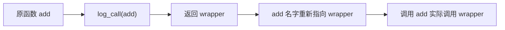
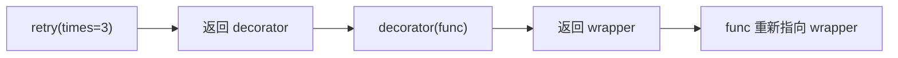

# Python 装饰器讲解：从闭包到工程化实践

装饰器是 Python 里非常重要的语法。它看起来像是在函数上方加了一个 `@xxx`，本质上却是“把一个函数交给另一个函数处理，然后把返回值重新绑定回原来的名字”。

一句话概括：

```txt
装饰器 = 接收函数，返回新函数的高阶函数
```

## 1. 从函数是一等对象开始

Python 中函数可以赋值给变量：

```python
def hello(name: str) -> str:
    return f"Hello, {name}"


say = hello

print(say("Alice"))
```

也可以作为参数传给另一个函数：

```python
def call_twice(func):
    func()
    func()


def greet():
    print("hi")


call_twice(greet)
```

还可以作为返回值：

```python
def make_greeter():
    def greet():
        print("hi")

    return greet


fn = make_greeter()
fn()
```

装饰器正是建立在这些能力之上。

## 2. 闭包是装饰器的基础

看一个计数器：

```python
def make_counter():
    count = 0

    def increase():
        nonlocal count
        count += 1
        return count

    return increase


counter = make_counter()

print(counter())  # 1
print(counter())  # 2
```

`make_counter` 已经执行完了，但 `increase` 仍然记得 `count`。这种“内部函数记住外部函数变量”的能力，就是闭包。

装饰器也需要闭包，因为它要记住被装饰的原函数。

## 3. 最简单的装饰器

先写一个函数：

```python
def add(a: int, b: int) -> int:
    return a + b
```

现在希望在调用前后打印日志：

```python
def log_call(func):
    def wrapper(*args, **kwargs):
        print(f"准备调用: {func.__name__}")
        result = func(*args, **kwargs)
        print(f"调用结束: {func.__name__}")
        return result

    return wrapper


add = log_call(add)

print(add(1, 2))
```

这就是装饰器的本质。`@` 只是语法糖：

```python
@log_call
def add(a: int, b: int) -> int:
    return a + b
```

等价于：

```python
def add(a: int, b: int) -> int:
    return a + b


add = log_call(add)
```

流程可以画成这样：



## 4. wrapper 为什么要写 *args 和 **kwargs

被装饰的函数参数可能各不相同：

```python
def get_user(user_id: int):
    ...


def create_order(user_id: int, sku: str, count: int = 1):
    ...
```

如果装饰器写死参数，就不能复用。`*args` 和 `**kwargs` 可以接住任意位置参数和关键字参数：

```python
def log_call(func):
    def wrapper(*args, **kwargs):
        print("before")
        result = func(*args, **kwargs)
        print("after")
        return result

    return wrapper
```

这让装饰器可以作用在大多数函数上。

## 5. 一定要使用 functools.wraps

上面的装饰器有一个问题：

```python
@log_call
def add(a: int, b: int) -> int:
    """计算两个整数的和"""
    return a + b


print(add.__name__)
print(add.__doc__)
```

输出会变成：

```txt
wrapper
None
```

因为 `add` 已经指向 `wrapper` 了，原函数的名称、文档字符串、注解等元信息丢失了。

正确写法：

```python
from functools import wraps


def log_call(func):
    @wraps(func)
    def wrapper(*args, **kwargs):
        print(f"准备调用: {func.__name__}")
        result = func(*args, **kwargs)
        print(f"调用结束: {func.__name__}")
        return result

    return wrapper
```

`functools.wraps` 会把原函数的重要元信息复制到 `wrapper` 上。写工程代码时，自己实现装饰器基本都应该加它。

## 6. 带参数的装饰器

有时装饰器自身也需要参数，例如重试次数：

```python
import time
from functools import wraps


def retry(times: int, delay: float = 0.1):
    def decorator(func):
        @wraps(func)
        def wrapper(*args, **kwargs):
            last_error = None

            for attempt in range(1, times + 1):
                try:
                    return func(*args, **kwargs)
                except Exception as exc:
                    last_error = exc
                    print(f"第 {attempt} 次调用失败: {exc}")
                    time.sleep(delay)

            raise last_error

        return wrapper

    return decorator
```

使用：

```python
@retry(times=3, delay=0.5)
def call_remote_api():
    ...
```

它的执行关系比普通装饰器多一层：

```txt
@retry(times=3)
def func():
    ...
```

等价于：

```python
decorator = retry(times=3)
func = decorator(func)
```

用图表示：



带参数装饰器的结构是三层：

```python
def outer(config):
    def decorator(func):
        def wrapper(*args, **kwargs):
            return func(*args, **kwargs)

        return wrapper

    return decorator
```

## 7. 装饰器的执行时机

装饰器不是在函数调用时才执行外层逻辑，而是在函数定义完成后立刻执行。

```python
def deco(func):
    print("装饰器执行")

    def wrapper():
        print("wrapper 执行")
        return func()

    return wrapper


@deco
def hello():
    print("hello 执行")


print("准备调用")
hello()
```

输出：

```txt
装饰器执行
准备调用
wrapper 执行
hello 执行
```

这点很重要。装饰器外层适合做包装配置，不适合做每次调用才应该发生的业务操作。

## 8. 多个装饰器的顺序

```python
def deco_a(func):
    @wraps(func)
    def wrapper(*args, **kwargs):
        print("A before")
        result = func(*args, **kwargs)
        print("A after")
        return result

    return wrapper


def deco_b(func):
    @wraps(func)
    def wrapper(*args, **kwargs):
        print("B before")
        result = func(*args, **kwargs)
        print("B after")
        return result

    return wrapper


@deco_a
@deco_b
def run():
    print("run")
```

等价于：

```python
run = deco_a(deco_b(run))
```

调用输出：

```txt
A before
B before
run
B after
A after
```

可以记住两句话：

- 装饰时从下往上包。
- 调用时从上往下进。

## 9. 类方法中的装饰器

装饰实例方法时，`self` 只是第一个位置参数。

```python
from functools import wraps


def require_login(func):
    @wraps(func)
    def wrapper(self, *args, **kwargs):
        if not self.current_user:
            raise PermissionError("请先登录")

        return func(self, *args, **kwargs)

    return wrapper


class OrderService:
    def __init__(self, current_user):
        self.current_user = current_user

    @require_login
    def create_order(self, sku: str):
        return {"sku": sku, "user": self.current_user}
```

调用：

```python
service = OrderService(current_user="alice")
print(service.create_order("book"))
```

类方法和静态方法也可以和装饰器组合，但要注意顺序。

```python
class User:
    @classmethod
    @log_call
    def from_id(cls, user_id: int):
        return cls()

    @staticmethod
    @log_call
    def validate_email(email: str) -> bool:
        return "@" in email
```

通常让 `@classmethod`、`@staticmethod` 放在最外层，可读性更清晰。

## 10. 类装饰器

装饰器不只能装饰函数，也能装饰类。

```python
def add_repr(cls):
    def __repr__(self):
        fields = ", ".join(
            f"{key}={value!r}"
            for key, value in self.__dict__.items()
        )
        return f"{cls.__name__}({fields})"

    cls.__repr__ = __repr__
    return cls


@add_repr
class User:
    def __init__(self, name: str, age: int):
        self.name = name
        self.age = age


print(User("Alice", 18))
```

输出：

```txt
User(name='Alice', age=18)
```

标准库里的 `@dataclass` 就是典型的类装饰器。它接收一个类，分析字段，然后给类补充 `__init__`、`__repr__`、`__eq__` 等方法。

```python
from dataclasses import dataclass


@dataclass
class Product:
    id: int
    name: str
    price: int
```

## 11. 用类实现装饰器

函数装饰器最常见，但也可以用类实现。

```python
from functools import wraps


class CountCalls:
    def __init__(self, func):
        wraps(func)(self)
        self.func = func
        self.count = 0

    def __call__(self, *args, **kwargs):
        self.count += 1
        print(f"{self.func.__name__} 被调用 {self.count} 次")
        return self.func(*args, **kwargs)


@CountCalls
def hello(name: str):
    print(f"Hello, {name}")


hello("Alice")
hello("Bob")
```

类装饰器适合需要维护状态的场景，例如统计调用次数、缓存、限流等。

## 12. 异步装饰器

如果被装饰的是异步函数，`wrapper` 也应该是 `async def`，并且调用原函数时要 `await`。

```python
import time
from functools import wraps


def async_timer(func):
    @wraps(func)
    async def wrapper(*args, **kwargs):
        start = time.perf_counter()

        try:
            return await func(*args, **kwargs)
        finally:
            cost = time.perf_counter() - start
            print(f"{func.__name__} 耗时: {cost:.3f}s")

    return wrapper
```

使用：

```python
import asyncio


@async_timer
async def fetch_data():
    await asyncio.sleep(0.2)
    return {"ok": True}


asyncio.run(fetch_data())
```

不要用同步 wrapper 包异步函数，否则返回的可能只是一个 coroutine 对象，真正逻辑没有被等待。

## 13. 常见工程场景

### 计时

```python
import time
from functools import wraps


def timer(func):
    @wraps(func)
    def wrapper(*args, **kwargs):
        start = time.perf_counter()

        try:
            return func(*args, **kwargs)
        finally:
            cost = time.perf_counter() - start
            print(f"{func.__name__} cost={cost:.3f}s")

    return wrapper
```

### 权限校验

```python
from functools import wraps


def require_role(role: str):
    def decorator(func):
        @wraps(func)
        def wrapper(user, *args, **kwargs):
            if role not in user.roles:
                raise PermissionError(f"需要角色: {role}")

            return func(user, *args, **kwargs)

        return wrapper

    return decorator


@require_role("admin")
def delete_user(current_user, user_id: int):
    return {"deleted": user_id}
```

### 缓存

很多情况下不需要自己写缓存装饰器，标准库已经提供了 `lru_cache`。

```python
from functools import lru_cache


@lru_cache(maxsize=128)
def fib(n: int) -> int:
    if n <= 1:
        return n

    return fib(n - 1) + fib(n - 2)
```

第一次计算后，相同参数的结果会被缓存。

### 注册路由

Web 框架里的路由装饰器也是装饰器思想的应用。

```python
routes = {}


def route(path: str):
    def decorator(func):
        routes[path] = func
        return func

    return decorator


@route("/hello")
def hello():
    return "hello"
```

这个装饰器没有包一层 `wrapper`，只是把函数注册到 `routes` 字典里，然后原样返回函数。装饰器不一定都要包装调用过程，它也可以做注册、标记、改造类等事情。

## 14. 常见坑

### 忘记 return wrapper

错误写法：

```python
def deco(func):
    def wrapper(*args, **kwargs):
        return func(*args, **kwargs)
```

这里没有返回 `wrapper`，被装饰的函数会变成 `None`。

### 忘记返回原函数结果

错误写法：

```python
def deco(func):
    @wraps(func)
    def wrapper(*args, **kwargs):
        func(*args, **kwargs)

    return wrapper
```

如果原函数有返回值，调用结果会丢失。应该写：

```python
return func(*args, **kwargs)
```

### 捕获异常后吞掉错误

不推荐：

```python
def safe(func):
    @wraps(func)
    def wrapper(*args, **kwargs):
        try:
            return func(*args, **kwargs)
        except Exception:
            return None

    return wrapper
```

这会让错误消失，排查困难。除非业务明确需要兜底，否则至少要记录日志或重新抛出。

### 装饰器做了太多事情

装饰器适合处理横切逻辑，例如日志、鉴权、缓存、重试、事务。它不适合隐藏核心业务流程。装饰器越多，调用链越不直观，所以要控制职责边界。

## 15. 推荐写法模板

普通装饰器：

```python
from functools import wraps


def decorator(func):
    @wraps(func)
    def wrapper(*args, **kwargs):
        # before
        result = func(*args, **kwargs)
        # after
        return result

    return wrapper
```

带参数装饰器：

```python
from functools import wraps


def decorator_with_options(option):
    def decorator(func):
        @wraps(func)
        def wrapper(*args, **kwargs):
            # use option
            return func(*args, **kwargs)

        return wrapper

    return decorator
```

异步装饰器：

```python
from functools import wraps


def async_decorator(func):
    @wraps(func)
    async def wrapper(*args, **kwargs):
        return await func(*args, **kwargs)

    return wrapper
```

理解装饰器时，不要只盯着 `@`。把它还原成赋值语句：

```python
func = decorator(func)
```

大部分问题都会变得清楚。

## 16. 参考资料

- Python functools 标准库文档: https://docs.python.org/3/library/functools.html

