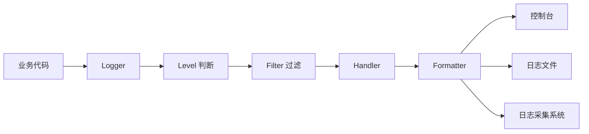

# Python logging 库讲解：从日志级别到工程化配置

`logging` 是 Python 标准库里的日志系统。它解决的不是“把内容打印出来”这么简单，而是让不同模块、不同第三方库、不同运行环境都能用一套统一机制记录运行过程。

`print` 适合临时调试，`logging` 适合长期运行的程序。一个后端服务上线后，排查问题时通常看不到用户当时的屏幕，也不能随便复现生产数据，这时日志就是还原现场的主要线索。

## 1. 先建立整体认识



这张图里有四个核心概念：

- `Logger`：代码里真正调用的对象，例如 `logger.info(...)`。
- `Level`：日志级别，用来区分严重程度。
- `Handler`：决定日志输出到哪里，例如控制台、文件、HTTP、队列。
- `Formatter`：决定日志长什么样，例如是否带时间、模块名、请求 ID。

Python 官方文档也强调过，标准库提供日志 API 的价值在于应用代码和第三方模块可以共同接入同一个日志系统，这比每个模块各自 `print` 更容易治理。

## 2. 最小可用写法

```python
import logging

logging.basicConfig(level=logging.INFO)

logging.debug("调试信息")
logging.info("服务启动成功")
logging.warning("磁盘空间不足")
logging.error("订单创建失败")
logging.critical("数据库不可用")
```

运行结果大致是：

```txt
INFO:root:服务启动成功
WARNING:root:磁盘空间不足
ERROR:root:订单创建失败
CRITICAL:root:数据库不可用
```

`DEBUG` 没有显示，因为当前配置的最低级别是 `INFO`。日志级别从低到高是：

```txt
DEBUG < INFO < WARNING < ERROR < CRITICAL
```

工程里通常这样使用：

```python
logger.debug("SQL 参数: %s", params)
logger.info("用户登录成功: user_id=%s", user_id)
logger.warning("库存不足: sku=%s stock=%s", sku, stock)
logger.error("支付回调处理失败: order_id=%s", order_id)
logger.critical("核心依赖不可用: service=%s", service_name)
```

## 3. 为什么不直接用 print

`print` 最大的问题是缺少结构化控制。

```python
print("user login", user_id)
```

这行代码无法自然表达这些问题：

- 这条信息是什么级别？
- 要输出到控制台还是文件？
- 生产环境是否应该显示？
- 能否统一带上时间、模块名、请求 ID？
- 第三方库日志能否一起收集？

`logging` 可以把这些事情放到配置层解决，业务代码只负责记录事件。

```python
import logging

logger = logging.getLogger(__name__)


def login(user_id: int) -> None:
    logger.info("用户登录成功: user_id=%s", user_id)
```

这里推荐使用 `logging.getLogger(__name__)`，而不是一直使用根日志器。`__name__` 会让日志器名称跟模块路径保持一致，例如 `app.services.user`。

## 4. Logger 的层级关系

假设项目结构是：

```txt
app/
  main.py
  services/
    user.py
    order.py
```

在不同模块中写：

```python
# app/services/user.py
import logging

logger = logging.getLogger(__name__)


def create_user(email: str) -> None:
    logger.info("创建用户: email=%s", email)
```

```python
# app/services/order.py
import logging

logger = logging.getLogger(__name__)


def create_order(user_id: int) -> None:
    logger.info("创建订单: user_id=%s", user_id)
```

对应的 logger 名称分别是：

```txt
app.services.user
app.services.order
```

它们的上级是 `app.services`，再上级是 `app`。这意味着你可以统一控制某一组模块的日志：

```python
logging.getLogger("app.services").setLevel(logging.DEBUG)
logging.getLogger("urllib3").setLevel(logging.WARNING)
```

这就是日志层级的价值：应用模块可以详细输出，第三方库可以保持安静。

## 5. Handler 和 Formatter

下面是一份手写配置，能清楚看到每个对象的职责。

```python
import logging

logger = logging.getLogger("app")
logger.setLevel(logging.INFO)

console_handler = logging.StreamHandler()
console_handler.setLevel(logging.INFO)

formatter = logging.Formatter(
    fmt="%(asctime)s %(levelname)s [%(name)s] %(message)s",
    datefmt="%Y-%m-%d %H:%M:%S",
)

console_handler.setFormatter(formatter)
logger.addHandler(console_handler)

logger.info("服务启动完成")
```

输出示例：

```txt
2026-06-06 10:30:00 INFO [app] 服务启动完成
```

常用格式字段：

| 字段 | 含义 |
| --- | --- |
| `%(asctime)s` | 日志时间 |
| `%(levelname)s` | 日志级别 |
| `%(name)s` | logger 名称 |
| `%(module)s` | 模块名 |
| `%(funcName)s` | 函数名 |
| `%(lineno)d` | 行号 |
| `%(message)s` | 格式化后的日志内容 |

## 6. 不要在日志字符串里提前格式化

推荐：

```python
logger.info("用户登录成功: user_id=%s", user_id)
```

不推荐：

```python
logger.info(f"用户登录成功: user_id={user_id}")
```

原因是 logging 支持延迟格式化。只有当这条日志真的需要输出时，才会把参数合并进字符串。对于高频 `DEBUG` 日志，这一点能避免不必要的字符串构造成本。

复杂对象也一样：

```python
logger.debug("请求参数: %r", payload)
```

如果当前级别是 `INFO`，这条 `DEBUG` 不会输出，格式化成本也能被跳过。

## 7. 记录异常栈

只写错误消息是不够的：

```python
try:
    1 / 0
except ZeroDivisionError as exc:
    logger.error("计算失败: %s", exc)
```

这只能看到错误文本，看不到调用栈。更推荐：

```python
try:
    1 / 0
except ZeroDivisionError:
    logger.exception("计算失败")
```

`logger.exception(...)` 只能在 `except` 块里使用，它等价于：

```python
logger.error("计算失败", exc_info=True)
```

生产排查时，堆栈通常比一句“失败了”更重要。

## 8. 输出到文件并做日志轮转

如果日志一直写到同一个文件，文件会越来越大。常见做法是按大小或按时间切分。

按大小切分：

```python
import logging
from logging.handlers import RotatingFileHandler

logger = logging.getLogger("app")
logger.setLevel(logging.INFO)

handler = RotatingFileHandler(
    filename="logs/app.log",
    maxBytes=10 * 1024 * 1024,
    backupCount=5,
    encoding="utf-8",
)

handler.setFormatter(logging.Formatter(
    "%(asctime)s %(levelname)s [%(name)s] %(message)s"
))

logger.addHandler(handler)
logger.info("写入文件日志")
```

含义：

- `maxBytes`：单个日志文件最大大小。
- `backupCount`：最多保留几个历史文件。
- `encoding`：建议显式指定，避免中文乱码。

按时间切分：

```python
from logging.handlers import TimedRotatingFileHandler

handler = TimedRotatingFileHandler(
    filename="logs/app.log",
    when="midnight",
    interval=1,
    backupCount=14,
    encoding="utf-8",
)
```

如果服务部署在容器里，更常见的做法是输出到标准输出，由 Docker、Kubernetes 或日志采集系统接管文件轮转和采集。

## 9. 用 dictConfig 做工程化配置

实际项目不建议在各处手动创建 Handler。更常见的是在入口统一配置：

```python
import logging.config

LOGGING_CONFIG = {
    "version": 1,
    "disable_existing_loggers": False,
    "formatters": {
        "default": {
            "format": "%(asctime)s %(levelname)s [%(name)s] %(message)s",
        },
        "verbose": {
            "format": (
                "%(asctime)s %(levelname)s [%(name)s] "
                "%(filename)s:%(lineno)d %(message)s"
            ),
        },
    },
    "handlers": {
        "console": {
            "class": "logging.StreamHandler",
            "level": "INFO",
            "formatter": "default",
        },
        "file": {
            "class": "logging.handlers.RotatingFileHandler",
            "level": "INFO",
            "formatter": "verbose",
            "filename": "logs/app.log",
            "maxBytes": 10 * 1024 * 1024,
            "backupCount": 5,
            "encoding": "utf-8",
        },
    },
    "loggers": {
        "app": {
            "handlers": ["console", "file"],
            "level": "INFO",
            "propagate": False,
        },
        "uvicorn.access": {
            "handlers": ["console"],
            "level": "INFO",
            "propagate": False,
        },
    },
    "root": {
        "handlers": ["console"],
        "level": "WARNING",
    },
}


def setup_logging() -> None:
    logging.config.dictConfig(LOGGING_CONFIG)
```

入口文件：

```python
from app.logging_config import setup_logging

setup_logging()

logger = logging.getLogger("app")
logger.info("应用启动")
```

这里有两个容易忽略的配置：

- `disable_existing_loggers=False`：避免把已经存在的第三方库 logger 禁掉。
- `propagate=False`：避免同一条日志向上冒泡后被重复输出。

## 10. 结构化日志

传统文本日志适合人读，结构化日志适合机器检索。比如在日志平台里按 `user_id`、`request_id`、`path` 查询。

可以先写一个简单 JSON Formatter：

```python
import json
import logging


class JsonFormatter(logging.Formatter):
    def format(self, record: logging.LogRecord) -> str:
        payload = {
            "time": self.formatTime(record),
            "level": record.levelname,
            "logger": record.name,
            "message": record.getMessage(),
            "module": record.module,
            "line": record.lineno,
        }

        if record.exc_info:
            payload["exception"] = self.formatException(record.exc_info)

        return json.dumps(payload, ensure_ascii=False)
```

配置到 Handler：

```python
handler = logging.StreamHandler()
handler.setFormatter(JsonFormatter())
```

输出示例：

```json
{"time": "2026-06-06 10:30:00,000", "level": "INFO", "logger": "app", "message": "用户登录成功", "module": "auth", "line": 42}
```

更成熟的项目可以使用 `python-json-logger`、`structlog` 或 OpenTelemetry，把日志、指标、链路追踪统一起来。

## 11. 在 Web 服务里带上请求 ID

后端服务最常见的问题是：一条请求会经过路由、业务服务、数据库访问、第三方 API。没有请求 ID，很难把这些日志串起来。

可以用 `contextvars` 保存当前请求上下文：

```python
import contextvars
import logging
from uuid import uuid4

from fastapi import FastAPI, Request

request_id_var = contextvars.ContextVar("request_id", default="-")


class RequestIdFilter(logging.Filter):
    def filter(self, record: logging.LogRecord) -> bool:
        record.request_id = request_id_var.get()
        return True


logger = logging.getLogger("app")
handler = logging.StreamHandler()
handler.addFilter(RequestIdFilter())
handler.setFormatter(logging.Formatter(
    "%(asctime)s %(levelname)s request_id=%(request_id)s %(message)s"
))
logger.addHandler(handler)
logger.setLevel(logging.INFO)

app = FastAPI()


@app.middleware("http")
async def add_request_id(request: Request, call_next):
    request_id = request.headers.get("x-request-id", str(uuid4()))
    token = request_id_var.set(request_id)

    try:
        response = await call_next(request)
        response.headers["x-request-id"] = request_id
        return response
    finally:
        request_id_var.reset(token)


@app.get("/orders/{order_id}")
async def get_order(order_id: int):
    logger.info("查询订单: order_id=%s", order_id)
    return {"id": order_id}
```

日志就会变成：

```txt
2026-06-06 10:30:00 INFO request_id=6f7... 查询订单: order_id=1001
```

同一个请求链路里的日志都带着同一个 `request_id`，排查效率会高很多。

## 12. 常见问题

### 日志重复输出

常见原因是既给子 logger 加了 handler，又让它继续向父 logger 传播。

```python
logger = logging.getLogger("app")
logger.propagate = False
```

如果仍然重复，检查是否多次执行了初始化函数。可以在添加 Handler 前判断：

```python
logger = logging.getLogger("app")

if not logger.handlers:
    logger.addHandler(handler)
```

### basicConfig 不生效

`basicConfig` 只在根日志器还没有 Handler 时生效。如果程序或第三方框架已经配置过 logging，再调用 `basicConfig` 可能看起来没有效果。

工程里更推荐使用 `dictConfig` 统一配置。

### 日志里出现敏感信息

日志不应该记录密码、完整 token、身份证号、银行卡号等敏感数据。可以在业务层避免输出，也可以写 Filter 做脱敏。

```python
class SecretFilter(logging.Filter):
    def filter(self, record: logging.LogRecord) -> bool:
        record.msg = str(record.msg).replace("password=", "password=***")
        return True
```

更可靠的方式是在日志字段设计阶段就不要把敏感字段传进去。

## 13. 一份推荐实践

一个中小型 Python 后端项目，可以采用下面的规则：

- 每个模块使用 `logger = logging.getLogger(__name__)`。
- 应用入口统一调用 `logging.config.dictConfig`。
- 本地开发输出人类可读日志，生产环境输出 JSON 日志。
- 请求入口生成 `request_id`，所有业务日志自动带上。
- 异常使用 `logger.exception` 记录堆栈。
- 不记录密码、token、密钥和完整个人敏感信息。
- 容器环境优先输出到标准输出，由平台负责采集和轮转。

## 14. 参考资料

- Python Logging HOWTO: https://docs.python.org/3/howto/logging.html
- Python logging 标准库文档: https://docs.python.org/3/library/logging.html

