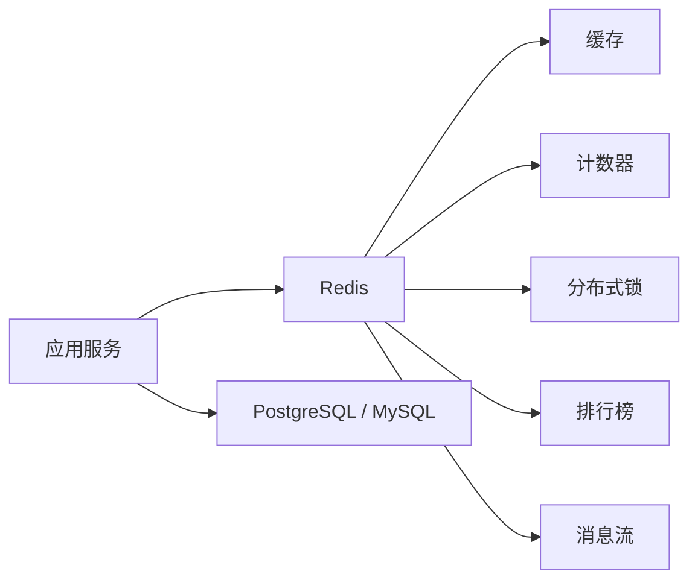
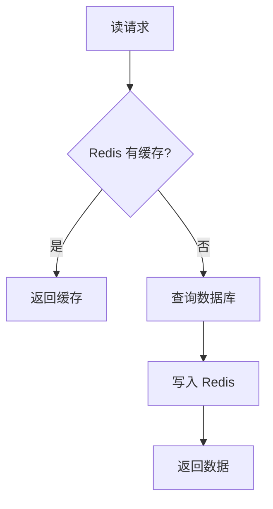

# Redis 使用教程：从缓存到数据结构、分布式锁、排行榜和 Streams

Redis 是一个以内存为核心的键值数据库。它最常见的用途是缓存，但如果只把 Redis 当作“更快的 Map”，会错过它真正强大的地方：丰富的数据结构、原子命令、过期时间、发布订阅、Streams、Lua 脚本和持久化机制，让它可以承担缓存、计数器、限流、排行榜、轻量消息流、会话存储等多种基础能力。

Redis 解决的问题可以概括成一句话：把高频、低延迟、结构简单但访问量大的数据，放到离应用更近、更快、更容易原子操作的位置。



## 1. Redis 适合解决什么问题

关系型数据库擅长事务、复杂查询、约束和长期存储，但有些场景直接压数据库会很吃力：

- 热点数据频繁读取，例如商品详情、配置、用户权限。
- 计数器高频更新，例如浏览量、点赞数、短信发送次数。
- 需要过期的数据，例如验证码、登录态、临时 token。
- 需要原子判断和更新，例如限流、分布式锁。
- 需要有序集合，例如排行榜、延迟任务索引。

Redis 的优势：

- 内存访问，延迟通常很低。
- 单线程执行命令，单条命令天然原子。
- 数据结构丰富，不只是字符串。
- 支持 key 过期，适合临时数据。
- 可以通过 RDB / AOF 做持久化。

Redis 不适合的场景：

- 复杂多表查询。
- 大规模关系建模。
- 强一致金融账本。
- 无限增长的大对象存储。
- 把所有业务数据都复制一份进 Redis。

## 2. 本地启动和 Node.js 连接

用 Docker 启动：

```bash
docker run --name redis-dev -p 6379:6379 -d redis:7
```

安装 Node.js 客户端：

```bash
pnpm add redis
```

连接：

```js
// redis-client.mjs
import { createClient } from 'redis'

export const redis = createClient({
  url: process.env.REDIS_URL ?? 'redis://localhost:6379'
})

redis.on('error', (error) => {
  console.error('Redis error', error)
})

await redis.connect()
```

基本读写：

```js
import { redis } from './redis-client.mjs'

await redis.set('app:name', 'vitepress-blog')
const name = await redis.get('app:name')

console.log(name)
```

## 3. Key 命名规范

Redis 没有表结构，key 命名就是你的数据模型。推荐使用冒号分层：

```txt
user:1001:profile
user:1001:sessions
post:2001:view-count
rate-limit:sms:phone:13800000000
lock:order:o_10001
stream:order-events
```

几个建议：

- 前缀表达业务域，例如 `user`、`post`、`order`。
- 中间放实体 ID。
- 后缀表达数据含义。
- 避免特别长的 key，也避免没有语义的 key。
- 批量扫描时用 `SCAN`，不要在线上用 `KEYS *`。

## 4. String：缓存、验证码、计数器

String 是最基础的数据结构，值可以是文本、JSON、数字、二进制。

### 缓存用户资料

```js
async function getUserProfile(userId) {
  const key = `user:${userId}:profile`

  const cached = await redis.get(key)
  if (cached) {
    return JSON.parse(cached)
  }

  const profile = await db.user.findById(userId)

  await redis.set(key, JSON.stringify(profile), {
    EX: 300
  })

  return profile
}
```

`EX: 300` 表示 300 秒后过期。缓存必须设置过期时间，否则旧数据可能永远留在 Redis 里。

### 验证码

```js
async function saveSmsCode(phone, code) {
  await redis.set(`sms-code:${phone}`, code, {
    EX: 300
  })
}

async function verifySmsCode(phone, code) {
  const key = `sms-code:${phone}`
  const saved = await redis.get(key)

  if (saved !== code) {
    return false
  }

  await redis.del(key)
  return true
}
```

验证码验证成功后要删除，避免重复使用。

### 计数器

```js
async function increasePostView(postId) {
  const key = `post:${postId}:views`
  return redis.incr(key)
}
```

`INCR` 是原子操作，适合浏览量、点赞数、临时序号等场景。

## 5. Hash：对象字段读写

Hash 适合存储一个对象的多个字段：

```js
await redis.hSet('user:1001:profile', {
  name: 'Alice',
  role: 'admin',
  city: 'Shanghai'
})

const role = await redis.hGet('user:1001:profile', 'role')
const profile = await redis.hGetAll('user:1001:profile')
```

如果对象经常只读写某几个字段，Hash 比整段 JSON 更方便。比如用户在线状态：

```js
async function updateUserPresence(userId, patch) {
  await redis.hSet(`user:${userId}:presence`, {
    ...patch,
    updatedAt: new Date().toISOString()
  })
  await redis.expire(`user:${userId}:presence`, 600)
}
```

注意：Hash 不是关系表，不能替代数据库约束和复杂查询。

## 6. List：队列和最近记录

List 是有序链表，适合简单队列或最近 N 条记录。

```js
await redis.lPush('recent:logs', JSON.stringify({
  level: 'info',
  message: 'server started',
  time: new Date().toISOString()
}))

await redis.lTrim('recent:logs', 0, 99)

const logs = await redis.lRange('recent:logs', 0, 9)
```

简单任务队列：

```js
await redis.rPush('queue:emails', JSON.stringify({
  to: 'user@example.com',
  template: 'welcome'
}))

const task = await redis.blPop('queue:emails', 5)
if (task) {
  const payload = JSON.parse(task.element)
  await sendEmail(payload)
}
```

如果需要消费者组、确认、待处理列表，优先用 Redis Streams，而不是手写复杂 List 队列。

## 7. Set：去重、标签、集合运算

Set 适合唯一集合：

```js
await redis.sAdd('post:2001:liked-users', 'u_1')
await redis.sAdd('post:2001:liked-users', 'u_2')

const liked = await redis.sIsMember('post:2001:liked-users', 'u_1')
const count = await redis.sCard('post:2001:liked-users')
```

共同关注：

```js
const common = await redis.sInter([
  'user:u_1:following',
  'user:u_2:following'
])
```

Set 的强项是去重和集合运算，不适合需要按分数排序的场景。

## 8. Sorted Set：排行榜和延迟索引

Sorted Set 每个成员有一个分数，Redis 按分数排序。

排行榜：

```js
await redis.zIncrBy('rank:post-likes', 1, 'post_2001')

const top10 = await redis.zRangeWithScores('rank:post-likes', 0, 9, {
  REV: true
})
```

用户排名：

```js
const rank = await redis.zRevRank('rank:post-likes', 'post_2001')
```

延迟任务也可以用 Sorted Set，score 放执行时间戳：

```js
await redis.zAdd('delayed:jobs', {
  score: Date.now() + 60_000,
  value: JSON.stringify({ type: 'close_order', orderId: 'o_10001' })
})

const dueJobs = await redis.zRangeByScore('delayed:jobs', 0, Date.now(), {
  LIMIT: { offset: 0, count: 10 }
})
```

拿到任务后要用 Lua 或事务保证“取出 + 删除”的原子性，否则多个 worker 可能重复取到同一任务。

## 9. 缓存模式：Cache Aside

最常用的是 Cache Aside：



读取：

```js
async function getPost(postId) {
  const key = `post:${postId}:detail`

  const cached = await redis.get(key)
  if (cached) return JSON.parse(cached)

  const post = await db.post.findById(postId)
  if (!post) return null

  await redis.set(key, JSON.stringify(post), {
    EX: 600
  })

  return post
}
```

更新：

```js
async function updatePost(postId, patch) {
  const post = await db.post.update(postId, patch)
  await redis.del(`post:${postId}:detail`)
  return post
}
```

更新时一般先写数据库，再删除缓存。不要先删缓存再写数据库，否则并发读可能把旧数据重新写回缓存。

## 10. 缓存穿透、击穿、雪崩

### 缓存穿透

查询不存在的数据，每次都打到数据库。解决方法：缓存空值。

```js
async function getUser(userId) {
  const key = `user:${userId}`
  const cached = await redis.get(key)

  if (cached === '__NULL__') return null
  if (cached) return JSON.parse(cached)

  const user = await db.user.findById(userId)

  if (!user) {
    await redis.set(key, '__NULL__', { EX: 60 })
    return null
  }

  await redis.set(key, JSON.stringify(user), { EX: 300 })
  return user
}
```

### 缓存击穿

某个热点 key 过期，大量请求同时查询数据库。解决方法：互斥重建或逻辑过期。

```js
async function getHotConfig(name) {
  const key = `config:${name}`
  const cached = await redis.get(key)
  if (cached) return JSON.parse(cached)

  const lockKey = `lock:rebuild:${key}`
  const locked = await redis.set(lockKey, '1', {
    NX: true,
    EX: 10
  })

  if (locked) {
    try {
      const config = await db.config.findByName(name)
      await redis.set(key, JSON.stringify(config), { EX: 300 })
      return config
    } finally {
      await redis.del(lockKey)
    }
  }

  await sleep(50)
  return getHotConfig(name)
}
```

### 缓存雪崩

大量 key 同时过期，数据库瞬间被打满。解决方法：过期时间加随机抖动。

```js
function ttlWithJitter(baseSeconds) {
  return baseSeconds + Math.floor(Math.random() * 60)
}

await redis.set(key, JSON.stringify(value), {
  EX: ttlWithJitter(300)
})
```

## 11. 分布式锁

最小可用锁要满足两个条件：

- 只有不存在时才能加锁：`NX`。
- 锁必须有过期时间：`EX` 或 `PX`。

加锁：

```js
async function acquireLock(key, ttlMs) {
  const token = crypto.randomUUID()
  const result = await redis.set(key, token, {
    NX: true,
    PX: ttlMs
  })

  return result === 'OK' ? token : null
}
```

释放锁必须判断 token，不能直接 `DEL`，否则可能删掉别人的锁：

```js
const releaseLockScript = `
if redis.call("GET", KEYS[1]) == ARGV[1] then
  return redis.call("DEL", KEYS[1])
else
  return 0
end
`

async function releaseLock(key, token) {
  await redis.eval(releaseLockScript, {
    keys: [key],
    arguments: [token]
  })
}
```

使用：

```js
async function closeOrder(orderId) {
  const lockKey = `lock:order:${orderId}`
  const token = await acquireLock(lockKey, 10_000)

  if (!token) {
    throw new Error('order is being processed')
  }

  try {
    await doCloseOrder(orderId)
  } finally {
    await releaseLock(lockKey, token)
  }
}
```

分布式锁适合保护短时间、可重试的临界区。不要把长事务、大文件处理、不可重入任务全压到锁里。

## 12. 限流

固定窗口限流：

```js
async function checkSmsRateLimit(phone) {
  const key = `rate-limit:sms:${phone}:${Math.floor(Date.now() / 60_000)}`
  const count = await redis.incr(key)

  if (count === 1) {
    await redis.expire(key, 60)
  }

  return count <= 5
}
```

这表示每个手机号每分钟最多 5 次。固定窗口实现简单，但窗口边界可能出现突刺。更精细可以用滑动窗口，Sorted Set 记录请求时间：

```js
async function checkSlidingWindow(userId) {
  const key = `rate-limit:api:${userId}`
  const now = Date.now()
  const windowMs = 60_000
  const limit = 100

  await redis.zRemRangeByScore(key, 0, now - windowMs)
  await redis.zAdd(key, { score: now, value: `${now}:${crypto.randomUUID()}` })
  await redis.expire(key, 60)

  const count = await redis.zCard(key)
  return count <= limit
}
```

生产环境中，这类多命令逻辑最好封装成 Lua，避免并发下不完全原子。

## 13. 发布订阅

Redis Pub/Sub 适合在线进程之间的即时通知：

```js
// subscriber.mjs
import { createClient } from 'redis'

const subscriber = createClient()
await subscriber.connect()

await subscriber.subscribe('system.notifications', (message) => {
  console.log('notification', JSON.parse(message))
})
```

```js
// publisher.mjs
import { createClient } from 'redis'

const publisher = createClient()
await publisher.connect()

await publisher.publish('system.notifications', JSON.stringify({
  type: 'config_changed',
  at: new Date().toISOString()
}))
```

Pub/Sub 不保存历史消息，订阅者离线时会错过消息。如果需要可靠消费，用 Streams。

## 14. Redis Streams

生产者：

```js
await redis.xAdd('stream:order-events', '*', {
  eventId: crypto.randomUUID(),
  type: 'order.created',
  orderId: 'o_10001',
  occurredAt: new Date().toISOString()
})
```

创建消费组：

```js
try {
  await redis.xGroupCreate('stream:order-events', 'stock-service', '0', {
    MKSTREAM: true
  })
} catch (error) {
  if (!String(error.message).includes('BUSYGROUP')) throw error
}
```

消费并确认：

```js
const response = await redis.xReadGroup(
  'stock-service',
  'consumer-1',
  [{ key: 'stream:order-events', id: '>' }],
  { COUNT: 10, BLOCK: 5000 }
)

if (response) {
  for (const stream of response) {
    for (const message of stream.messages) {
      await handleOrderEvent(message.message)
      await redis.xAck('stream:order-events', 'stock-service', message.id)
    }
  }
}
```

Streams 适合轻量消息流，但要定期裁剪：

```js
await redis.xTrim('stream:order-events', 'MAXLEN', 100_000)
```

否则 stream 会无限增长。

## 15. 持久化：RDB 和 AOF

Redis 支持两类持久化：

| 方式 | 特点 |
| --- | --- |
| RDB | 定期生成快照，恢复快，占用小，但可能丢失最近一段数据 |
| AOF | 记录写命令，数据更完整，文件更大，恢复可能更慢 |

常见配置思路：

```conf
save 900 1
save 300 10
save 60 10000

appendonly yes
appendfsync everysec
```

`appendfsync everysec` 表示大约每秒刷盘一次，是性能和可靠性之间的常见折中。

如果 Redis 只是纯缓存，可以接受数据丢失，持久化要求可以低一些。如果 Redis 存了锁、计数、会话、消息流，就要认真规划持久化、备份和恢复。

## 16. 内存淘汰策略

Redis 内存不是无限的，需要设置 `maxmemory` 和淘汰策略：

```conf
maxmemory 2gb
maxmemory-policy allkeys-lru
```

常见策略：

| 策略 | 含义 |
| --- | --- |
| `noeviction` | 内存满后写入报错 |
| `allkeys-lru` | 所有 key 中淘汰最近最少使用 |
| `volatile-lru` | 只在设置了过期时间的 key 中淘汰 LRU |
| `allkeys-random` | 所有 key 中随机淘汰 |
| `volatile-ttl` | 优先淘汰 TTL 更短的 key |

如果 Redis 主要做缓存，常用 `allkeys-lru` 或 `allkeys-lfu`。如果 Redis 里混放了重要数据和缓存，要拆实例或至少拆数据库和 key 空间，避免重要数据被淘汰。

## 17. 线上使用注意事项

1. 不要在线上执行 `KEYS *`，用 `SCAN` 分批扫描。
2. 大 value 会阻塞网络和序列化，尽量拆小。
3. 缓存要设置过期时间，并加随机抖动。
4. 删除缓存优先用 `DEL` 小 key；大 key 可考虑 `UNLINK` 异步释放。
5. 分布式锁必须带 token 和过期时间。
6. Pub/Sub 不可靠，可靠消息用 Streams 或专业消息队列。
7. 监控内存、连接数、命中率、慢查询、阻塞命令、复制延迟。

Redis 的正确打开方式不是“所有东西都放进去”，而是找到那些高频、短生命周期、结构清晰、需要原子操作的业务点，让 Redis 做它最擅长的事。

## 参考资料

- [Redis Get started](https://redis.io/docs/latest/develop/get-started/)
- [Redis data types](https://redis.io/docs/latest/develop/data-types/)
- [Redis Streams](https://redis.io/docs/latest/develop/data-types/streams/)
- [Redis persistence](https://redis.io/docs/latest/operate/oss_and_stack/management/persistence/)
- [Redis eviction](https://redis.io/docs/latest/develop/reference/eviction/)
