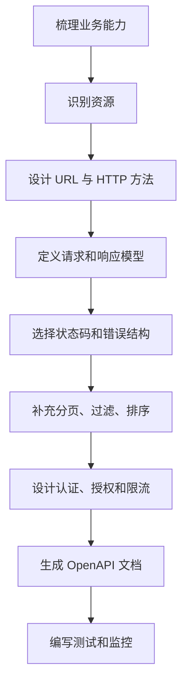

# RESTful API 讲解：从资源建模到接口落地

RESTful API 不是“把接口写成 `/getUser` 还是 `/users`”这么简单。它背后真正重要的是：用 HTTP 的语义表达资源操作，让接口在命名、状态、缓存、安全和演进上都更稳定。

## 1. REST 解决什么问题

假设一个订单系统提供这些接口：

```txt
/createOrder
/getOrderInfo
/updateOrderStatus
/deleteOrder
/queryOrderList
```

这些接口能用，但问题是接口语义完全靠路径里的动词表达。随着业务变多，很容易出现命名不一致：

```txt
/getUser
/findUsers
/queryProductList
/fetchOrderDetail
```

RESTful 的思路是把接口围绕“资源”来设计，再用 HTTP 方法表达动作。

```txt
GET    /orders       查询订单列表
POST   /orders       创建订单
GET    /orders/1001  查询单个订单
PATCH  /orders/1001  修改订单局部字段
DELETE /orders/1001  删除订单
```

资源是名词，动作交给 HTTP 方法。

## 2. 资源建模

RESTful API 的第一步不是写代码，而是找资源。

在一个电商系统里，常见资源有：

```txt
users
products
orders
payments
shipments
reviews
```

资源通常用复数名词：

```txt
/users
/products
/orders
```

嵌套资源用于表达从属关系：

```txt
GET /users/1/orders
GET /orders/1001/items
```

不要过度嵌套：

```txt
/companies/1/departments/2/users/3/orders/4/items
```

过深的路径会让接口难维护。一般超过两层就要考虑是否拆成查询参数：

```txt
GET /orders?companyId=1&departmentId=2&userId=3
```

## 3. HTTP 方法的语义

RESTful API 里，HTTP 方法本身就携带语义。

| 方法 | 含义 | 是否安全 | 是否幂等 |
| --- | --- | --- | --- |
| GET | 查询资源 | 是 | 是 |
| POST | 创建资源或提交动作 | 否 | 否 |
| PUT | 整体替换资源 | 否 | 是 |
| PATCH | 局部更新资源 | 否 | 通常取决于实现 |
| DELETE | 删除资源 | 否 | 是 |

安全是指不会改变服务器状态。幂等是指执行一次和执行多次的最终结果一致。

### GET

```http
GET /products/100
```

返回商品：

```json
{
  "id": 100,
  "name": "Keyboard",
  "price": 19900
}
```

GET 不应该产生业务副作用。不要用 GET 做删除：

```txt
GET /deleteOrder?id=1001
```

这种接口很危险，爬虫、预加载、浏览器插件都可能触发 GET。

### POST

```http
POST /orders
Content-Type: application/json

{
  "productId": 100,
  "quantity": 2
}
```

创建成功可以返回 `201 Created`：

```http
HTTP/1.1 201 Created
Location: /orders/1001
```

响应体：

```json
{
  "id": 1001,
  "status": "pending",
  "totalAmount": 39800
}
```

### PUT 和 PATCH

PUT 通常表示整体替换：

```http
PUT /users/1

{
  "name": "Alice",
  "email": "alice@example.com",
  "phone": "13800000000"
}
```

PATCH 表示局部更新：

```http
PATCH /users/1

{
  "phone": "13900000000"
}
```

如果只是修改一个字段，用 PATCH 更贴切。

## 4. 状态码设计

HTTP 状态码是 API 契约的一部分。

常用状态码：

| 状态码 | 场景 |
| --- | --- |
| 200 | 请求成功 |
| 201 | 资源创建成功 |
| 204 | 成功但无响应体 |
| 400 | 请求参数错误 |
| 401 | 未登录或令牌无效 |
| 403 | 已登录但无权限 |
| 404 | 资源不存在 |
| 409 | 资源冲突 |
| 422 | 语义校验失败 |
| 429 | 请求过于频繁 |
| 500 | 服务端异常 |

示例：

```json
{
  "code": "ORDER_NOT_FOUND",
  "message": "订单不存在",
  "requestId": "req_01HZ..."
}
```

不要所有错误都返回 `200`：

```json
{
  "success": false,
  "message": "未登录"
}
```

如果用户未登录，HTTP 层应该返回 `401`。业务字段可以补充错误详情，但不能替代状态码。

## 5. 列表查询、分页、过滤和排序

列表查询通常用 query string。

```http
GET /products?page=1&pageSize=20&keyword=keyboard&sort=-createdAt
```

响应：

```json
{
  "items": [
    {
      "id": 100,
      "name": "Keyboard"
    }
  ],
  "page": 1,
  "pageSize": 20,
  "total": 143
}
```

当数据量很大时，基于页码的分页可能越来越慢：

```sql
select * from orders
order by created_at desc
limit 20 offset 200000;
```

可以改成游标分页：

```http
GET /orders?limit=20&cursor=2026-06-01T10:00:00Z
```

响应：

```json
{
  "items": [],
  "nextCursor": "2026-06-01T09:58:12Z"
}
```

游标分页更适合时间线、消息流、订单流水等不断增长的数据。

## 6. 统一错误响应

一个实用的错误响应结构：

```json
{
  "code": "VALIDATION_ERROR",
  "message": "请求参数不合法",
  "details": [
    {
      "field": "email",
      "message": "邮箱格式错误"
    }
  ],
  "requestId": "req_01HZABC"
}
```

字段含义：

1. `code` 给前端做逻辑判断。
2. `message` 给用户或开发者看。
3. `details` 表示字段级错误。
4. `requestId` 用于日志追踪。

FastAPI 示例：

```python
from fastapi import FastAPI, Request
from fastapi.responses import JSONResponse

app = FastAPI()


class ApiError(Exception):
    def __init__(self, status_code: int, code: str, message: str):
        self.status_code = status_code
        self.code = code
        self.message = message


@app.exception_handler(ApiError)
async def api_error_handler(request: Request, exc: ApiError):
    return JSONResponse(
        status_code=exc.status_code,
        content={
            "code": exc.code,
            "message": exc.message,
            "requestId": request.headers.get("x-request-id")
        }
    )
```

业务里抛出：

```python
raise ApiError(404, "ORDER_NOT_FOUND", "订单不存在")
```

## 7. 认证和授权

REST API 常见认证方式：

1. Cookie Session。
2. Bearer Token。
3. API Key。
4. OAuth2 / OIDC。

Bearer Token 示例：

```http
GET /api/me
Authorization: Bearer eyJhbGciOi...
```

服务端校验后得到用户身份：

```python
from fastapi import Depends, Header, HTTPException


async def get_current_user(authorization: str | None = Header(default=None)):
    if not authorization or not authorization.startswith("Bearer "):
      raise HTTPException(status_code=401, detail="未登录")

    token = authorization.removeprefix("Bearer ").strip()
    user = verify_token(token)

    if not user:
        raise HTTPException(status_code=401, detail="令牌无效")

    return user
```

授权要在认证之后做：

```python
def require_permission(permission: str):
    async def dependency(user=Depends(get_current_user)):
        if permission not in user.permissions:
            raise HTTPException(status_code=403, detail="无权限")
        return user

    return dependency
```

## 8. 幂等性设计

POST 默认不幂等。重复提交订单可能创建两笔订单。

可以引入幂等键：

```http
POST /orders
Idempotency-Key: 6f3c7b0e-0c3c-4c9f
```

服务端保存幂等键和结果：

```python
def create_order(payload, idempotency_key: str):
    cached = find_idempotency_record(idempotency_key)

    if cached:
        return cached.response

    order = insert_order(payload)
    save_idempotency_record(idempotency_key, order)
    return order
```

适用场景：

1. 创建订单。
2. 发起支付。
3. 扣减库存。
4. 提交表单。

## 9. 版本管理

常见版本方式：

```txt
/api/v1/orders
/api/v2/orders
```

也可以放 Header：

```http
Accept: application/vnd.example.v2+json
```

简单项目用路径版本更直观。

版本升级时要避免直接破坏旧字段：

```json
{
  "id": 1,
  "name": "Alice",
  "avatarUrl": "https://..."
}
```

新增字段通常兼容，删除或改字段含义才需要版本升级。

## 10. OpenAPI 文档

RESTful API 需要文档，但文档最好来自代码和 schema。

FastAPI 会自动生成 OpenAPI：

```python
from fastapi import FastAPI
from pydantic import BaseModel

app = FastAPI(title="Order API")


class OrderCreate(BaseModel):
    product_id: int
    quantity: int


@app.post("/orders", status_code=201)
async def create_order(payload: OrderCreate):
    return {"id": 1, **payload.model_dump()}
```

启动后可以访问：

```txt
/docs
/openapi.json
```

文档自动化的价值是让前端、后端、测试、网关都围绕同一份契约协作。

## 11. RESTful API 设计流程



## 总结

RESTful API 的重点是把接口设计成稳定的资源契约。路径表达资源，HTTP 方法表达动作，状态码表达结果，响应体表达业务数据，错误结构表达可定位的问题。

设计得好的 REST API，不只前端好调用，后端也更容易做缓存、网关、审计、限流、监控和版本演进。
