# 单点登录 SSO 讲解：背景、原理与代码实现

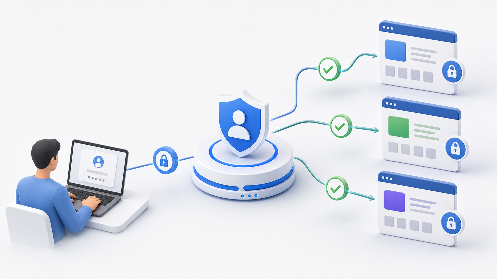

单点登录，英文是 Single Sign-On，简称 SSO。它解决的是一个很常见的问题：用户只登录一次，就可以访问多个互相信任的业务系统。

例如一个公司内部可能有这些系统：

1. OA 系统。
2. CRM 系统。
3. 报表系统。
4. 工单系统。
5. 文档系统。

如果每个系统都维护自己的账号、密码和登录页，用户体验会很差，安全治理也会很散。SSO 的目标就是把认证能力集中到一个统一的身份中心，由身份中心完成登录，业务系统只负责识别登录结果和做自己的授权判断。

## 1. 没有 SSO 时会遇到什么问题

最原始的多系统登录通常是这样：

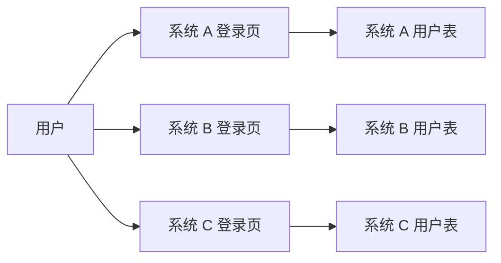

这种结构有几个明显问题。

第一，账号体系重复。每个系统都要保存用户、密码、角色、组织等信息，数据容易不一致。

第二，安全策略重复。密码强度、登录失败锁定、多因素认证、验证码、风险控制都要在每个系统实现一遍。

第三，用户体验割裂。用户访问系统 A 登录一次，访问系统 B 又要登录一次。

第四，退出不彻底。用户在一个系统退出了，其他系统可能仍然保持登录状态。

SSO 把登录能力抽到统一身份中心后，结构变成：

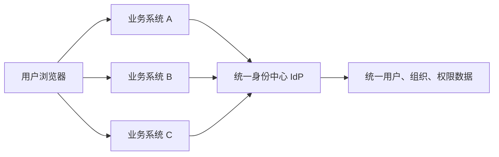

这里的身份中心常被称为 IdP，Identity Provider。业务系统常被称为 SP 或 Client，也就是 Service Provider / Client Application。

## 2. SSO 的核心角色

理解 SSO 先要分清几个角色。

### 用户

用户通过浏览器、App、桌面客户端访问业务系统。

在 Web 场景下，浏览器很关键，因为 Cookie、重定向、跨站跳转都是靠浏览器完成的。

### 业务系统

业务系统是真正提供业务功能的应用，例如 CRM、报表、工单系统。

它不直接处理账号密码，而是把用户引导到身份中心登录。登录完成后，业务系统根据身份中心返回的结果建立自己的本地会话。

### 身份中心

身份中心负责：

1. 展示统一登录页。
2. 校验账号密码、短信验证码、扫码、多因素认证。
3. 维护统一登录态。
4. 给业务系统签发令牌或票据。
5. 提供用户信息接口。
6. 处理统一退出。

### 浏览器会话

浏览器会保存身份中心和业务系统各自的 Cookie。

这点很重要：SSO 不是所有系统共用同一个 Cookie。跨域情况下，业务系统不能直接读取身份中心的 Cookie。它们通常是通过浏览器重定向和一次性授权码来完成登录状态传递。

## 3. 普通单系统登录先讲清楚

单点登录是建立在普通登录之上的。先看单系统登录：

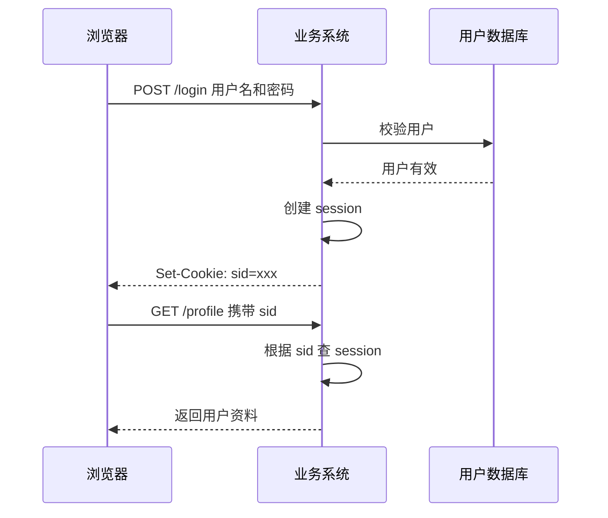

Node.js 里可以这样模拟：

```js
import express from 'express'
import cookieParser from 'cookie-parser'
import crypto from 'node:crypto'

const app = express()
const sessions = new Map()

app.use(express.json())
app.use(cookieParser())

function createSession(user) {
  const sid = crypto.randomUUID()
  sessions.set(sid, {
    user,
    createdAt: Date.now()
  })
  return sid
}

app.post('/login', async (req, res) => {
  const { username, password } = req.body

  if (username !== 'alice' || password !== '123456') {
    return res.status(401).json({ message: '用户名或密码错误' })
  }

  const sid = createSession({
    id: 'u_1',
    name: 'Alice'
  })

  res.cookie('sid', sid, {
    httpOnly: true,
    sameSite: 'lax',
    secure: true,
    maxAge: 2 * 60 * 60 * 1000
  })

  res.json({ ok: true })
})

app.get('/profile', (req, res) => {
  const session = sessions.get(req.cookies.sid)

  if (!session) {
    return res.status(401).json({ message: '未登录' })
  }

  res.json(session.user)
})
```

这个模式只适用于一个系统。多个系统时，`app-a.example.com` 的 Cookie 默认不能给 `app-b.example.com` 使用，更不能给完全不同域名的系统使用。

SSO 的关键就在于：如何让一个系统知道用户已经在身份中心登录过，并且安全地为这个用户建立本系统会话。

## 4. SSO 的基本思路

用户访问业务系统 A，业务系统 A 发现用户没有本地会话，就把用户重定向到身份中心。

如果用户在身份中心还没登录，身份中心展示登录页。登录成功后，身份中心保存自己的登录态，然后带着一个临时凭证跳回业务系统 A。

业务系统 A 拿临时凭证去身份中心换取用户身份，确认无误后建立自己的本地会话。

之后用户访问业务系统 B，业务系统 B 也把用户重定向到身份中心。身份中心发现用户已经登录过，不再要求输入密码，直接签发新的临时凭证给系统 B。系统 B 再建立自己的本地会话。

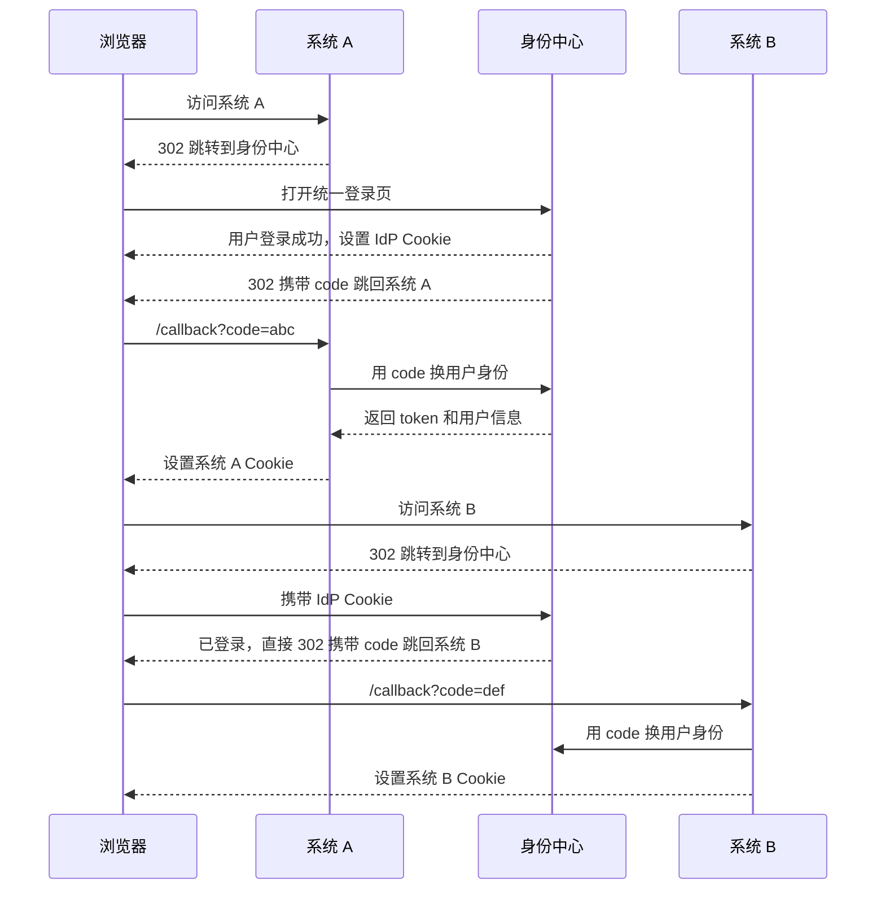

注意这里有三类登录态：

1. 身份中心自己的登录态。
2. 系统 A 的本地登录态。
3. 系统 B 的本地登录态。

用户感觉只登录了一次，是因为后续系统都借助身份中心的登录态完成了静默登录。

## 5. 为什么不能直接把用户信息放在 URL 里

一种看似简单的做法是：

```txt
https://app.example.com/callback?userId=u_1&name=Alice
```

这非常危险，因为 URL 可以被篡改。攻击者可以自己拼一个：

```txt
https://app.example.com/callback?userId=admin
```

所以 SSO 不能直接相信浏览器带回来的用户信息。正确做法是使用一次性 `code`，业务系统后端再用这个 `code` 去身份中心后端换取身份。

```txt
浏览器只负责传递 code
业务系统后端负责用 code 换 token
身份中心后端负责校验 code
```

这样浏览器看不到关键密钥，也不能直接伪造用户身份。

## 6. OAuth2 授权码模式和 OIDC

现代 Web SSO 最常见的协议组合是 OAuth2 Authorization Code Flow + OpenID Connect。

OAuth2 原本解决的是授权问题，例如允许第三方应用访问某个用户的资源。OIDC 建立在 OAuth2 之上，补充了身份认证能力。

简单理解：

1. OAuth2 负责发放访问资源的 `access_token`。
2. OIDC 负责证明用户是谁，核心是 `id_token`。

典型授权码流程：

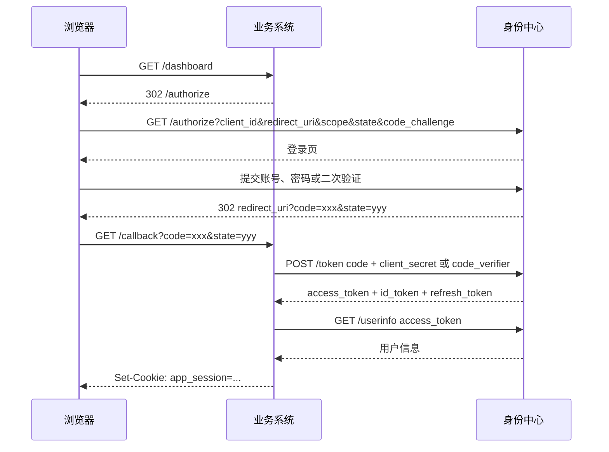

几个参数要特别注意。

### client_id

业务系统在身份中心注册后的应用标识。

```json
{
  "client_id": "crm-web",
  "client_name": "CRM 系统",
  "redirect_uris": [
    "https://crm.example.com/auth/callback"
  ]
}
```

身份中心会校验 `client_id` 和 `redirect_uri` 是否匹配，避免授权码被发到未知地址。

### redirect_uri

登录完成后跳回业务系统的地址。它必须提前注册，不能让调用方随便传。

错误做法：

```js
// 不要接受任意 redirect_uri
const redirectUri = req.query.redirect_uri
```

正确做法：

```js
const registeredClient = await getClient(clientId)

if (!registeredClient.redirectUris.includes(redirectUri)) {
  return res.status(400).send('invalid redirect_uri')
}
```

### state

`state` 用来防止 CSRF，并保存登录前的跳转目标。

业务系统发起登录前生成：

```js
const state = crypto.randomUUID()

req.session.oauthState = state

const loginUrl = new URL('https://idp.example.com/oauth/authorize')
loginUrl.searchParams.set('response_type', 'code')
loginUrl.searchParams.set('client_id', 'crm-web')
loginUrl.searchParams.set('redirect_uri', 'https://crm.example.com/auth/callback')
loginUrl.searchParams.set('scope', 'openid profile email')
loginUrl.searchParams.set('state', state)
```

回调时校验：

```js
app.get('/auth/callback', async (req, res) => {
  const { code, state } = req.query

  if (!state || state !== req.session.oauthState) {
    return res.status(400).send('invalid state')
  }

  // 继续用 code 换 token
})
```

### scope

`scope` 表示业务系统想要哪些权限或用户信息。

OIDC 常见 scope：

```txt
openid profile email
```

其中 `openid` 表示这是一次 OIDC 登录请求。

### code_challenge 和 code_verifier

这是 PKCE 机制，用来防止授权码被截获后直接换 token。

业务系统发起登录前生成 `code_verifier`：

```js
import crypto from 'node:crypto'

function base64Url(buffer) {
  return buffer
    .toString('base64')
    .replace(/\+/g, '-')
    .replace(/\//g, '_')
    .replace(/=+$/, '')
}

function createPkcePair() {
  const verifier = base64Url(crypto.randomBytes(32))
  const challenge = base64Url(
    crypto.createHash('sha256').update(verifier).digest()
  )

  return {
    codeVerifier: verifier,
    codeChallenge: challenge
  }
}
```

发起授权时传 `code_challenge`：

```js
const { codeVerifier, codeChallenge } = createPkcePair()

req.session.codeVerifier = codeVerifier

loginUrl.searchParams.set('code_challenge', codeChallenge)
loginUrl.searchParams.set('code_challenge_method', 'S256')
```

用 code 换 token 时传 `code_verifier`：

```js
const tokenRes = await fetch('https://idp.example.com/oauth/token', {
  method: 'POST',
  headers: {
    'content-type': 'application/x-www-form-urlencoded'
  },
  body: new URLSearchParams({
    grant_type: 'authorization_code',
    client_id: 'crm-web',
    code,
    redirect_uri: 'https://crm.example.com/auth/callback',
    code_verifier: req.session.codeVerifier
  })
})
```

身份中心会重新计算 `code_verifier` 的哈希，与最初保存的 `code_challenge` 对比。对不上就拒绝换 token。

## 7. ID Token、Access Token、Refresh Token 的区别

SSO 场景里经常会看到三个 token。

### ID Token

`id_token` 是 OIDC 中用于证明用户身份的令牌，通常是 JWT。

它回答的问题是：用户是谁。

典型内容：

```json
{
  "iss": "https://idp.example.com",
  "sub": "u_10001",
  "aud": "crm-web",
  "exp": 1779955200,
  "iat": 1779951600,
  "name": "Alice",
  "email": "alice@example.com"
}
```

业务系统需要校验：

1. 签名是否正确。
2. `iss` 是否是可信身份中心。
3. `aud` 是否是当前系统的 `client_id`。
4. `exp` 是否过期。
5. `nonce` 是否匹配。

### Access Token

`access_token` 用来访问资源接口。

它回答的问题是：调用方能访问什么资源。

例如业务系统调用身份中心用户信息接口：

```js
const userInfoRes = await fetch('https://idp.example.com/oauth/userinfo', {
  headers: {
    authorization: `Bearer ${accessToken}`
  }
})
```

### Refresh Token

`refresh_token` 用来在 access token 过期后换取新的 access token。

它的生命周期更长，安全要求也更高。Web 后端应用可以把 refresh token 存在服务端，不要直接暴露给浏览器 JavaScript。

## 8. 业务系统如何接入 SSO

下面用一个 Express 业务系统模拟接入 OIDC。

### 登录入口

```js
import express from 'express'
import session from 'express-session'
import crypto from 'node:crypto'

const app = express()

app.use(session({
  secret: process.env.SESSION_SECRET,
  resave: false,
  saveUninitialized: false,
  cookie: {
    httpOnly: true,
    secure: true,
    sameSite: 'lax'
  }
}))

const idpBaseUrl = 'https://idp.example.com'
const clientId = 'crm-web'
const redirectUri = 'https://crm.example.com/auth/callback'

app.get('/auth/login', (req, res) => {
  const state = crypto.randomUUID()
  const nonce = crypto.randomUUID()
  const { codeVerifier, codeChallenge } = createPkcePair()

  req.session.oauth = {
    state,
    nonce,
    codeVerifier,
    returnTo: req.query.returnTo || '/'
  }

  const url = new URL(`${idpBaseUrl}/oauth/authorize`)
  url.searchParams.set('response_type', 'code')
  url.searchParams.set('client_id', clientId)
  url.searchParams.set('redirect_uri', redirectUri)
  url.searchParams.set('scope', 'openid profile email')
  url.searchParams.set('state', state)
  url.searchParams.set('nonce', nonce)
  url.searchParams.set('code_challenge', codeChallenge)
  url.searchParams.set('code_challenge_method', 'S256')

  res.redirect(url.toString())
})
```

### 登录回调

```js
app.get('/auth/callback', async (req, res, next) => {
  try {
    const { code, state } = req.query
    const oauth = req.session.oauth

    if (!oauth || state !== oauth.state) {
      return res.status(400).send('invalid state')
    }

    const tokenRes = await fetch(`${idpBaseUrl}/oauth/token`, {
      method: 'POST',
      headers: {
        'content-type': 'application/x-www-form-urlencoded'
      },
      body: new URLSearchParams({
        grant_type: 'authorization_code',
        client_id: clientId,
        redirect_uri: redirectUri,
        code,
        code_verifier: oauth.codeVerifier
      })
    })

    if (!tokenRes.ok) {
      return res.status(401).send('token exchange failed')
    }

    const tokens = await tokenRes.json()
    const claims = await verifyIdToken(tokens.id_token, {
      issuer: idpBaseUrl,
      audience: clientId,
      nonce: oauth.nonce
    })

    req.session.user = {
      id: claims.sub,
      name: claims.name,
      email: claims.email
    }

    const returnTo = oauth.returnTo || '/'
    delete req.session.oauth

    res.redirect(returnTo)
  } catch (error) {
    next(error)
  }
})
```

### 保护业务路由

```js
function requireLogin(req, res, next) {
  if (req.session.user) {
    return next()
  }

  const returnTo = encodeURIComponent(req.originalUrl)
  res.redirect(`/auth/login?returnTo=${returnTo}`)
}

app.get('/dashboard', requireLogin, (req, res) => {
  res.json({
    message: `hello ${req.session.user.name}`
  })
})
```

业务系统最终仍然建立了自己的本地 session。它没有每次请求都去身份中心校验，这样性能更好，也能把系统自己的权限数据挂在本地会话上。

## 9. 身份中心如何实现授权码

身份中心需要维护应用、用户、登录态、授权码。

可以用数据库表描述：

```sql
create table oauth_clients (
  id text primary key,
  name text not null,
  redirect_uris jsonb not null,
  client_secret_hash text,
  created_at timestamptz not null default now()
);

create table authorization_codes (
  code text primary key,
  client_id text not null,
  user_id text not null,
  redirect_uri text not null,
  scope text not null,
  code_challenge text,
  code_challenge_method text,
  nonce text,
  expires_at timestamptz not null,
  consumed_at timestamptz
);
```

### /authorize 接口

```js
idp.get('/oauth/authorize', async (req, res) => {
  const {
    client_id: clientId,
    redirect_uri: redirectUri,
    response_type: responseType,
    scope,
    state,
    nonce,
    code_challenge: codeChallenge,
    code_challenge_method: codeChallengeMethod
  } = req.query

  if (responseType !== 'code') {
    return res.status(400).send('unsupported response_type')
  }

  const client = await findClient(clientId)

  if (!client || !client.redirectUris.includes(redirectUri)) {
    return res.status(400).send('invalid client or redirect_uri')
  }

  const loginSession = await getLoginSession(req.cookies.idp_sid)

  if (!loginSession) {
    const currentUrl = req.originalUrl
    return res.redirect(`/login?returnTo=${encodeURIComponent(currentUrl)}`)
  }

  const code = crypto.randomUUID()

  await saveAuthorizationCode({
    code,
    clientId,
    userId: loginSession.userId,
    redirectUri,
    scope,
    nonce,
    codeChallenge,
    codeChallengeMethod,
    expiresAt: new Date(Date.now() + 5 * 60 * 1000)
  })

  const callbackUrl = new URL(redirectUri)
  callbackUrl.searchParams.set('code', code)
  callbackUrl.searchParams.set('state', state)

  res.redirect(callbackUrl.toString())
})
```

授权码必须满足：

1. 有效期很短，通常几分钟。
2. 只能使用一次。
3. 和 `client_id`、`redirect_uri`、`code_challenge` 绑定。

### /token 接口

```js
idp.post('/oauth/token', async (req, res) => {
  const {
    grant_type: grantType,
    client_id: clientId,
    code,
    redirect_uri: redirectUri,
    code_verifier: codeVerifier
  } = req.body

  if (grantType !== 'authorization_code') {
    return res.status(400).json({ error: 'unsupported_grant_type' })
  }

  const authCode = await findAuthorizationCode(code)

  if (!authCode || authCode.consumedAt || authCode.expiresAt < new Date()) {
    return res.status(400).json({ error: 'invalid_grant' })
  }

  if (authCode.clientId !== clientId || authCode.redirectUri !== redirectUri) {
    return res.status(400).json({ error: 'invalid_grant' })
  }

  if (!verifyPkce(codeVerifier, authCode.codeChallenge)) {
    return res.status(400).json({ error: 'invalid_grant' })
  }

  await consumeAuthorizationCode(code)

  const user = await findUser(authCode.userId)

  const idToken = signJwt({
    iss: 'https://idp.example.com',
    sub: user.id,
    aud: clientId,
    name: user.name,
    email: user.email,
    nonce: authCode.nonce,
    iat: Math.floor(Date.now() / 1000),
    exp: Math.floor(Date.now() / 1000) + 3600
  })

  const accessToken = signJwt({
    iss: 'https://idp.example.com',
    sub: user.id,
    aud: 'idp-api',
    scope: authCode.scope,
    iat: Math.floor(Date.now() / 1000),
    exp: Math.floor(Date.now() / 1000) + 1800
  })

  res.json({
    token_type: 'Bearer',
    expires_in: 1800,
    access_token: accessToken,
    id_token: idToken
  })
})
```

PKCE 校验：

```js
function verifyPkce(codeVerifier, expectedChallenge) {
  if (!codeVerifier || !expectedChallenge) return false

  const actualChallenge = base64Url(
    crypto.createHash('sha256').update(codeVerifier).digest()
  )

  return crypto.timingSafeEqual(
    Buffer.from(actualChallenge),
    Buffer.from(expectedChallenge)
  )
}
```

这里使用 `timingSafeEqual` 是为了避免普通字符串比较带来的计时侧信道风险。

## 10. 前端应用如何处理登录态

如果业务系统是前后端分离应用，推荐让后端完成 OIDC 回调和 token 交换，然后给浏览器设置 HttpOnly Cookie。

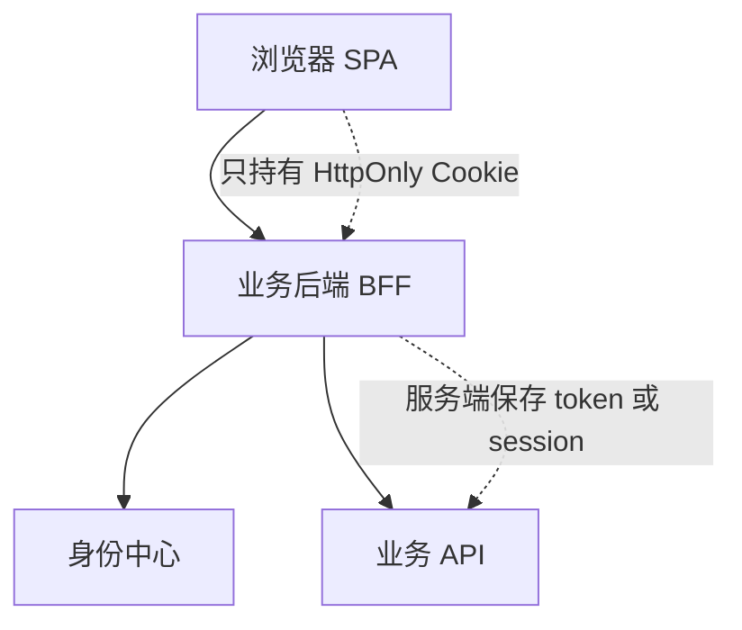

这种结构常被称为 BFF，Backend For Frontend。

前端只需要判断当前是否有会话：

```js
export async function getCurrentUser() {
  const res = await fetch('/api/me', {
    credentials: 'include'
  })

  if (res.status === 401) {
    return null
  }

  return res.json()
}
```

路由守卫：

```js
router.beforeEach(async (to) => {
  const user = await getCurrentUser()

  if (!user) {
    const returnTo = encodeURIComponent(to.fullPath)
    window.location.href = `/auth/login?returnTo=${returnTo}`
    return false
  }

  return true
})
```

后端提供 `/api/me`：

```js
app.get('/api/me', (req, res) => {
  if (!req.session.user) {
    return res.status(401).json({ message: '未登录' })
  }

  res.json(req.session.user)
})
```

不推荐把 `access_token` 长期放在 `localStorage`。一旦页面存在 XSS 漏洞，攻击者可以直接读取 token。HttpOnly Cookie 至少能阻止 JavaScript 直接读取 Cookie 内容。

## 11. 同域、子域和跨域下 Cookie 的差异

如果所有系统都在同一个主域下：

```txt
idp.example.com
crm.example.com
oa.example.com
report.example.com
```

可以让身份中心 Cookie 设置在自己的域名：

```txt
Set-Cookie: idp_sid=xxx; Domain=idp.example.com; HttpOnly; Secure; SameSite=Lax
```

业务系统无法直接读这个 Cookie，但跳转到 `idp.example.com` 时浏览器会自动带上它。

如果想让多个子域共享某个 Cookie，可以设置：

```txt
Domain=.example.com
```

但这通常不建议用于共享核心登录态，因为任何子域风险都会影响整个主域。更稳妥的做法是：身份中心只维护自己的 Cookie，业务系统维护自己的 Cookie，通过协议完成登录态传递。

跨主域场景：

```txt
idp.company-auth.com
crm.example.com
report.example.net
```

这时更依赖标准 OIDC/SAML 流程。不要试图通过共享 Cookie 解决，因为浏览器不会允许不同站点随意读写彼此的 Cookie。

## 12. CAS、SAML、OAuth2/OIDC 的区别

SSO 不是只有一种协议。常见协议有 CAS、SAML、OAuth2/OIDC。

### CAS

CAS 是 Central Authentication Service。它的思想非常直观：

1. 用户访问业务系统。
2. 业务系统跳到 CAS Server。
3. CAS Server 登录后签发 Service Ticket。
4. 业务系统拿 Service Ticket 到 CAS Server 校验。
5. 校验成功后建立本地会话。

CAS 流程：

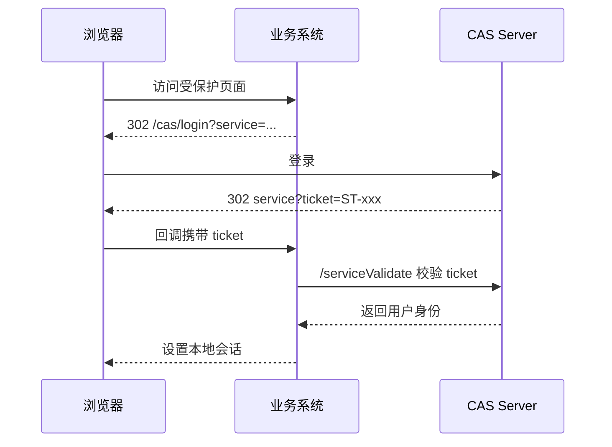

CAS 在企业内部系统里比较常见，模型简单，适合传统 Web 应用。

### SAML

SAML 是基于 XML 的身份联邦协议，常见于企业 SaaS 登录。

它的核心是 Assertion，也就是身份断言。身份中心生成一个经过签名的 XML，业务系统验证签名后信任其中的用户身份。

特点：

1. 企业软件支持广。
2. XML 格式比较重。
3. 配置中常涉及证书、Entity ID、ACS URL。

### OAuth2/OIDC

OAuth2/OIDC 更适合现代 Web、移动端、开放平台和 API 场景。

特点：

1. JSON 和 JWT 更轻量。
2. 适合前后端分离。
3. 生态广，云厂商和身份平台普遍支持。
4. 可以同时处理登录和 API 授权。

简单选择：

```txt
传统企业内部 Web 单点登录
  CAS 可以胜任

企业 SaaS 与身份提供商对接
  SAML 很常见

现代 Web、App、开放 API
  OAuth2 + OIDC 更常用
```

## 13. 单点退出如何做

SSO 登录相对容易，退出更复杂。

用户点击退出时，至少要清理：

1. 当前业务系统本地会话。
2. 身份中心登录态。
3. 其他已登录业务系统的本地会话。

最简单的退出只清当前系统：

```js
app.post('/auth/logout', (req, res) => {
  req.session.destroy(() => {
    res.clearCookie('connect.sid')
    res.json({ ok: true })
  })
})
```

这不是完整单点退出。用户访问其他系统时可能仍然是登录状态。

常见单点退出方案有三种。

### 前通道退出

身份中心通过浏览器访问各业务系统的退出地址。

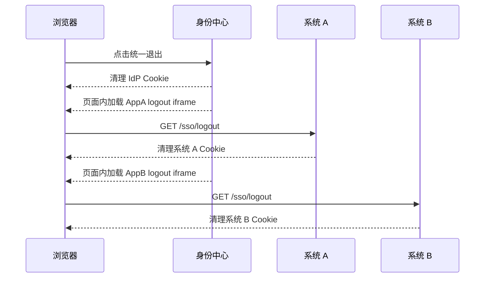

优点是实现直观。缺点是依赖浏览器和第三方 Cookie 策略，稳定性一般。

### 后通道退出

身份中心直接从服务端通知业务系统。

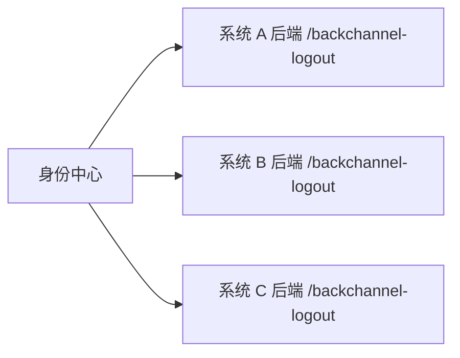

业务系统收到通知后，根据用户 id 或 session id 清理本地会话。

```js
app.post('/backchannel-logout', async (req, res) => {
  const logoutToken = req.body.logout_token
  const claims = await verifyLogoutToken(logoutToken)

  await deleteSessionsByUserId(claims.sub)

  res.status(204).end()
})
```

后通道更可靠，但要求业务系统维护“用户和本地 session 的映射”。

### 短会话 + 静默续期

有些系统不追求强实时退出，而是让业务系统本地 session 较短，并定期回到身份中心确认登录态。

这样实现简单，但退出传播不是实时的。

## 14. 权限不是登录本身

SSO 只解决“用户是谁”，不等于解决“用户能做什么”。

登录成功后，业务系统还要做授权。

例如：

```js
function requirePermission(permission) {
  return (req, res, next) => {
    const permissions = req.session.user?.permissions || []

    if (!permissions.includes(permission)) {
      return res.status(403).json({ message: '无权限' })
    }

    next()
  }
}

app.delete(
  '/api/orders/:id',
  requireLogin,
  requirePermission('order:delete'),
  deleteOrder
)
```

权限数据可以来自身份中心，也可以由业务系统自己维护。

常见做法：

1. 身份中心维护用户、组织、全局角色。
2. 业务系统维护本系统的细粒度权限。
3. 登录后根据用户 id 查询业务权限并缓存到本地 session。

不要把大量细粒度权限全部塞进 JWT，令牌会变大，权限变更也不容易实时生效。

## 15. 安全细节清单

SSO 是安全基础设施，下面这些点不能忽略。

### redirect_uri 必须白名单校验

不要允许任意跳转地址，否则会产生开放重定向漏洞。

```js
if (!client.redirectUris.includes(redirectUri)) {
  throw new Error('invalid redirect_uri')
}
```

### code 必须短期、一次性、绑定客户端

授权码泄露的风险要靠这些约束降低：

1. 5 分钟内过期。
2. 使用后立即作废。
3. 绑定 `client_id`。
4. 绑定 `redirect_uri`。
5. 绑定 PKCE。

### Cookie 设置要稳妥

```js
res.cookie('sid', sid, {
  httpOnly: true,
  secure: true,
  sameSite: 'lax',
  maxAge: 2 * 60 * 60 * 1000
})
```

含义：

1. `HttpOnly`：前端 JS 不能读取。
2. `Secure`：只在 HTTPS 下发送。
3. `SameSite=Lax`：降低 CSRF 风险，同时允许常规顶层跳转携带 Cookie。

### state 和 nonce 都要校验

`state` 主要防 CSRF，`nonce` 主要防 ID Token 重放。

发起登录：

```js
req.session.oauth = {
  state: crypto.randomUUID(),
  nonce: crypto.randomUUID()
}
```

回调校验：

```js
if (req.query.state !== req.session.oauth.state) {
  throw new Error('invalid state')
}

if (idTokenClaims.nonce !== req.session.oauth.nonce) {
  throw new Error('invalid nonce')
}
```

### JWT 不能只解码不验签

错误做法：

```js
const claims = JSON.parse(
  Buffer.from(idToken.split('.')[1], 'base64url').toString()
)
```

这只是解码，不是验证。任何人都可以伪造 payload。

正确做法是用身份中心的公钥验证签名，并校验 issuer、audience、exp。

```js
import { jwtVerify, createRemoteJWKSet } from 'jose'

const jwks = createRemoteJWKSet(
  new URL('https://idp.example.com/.well-known/jwks.json')
)

async function verifyIdToken(idToken) {
  const { payload } = await jwtVerify(idToken, jwks, {
    issuer: 'https://idp.example.com',
    audience: 'crm-web'
  })

  return payload
}
```

### 全站必须使用 HTTPS

SSO 里有授权码、Cookie、Token、用户资料。只要有一段链路不是 HTTPS，就可能被窃听或篡改。

生产环境不要允许明文 HTTP 登录回调。

## 16. 一个最小可落地架构

中小型 Web 系统可以从下面这个架构开始：

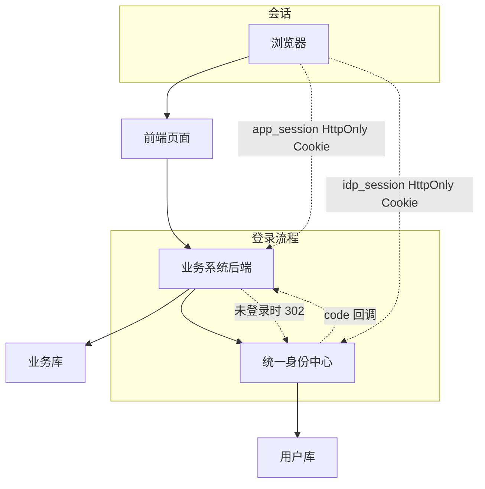

落地步骤：

1. 搭建身份中心，统一用户、组织、登录策略。
2. 给每个业务系统注册 `client_id` 和 `redirect_uri`。
3. 业务系统实现 `/auth/login` 和 `/auth/callback`。
4. 使用授权码 + PKCE 换 token。
5. 校验 `id_token` 后建立本地 session。
6. 前端通过 `/api/me` 判断当前登录用户。
7. 业务接口用本地 session 做登录校验。
8. 权限由业务系统或权限中心补充。
9. 退出时同时清理本地 session 和身份中心 session。

## 17. 常见问题

### SSO 是不是必须用 JWT

不是。SSO 是登录体系，JWT 只是令牌格式之一。

CAS 可以用 Service Ticket，SAML 可以用 XML Assertion，OIDC 常用 JWT 格式的 ID Token。

### 业务系统是否每次请求都要校验身份中心

通常不需要。业务系统在回调时完成身份校验，然后建立自己的本地 session。后续请求查本地 session 即可。

如果安全要求很高，可以缩短 session 生命周期，或者定期检查身份中心登录态。

### access_token 可以放 localStorage 吗

能放，但风险较高。更推荐 BFF 模式：token 存后端，浏览器只拿 HttpOnly Cookie。

如果必须在前端保存 token，要重点防 XSS，并使用较短过期时间。

### 单点登录和单点退出是不是一回事

不是。单点登录是让多个系统共享认证结果，单点退出是让多个系统同步清理登录态。退出传播比登录更难，需要额外设计。

## 总结

SSO 的核心不是“共享一个 Cookie”，而是“让多个业务系统信任同一个身份中心”。

在现代 Web 项目里，推荐用 OAuth2 授权码模式 + OIDC，并配合 PKCE、state、nonce、redirect_uri 白名单、JWT 验签和 HTTPS。业务系统不要直接处理账号密码，而是把用户引导到身份中心登录，回调后用授权码换取身份，再建立自己的本地 session。

这样既能让用户只登录一次，也能把账号安全、登录策略、多因素认证、审计和权限基础数据集中治理起来。
