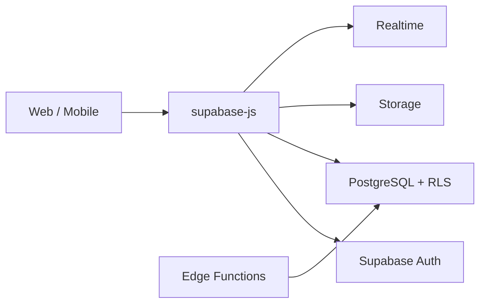

# Supabase 使用教程：从数据库、登录鉴权到存储、实时订阅和 Edge Functions

Supabase 可以理解为一套围绕 PostgreSQL 构建的后端平台。它把数据库、登录鉴权、行级权限、文件存储、实时订阅、自动生成 API、Edge Functions 等能力组合在一起，让前端或全栈项目可以更快搭出一个可用后端。

它解决的问题不是“让你不用理解后端”，而是把大量通用后端能力产品化：

- 数据库：基于 PostgreSQL。
- Auth：邮箱、密码、OAuth、Magic Link、JWT 会话。
- Row Level Security：在数据库层控制每一行谁能读写。
- Storage：上传头像、图片、附件等文件。
- Realtime：订阅数据库变化或广播事件。
- Edge Functions：写少量服务端逻辑，处理 Webhook、签名、私密操作。



本文用一个“团队任务管理”小项目串起来：用户可以注册登录，创建团队、创建任务、上传附件，并实时看到任务变化。

## 1. Supabase 和普通后端的区别

传统做法：

```txt
前端 -> 自己写的 API 服务 -> 数据库
```

Supabase 常见做法：

```txt
前端 -> Supabase API -> PostgreSQL
```

这并不代表所有逻辑都应该放前端。正确边界是：

- 普通 CRUD、个人数据访问、列表查询：可以直接用 Supabase 客户端。
- 权限控制：尽量放到数据库 RLS。
- 私密密钥、支付回调、复杂事务、跨服务调用：放到 Edge Functions 或自己的后端。

Supabase 的核心思想是：数据库不再只是后端内部资源，而是通过权限策略安全地暴露出一部分能力。

## 2. 创建项目和安装客户端

安装：

```bash
pnpm add @supabase/supabase-js
```

环境变量：

```env
VITE_SUPABASE_URL=https://your-project.supabase.co
VITE_SUPABASE_ANON_KEY=your-anon-key
```

浏览器客户端：

```ts
// src/lib/supabase.ts
import { createClient } from '@supabase/supabase-js'

export const supabase = createClient(
  import.meta.env.VITE_SUPABASE_URL,
  import.meta.env.VITE_SUPABASE_ANON_KEY
)
```

`anon key` 可以放前端，但它不是“无限权限”。真正的权限应该由 RLS 策略控制。`service_role key` 权限很高，只能放在服务端环境，不能打包到浏览器。

## 3. 数据库表设计

先设计三张表：

- `teams`：团队。
- `team_members`：团队成员。
- `tasks`：任务。

SQL：

```sql
create table public.teams (
  id uuid primary key default gen_random_uuid(),
  name text not null,
  owner_id uuid not null references auth.users(id) on delete cascade,
  created_at timestamptz not null default now()
);

create table public.team_members (
  team_id uuid not null references public.teams(id) on delete cascade,
  user_id uuid not null references auth.users(id) on delete cascade,
  role text not null check (role in ('owner', 'member')),
  joined_at timestamptz not null default now(),
  primary key (team_id, user_id)
);

create table public.tasks (
  id uuid primary key default gen_random_uuid(),
  team_id uuid not null references public.teams(id) on delete cascade,
  title text not null,
  description text,
  status text not null default 'todo' check (status in ('todo', 'doing', 'done')),
  assignee_id uuid references auth.users(id) on delete set null,
  created_by uuid not null references auth.users(id) on delete cascade,
  created_at timestamptz not null default now(),
  updated_at timestamptz not null default now()
);

create index tasks_team_id_status_idx on public.tasks (team_id, status);
create index team_members_user_id_idx on public.team_members (user_id);
```

这里直接引用 `auth.users(id)`，说明业务表和 Supabase Auth 用户打通了。

## 4. RLS：Supabase 最重要的安全机制

如果前端可以直接访问数据库 API，那权限必须在数据库层控制。Supabase 推荐开启 Row Level Security。

```sql
alter table public.teams enable row level security;
alter table public.team_members enable row level security;
alter table public.tasks enable row level security;
```

先写一个辅助函数，判断当前登录用户是否属于某个团队：

```sql
create or replace function public.is_team_member(team_id uuid)
returns boolean
language sql
security definer
set search_path = public
as $$
  select exists (
    select 1
    from public.team_members
    where team_members.team_id = is_team_member.team_id
      and team_members.user_id = auth.uid()
  );
$$;
```

团队读取策略：

```sql
create policy "members can read teams"
on public.teams
for select
using (
  public.is_team_member(id)
);
```

创建团队策略：

```sql
create policy "authenticated users can create teams"
on public.teams
for insert
to authenticated
with check (
  owner_id = auth.uid()
);
```

任务读取策略：

```sql
create policy "team members can read tasks"
on public.tasks
for select
using (
  public.is_team_member(team_id)
);
```

任务创建策略：

```sql
create policy "team members can create tasks"
on public.tasks
for insert
to authenticated
with check (
  public.is_team_member(team_id)
  and created_by = auth.uid()
);
```

任务更新策略：

```sql
create policy "team members can update tasks"
on public.tasks
for update
using (
  public.is_team_member(team_id)
)
with check (
  public.is_team_member(team_id)
);
```

RLS 的思路是：

- `using` 控制哪些行可见、可更新、可删除。
- `with check` 控制插入或更新后的新行是否合法。
- `auth.uid()` 表示当前登录用户 ID。

如果 RLS 写错，即使前端页面隐藏了按钮，用户仍可能直接调用 API 修改数据。所以安全边界要放在 RLS，而不是只放 UI。

## 5. 注册、登录和获取当前用户

注册：

```ts
import { supabase } from './supabase'

export async function signUp(email: string, password: string) {
  const { data, error } = await supabase.auth.signUp({
    email,
    password
  })

  if (error) throw error
  return data.user
}
```

登录：

```ts
export async function signIn(email: string, password: string) {
  const { data, error } = await supabase.auth.signInWithPassword({
    email,
    password
  })

  if (error) throw error
  return data.session
}
```

获取当前用户：

```ts
export async function getCurrentUser() {
  const { data, error } = await supabase.auth.getUser()
  if (error) throw error
  return data.user
}
```

监听登录状态：

```ts
supabase.auth.onAuthStateChange((event, session) => {
  console.log(event, session?.user?.id)
})
```

实际项目里，要把 session 状态接入路由守卫或全局状态管理。

## 6. 创建团队：数据库事务放在哪里

创建团队后，还要把创建者加入 `team_members`。这是一个多表写入，推荐放到数据库函数中，保证事务一致。

```sql
create or replace function public.create_team(team_name text)
returns public.teams
language plpgsql
security definer
set search_path = public
as $$
declare
  new_team public.teams;
begin
  insert into public.teams (name, owner_id)
  values (team_name, auth.uid())
  returning * into new_team;

  insert into public.team_members (team_id, user_id, role)
  values (new_team.id, auth.uid(), 'owner');

  return new_team;
end;
$$;
```

前端调用 RPC：

```ts
export async function createTeam(name: string) {
  const { data, error } = await supabase.rpc('create_team', {
    team_name: name
  })

  if (error) throw error
  return data
}
```

多步骤业务不要散落在前端连续调用多个 insert。只要中途失败，就容易出现半完成状态。

## 7. 查询任务列表

```ts
export async function listTasks(teamId: string) {
  const { data, error } = await supabase
    .from('tasks')
    .select('id,title,description,status,assignee_id,created_at,updated_at')
    .eq('team_id', teamId)
    .order('created_at', { ascending: false })

  if (error) throw error
  return data
}
```

创建任务：

```ts
export async function createTask(input: {
  teamId: string
  title: string
  description?: string
}) {
  const user = await getCurrentUser()
  if (!user) throw new Error('not signed in')

  const { data, error } = await supabase
    .from('tasks')
    .insert({
      team_id: input.teamId,
      title: input.title,
      description: input.description,
      created_by: user.id
    })
    .select()
    .single()

  if (error) throw error
  return data
}
```

更新任务状态：

```ts
export async function updateTaskStatus(taskId: string, status: 'todo' | 'doing' | 'done') {
  const { data, error } = await supabase
    .from('tasks')
    .update({
      status,
      updated_at: new Date().toISOString()
    })
    .eq('id', taskId)
    .select()
    .single()

  if (error) throw error
  return data
}
```

这些 API 能否成功，不取决于前端有没有传对字段，而取决于 RLS 是否允许当前用户操作对应行。

## 8. TypeScript 类型生成

Supabase 可以从数据库 schema 生成类型。生成后创建强类型客户端：

```ts
import { createClient } from '@supabase/supabase-js'
import type { Database } from './database.types'

export const supabase = createClient<Database>(
  import.meta.env.VITE_SUPABASE_URL,
  import.meta.env.VITE_SUPABASE_ANON_KEY
)
```

这样 `.from('tasks')`、字段名、返回值都会有类型提示。数据库结构变化后要重新生成类型，避免前端类型和真实表结构脱节。

## 9. 文件上传：Storage

创建一个 bucket，例如 `task-attachments`。上传文件：

```ts
export async function uploadTaskAttachment(taskId: string, file: File) {
  const user = await getCurrentUser()
  if (!user) throw new Error('not signed in')

  const fileExt = file.name.split('.').pop()
  const path = `${user.id}/${taskId}/${crypto.randomUUID()}.${fileExt}`

  const { data, error } = await supabase.storage
    .from('task-attachments')
    .upload(path, file, {
      cacheControl: '3600',
      upsert: false
    })

  if (error) throw error
  return data.path
}
```

获取公开 URL：

```ts
export function getAttachmentPublicUrl(path: string) {
  const { data } = supabase.storage
    .from('task-attachments')
    .getPublicUrl(path)

  return data.publicUrl
}
```

如果 bucket 是私有的，用签名 URL：

```ts
export async function createAttachmentSignedUrl(path: string) {
  const { data, error } = await supabase.storage
    .from('task-attachments')
    .createSignedUrl(path, 60)

  if (error) throw error
  return data.signedUrl
}
```

文件权限也要配策略。公开 bucket 适合头像、公开图片；私有附件要用签名 URL 或 RLS 控制。

## 10. 实时订阅任务变化

Supabase Realtime 可以订阅 Postgres 变更：

```ts
export function subscribeTaskChanges(teamId: string, onChange: () => void) {
  const channel = supabase
    .channel(`tasks:${teamId}`)
    .on(
      'postgres_changes',
      {
        event: '*',
        schema: 'public',
        table: 'tasks',
        filter: `team_id=eq.${teamId}`
      },
      () => {
        onChange()
      }
    )
    .subscribe()

  return () => {
    supabase.removeChannel(channel)
  }
}
```

在 Vue 组件里使用：

```ts
import { onMounted, onUnmounted, ref } from 'vue'
import { listTasks, subscribeTaskChanges } from './task-api'

const tasks = ref([])
let unsubscribe: undefined | (() => void)

async function reload() {
  tasks.value = await listTasks(currentTeamId.value)
}

onMounted(async () => {
  await reload()
  unsubscribe = subscribeTaskChanges(currentTeamId.value, reload)
})

onUnmounted(() => {
  unsubscribe?.()
})
```

实时订阅适合协作界面、看板刷新、通知提醒。不要把它当作后台任务队列；可靠异步任务还是要用消息队列或 Edge Functions。

## 11. Edge Functions：服务端逻辑放这里

有些逻辑不能放前端：

- 使用第三方私密密钥。
- 支付回调验签。
- 批量写入和复杂事务。
- 调用外部系统后再写数据库。

Edge Function 示例：

```ts
// supabase/functions/create-invite/index.ts
import { createClient } from 'https://esm.sh/@supabase/supabase-js@2'

Deno.serve(async (req) => {
  const authHeader = req.headers.get('Authorization')

  const supabase = createClient(
    Deno.env.get('SUPABASE_URL')!,
    Deno.env.get('SUPABASE_ANON_KEY')!,
    {
      global: {
        headers: {
          Authorization: authHeader ?? ''
        }
      }
    }
  )

  const { data: userData, error: userError } = await supabase.auth.getUser()
  if (userError || !userData.user) {
    return new Response('Unauthorized', { status: 401 })
  }

  const { teamId, email } = await req.json()

  const { data, error } = await supabase
    .from('team_invites')
    .insert({
      team_id: teamId,
      email,
      invited_by: userData.user.id
    })
    .select()
    .single()

  if (error) {
    return Response.json({ error: error.message }, { status: 400 })
  }

  return Response.json(data)
})
```

前端调用：

```ts
export async function createInvite(teamId: string, email: string) {
  const { data, error } = await supabase.functions.invoke('create-invite', {
    body: { teamId, email }
  })

  if (error) throw error
  return data
}
```

如果函数里使用 `service_role key`，一定要非常谨慎，因为它会绕过 RLS。通常只有后台管理、Webhook、系统任务才需要。

## 12. 本地开发

Supabase CLI 可以在本地启动一套开发环境：

```bash
supabase init
supabase start
```

迁移：

```bash
supabase migration new create_tasks
supabase db reset
```

把 SQL 放进迁移文件，而不是只在网页控制台手工点。这样数据库结构才能被版本管理、团队协作和环境复现。

## 13. 常见问题和排查

### 前端查询返回空数组

优先查 RLS。可能不是数据不存在，而是当前用户没有策略可见。

检查：

```sql
select auth.uid();
```

再检查 policy 的 `using` 条件是否满足。

### 插入时报 permission denied

通常是：

- 表开启了 RLS，但没有 insert policy。
- `with check` 条件不满足。
- 前端传了不允许的用户 ID。

例如创建任务时，`created_by` 必须等于 `auth.uid()`。

### service_role 泄露风险

`service_role key` 不能出现在：

- 前端源码。
- Vite 环境变量 `VITE_` 前缀。
- 浏览器网络请求。
- 移动端包体。

它只能放服务器或 Edge Functions 的安全环境变量中。

### 数据库慢

Supabase 底层是 Postgres，慢查询仍然要按数据库方式处理：

- 给过滤字段加索引。
- 避免一次返回过多列和过多行。
- 使用分页。
- 查看执行计划。
- 把复杂聚合放到视图、函数或后端接口。

## 14. 生产使用建议

1. 所有暴露给前端的表都开启 RLS。
2. 用迁移管理数据库结构。
3. 生成 TypeScript 类型并纳入开发流程。
4. `anon key` 可以在前端，`service_role key` 只能在服务端。
5. 多表事务放到数据库函数或服务端函数。
6. 私有文件使用签名 URL，不要误设公开 bucket。
7. 复杂业务不要硬塞进前端连续调用，应该抽到 RPC、Edge Functions 或自建服务。
8. 监控数据库慢查询、连接数、存储容量和函数错误。

Supabase 的优势是把常见后端能力快速组合起来，但项目是否安全、可维护，关键仍然取决于数据模型、RLS 策略和业务边界设计。

## 参考资料

- [Supabase JavaScript Quickstart](https://supabase.com/docs/guides/getting-started/quickstarts/javascript)
- [Supabase Auth](https://supabase.com/docs/guides/auth)
- [Supabase Row Level Security](https://supabase.com/docs/guides/database/postgres/row-level-security)
- [Supabase Storage](https://supabase.com/docs/guides/storage)
- [Supabase Realtime](https://supabase.com/docs/guides/realtime)
- [Supabase Edge Functions](https://supabase.com/docs/guides/functions)
