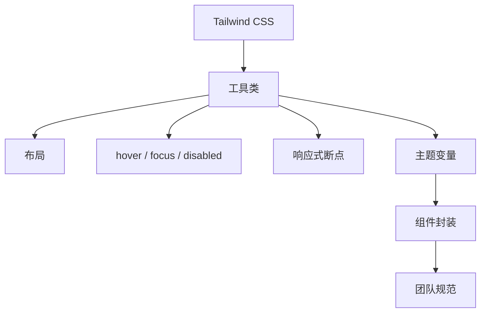

# Tailwind CSS 使用教程：从原子化样式到响应式、主题和组件封装

Tailwind CSS 是一个 utility-first 的 CSS 框架。它不先提供一套按钮、卡片、表格组件，而是提供大量低层级工具类，让你直接在 HTML 或组件模板里组合样式。

一句话理解：

> Tailwind 把常用 CSS 声明变成可组合的工具类，让样式跟随组件结构一起演进。

本文用一个“项目任务面板”来讲 Tailwind：从安装、布局、状态、响应式、暗色模式、主题变量到组件封装，重点讲清怎样写得快，也怎样避免写乱。



## 1. Tailwind 解决了什么问题

传统 CSS 常见问题：

```css
.task-card {
  padding: 16px;
  border: 1px solid #e5e7eb;
  border-radius: 8px;
  background: #fff;
}

.task-card-title {
  font-size: 16px;
  font-weight: 600;
}
```

写久之后容易出现：

- 类名越来越难取。
- CSS 文件和组件来回跳。
- 删除组件后忘记删样式。
- 相似样式到处复制。
- 设计约束不明显，间距和颜色随手写。

Tailwind 的写法：

```html
<article class="rounded-lg border border-zinc-200 bg-white p-4">
  <h2 class="text-base font-semibold text-zinc-900">任务标题</h2>
</article>
```

看起来类很多，但好处是：

- 样式和结构在同一个地方。
- 间距、颜色、字号来自统一设计刻度。
- 删除组件时样式一起删除。
- 状态和响应式可以直接写在类名里。

## 2. 安装和接入

以 Vite 项目为例：

```bash
pnpm create vite task-board --template react-ts
cd task-board
pnpm add tailwindcss @tailwindcss/vite
```

配置 Vite 插件：

```ts
// vite.config.ts
import { defineConfig } from 'vite'
import react from '@vitejs/plugin-react'
import tailwindcss from '@tailwindcss/vite'

export default defineConfig({
  plugins: [react(), tailwindcss()]
})
```

在入口 CSS 引入：

```css
/* src/index.css */
@import "tailwindcss";
```

然后启动：

```bash
pnpm dev
```

一个最小例子：

```tsx
export function App() {
  return (
    <main className="min-h-screen bg-zinc-50 p-6">
      <h1 className="text-2xl font-semibold text-zinc-950">
        项目任务面板
      </h1>
    </main>
  )
}
```

## 3. 工具类和 CSS 的对应关系

Tailwind 类本质上是 CSS 声明的缩写。

| Tailwind | 大致对应 CSS |
| --- | --- |
| `p-4` | `padding: 1rem` |
| `mt-6` | `margin-top: 1.5rem` |
| `flex` | `display: flex` |
| `items-center` | `align-items: center` |
| `justify-between` | `justify-content: space-between` |
| `text-sm` | 小字号 |
| `font-medium` | 中等字重 |
| `rounded-lg` | 圆角 |
| `border-zinc-200` | 边框颜色 |
| `bg-white` | 背景色 |

示例：

```tsx
function TaskCard() {
  return (
    <article className="rounded-lg border border-zinc-200 bg-white p-4 shadow-sm">
      <div className="flex items-start justify-between gap-4">
        <div>
          <h2 className="font-medium text-zinc-950">完善登录页面</h2>
          <p className="mt-1 text-sm text-zinc-600">
            补齐错误提示、加载状态和表单校验
          </p>
        </div>
        <span className="rounded-full bg-amber-100 px-2 py-1 text-xs font-medium text-amber-800">
          进行中
        </span>
      </div>
    </article>
  )
}
```

工具类不是为了“少写字符”，而是为了让样式来自一套稳定的设计词表。

## 4. 布局：Flex 和 Grid

任务面板常见结构：

```tsx
export function Dashboard() {
  return (
    <main className="mx-auto max-w-6xl p-6">
      <header className="flex items-center justify-between">
        <div>
          <h1 className="text-2xl font-semibold text-zinc-950">任务面板</h1>
          <p className="mt-1 text-sm text-zinc-600">按状态查看项目进度</p>
        </div>
        <button className="rounded-md bg-zinc-950 px-3 py-2 text-sm font-medium text-white">
          新建任务
        </button>
      </header>

      <section className="mt-6 grid gap-4 md:grid-cols-3">
        <TaskColumn title="待处理" />
        <TaskColumn title="进行中" />
        <TaskColumn title="已完成" />
      </section>
    </main>
  )
}
```

说明：

- `mx-auto max-w-6xl` 控制页面宽度。
- `flex items-center justify-between` 做头部左右布局。
- `grid gap-4 md:grid-cols-3` 小屏一列，中屏以上三列。

列组件：

```tsx
function TaskColumn({ title }: { title: string }) {
  return (
    <section className="rounded-lg border border-zinc-200 bg-zinc-50 p-3">
      <h2 className="px-1 text-sm font-medium text-zinc-700">{title}</h2>
      <div className="mt-3 space-y-3">
        <TaskCard />
        <TaskCard />
      </div>
    </section>
  )
}
```

`space-y-3` 适合处理纵向列表项间距，比给每个子元素写 `mb-3` 更干净。

## 5. 状态变体：hover、focus、disabled

Tailwind 用前缀表达状态：

```tsx
<button className="rounded-md bg-zinc-950 px-3 py-2 text-sm font-medium text-white hover:bg-zinc-800 focus:outline-none focus:ring-2 focus:ring-zinc-400 disabled:cursor-not-allowed disabled:opacity-50">
  保存
</button>
```

拆开看：

| 类 | 作用 |
| --- | --- |
| `hover:bg-zinc-800` | 悬停时变色 |
| `focus:outline-none` | 去掉默认 outline |
| `focus:ring-2` | 聚焦时显示 ring |
| `disabled:opacity-50` | 禁用时半透明 |
| `disabled:cursor-not-allowed` | 禁用鼠标状态 |

状态要写完整，尤其是表单和按钮：

```tsx
function SaveButton({ pending }: { pending: boolean }) {
  return (
    <button
      disabled={pending}
      className="inline-flex items-center rounded-md bg-blue-600 px-3 py-2 text-sm font-medium text-white hover:bg-blue-500 focus:outline-none focus:ring-2 focus:ring-blue-300 disabled:pointer-events-none disabled:opacity-60"
    >
      {pending ? '保存中...' : '保存'}
    </button>
  )
}
```

只写默认态的 UI，在真实产品里很快会显得粗糙。

## 6. 响应式设计

Tailwind 的响应式写法是断点前缀：

```tsx
<section className="grid gap-4 sm:grid-cols-2 lg:grid-cols-4">
  <StatCard />
  <StatCard />
  <StatCard />
  <StatCard />
</section>
```

含义：

| 类 | 含义 |
| --- | --- |
| `grid` | 默认就是网格 |
| `gap-4` | 默认间距 |
| `sm:grid-cols-2` | 小屏以上两列 |
| `lg:grid-cols-4` | 大屏以上四列 |

常见断点思路：

- 默认样式先照顾手机。
- `sm` 处理较大手机和小平板。
- `md` 处理平板和小笔记本。
- `lg`、`xl` 处理桌面。

示例：

```tsx
<div className="flex flex-col gap-3 md:flex-row md:items-center md:justify-between">
  <div>
    <h1 className="text-xl font-semibold text-zinc-950 md:text-2xl">
      项目概览
    </h1>
    <p className="text-sm text-zinc-600">最近 7 天任务进展</p>
  </div>
  <div className="flex gap-2">
    <button className="rounded-md border px-3 py-2 text-sm">导出</button>
    <button className="rounded-md bg-zinc-950 px-3 py-2 text-sm text-white">
      新建
    </button>
  </div>
</div>
```

不要只在桌面宽度调样式。移动端默认样式写好，桌面再逐步增强，通常更稳。

## 7. 颜色、字号和间距

Tailwind 的颜色命名大致是：

```txt
slate / gray / zinc / neutral / stone
red / orange / amber / yellow / lime / green
emerald / teal / cyan / sky / blue / indigo
violet / purple / fuchsia / pink / rose
```

常用组合：

```tsx
<div className="border border-zinc-200 bg-white text-zinc-950">
  <p className="text-zinc-600">次级文本</p>
</div>
```

状态色：

```tsx
const statusClass = {
  todo: 'bg-zinc-100 text-zinc-700',
  doing: 'bg-amber-100 text-amber-800',
  done: 'bg-emerald-100 text-emerald-800'
}
```

字号：

```tsx
<h1 className="text-2xl font-semibold">页面标题</h1>
<h2 className="text-base font-medium">卡片标题</h2>
<p className="text-sm text-zinc-600">说明文字</p>
<span className="text-xs text-zinc-500">辅助信息</span>
```

间距建议：

- 页面外边距：`p-4`、`p-6`、`px-8`。
- 区块间距：`mt-6`、`gap-6`。
- 卡片内边距：`p-4`。
- 表单控件间距：`space-y-4`。

## 8. 暗色模式

如果项目需要暗色模式，可以使用 `dark:` 前缀：

```tsx
<main className="min-h-screen bg-white text-zinc-950 dark:bg-zinc-950 dark:text-zinc-50">
  <article className="rounded-lg border border-zinc-200 bg-white p-4 dark:border-zinc-800 dark:bg-zinc-900">
    <h2 className="font-medium">任务标题</h2>
    <p className="text-sm text-zinc-600 dark:text-zinc-400">任务描述</p>
  </article>
</main>
```

设计暗色模式时，不要机械地把白色改黑色。要重新考虑：

- 背景层级。
- 边框可见度。
- 阴影是否还有效。
- 文本对比度。
- 状态色是否刺眼。

## 9. 主题变量

Tailwind v4 更强调 CSS-first 配置，可以在 CSS 中定义主题变量：

```css
@import "tailwindcss";

@theme {
  --color-brand-50: #eff6ff;
  --color-brand-500: #2563eb;
  --color-brand-600: #1d4ed8;
  --radius-card: 0.5rem;
}
```

然后使用：

```tsx
<button className="rounded-card bg-brand-600 px-3 py-2 text-white hover:bg-brand-500">
  提交
</button>
```

主题变量适合放：

- 品牌色。
- 语义色。
- 字体。
- 圆角。
- 阴影。
- 动画。

不要把每个页面的一次性样式都塞进主题。主题应该代表跨页面复用的设计语言。

## 10. 表单样式

一个常见表单：

```tsx
function TaskForm() {
  return (
    <form className="space-y-4 rounded-lg border border-zinc-200 bg-white p-4">
      <div>
        <label className="block text-sm font-medium text-zinc-700">
          任务名称
        </label>
        <input
          className="mt-1 w-full rounded-md border border-zinc-300 px-3 py-2 text-sm outline-none focus:border-blue-500 focus:ring-2 focus:ring-blue-100"
          placeholder="例如：完善支付回调"
        />
      </div>

      <div>
        <label className="block text-sm font-medium text-zinc-700">
          优先级
        </label>
        <select className="mt-1 w-full rounded-md border border-zinc-300 px-3 py-2 text-sm outline-none focus:border-blue-500 focus:ring-2 focus:ring-blue-100">
          <option>低</option>
          <option>中</option>
          <option>高</option>
        </select>
      </div>

      <button className="rounded-md bg-blue-600 px-3 py-2 text-sm font-medium text-white hover:bg-blue-500">
        保存任务
      </button>
    </form>
  )
}
```

表单要重点处理：

- label 和输入框关联。
- placeholder 不能代替 label。
- focus 状态清晰。
- 错误文案位置稳定。
- disabled 和 loading 状态明确。

错误状态：

```tsx
<input className="mt-1 w-full rounded-md border border-red-300 px-3 py-2 text-sm outline-none focus:border-red-500 focus:ring-2 focus:ring-red-100" />
<p className="mt-1 text-sm text-red-600">任务名称不能为空</p>
```

## 11. 组件封装

Tailwind 项目不代表完全不封装。重复出现的结构应该封装成组件。

```tsx
type ButtonProps = React.ButtonHTMLAttributes<HTMLButtonElement> & {
  variant?: 'primary' | 'secondary' | 'danger'
}

const variants = {
  primary: 'bg-blue-600 text-white hover:bg-blue-500',
  secondary: 'border border-zinc-300 bg-white text-zinc-900 hover:bg-zinc-50',
  danger: 'bg-red-600 text-white hover:bg-red-500'
}

export function Button({
  variant = 'primary',
  className = '',
  ...props
}: ButtonProps) {
  return (
    <button
      className={[
        'inline-flex items-center rounded-md px-3 py-2 text-sm font-medium focus:outline-none focus:ring-2 disabled:pointer-events-none disabled:opacity-60',
        variants[variant],
        className
      ].join(' ')}
      {...props}
    />
  )
}
```

使用：

```tsx
<Button>保存</Button>
<Button variant="secondary">取消</Button>
<Button variant="danger">删除</Button>
```

封装原则：

- 高频重复才封装。
- 先封装业务组件，再封装纯样式组件。
- 不要把所有 Tailwind 类都藏起来，否则会失去就地表达样式的优势。

## 12. 条件类名

业务状态经常决定样式：

```tsx
const statusStyles = {
  todo: 'bg-zinc-100 text-zinc-700',
  doing: 'bg-amber-100 text-amber-800',
  done: 'bg-emerald-100 text-emerald-800'
}

function StatusBadge({ status }: { status: keyof typeof statusStyles }) {
  return (
    <span className={`rounded-full px-2 py-1 text-xs font-medium ${statusStyles[status]}`}>
      {status}
    </span>
  )
}
```

如果项目里条件类名很多，可以使用 `clsx`：

```tsx
import clsx from 'clsx'

function Card({ selected }: { selected: boolean }) {
  return (
    <article
      className={clsx(
        'rounded-lg border bg-white p-4',
        selected ? 'border-blue-500 ring-2 ring-blue-100' : 'border-zinc-200'
      )}
    />
  )
}
```

## 13. 自定义 CSS 什么时候需要

Tailwind 覆盖不了所有场景。下面这些情况可以写 CSS：

- 复杂动画关键帧。
- 第三方组件覆盖。
- Markdown 内容排版。
- 浏览器兼容 hack。
- 需要复用的底层设计 token。

示例：

```css
@import "tailwindcss";

@layer components {
  .markdown-body {
    line-height: 1.75;
  }

  .markdown-body h2 {
    margin-top: 2rem;
    font-size: 1.25rem;
    font-weight: 600;
  }
}
```

不要因为用了 Tailwind 就排斥 CSS。Tailwind 是主要表达方式，不是禁止写 CSS。

## 14. 团队规范

Tailwind 在团队里要避免两种极端：

- 完全随手堆类，页面越来越乱。
- 过度封装，最后又变回一堆语义类名。

建议规范：

- 页面级布局可以直接写工具类。
- 重复 3 次以上的 UI 结构考虑封装组件。
- 品牌色、语义色放主题变量。
- 表单、按钮、弹窗等基础组件统一封装。
- 类名顺序交给格式化工具处理。
- Code Review 关注可读性、响应式和状态完整性。

一个可维护的 Tailwind 项目，不是类名最少，而是重复最少、意图清楚、改动局部。

## 15. 常见坑

### 15.1 动态拼接类名导致样式丢失

不要这样：

```tsx
const color = 'blue'
return <div className={`bg-${color}-500`} />
```

构建工具可能扫描不到完整类名。更稳的做法：

```tsx
const colorClass = {
  blue: 'bg-blue-500',
  red: 'bg-red-500',
  emerald: 'bg-emerald-500'
}

return <div className={colorClass[color]} />
```

### 15.2 不做组件抽象

如果 20 个按钮都复制一遍完整类名，后面改按钮高度会很痛苦。高频基础 UI 应该封装。

### 15.3 只写桌面样式

Tailwind 默认移动优先。先写手机样式，再用 `md:`、`lg:` 增强桌面，通常更稳定。

### 15.4 状态不完整

按钮只写默认态，没有 hover、focus、disabled，会影响可用性和质感。

## 16. 面试表达

可以这样描述 Tailwind：

> Tailwind CSS 是 utility-first CSS 框架。它把常见 CSS 声明抽象成工具类，让开发者直接在组件里组合样式。优点是样式局部、设计刻度统一、删除组件时样式也随之消失；风险是类名过长和重复，所以需要通过组件封装、主题变量、条件类名映射和团队规范来保持可维护性。

## 17. 总结

学习 Tailwind 的主线：

- 先理解工具类和 CSS 的对应关系。
- 再掌握布局、间距、颜色、字号。
- 然后补齐状态、响应式、暗色模式。
- 项目变大后引入主题变量和组件封装。
- 最后用团队规范控制重复和可读性。

Tailwind 写得好，不是满屏类名，而是让样式变化更局部、更可预测。
