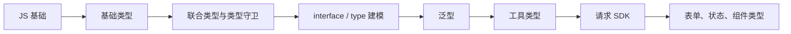

# TypeScript 实战教程：从类型基础到业务建模

TypeScript 的价值不是“给变量加类型注释”，而是用类型描述业务规则，让错误尽量在开发阶段暴露。

这篇文章不按语法清单讲，而是用一个“商品 + 订单”的前端业务场景，讲你在真实开发和面试中最常用的 TypeScript 能力。

## 学习路线图



面试里可以先这样概括：

> 我学习 TypeScript 的重点是类型建模。基础语法只是第一步，真正落地时要能用联合类型表达状态，用泛型抽象接口返回，用工具类型复用业务模型，用类型守卫处理不可信数据，最后把接口、表单、状态和组件 Props 全部串起来。

## 1. 从一个 JS 问题开始

先看一段普通 JS：

```js
function renderProduct(product) {
  return `${product.name} - ￥${product.price.toFixed(2)}`
}

renderProduct({
  name: 'Keyboard',
  price: '199'
})
```

这段代码运行时会报错，因为 `price` 是字符串，没有 `toFixed`。

TypeScript 能在开发阶段发现：

```ts
type Product = {
  id: string
  name: string
  price: number
}

function renderProduct(product: Product) {
  return `${product.name} - ￥${product.price.toFixed(2)}`
}

renderProduct({
  id: 'p_1',
  name: 'Keyboard',
  price: '199'
})
```

`price: '199'` 会直接报类型错误。

这就是 TS 的第一层价值：减少低级运行时错误。

## 2. 用 type 和 interface 描述业务对象

商品模型：

```ts
type ProductStatus = 'draft' | 'online' | 'offline'

interface Product {
  id: string
  name: string
  price: number
  status: ProductStatus
  tags: string[]
  stock: number
  createdAt: string
}
```

什么时候用 `interface`，什么时候用 `type`？

- 对象结构、可扩展模型：`interface`
- 联合类型、工具组合、函数类型：`type`

例如订单状态更适合用联合类型：

```ts
type OrderStatus = 'pending' | 'paid' | 'shipped' | 'cancelled'
```

这样比字符串更安全：

```ts
function updateOrderStatus(status: OrderStatus) {
  console.log(status)
}

updateOrderStatus('paid')
updateOrderStatus('done') // 报错
```

## 3. 用联合类型表达页面状态

很多前端代码喜欢这样写：

```ts
const loading = ref(false)
const error = ref('')
const data = ref<Product[]>([])
```

问题是状态可能互相矛盾：`loading = true` 时也有 `error`，或者 `error` 存在时还展示旧数据。

更好的方式是用联合类型表达状态机：

```ts
type AsyncState<T> =
  | { status: 'idle' }
  | { status: 'loading' }
  | { status: 'success'; data: T }
  | { status: 'error'; error: string }
```

使用：

```ts
let state: AsyncState<Product[]> = { status: 'idle' }

state = { status: 'loading' }
state = { status: 'success', data: [] }
state = { status: 'error', error: 'Network Error' }
```

渲染时：

```ts
function renderState(state: AsyncState<Product[]>) {
  switch (state.status) {
    case 'idle':
      return '请开始搜索'
    case 'loading':
      return '加载中'
    case 'success':
      return `共 ${state.data.length} 个商品`
    case 'error':
      return state.error
  }
}
```

这里 TS 会根据 `state.status` 自动缩小类型。只有 `success` 分支能访问 `data`，只有 `error` 分支能访问 `error`。

## 4. 类型守卫：处理不可信数据

接口返回、localStorage、URL 参数都是不可信数据。不要直接断言。

错误写法：

```ts
const product = JSON.parse(localStorage.getItem('product') || '{}') as Product
console.log(product.price.toFixed(2))
```

`as Product` 只是告诉 TS “相信我”，不会做运行时校验。

更好的方式是写类型守卫：

```ts
function isProduct(value: unknown): value is Product {
  if (typeof value !== 'object' || value === null) return false

  const item = value as Record<string, unknown>

  return (
    typeof item.id === 'string' &&
    typeof item.name === 'string' &&
    typeof item.price === 'number' &&
    ['draft', 'online', 'offline'].includes(String(item.status)) &&
    Array.isArray(item.tags) &&
    typeof item.stock === 'number' &&
    typeof item.createdAt === 'string'
  )
}
```

使用：

```ts
const raw = JSON.parse(localStorage.getItem('product') || '{}') as unknown

if (isProduct(raw)) {
  console.log(raw.price.toFixed(2))
} else {
  console.warn('Invalid product data')
}
```

面试中可以说：

> `as` 只影响编译期，不会做运行时校验。面对接口返回或本地缓存这类不可信数据，我会用类型守卫或 zod 这类库先缩小类型，再进入业务逻辑。

## 5. 泛型：封装通用 API 响应

接口通常有统一结构：

```json
{
  "code": 0,
  "message": "ok",
  "data": {}
}
```

用泛型建模：

```ts
type ApiResponse<T> = {
  code: number
  message: string
  data: T
}

type PageResult<T> = {
  list: T[]
  total: number
  page: number
  pageSize: number
}
```

商品列表接口类型：

```ts
type ProductListResponse = ApiResponse<PageResult<Product>>
```

这就是泛型的价值：把通用结构抽象出来，把变化的部分交给调用方传入。

## 6. 实现一个类型安全的请求 SDK

先写基础版本：

```ts
type RequestOptions = {
  method?: 'GET' | 'POST' | 'PUT' | 'PATCH' | 'DELETE'
  body?: unknown
  headers?: Record<string, string>
}

async function request<T>(url: string, options: RequestOptions = {}): Promise<T> {
  const response = await fetch(url, {
    method: options.method ?? 'GET',
    headers: {
      'Content-Type': 'application/json',
      ...options.headers
    },
    body: options.body ? JSON.stringify(options.body) : undefined
  })

  if (!response.ok) {
    throw new Error(`HTTP Error: ${response.status}`)
  }

  const result = (await response.json()) as ApiResponse<T>

  if (result.code !== 0) {
    throw new Error(result.message)
  }

  return result.data
}
```

使用：

```ts
async function fetchProducts() {
  return request<PageResult<Product>>('/api/products')
}

async function createProduct(input: CreateProductInput) {
  return request<Product>('/api/products', {
    method: 'POST',
    body: input
  })
}
```

调用时能拿到准确类型：

```ts
const page = await fetchProducts()

page.list.forEach((product) => {
  console.log(product.name)
  console.log(product.price.toFixed(2))
})
```

## 7. 用工具类型复用业务模型

不要为创建、更新、列表项重复写很多相似类型。

```ts
type CreateProductInput = Pick<Product, 'name' | 'price' | 'tags' | 'stock'>

type UpdateProductInput = Partial<CreateProductInput>

type ProductListItem = Pick<Product, 'id' | 'name' | 'price' | 'status' | 'stock'>
```

含义：

- `Pick`：从类型中挑字段。
- `Partial`：把字段都变成可选。
- `Omit`：排除某些字段。

例如表单不需要 `id` 和 `createdAt`：

```ts
type ProductFormModel = Omit<Product, 'id' | 'createdAt'>
```

但注意：工具类型不能滥用。如果组合太复杂，直接写清楚反而更好。

## 8. keyof：避免字符串硬编码

排序字段不能随便传字符串。

```ts
type ProductSortField = keyof Pick<Product, 'price' | 'stock' | 'createdAt'>

function sortProducts(list: Product[], field: ProductSortField) {
  return [...list].sort((a, b) => {
    const left = a[field]
    const right = b[field]

    if (typeof left === 'number' && typeof right === 'number') {
      return left - right
    }

    return String(left).localeCompare(String(right))
  })
}

sortProducts(products, 'price')
sortProducts(products, 'name') // 报错，因为 name 不在允许排序字段中
```

这类类型约束非常适合表格排序、筛选、表单字段。

## 9. 表单类型：把校验和提交分开

表单状态通常和接口提交参数不完全一样。

```ts
type ProductFormState = {
  name: string
  price: string
  tagsText: string
  stock: string
}

type CreateProductInput = {
  name: string
  price: number
  tags: string[]
  stock: number
}
```

转换函数：

```ts
function normalizeProductForm(form: ProductFormState): CreateProductInput {
  return {
    name: form.name.trim(),
    price: Number(form.price),
    tags: form.tagsText
      .split(',')
      .map((tag) => tag.trim())
      .filter(Boolean),
    stock: Number(form.stock)
  }
}
```

校验：

```ts
function validateProductInput(input: CreateProductInput) {
  const errors: string[] = []

  if (!input.name) errors.push('商品名称不能为空')
  if (!Number.isFinite(input.price) || input.price <= 0) errors.push('价格必须大于 0')
  if (!Number.isInteger(input.stock) || input.stock < 0) errors.push('库存不能小于 0')

  return errors
}
```

这个设计很实用：表单层保留字符串，提交前再转换成业务类型。

## 10. Vue 组件 Props 类型

`ProductCard.vue` 的 `script setup` 部分：

```ts
type ProductCardProps = {
  product: ProductListItem
  selected?: boolean
}

const props = withDefaults(defineProps<ProductCardProps>(), {
  selected: false
})

const emit = defineEmits<{
  select: [id: string]
  remove: [id: string]
}>()

function handleSelect() {
  emit('select', props.product.id)
}
```

模板部分：

```html
<template>
  <article :class="{ selected }" @click="handleSelect">
    <h3>{{ product.name }}</h3>
    <p>￥{{ product.price.toFixed(2) }}</p>
  </article>
</template>
```

这里 TS 约束了：

- 父组件必须传正确的 `product`。
- `selected` 有默认值。
- `emit` 的事件名和参数类型是确定的。

## 11. unknown 比 any 更安全

`any` 会关闭类型检查。

```ts
function parseJsonUnsafe(value: string): any {
  return JSON.parse(value)
}
```

更推荐：

```ts
function parseJson(value: string): unknown {
  return JSON.parse(value)
}

const result = parseJson('{"name":"Keyboard"}')

if (typeof result === 'object' && result !== null && 'name' in result) {
  console.log(result)
}
```

面试里可以这样说：

> `unknown` 表示我不知道这个值是什么，使用前必须缩小类型；`any` 表示放弃检查。处理外部输入时我更倾向 unknown。

## 12. tsconfig 推荐配置

新项目建议开启严格模式：

```json
{
  "compilerOptions": {
    "target": "ES2022",
    "module": "ESNext",
    "moduleResolution": "Bundler",
    "strict": true,
    "noImplicitAny": true,
    "strictNullChecks": true,
    "baseUrl": ".",
    "paths": {
      "@/*": ["src/*"]
    }
  }
}
```

老项目不要一次性全开严格模式，可以分阶段：

1. 先允许 JS 和 TS 混合。
2. 新文件必须写 TS。
3. 核心模块逐步加类型。
4. 最后开启更多 strict 规则。

## 13. 面试回答模板

如果问“TypeScript 的价值是什么”，可以答：

> TS 的价值是把一部分运行时错误提前到编译期，并且通过类型表达业务约束。比如用联合类型表达订单状态，用泛型抽象 API 响应，用工具类型复用表单和接口模型，用类型守卫处理不可信数据。它提升的不只是代码安全性，还有团队协作和重构信心。

如果问“你在项目里怎么用 TS”，可以答：

> 我会先定义领域模型，比如 Product、Order、User；接口层用 `ApiResponse<T>` 和 `PageResult<T>` 做泛型封装；表单层单独定义 FormState，再转换成提交 DTO；组件 Props 和 emit 明确类型；对接口返回和本地缓存这类不可信数据，用类型守卫或校验库处理，尽量避免 any。

## 14. 复习清单

- 能不能解释 `type` 和 `interface` 的选择。
- 能不能用联合类型表达状态。
- 能不能写类型守卫处理 `unknown`。
- 能不能写 `ApiResponse<T>` 和 `PageResult<T>`。
- 能不能用 `Pick`、`Omit`、`Partial` 复用模型。
- 能不能解释为什么不要滥用 `as any`。
- 能不能给 Vue Props 和 emit 加类型。
- 能不能讲清表单类型和接口 DTO 为什么要分开。
