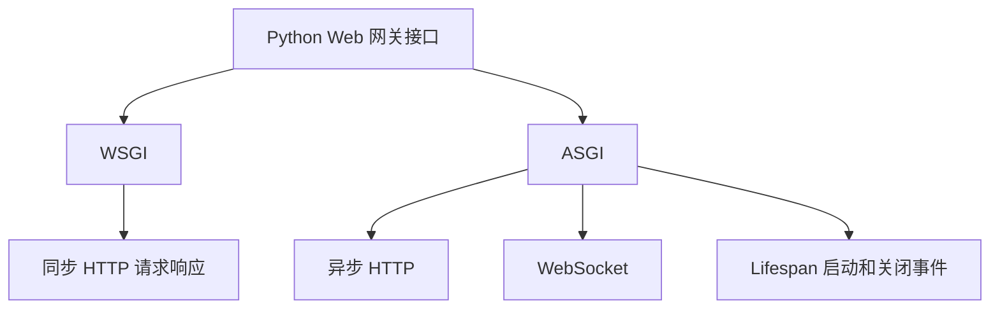
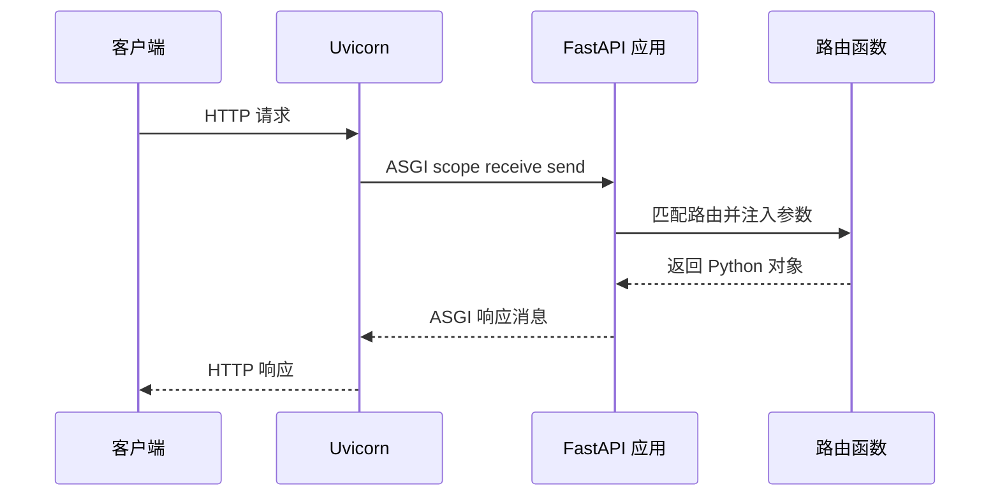
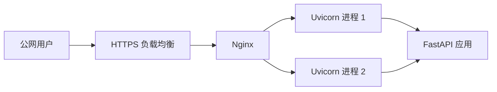

# Uvicorn 使用教程：ASGI 服务、启动参数与部署

Uvicorn 是 Python 生态里常用的 ASGI Web Server。它经常和 FastAPI、Starlette 一起出现，但它本身不是 Web 框架，而是负责接收 HTTP 请求、管理连接、调用 ASGI 应用、把响应写回客户端的服务器。

如果把一个后端服务拆开看，可以这样理解：


FastAPI 负责定义接口和业务逻辑，Uvicorn 负责把网络请求送进 FastAPI。

## 1. WSGI 和 ASGI 的区别

Python Web 服务早期常见的是 WSGI，比如 Django、Flask 传统同步应用。WSGI 的模型可以简单理解为：

```txt
请求进来 -> 调用一个同步函数 -> 返回响应
```

ASGI 是后来的异步网关接口，既支持普通 HTTP，也能更自然地支持 WebSocket、长连接和异步任务。



这不是说 WSGI 不能用，而是 ASGI 更适合现代异步 Web 服务。

## 2. 安装 Uvicorn

基础安装：

```bash
pip install uvicorn
```

常用推荐安装：

```bash
pip install "uvicorn[standard]"
```

`uvicorn[standard]` 会安装一些可选依赖，例如更高性能的事件循环、HTTP 解析器和文件监听能力。本地开发 FastAPI 时通常这样安装：

```bash
pip install fastapi "uvicorn[standard]"
```

## 3. 最小 ASGI 应用

不依赖 FastAPI，也可以写一个最小 ASGI 应用：

```python
# main.py
async def app(scope, receive, send):
    if scope["type"] != "http":
        return

    await send({
        "type": "http.response.start",
        "status": 200,
        "headers": [(b"content-type", b"text/plain; charset=utf-8")],
    })
    await send({
        "type": "http.response.body",
        "body": "Hello ASGI".encode("utf-8"),
    })
```

启动：

```bash
uvicorn main:app --reload
```

访问：

```txt
http://127.0.0.1:8000
```

`main:app` 是导入字符串，意思是：

```txt
main.py 文件里的 app 对象
```

## 4. 和 FastAPI 一起使用

更常见的写法：

```python
# main.py
from fastapi import FastAPI

app = FastAPI()


@app.get("/")
async def root():
    return {"message": "Hello Uvicorn"}
```

启动：

```bash
uvicorn main:app --reload
```

这里 Uvicorn 做的是服务器工作，FastAPI 做的是应用工作。



## 5. 常用启动参数

### host 和 port

```bash
uvicorn main:app --host 0.0.0.0 --port 8000
```

含义：

- `127.0.0.1`：只允许本机访问。
- `0.0.0.0`：监听所有网卡，容器或服务器部署时常用。
- `--port`：监听端口。

本地开发可以用默认值，部署时通常显式指定。

### reload

```bash
uvicorn main:app --reload
```

`--reload` 会监听文件变化并自动重启服务，适合开发环境。生产环境不要使用它，因为它会额外启动监听进程，也不适合稳定运行。

### workers

```bash
uvicorn main:app --host 0.0.0.0 --port 8000 --workers 4
```

`--workers` 会启动多个工作进程。它适合 CPU 多核机器，可以让多个进程共同处理请求。

注意：`--reload` 和 `--workers` 面向不同场景。开发用 `--reload`，生产按需要使用 `--workers`。

### app-dir

如果项目结构是：

```txt
project/
  src/
    app/
      main.py
```

可以这样启动：

```bash
uvicorn app.main:app --app-dir src
```

这样不需要手动改 `PYTHONPATH`。

## 6. 通过 Python 代码启动

有时你希望从 Python 入口启动：

```python
# run.py
import uvicorn


if __name__ == "__main__":
    uvicorn.run(
        "main:app",
        host="127.0.0.1",
        port=8000,
        reload=True,
    )
```

运行：

```bash
python run.py
```

如果使用 `reload=True` 或 `workers>1`，推荐传入 `"main:app"` 这种导入字符串，而不是直接传 `app` 对象，因为子进程需要重新导入应用。

## 7. Lifespan 启动和关闭事件

ASGI 支持应用生命周期事件，适合做连接池初始化、资源释放等工作。

FastAPI 推荐使用 lifespan：

```python
from contextlib import asynccontextmanager

from fastapi import FastAPI


@asynccontextmanager
async def lifespan(app: FastAPI):
    print("启动时: 创建连接池")
    app.state.cache = {}

    yield

    print("关闭时: 释放资源")
    app.state.cache.clear()


app = FastAPI(lifespan=lifespan)


@app.get("/health")
async def health_check():
    return {"status": "ok"}
```

Uvicorn 启动应用时会触发启动事件，进程退出时会触发关闭事件。

## 8. 同步函数和异步函数

FastAPI 中可以写同步路由：

```python
@app.get("/sync")
def sync_endpoint():
    return {"type": "sync"}
```

也可以写异步路由：

```python
@app.get("/async")
async def async_endpoint():
    return {"type": "async"}
```

异步路由适合等待异步 I/O：

```python
import httpx


@app.get("/github")
async def github_status():
    async with httpx.AsyncClient() as client:
        response = await client.get("https://api.github.com")
    return {"status_code": response.status_code}
```

如果在 `async def` 里直接调用耗时阻塞代码，会阻塞事件循环。

不推荐：

```python
import time


@app.get("/bad")
async def bad_endpoint():
    time.sleep(3)
    return {"ok": True}
```

更合理：

```python
import asyncio


@app.get("/good")
async def good_endpoint():
    await asyncio.sleep(3)
    return {"ok": True}
```

对于 CPU 密集型任务，应考虑进程池、任务队列，或者把它拆到独立服务。

## 9. 日志配置

Uvicorn 默认会输出访问日志和错误日志：

```txt
INFO:     127.0.0.1:53210 - "GET / HTTP/1.1" 200 OK
```

可以关闭访问日志：

```bash
uvicorn main:app --no-access-log
```

也可以指定日志配置文件：

```bash
uvicorn main:app --log-config logging.yaml
```

一个简化版 YAML：

```yaml
version: 1
disable_existing_loggers: false
formatters:
  default:
    format: "%(asctime)s %(levelname)s [%(name)s] %(message)s"
handlers:
  console:
    class: logging.StreamHandler
    formatter: default
loggers:
  uvicorn:
    handlers: [console]
    level: INFO
    propagate: false
  uvicorn.access:
    handlers: [console]
    level: INFO
    propagate: false
root:
  handlers: [console]
  level: INFO
```

如果要使用 YAML 日志配置，需要确保项目安装了对应解析依赖。安装 `uvicorn[standard]` 通常更省心。

## 10. 反向代理部署

生产环境通常不会让 Uvicorn 直接暴露在公网最前面，而是放在 Nginx 或云负载均衡后面。



Nginx 示例：

```nginx
server {
    listen 80;
    server_name example.com;

    location / {
        proxy_pass http://127.0.0.1:8000;
        proxy_set_header Host $host;
        proxy_set_header X-Real-IP $remote_addr;
        proxy_set_header X-Forwarded-For $proxy_add_x_forwarded_for;
        proxy_set_header X-Forwarded-Proto $scheme;
    }
}
```

Uvicorn 侧启动时可以启用代理头处理：

```bash
uvicorn main:app --proxy-headers --forwarded-allow-ips="127.0.0.1"
```

这样应用才能更准确地知道原始客户端 IP 和协议。

## 11. Docker 部署

一个简单 Dockerfile：

```dockerfile
FROM python:3.12-slim

WORKDIR /app

COPY requirements.txt .
RUN pip install --no-cache-dir -r requirements.txt

COPY . .

EXPOSE 8000

CMD ["uvicorn", "main:app", "--host", "0.0.0.0", "--port", "8000"]
```

`requirements.txt`：

```txt
fastapi
uvicorn[standard]
```

构建和运行：

```bash
docker build -t fastapi-demo .
docker run --rm -p 8000:8000 fastapi-demo
```

容器里一般把日志输出到标准输出，由容器平台负责采集。

## 12. systemd 部署示例

如果直接部署在 Linux 服务器上，可以用 systemd 管理进程：

```ini
[Unit]
Description=FastAPI service
After=network.target

[Service]
WorkingDirectory=/opt/app
Environment="PATH=/opt/app/.venv/bin"
ExecStart=/opt/app/.venv/bin/uvicorn main:app --host 127.0.0.1 --port 8000 --workers 4
Restart=always
RestartSec=3

[Install]
WantedBy=multi-user.target
```

常用命令：

```bash
sudo systemctl daemon-reload
sudo systemctl enable fastapi
sudo systemctl start fastapi
sudo systemctl status fastapi
```

## 13. Gunicorn 和 Uvicorn Worker

在一些部署方案里，会用 Gunicorn 管理多个 worker，再用 Uvicorn worker 运行 ASGI 应用：

```bash
gunicorn main:app -k uvicorn.workers.UvicornWorker -w 4 -b 127.0.0.1:8000
```

这类方案的价值在于 Gunicorn 有成熟的进程管理能力。不过现在直接使用 Uvicorn 的 `--workers` 也很常见。具体选型要看部署平台、运维习惯和服务复杂度。

## 14. 常见问题

### Error loading ASGI app

常见原因是导入路径写错。

项目结构：

```txt
app/
  main.py
```

如果 `main.py` 里有 `app = FastAPI()`，启动命令应该是：

```bash
uvicorn app.main:app
```

不是：

```bash
uvicorn main:app
```

除非你当前工作目录就是 `app/`。

### 地址已经被占用

```txt
Address already in use
```

说明端口被其他进程占用。可以换端口：

```bash
uvicorn main:app --port 8001
```

也可以找到并停止占用端口的进程。

### 开发环境热更新没生效

确认使用了：

```bash
uvicorn main:app --reload
```

如果项目目录复杂，可以指定监听目录：

```bash
uvicorn main:app --reload --reload-dir app
```

### 线上接口偶发变慢

排查方向通常包括：

- 是否在异步路由里调用了阻塞函数。
- 数据库连接池是否耗尽。
- worker 数量是否过少或过多。
- 是否缺少反向代理超时配置。
- 日志中是否能串起请求 ID 和耗时。

Uvicorn 本身只是请求入口，慢请求常常来自业务代码、数据库、外部服务或部署参数。

## 15. 推荐实践

本地开发：

```bash
uvicorn app.main:app --reload
```

Docker 或服务器部署：

```bash
uvicorn app.main:app --host 0.0.0.0 --port 8000 --workers 4
```

反向代理后面：

```bash
uvicorn app.main:app --host 127.0.0.1 --port 8000 --workers 4 --proxy-headers --forwarded-allow-ips="127.0.0.1"
```

总体原则：

- FastAPI、Starlette 负责编写应用。
- Uvicorn 负责运行 ASGI 应用。
- Nginx 或负载均衡负责公网入口、HTTPS、静态资源和转发。
- 日志、指标、健康检查要在上线前配置好。

## 16. 参考资料

- Uvicorn Settings: https://www.uvicorn.org/settings/
- Uvicorn Deployment: https://www.uvicorn.org/deployment/

