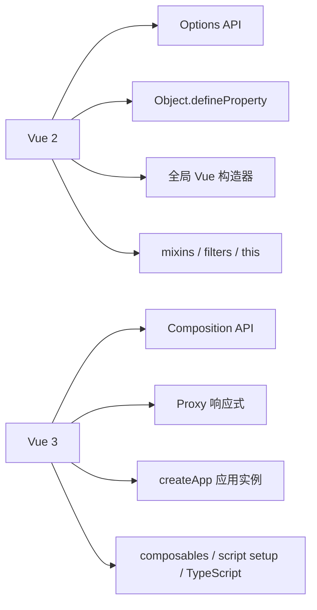

# Vue 3 相比 Vue 2 的变化与设计思路

Vue 3 不是在 Vue 2 上简单增加几个 API，而是对框架底层、代码组织方式和工程能力做了一次系统重构。

如果只记住“Vue 3 有 Composition API、Proxy、性能更好”，其实还没有真正理解它。更重要的问题是：

- 这些变化从哪里来？
- Vue 2 当时遇到了什么实际问题？
- Vue 3 如何解决这些问题？
- 在项目中应该怎样写代码，才能真正用上这些能力？

这篇文章围绕这些问题展开。

## 1. 先看整体变化

Vue 2 的核心开发体验是：

- 用 `new Vue()` 创建应用。
- 用 Options API 按 `data`、`methods`、`computed`、`watch` 组织组件。
- 用 `Object.defineProperty` 做响应式拦截。
- 通过 mixins、filters、全局 API、插件等方式扩展能力。

Vue 3 的核心开发体验变成：

- 用 `createApp()` 创建应用实例。
- 用 Composition API 按“业务逻辑”组织代码。
- 用 `Proxy` 做响应式代理。
- 用 `<script setup>`、`defineProps`、`defineEmits` 提升单文件组件开发效率。
- 更重视 TypeScript、Tree-shaking、运行时隔离和大型项目可维护性。

可以用下面这张图理解：



Vue 3 的很多设计并不是为了让语法“更潮”，而是为了解决复杂组件、逻辑复用、类型推导、应用隔离和性能优化这些长期问题。

## 2. 应用创建方式：从全局 Vue 到 createApp

### Vue 2 的写法

Vue 2 通常这样启动应用：

```js
import Vue from 'vue'
import App from './App.vue'
import router from './router'

Vue.use(router)

Vue.mixin({
  created() {
    // 所有组件都会执行
  }
})

Vue.prototype.$http = httpClient

new Vue({
  router,
  render: h => h(App)
}).$mount('#app')
```

这套写法的问题是：很多配置都挂在全局 `Vue` 构造器上。

只要你执行了：

```js
Vue.mixin(...)
Vue.use(...)
Vue.prototype.$http = ...
```

它影响的就不只是某一个应用，而是同一个页面里所有基于这个 `Vue` 构造器创建出来的应用。

在简单项目里这不明显，但在以下场景会变得麻烦：

- 一个页面上挂载多个 Vue 应用。
- 单元测试中需要为不同测试准备不同插件。
- 微前端中多个子应用各自有自己的 Vue 配置。
- 插件、mixin、全局组件污染了其他应用。

### Vue 3 的写法

Vue 3 改成了 `createApp()`：

```js
import { createApp } from 'vue'
import App from './App.vue'
import router from './router'

const app = createApp(App)

app.use(router)
app.mixin({
  created() {
    // 只影响当前 app
  }
})
app.config.globalProperties.$http = httpClient

app.mount('#app')
```

关键变化是：配置不再直接写到全局 `Vue` 上，而是写到 `app` 实例上。

这解决的是“应用级隔离”问题。一个页面里可以创建多个应用，每个应用有自己的插件、全局组件、全局属性和错误处理：

```js
const adminApp = createApp(AdminApp)
adminApp.use(adminRouter)
adminApp.mount('#admin')

const widgetApp = createApp(WidgetApp)
widgetApp.use(widgetStore)
widgetApp.mount('#widget')
```

两个应用互不污染。

### 插件写法也跟着变化

Vue 2 插件：

```js
const MyPlugin = {
  install(Vue) {
    Vue.prototype.$toast = function (message) {
      console.log(message)
    }
  }
}
```

Vue 3 插件：

```js
const MyPlugin = {
  install(app) {
    app.config.globalProperties.$toast = function (message) {
      console.log(message)
    }
  }
}
```

插件接收到的不再是全局构造器，而是当前应用实例。

如果插件要提供跨组件的数据，更推荐使用 `provide`：

```js
const MyPlugin = {
  install(app, options) {
    app.provide('toastOptions', options)
  }
}
```

组件里读取：

```vue
<script setup>
import { inject } from 'vue'

const toastOptions = inject('toastOptions')
</script>
```

这比把所有东西都挂到全局属性上更清晰。

## 3. 响应式系统：从 Object.defineProperty 到 Proxy

### Vue 2 的响应式来源

Vue 2 使用 `Object.defineProperty` 劫持对象已有属性的 `get` 和 `set`。

简化理解可以写成这样：

```js
function defineReactive(obj, key) {
  let value = obj[key]

  Object.defineProperty(obj, key, {
    get() {
      console.log('读取', key)
      return value
    },
    set(newValue) {
      console.log('更新', key, newValue)
      value = newValue
    }
  })
}

const state = { count: 0 }
defineReactive(state, 'count')

state.count
state.count = 1
```

它能拦截 `count` 的读取和修改，但它有一个天然限制：只能拦截已经定义过的属性。

例如：

```js
const vm = new Vue({
  data() {
    return {
      user: {
        name: 'Ada'
      }
    }
  }
})

vm.user.age = 18
```

在 Vue 2 中，`age` 是后加的属性，默认不会变成响应式。通常需要这样写：

```js
Vue.set(vm.user, 'age', 18)
```

数组也有类似限制。比如直接通过索引改值：

```js
vm.list[0] = 'new item'
```

在 Vue 2 中容易绕过响应式更新，因此常见写法是：

```js
Vue.set(vm.list, 0, 'new item')
```

或者：

```js
vm.list.splice(0, 1, 'new item')
```

Vue 2 为数组重写了一批变更方法，例如 `push`、`pop`、`splice`，但这种处理本质上是补丁式的。

### Vue 3 的响应式来源

Vue 3 使用 `Proxy` 代理整个对象。

简化理解：

```js
const raw = {
  user: {
    name: 'Ada'
  },
  list: ['a', 'b']
}

const state = new Proxy(raw, {
  get(target, key, receiver) {
    console.log('读取', key)
    return Reflect.get(target, key, receiver)
  },
  set(target, key, value, receiver) {
    console.log('设置', key, value)
    return Reflect.set(target, key, value, receiver)
  }
})

state.user
state.list
state.extra = 'new field'
```

`Proxy` 代理的是对象本身，而不是一个个已有属性，所以它能更自然地处理：

- 新增属性。
- 删除属性。
- 数组索引修改。
- `in` 操作。
- `Map`、`Set` 等集合类型。

Vue 3 中：

```vue
<script setup>
import { reactive } from 'vue'

const state = reactive({
  user: {
    name: 'Ada'
  },
  list: ['a', 'b']
})

function update() {
  state.user.age = 18
  state.list[0] = 'new item'
  state.list.length = 0
}
</script>

<template>
  <button @click="update">更新</button>
  <pre>{{ state }}</pre>
</template>
```

这些更新都能被追踪。

### ref 和 reactive 怎么选

Vue 3 常用两个响应式 API：

```js
import { ref, reactive } from 'vue'

const count = ref(0)

const user = reactive({
  name: 'Ada',
  age: 18
})
```

`ref` 适合：

- 基础类型：`number`、`string`、`boolean`。
- 可能整体替换的数据。
- 需要作为组合函数返回值暴露的数据。

```js
const keyword = ref('')

function clear() {
  keyword.value = ''
}
```

`reactive` 适合：

- 结构稳定的对象。
- 多字段状态需要一起维护。

```js
const form = reactive({
  username: '',
  password: '',
  remember: true
})
```

需要注意：在 JavaScript 中访问 `ref` 要写 `.value`：

```js
count.value++
```

模板中会自动解包：

```vue
<template>
  <button>{{ count }}</button>
</template>
```

### reactive 的解构陷阱

下面这段代码很常见，但会丢失响应式：

```js
const state = reactive({
  name: 'Ada',
  age: 18
})

const { name, age } = state
```

`name` 和 `age` 被解构成普通变量，后续不会跟着 `state` 更新。

应该使用 `toRefs`：

```js
import { reactive, toRefs } from 'vue'

const state = reactive({
  name: 'Ada',
  age: 18
})

const { name, age } = toRefs(state)
```

这也是很多组合函数返回对象时常见的写法：

```js
import { reactive, toRefs } from 'vue'

export function useUserForm() {
  const form = reactive({
    name: '',
    email: ''
  })

  function reset() {
    form.name = ''
    form.email = ''
  }

  return {
    ...toRefs(form),
    reset
  }
}
```

使用时：

```vue
<script setup>
import { useUserForm } from './useUserForm'

const { name, email, reset } = useUserForm()
</script>

<template>
  <input v-model="name" />
  <input v-model="email" />
  <button @click="reset">重置</button>
</template>
```

## 4. 代码组织方式：从 Options API 到 Composition API

### Vue 2 Options API 的特点

Vue 2 组件一般这样写：

```vue
<script>
export default {
  data() {
    return {
      keyword: '',
      loading: false,
      users: [],
      page: 1
    }
  },
  computed: {
    visibleUsers() {
      return this.users.filter(user => user.name.includes(this.keyword))
    }
  },
  watch: {
    keyword() {
      this.page = 1
      this.fetchUsers()
    }
  },
  mounted() {
    this.fetchUsers()
  },
  methods: {
    async fetchUsers() {
      this.loading = true
      try {
        const res = await fetch(`/api/users?keyword=${this.keyword}&page=${this.page}`)
        this.users = await res.json()
      } finally {
        this.loading = false
      }
    }
  }
}
</script>
```

Options API 的优点是结构清楚：数据放 `data`，方法放 `methods`，派生状态放 `computed`，监听放 `watch`。

但组件变复杂后，同一个业务功能会被拆散在多个选项里。

以“用户列表搜索”为例：

- `keyword` 在 `data`。
- `visibleUsers` 在 `computed`。
- `keyword` 的副作用在 `watch`。
- `fetchUsers` 在 `methods`。
- 首次请求在 `mounted`。

读代码时需要在文件里上下跳转，才能拼出一个完整功能。

### Composition API 的目标

Composition API 的目标不是替代所有 Options API，而是让复杂逻辑可以按功能聚合。

同样的用户列表，在 Vue 3 中可以这样写：

```vue
<script setup>
import { computed, onMounted, ref, watch } from 'vue'

const keyword = ref('')
const loading = ref(false)
const users = ref([])
const page = ref(1)

const visibleUsers = computed(() => {
  return users.value.filter(user => user.name.includes(keyword.value))
})

async function fetchUsers() {
  loading.value = true

  try {
    const res = await fetch(`/api/users?keyword=${keyword.value}&page=${page.value}`)
    users.value = await res.json()
  } finally {
    loading.value = false
  }
}

watch(keyword, () => {
  page.value = 1
  fetchUsers()
})

onMounted(fetchUsers)
</script>

<template>
  <input v-model="keyword" placeholder="搜索用户" />

  <p v-if="loading">加载中...</p>

  <ul v-else>
    <li v-for="user in visibleUsers" :key="user.id">
      {{ user.name }}
    </li>
  </ul>
</template>
```

这段代码把“用户搜索”相关逻辑放在了一起。

进一步可以抽成组合函数：

```js
// composables/useUsers.js
import { computed, onMounted, ref, watch } from 'vue'

export function useUsers() {
  const keyword = ref('')
  const loading = ref(false)
  const users = ref([])
  const page = ref(1)

  const visibleUsers = computed(() => {
    return users.value.filter(user => user.name.includes(keyword.value))
  })

  async function fetchUsers() {
    loading.value = true

    try {
      const params = new URLSearchParams({
        keyword: keyword.value,
        page: String(page.value)
      })
      const res = await fetch(`/api/users?${params}`)
      users.value = await res.json()
    } finally {
      loading.value = false
    }
  }

  watch(keyword, () => {
    page.value = 1
    fetchUsers()
  })

  onMounted(fetchUsers)

  return {
    keyword,
    loading,
    users,
    page,
    visibleUsers,
    fetchUsers
  }
}
```

组件中只关心使用：

```vue
<script setup>
import { useUsers } from './composables/useUsers'

const { keyword, loading, visibleUsers } = useUsers()
</script>
```

这就是 Composition API 的核心收益：逻辑可以独立封装、独立测试、跨组件复用。

### mixins 的问题与 composables 的改进

Vue 2 中常用 mixins 复用逻辑：

```js
// userListMixin.js
export default {
  data() {
    return {
      keyword: '',
      users: []
    }
  },
  methods: {
    async fetchUsers() {
      const res = await fetch(`/api/users?keyword=${this.keyword}`)
      this.users = await res.json()
    }
  }
}
```

使用：

```js
import userListMixin from './userListMixin'

export default {
  mixins: [userListMixin],
  mounted() {
    this.fetchUsers()
  }
}
```

mixins 的问题主要有三个：

- 变量来源不直观：组件里突然出现 `keyword`、`users`、`fetchUsers`，需要去 mixin 文件里找。
- 命名冲突：组件本身和 mixin 都定义了同名属性时，容易互相覆盖。
- 依赖关系隐式：mixin 内部可能依赖组件里的某个字段，但从接口上看不出来。

组合函数的接口更明确：

```js
const {
  keyword,
  users,
  fetchUsers
} = useUsers()
```

它从哪里来、暴露了什么、依赖什么，都能通过函数参数和返回值表达。

例如把请求地址作为参数传入：

```js
import { ref } from 'vue'

export function useRemoteList(endpoint) {
  const loading = ref(false)
  const data = ref([])
  const error = ref(null)

  async function reload() {
    loading.value = true
    error.value = null

    try {
      const res = await fetch(endpoint)
      data.value = await res.json()
    } catch (err) {
      error.value = err
    } finally {
      loading.value = false
    }
  }

  return {
    loading,
    data,
    error,
    reload
  }
}
```

使用：

```vue
<script setup>
import { onMounted } from 'vue'
import { useRemoteList } from './useRemoteList'

const { loading, data: users, error, reload } = useRemoteList('/api/users')

onMounted(reload)
</script>
```

这比 mixins 更适合大型项目。

## 5. script setup：让组件更像普通 JavaScript 模块

Vue 3 仍然支持普通 `setup()`：

```vue
<script>
import { ref } from 'vue'

export default {
  setup() {
    const count = ref(0)

    function increment() {
      count.value++
    }

    return {
      count,
      increment
    }
  }
}
</script>
```

但实际项目中更常用 `<script setup>`：

```vue
<script setup>
import { ref } from 'vue'

const count = ref(0)

function increment() {
  count.value++
}
</script>

<template>
  <button @click="increment">{{ count }}</button>
</template>
```

`<script setup>` 的特点：

- 顶层变量可以直接在模板中使用。
- 不需要手动 `return`。
- 组件编译时会被转换成正常的 `setup()`。
- 对 TypeScript 类型推导更友好。

### props 和 emits

Vue 2 中：

```vue
<script>
export default {
  props: {
    modelValue: {
      type: String,
      required: true
    }
  },
  methods: {
    updateValue(value) {
      this.$emit('update:modelValue', value)
    }
  }
}
</script>
```

Vue 3 `<script setup>`：

```vue
<script setup>
const props = defineProps({
  modelValue: {
    type: String,
    required: true
  }
})

const emit = defineEmits(['update:modelValue'])

function updateValue(value) {
  emit('update:modelValue', value)
}
</script>
```

如果使用 TypeScript，可以写得更准确：

```vue
<script setup lang="ts">
const props = defineProps<{
  modelValue: string
  disabled?: boolean
}>()

const emit = defineEmits<{
  'update:modelValue': [value: string]
  submit: [payload: { value: string }]
}>()
</script>
```

这样事件名和参数都能被类型系统检查。

## 6. TypeScript 支持：减少 this，增强推导

Vue 2 也能用 TypeScript，但 Options API 依赖 `this`，类型推导并不自然。

例如：

```ts
export default {
  data() {
    return {
      count: 0
    }
  },
  methods: {
    increment() {
      this.count++
    }
  }
}
```

这里 `this.count` 的类型需要框架做额外推导。组件越复杂，`this` 上混入的数据、方法、计算属性、mixin、插件属性越多，类型关系越难维护。

Composition API 更接近普通 TypeScript 函数：

```ts
import { computed, ref } from 'vue'

const count = ref(0)

const double = computed(() => count.value * 2)

function increment(step = 1) {
  count.value += step
}
```

这段代码不依赖 `this`，TypeScript 能直接推导：

- `count` 是 `Ref<number>`。
- `double` 是 `ComputedRef<number>`。
- `increment` 的参数是 `number`。

### 用类型描述组件契约

一个用户卡片组件：

```vue
<script setup lang="ts">
type User = {
  id: number
  name: string
  avatar?: string
  role: 'admin' | 'editor' | 'viewer'
}

const props = defineProps<{
  user: User
  selected?: boolean
}>()

const emit = defineEmits<{
  select: [id: number]
}>()

function handleClick() {
  emit('select', props.user.id)
}
</script>

<template>
  <button :class="{ selected }" @click="handleClick">
    {{ user.name }} - {{ user.role }}
  </button>
</template>
```

父组件使用时，如果传错字段或事件参数，编辑器和构建过程都能更早发现：

```vue
<UserCard
  :user="{ id: 1, name: 'Ada', role: 'admin' }"
  @select="loadUserDetail"
/>
```

Composition API 并不是“为了 TypeScript 才存在”，但它的函数式组织方式确实让 TypeScript 更容易发挥作用。

## 7. 生命周期：名称变化和执行位置变化

Vue 2 生命周期：

```js
export default {
  beforeCreate() {},
  created() {},
  beforeMount() {},
  mounted() {},
  beforeUpdate() {},
  updated() {},
  beforeDestroy() {},
  destroyed() {}
}
```

Vue 3 Options API 中主要变化是销毁相关名称：

```js
export default {
  beforeUnmount() {},
  unmounted() {}
}
```

Composition API 中使用函数注册：

```vue
<script setup>
import {
  onBeforeMount,
  onMounted,
  onBeforeUpdate,
  onUpdated,
  onBeforeUnmount,
  onUnmounted
} from 'vue'

onBeforeMount(() => {
  console.log('挂载前')
})

onMounted(() => {
  console.log('挂载完成')
})

onBeforeUnmount(() => {
  console.log('卸载前')
})

onUnmounted(() => {
  console.log('卸载完成')
})
</script>
```

`beforeCreate` 和 `created` 在 Composition API 中通常不需要对应钩子，因为 `setup()` 本身就在组件初始化阶段执行：

```vue
<script setup>
import { ref } from 'vue'

const count = ref(0)

// 这里就相当于组件实例创建阶段的初始化逻辑
</script>
```

生命周期对照：

| Vue 2 | Vue 3 Composition API |
| --- | --- |
| `beforeCreate` | `setup()` |
| `created` | `setup()` |
| `beforeMount` | `onBeforeMount` |
| `mounted` | `onMounted` |
| `beforeUpdate` | `onBeforeUpdate` |
| `updated` | `onUpdated` |
| `beforeDestroy` | `onBeforeUnmount` |
| `destroyed` | `onUnmounted` |

## 8. 模板能力：Fragments、Teleport、Suspense

### Fragments：组件可以有多个根节点

Vue 2 单文件组件模板必须只有一个根节点：

```vue
<template>
  <div>
    <header>标题</header>
    <main>内容</main>
  </div>
</template>
```

这个外层 `div` 很多时候只是为了满足框架要求，没有业务含义，还可能影响样式布局。

Vue 3 支持多个根节点：

```vue
<template>
  <header>标题</header>
  <main>内容</main>
</template>
```

这让组件输出的 DOM 更接近真实结构。

### Teleport：把内容渲染到组件外部

弹窗、抽屉、通知这类组件常常遇到一个问题：逻辑属于当前组件，但 DOM 最好挂到 `body` 下，避免被父级的 `overflow`、`z-index`、`transform` 影响。

Vue 2 里通常要借助第三方 portal 库或手写 DOM 移动逻辑。

Vue 3 提供 `Teleport`：

```vue
<script setup>
import { ref } from 'vue'

const visible = ref(false)
</script>

<template>
  <button @click="visible = true">打开弹窗</button>

  <Teleport to="body">
    <div v-if="visible" class="modal-mask">
      <div class="modal">
        <h2>确认操作</h2>
        <button @click="visible = false">关闭</button>
      </div>
    </div>
  </Teleport>
</template>
```

组件状态仍然写在当前组件里，但真实 DOM 会渲染到 `body`。

### Suspense：等待异步依赖

如果组件的 `setup()` 是异步的，或者内部有异步组件，可以用 `Suspense` 包一层兜底界面：

```vue
<template>
  <Suspense>
    <UserPanel />

    <template #fallback>
      <p>用户信息加载中...</p>
    </template>
  </Suspense>
</template>
```

`UserPanel`：

```vue
<script setup>
const user = await fetch('/api/me').then(res => res.json())
</script>

<template>
  <section>{{ user.name }}</section>
</template>
```

这样父组件可以用统一的 fallback 处理异步等待状态。

## 9. v-model：从固定约定到可命名绑定

Vue 2 自定义组件的 `v-model` 默认等价于：

```vue
<Child :value="title" @input="title = $event" />
```

子组件：

```vue
<script>
export default {
  props: {
    value: String
  },
  methods: {
    update(value) {
      this.$emit('input', value)
    }
  }
}
</script>
```

Vue 3 默认改为：

```vue
<Child :modelValue="title" @update:modelValue="title = $event" />
```

子组件：

```vue
<script setup>
defineProps({
  modelValue: String
})

const emit = defineEmits(['update:modelValue'])

function update(value) {
  emit('update:modelValue', value)
}
</script>
```

更重要的是，Vue 3 支持多个 `v-model`：

```vue
<UserName
  v-model:first-name="firstName"
  v-model:last-name="lastName"
/>
```

子组件：

```vue
<script setup>
defineProps({
  firstName: String,
  lastName: String
})

const emit = defineEmits([
  'update:firstName',
  'update:lastName'
])

function updateFirstName(value) {
  emit('update:firstName', value)
}

function updateLastName(value) {
  emit('update:lastName', value)
}
</script>
```

Vue 2 中如果一个组件要双向绑定多个字段，往往要靠 `.sync` 或自定义事件约定。Vue 3 把这件事统一到了 `v-model` 语法里。

## 10. emits：把组件事件变成显式契约

Vue 2 中组件可以随时 `$emit` 任意事件：

```js
this.$emit('submit', form)
this.$emit('close')
```

这很灵活，但组件对外到底会发出哪些事件，不一定直观。

Vue 3 引入 `emits`：

```vue
<script>
export default {
  emits: ['submit', 'close'],
  methods: {
    submit() {
      this.$emit('submit', this.form)
    }
  }
}
</script>
```

或者在 `<script setup>` 中：

```vue
<script setup>
const emit = defineEmits(['submit', 'close'])

function submit(form) {
  emit('submit', form)
}
</script>
```

还可以校验事件参数：

```js
export default {
  emits: {
    submit(payload) {
      return payload && typeof payload.id === 'number'
    }
  }
}
```

这让组件的输入和输出都更明确：

- 输入是 `props`。
- 输出是 `emits`。

复杂组件库中，这个约定非常重要。

## 11. watch 与 watchEffect：副作用控制更细

Vue 2 中常用 `watch`：

```js
export default {
  data() {
    return {
      keyword: ''
    }
  },
  watch: {
    keyword(newValue, oldValue) {
      this.search(newValue)
    }
  }
}
```

Vue 3 中仍然可以写：

```js
import { ref, watch } from 'vue'

const keyword = ref('')

watch(keyword, (newValue, oldValue) => {
  search(newValue)
})
```

监听多个来源：

```js
watch([keyword, page], ([newKeyword, newPage]) => {
  fetchList(newKeyword, newPage)
})
```

监听 getter：

```js
watch(
  () => route.query.keyword,
  keyword => {
    fetchList(keyword)
  }
)
```

`watchEffect` 会自动收集内部用到的响应式依赖：

```js
import { ref, watchEffect } from 'vue'

const keyword = ref('')
const page = ref(1)

watchEffect(() => {
  fetchList({
    keyword: keyword.value,
    page: page.value
  })
})
```

只要函数里读取了 `keyword.value` 或 `page.value`，它们变化时就会重新执行。

通常可以这样选择：

- 明确知道监听哪个数据，用 `watch`。
- 副作用依赖多个响应式数据，且依赖关系很自然，用 `watchEffect`。
- 需要拿到旧值，用 `watch`。
- 需要控制是否立即执行，用 `watch` 的 `immediate` 选项。

```js
watch(
  keyword,
  value => {
    fetchList(value)
  },
  {
    immediate: true
  }
)
```

## 12. 计算属性：思想不变，写法更函数化

Vue 2：

```js
export default {
  data() {
    return {
      price: 100,
      count: 2
    }
  },
  computed: {
    total() {
      return this.price * this.count
    }
  }
}
```

Vue 3：

```js
import { computed, ref } from 'vue'

const price = ref(100)
const count = ref(2)

const total = computed(() => price.value * count.value)
```

可写计算属性：

```js
const firstName = ref('Ada')
const lastName = ref('Lovelace')

const fullName = computed({
  get() {
    return `${firstName.value} ${lastName.value}`
  },
  set(value) {
    const [first, last] = value.split(' ')
    firstName.value = first
    lastName.value = last
  }
})
```

模板：

```vue
<input v-model="fullName" />
```

计算属性的核心没有变：它是带缓存的派生状态。依赖不变时不会重复计算，依赖变化后才重新计算。

## 13. 性能：不只是 Proxy

Vue 3 的性能提升来自多个方向。

### 编译器能生成更精确的更新提示

模板：

```vue
<template>
  <div>
    <h1>用户信息</h1>
    <p>{{ user.name }}</p>
    <button @click="refresh">刷新</button>
  </div>
</template>
```

`h1` 是静态内容，`p` 和 `button` 才和响应式数据或事件有关。

Vue 3 编译器会尽量识别静态节点和动态节点，运行时更新时可以更精确地处理动态部分，而不是在每次渲染时都做同样多的比较。

你不需要手写这些优化，但理解它有助于写出更自然的模板：

- 稳定的静态结构就直接写在模板里。
- 列表一定写稳定的 `key`。
- 大量静态内容不要故意塞进函数里反复创建。

### Tree-shaking 友好

Vue 2 的很多 API 挂在全局构造器上：

```js
Vue.nextTick(...)
Vue.set(...)
Vue.use(...)
```

Vue 3 更鼓励按需导入：

```js
import { nextTick, ref, computed } from 'vue'
```

这让构建工具更容易删除没有使用的代码。

### 更好的大型列表和局部更新基础

Vue 3 的响应式和渲染系统为更细粒度的更新打下基础，但这不代表写任何代码都会自动变快。

例如大列表仍然需要：

```vue
<li v-for="item in list" :key="item.id">
  {{ item.name }}
</li>
```

如果列表非常大，仍然应该使用虚拟列表：

```vue
<VirtualList
  :items="list"
  :item-height="40"
/>
```

框架性能提升不能替代业务层面的数据量控制和渲染策略。

## 14. 被移除或调整的能力

### filters 被移除

Vue 2 支持 filters：

```vue
<template>
  <p>{{ price | currency }}</p>
</template>

<script>
export default {
  filters: {
    currency(value) {
      return `￥${Number(value).toFixed(2)}`
    }
  }
}
</script>
```

Vue 3 移除了 filters。推荐改成普通函数或计算属性：

```vue
<script setup>
function currency(value) {
  return `￥${Number(value).toFixed(2)}`
}
</script>

<template>
  <p>{{ currency(price) }}</p>
</template>
```

如果格式化逻辑依赖响应式数据，使用 `computed`：

```js
const formattedPrice = computed(() => {
  return `￥${Number(price.value).toFixed(2)}`
})
```

filters 看起来简洁，但它不是普通 JavaScript 表达式，工具支持、类型推导和组合复用都不如函数。

### 事件总线不再推荐

Vue 2 中常见事件总线：

```js
const bus = new Vue()

bus.$emit('login', user)
bus.$on('login', user => {
  console.log(user)
})
```

Vue 3 移除了实例上的 `$on`、`$off`、`$once`。跨组件通信更推荐：

- 父子组件使用 props 和 emits。
- 祖先后代使用 provide/inject。
- 全局状态使用 Pinia。
- 简单事件总线使用 `mitt` 这类小库。

例如用 `provide/inject`：

```vue
<!-- App.vue -->
<script setup>
import { provide, ref } from 'vue'

const currentUser = ref(null)

provide('currentUser', currentUser)
</script>
```

后代组件：

```vue
<script setup>
import { inject } from 'vue'

const currentUser = inject('currentUser')
</script>
```

对于大型业务状态，应该使用专门的状态管理，而不是靠事件到处广播。

## 15. 自定义指令：生命周期名称跟组件更一致

Vue 2 指令：

```js
Vue.directive('focus', {
  inserted(el) {
    el.focus()
  },
  update(el, binding) {
    console.log(binding.value)
  },
  unbind(el) {
    console.log('清理')
  }
})
```

Vue 3 指令：

```js
const focus = {
  mounted(el) {
    el.focus()
  },
  updated(el, binding) {
    console.log(binding.value)
  },
  unmounted(el) {
    console.log('清理')
  }
}
```

局部使用：

```vue
<script setup>
const vFocus = {
  mounted(el) {
    el.focus()
  }
}
</script>

<template>
  <input v-focus />
</template>
```

在 `<script setup>` 中，以 `v` 开头的驼峰变量可以直接作为自定义指令使用。

## 16. 插槽：统一为函数形式

Vue 2 中有普通插槽、作用域插槽等概念：

```vue
<UserList>
  <template slot-scope="{ user }">
    <span>{{ user.name }}</span>
  </template>
</UserList>
```

Vue 3 统一使用 `v-slot`：

```vue
<UserList>
  <template #default="{ user }">
    <span>{{ user.name }}</span>
  </template>
</UserList>
```

子组件：

```vue
<template>
  <ul>
    <li v-for="user in users" :key="user.id">
      <slot :user="user" />
    </li>
  </ul>
</template>
```

具名插槽：

```vue
<Card>
  <template #header>
    用户详情
  </template>

  <template #default>
    内容区域
  </template>

  <template #footer>
    操作按钮
  </template>
</Card>
```

这套语法比 Vue 2 中多个历史写法更统一。

## 17. 路由和状态管理也发生了配套变化

Vue 3 常与 Vue Router 4、Pinia 搭配使用。

路由中读取当前路由：

```vue
<script setup>
import { useRoute, useRouter } from 'vue-router'

const route = useRoute()
const router = useRouter()

function goDetail(id) {
  router.push({
    name: 'user-detail',
    params: { id }
  })
}
</script>
```

Pinia store：

```ts
// stores/user.ts
import { defineStore } from 'pinia'
import { computed, ref } from 'vue'

export const useUserStore = defineStore('user', () => {
  const token = ref('')
  const profile = ref(null)

  const isLoggedIn = computed(() => Boolean(token.value))

  function logout() {
    token.value = ''
    profile.value = null
  }

  return {
    token,
    profile,
    isLoggedIn,
    logout
  }
})
```

组件里使用：

```vue
<script setup>
import { useUserStore } from '@/stores/user'

const userStore = useUserStore()
</script>

<template>
  <button v-if="userStore.isLoggedIn" @click="userStore.logout">
    退出登录
  </button>
</template>
```

可以看到，路由和状态管理也都更倾向于函数式 API，与 Composition API 的心智模型一致。

## 18. 迁移时应该怎么做

从 Vue 2 迁移到 Vue 3，不建议一上来就把所有组件重写成 Composition API。更稳妥的策略是分层迁移。

### 第一步：先识别破坏性变化

重点检查：

- `new Vue()` 是否需要改成 `createApp()`。
- `Vue.use`、`Vue.mixin`、`Vue.prototype` 是否需要迁移到 `app`。
- filters 是否需要改成函数或计算属性。
- 事件总线是否依赖 `$on`、`$off`。
- 自定义组件 `v-model` 是否依赖 `value` 和 `input`。
- 自定义指令生命周期名称是否需要更新。
- 插槽语法是否仍然使用旧写法。

### 第二步：保留 Options API，先跑起来

Vue 3 仍然支持 Options API，所以很多组件可以先保持原有写法：

```js
export default {
  data() {
    return {
      count: 0
    }
  },
  methods: {
    increment() {
      this.count++
    }
  }
}
```

这降低了迁移风险。

### 第三步：把复杂逻辑逐步抽成组合函数

当一个组件里出现以下情况时，再考虑改 Composition API：

- 同一功能散落在多个选项里。
- 多个组件复制了相似请求、表单、权限、轮询逻辑。
- mixins 来源复杂。
- 组件需要更强的 TypeScript 类型约束。

比如把轮询逻辑抽出来：

```js
import { onBeforeUnmount, ref } from 'vue'

export function usePolling(task, interval = 5000) {
  const timer = ref(null)

  function start() {
    stop()
    task()
    timer.value = window.setInterval(task, interval)
  }

  function stop() {
    if (timer.value) {
      window.clearInterval(timer.value)
      timer.value = null
    }
  }

  onBeforeUnmount(stop)

  return {
    start,
    stop
  }
}
```

组件中：

```vue
<script setup>
import { onMounted } from 'vue'
import { usePolling } from './usePolling'

async function reloadDashboard() {
  await fetch('/api/dashboard')
}

const { start, stop } = usePolling(reloadDashboard, 10000)

onMounted(start)
</script>

<template>
  <button @click="stop">暂停刷新</button>
</template>
```

这样迁移的收益非常明确：复用和维护都变简单。

## 19. 常见误区

### 误区一：Vue 3 必须全部写 Composition API

不是。Vue 3 仍然支持 Options API。

如果组件很简单：

```js
export default {
  props: {
    title: String
  }
}
```

继续用 Options API 没有问题。Composition API 更适合复杂逻辑和复用场景。

### 误区二：reactive 一定比 ref 更好

不是。基础类型只能用 `ref`：

```js
const visible = ref(false)
```

对象也可以用 `ref`，尤其当你需要整体替换时：

```js
const user = ref(null)

async function loadUser() {
  user.value = await fetch('/api/me').then(res => res.json())
}
```

`reactive` 更适合结构稳定、字段较多的对象。

### 误区三：watchEffect 可以替代所有 watch

不是。`watchEffect` 自动收集依赖，写起来短，但依赖来源不如 `watch` 明确。

需要旧值时，必须用 `watch`：

```js
watch(keyword, (newValue, oldValue) => {
  console.log(newValue, oldValue)
})
```

需要精确控制监听来源时，也应该用 `watch`。

### 误区四：Proxy 解决了所有性能问题

不是。Proxy 解决的是响应式能力和追踪方式的问题。页面是否快，还取决于：

- 数据量是否过大。
- 是否重复渲染大列表。
- 是否有昂贵计算。
- 是否有不必要的深层监听。
- 是否正确使用 `key`。

框架提供基础，性能仍然需要业务代码配合。

## 20. 总结

Vue 3 相比 Vue 2 的核心变化可以归纳成五条：

1. 应用创建从全局 `Vue` 变成 `createApp()`，解决应用隔离和全局污染问题。
2. 响应式从 `Object.defineProperty` 变成 `Proxy`，更自然地支持新增属性、数组索引、集合类型等场景。
3. 代码组织从 Options API 扩展到 Composition API，解决复杂逻辑分散和复用困难的问题。
4. `<script setup>` 和 TypeScript 支持让组件更接近普通函数和模块，组件契约更清晰。
5. 模板、事件、插槽、指令、v-model 等 API 更统一，更适合大型项目和组件库。

Vue 3 的重点不是“新语法更多”，而是让项目变复杂之后，代码仍然能被拆分、复用、推导和维护。

## 参考资料

- [Vue 官方文档：Composition API FAQ](https://vuejs.org/guide/extras/composition-api-faq.html)
- [Vue 官方文档：Reactivity in Depth](https://vuejs.org/guide/extras/reactivity-in-depth.html)
- [Vue 官方文档：`<script setup>`](https://vuejs.org/api/sfc-script-setup.html)
- [Vue 官方迁移指南：Vue 3 Migration Guide](https://v3-migration.vuejs.org/)
- [Vue 官方迁移指南：Global API Application Instance](https://v3-migration.vuejs.org/breaking-changes/global-api.html)
- [Vue 官方迁移指南：Events API](https://v3-migration.vuejs.org/breaking-changes/events-api.html)
- [Vue 官方迁移指南：v-model](https://v3-migration.vuejs.org/breaking-changes/v-model.html)
