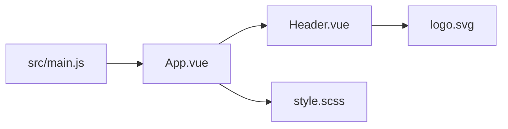

# Webpack 讲解：从模块打包到 Loader、Plugin 和性能优化

Webpack 是前端工程里经典的模块打包工具。它的核心能力是从入口文件出发，分析整个项目的模块依赖图，然后把 JavaScript、CSS、图片、字体等资源转换并打包成浏览器可以加载的静态资源。

一句话理解：

> Webpack 把项目里的各种模块当成依赖图来处理，再通过 loader 转换模块，通过 plugin 扩展构建流程，最终输出打包产物。

## 1. Webpack 解决什么问题

浏览器原生并不知道如何处理这些内容：

```js
import './style.scss'
import logo from './logo.svg'
import data from './data.json'
import App from './App.vue'
```

Webpack 可以让这些资源都成为模块。

它会处理：

- 模块依赖。
- JavaScript 语法转换。
- CSS、Sass、Less。
- 图片、字体、媒体资源。
- 文件 hash。
- 代码压缩。
- 代码分割。
- 开发服务器和热更新。

## 2. 依赖图

Webpack 从入口开始递归分析依赖。



入口文件：

```js
import { createApp } from 'vue'
import App from './App.vue'
import './style.css'

createApp(App).mount('#app')
```

Webpack 会根据 `import`、`require` 等语句建立依赖关系，再把每类资源交给对应 loader 处理。

## 3. 基础配置

一个简单配置：

```js
const path = require('path')

module.exports = {
  mode: 'production',
  entry: './src/main.js',
  output: {
    path: path.resolve(__dirname, 'dist'),
    filename: 'assets/[name].[contenthash].js',
    clean: true
  }
}
```

核心字段：

| 字段 | 作用 |
| --- | --- |
| mode | 构建模式，影响默认优化 |
| entry | 构建入口 |
| output | 输出目录和文件名 |
| module.rules | loader 配置 |
| plugins | 插件 |
| devServer | 开发服务器 |
| optimization | 优化配置 |

## 4. Loader

Loader 用于转换模块内容。

比如处理 CSS：

```js
module.exports = {
  module: {
    rules: [
      {
        test: /\.css$/,
        use: ['style-loader', 'css-loader']
      }
    ]
  }
}
```

执行顺序从右到左：

```txt
style-loader(css-loader(source))
```

`css-loader` 解析 CSS 里的 `@import` 和 `url()`。

`style-loader` 把 CSS 注入到页面。

处理 Babel：

```js
module.exports = {
  module: {
    rules: [
      {
        test: /\.jsx?$/,
        exclude: /node_modules/,
        use: {
          loader: 'babel-loader',
          options: {
            presets: ['@babel/preset-env', '@babel/preset-react']
          }
        }
      }
    ]
  }
}
```

Loader 的职责是“把一种源码转换成 Webpack 能继续处理的模块”。

## 5. Plugin

Plugin 用于扩展 Webpack 构建流程。

常见插件：

| 插件 | 作用 |
| --- | --- |
| HtmlWebpackPlugin | 生成 HTML 并自动注入资源 |
| MiniCssExtractPlugin | 抽离 CSS 文件 |
| DefinePlugin | 注入编译期常量 |
| CopyWebpackPlugin | 复制静态资源 |
| webpack-bundle-analyzer | 分析产物体积 |

示例：

```js
const HtmlWebpackPlugin = require('html-webpack-plugin')
const MiniCssExtractPlugin = require('mini-css-extract-plugin')

module.exports = {
  plugins: [
    new HtmlWebpackPlugin({
      template: './public/index.html'
    }),
    new MiniCssExtractPlugin({
      filename: 'assets/[name].[contenthash].css'
    })
  ]
}
```

Loader 面向文件转换，Plugin 面向构建生命周期扩展。

## 6. Mode

`mode` 有三个常见值：

| mode | 说明 |
| --- | --- |
| development | 开发模式，关注调试体验 |
| production | 生产模式，开启压缩和优化 |
| none | 不使用默认优化 |

生产模式会默认启用很多优化，例如代码压缩、tree shaking 等。

开发模式更关注 sourcemap、构建速度、热更新。

## 7. Dev Server 和 HMR

Webpack Dev Server 提供本地开发服务器。

```js
module.exports = {
  devServer: {
    port: 3000,
    hot: true,
    historyApiFallback: true,
    proxy: {
      '/api': 'http://localhost:8080'
    }
  }
}
```

常见能力：

- 本地 HTTP 服务。
- 代理接口解决跨域。
- 文件变化后自动刷新。
- HMR 热模块替换。
- SPA 路由 fallback。

HMR 的目标是修改模块后尽量保留页面状态，而不是整页刷新。

## 8. 代码分割

代码分割可以减少首屏加载体积。

动态导入：

```js
const SettingsPage = () => import('./pages/SettingsPage')
```

Webpack 会把这个页面拆成独立 chunk，访问到对应路由时再加载。

公共依赖拆分：

```js
module.exports = {
  optimization: {
    splitChunks: {
      chunks: 'all'
    }
  }
}
```

常见目标：

- 第三方依赖单独拆包。
- 公共模块复用。
- 路由级懒加载。
- 降低首屏 JS 体积。

## 9. Tree Shaking

Tree shaking 用于删除没有被使用的代码。

例如：

```js
export function add(a, b) {
  return a + b
}

export function multiply(a, b) {
  return a * b
}
```

只使用：

```js
import { add } from './math'
```

生产构建时，`multiply` 有机会被删除。

Tree shaking 依赖几个条件：

- 使用 ES Module 静态语法。
- 生产模式开启压缩优化。
- 包声明 `sideEffects`。
- 代码没有不可分析的副作用。

`package.json`：

```json
{
  "sideEffects": false
}
```

如果某些 CSS 或初始化文件有副作用，需要排除：

```json
{
  "sideEffects": ["*.css", "./src/polyfill.js"]
}
```

## 10. Source Map

生产代码经过压缩后很难调试，sourcemap 可以把压缩代码映射回源码。

开发环境：

```js
module.exports = {
  devtool: 'eval-cheap-module-source-map'
}
```

生产环境：

```js
module.exports = {
  devtool: 'source-map'
}
```

生产 sourcemap 要谨慎公开。如果包含源码，可以上传到监控平台用于错误定位，但不一定直接暴露给用户。

## 11. 缓存优化

生产构建常见输出：

```txt
main.8ac912.js
vendor.31f8aa.js
style.72bc10.css
```

使用 `contenthash` 的好处是：文件内容不变，文件名不变，浏览器可以长期缓存。

配置：

```js
module.exports = {
  output: {
    filename: 'assets/[name].[contenthash].js',
    chunkFilename: 'assets/[name].[contenthash].js'
  }
}
```

配合：

- JS、CSS 长缓存。
- HTML 短缓存。
- CDN 缓存刷新。
- 运行时代码单独拆分。

## 12. 构建性能优化

Webpack 项目变大后，构建速度可能变慢。

常见优化：

- 缩小 loader 处理范围。
- 使用持久化缓存。
- 使用 esbuild-loader、swc-loader 提升转译速度。
- 合理配置 `resolve.alias`。
- 减少不必要的 plugin。
- 使用 thread-loader 做并行处理。
- 分析 bundle 体积，移除过重依赖。

示例：

```js
module.exports = {
  cache: {
    type: 'filesystem'
  },
  module: {
    rules: [
      {
        test: /\.js$/,
        include: path.resolve(__dirname, 'src'),
        use: 'babel-loader'
      }
    ]
  }
}
```

## 13. Module Federation

Module Federation 是 Webpack 5 的重要能力，常用于微前端。

它允许一个应用在运行时加载另一个应用暴露出来的模块。

```js
new ModuleFederationPlugin({
  name: 'app1',
  filename: 'remoteEntry.js',
  exposes: {
    './Button': './src/Button'
  },
  shared: ['react', 'react-dom']
})
```

另一个应用可以远程使用：

```js
const RemoteButton = React.lazy(() => import('app1/Button'))
```

它适合多个团队独立构建和部署，但依赖共享、版本兼容、运行时错误隔离都要认真设计。

## 14. Webpack 和 Vite 的区别

简单说：

- Webpack 开发时通常先构建依赖图，再提供 bundle。
- Vite 开发时利用浏览器原生 ESM，按需加载源码模块。
- Webpack 生态成熟，可配置能力强。
- Vite 冷启动和热更新通常更快，配置更轻。

但 Webpack 仍然适合很多复杂场景，例如历史项目、深度定制构建、复杂微前端、特定 loader/plugin 生态。

## 15. 面试怎么回答

可以这样回答：

> Webpack 是模块打包工具，它从 entry 出发构建依赖图，把 JS、CSS、图片等资源都当成模块处理。Loader 负责把不同类型的文件转换成 Webpack 能识别的模块，比如 babel-loader 转 JS，css-loader 处理 CSS；Plugin 负责扩展构建生命周期，比如生成 HTML、抽离 CSS、注入环境变量。生产构建里可以通过 splitChunks 做代码分割，通过 tree shaking 删除无用代码，通过 contenthash 做浏览器缓存。开发阶段 Webpack Dev Server 提供代理、自动刷新和 HMR。

进一步可以补充：

- Loader 从右到左执行。
- Plugin 基于构建生命周期钩子。
- Tree shaking 依赖 ES Module 和副作用标记。
- `contenthash` 适合长期缓存。
- 构建慢可以用缓存、缩小范围、SWC 或 esbuild 优化。

## 16. 总结

Webpack 的核心是依赖图、loader 和 plugin。

记住这些点：

- entry 是依赖图入口。
- loader 负责文件转换。
- plugin 负责流程扩展。
- splitChunks 降低首屏体积。
- tree shaking 删除无用代码。
- contenthash 支撑长期缓存。

理解这些，再看复杂 Webpack 配置就不会只是背配置项了。
